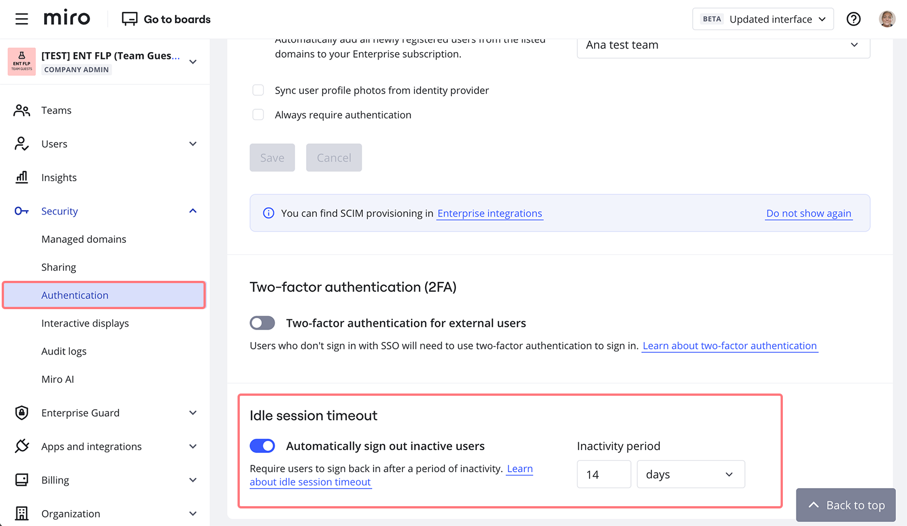

La función de tiempo de espera de sesión te permite establecer un**límite** con respecto a cuánto tiempo los usuarios finales pueden permanecer inactivos. Este parámetro afecta a todos los miembros e [invitados](../../../using-miro/sharing-boards/07-collaboration-with-guests.md). Si la sesión del usuario llega al límite y expira, se desconecta automáticamente al usuario de su perfil de Miro, y tendrá que volver a realizar la autorización antes de acceder a los datos de Enterprise.

:::warning
Evalúa atentamente esta configuración. Los límites de tiempo de espera muy seguros que son demasiado cortos en duración hacen que los usuarios se desconecten de sus tableros continuamente. Considera un enfoque equilibrado y seguro para los tiempos de espera de la sesión y recuerda comunicar estos límites claramente a tus usuarios.
:::

### Cómo habilitar el tiempo de espera de sesión inactiva

1. Ve a Configuración de **la empresa** > **Seguridad** > **Autenticación** > **Tiempo de espera de la sesión inactiva**
2. Habilita **Cerrar la sesión de usuarios inactivos de forma automática** y establece el límite de tiempo de espera  **
*altidle-session-timeout.pngEl tiempo de espera de sesión inactiva está habilitado***

Al habilitar por primera vez la función de tiempo de espera de sesión inactiva, se aplicará la sesión por defecto de 1 día. El admin puede personalizar la duración e ingresar un valor entero personalizado de 1 a 9999 y seleccionar las unidades: minutos, horas o días. La duración mínima permitida es de 1 hora y la máxima de 14 días. Recomendamos fijar una duración no inferior a 8 horas.

Para la función de tiempo de espera de sesión inactiva, definimos la inactividad como ninguna de las siguientes acciones presentes en ninguna parte de la aplicación durante el tiempo definido:

- Movimiento del mouse (o movimiento de la pantalla táctil)
- Clics del mouse (o toques en la pantalla táctil)
- Uso del teclado

Habrá un mensaje de advertencia que se les muestra a los usuarios varios minutos antes del cierre de sesión. Los usuarios sólo tienen que mover el ratón o pulsar cualquier tecla del teclado para seguir conectados.

:::note
El valor por defecto del tiempo de espera de sesión inactiva es de 1 día. Los valores pueden oscilar entre 1 hora y 14 días.
:::

:::note
El tiempo de espera de sesión inactiva funciona en todas partes (accediendo a la actividad del usuario en diferentes dispositivos, integraciones, etc.).
:::

:::note
Si un usuario es visitante en un tablero público guardado en un plan Enterprise, pero no forma parte del plan Enterprise que habilitó el tiempo de espera de la sesión, no se verá afectado.
:::

:::note
Siun usuario pertenece a varias organizaciones que tienen establecidos diferentes intervalos de tiempo de espera de la sesión inactiva, prevalecerá el de menor duración. Por ejemplo, si un usuario pertenece a una organización con un tiempo de espera de sesión inactiva de 6 horas y a otra con un tiempo de espera de sesión inactiva de 30 minutos. Todas las sesiones activas se cerrarán a los 30 minutos.
:::
