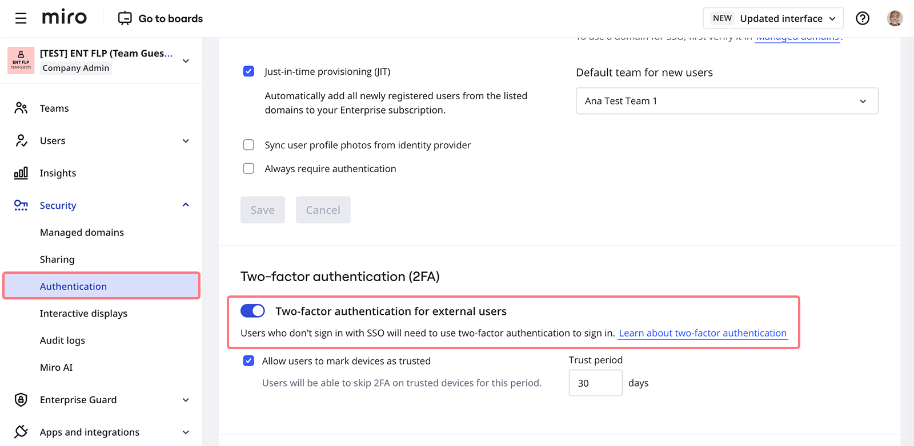
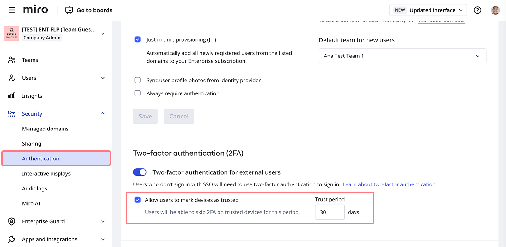
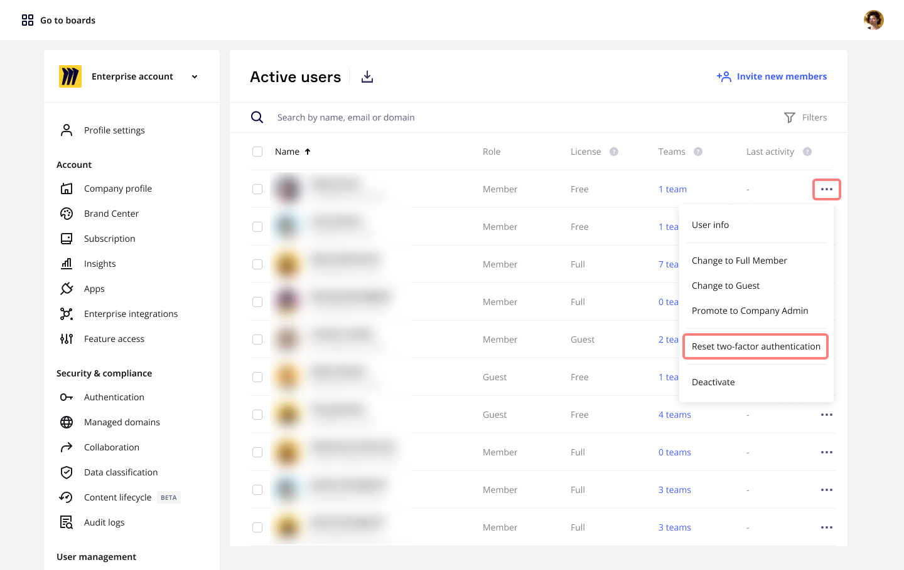

## Autenticación de dos factores (2FA) para organizaciones

La 2FA añade una capa adicional de seguridad a los perfiles online, más allá de solo el nombre de usuario y la contraseña. Los admin de empresa de Enterprise pueden exigir una prueba de identidad adicional cuando los usuarios acceden a su suscripción de Miro. Este requisito se aplica a todos los inicios de sesión que utilizan correo electrónico y contraseña.

Para las empresas que usan inicio de sesión único, la 2FA incluye solo a colaboradores externos que no utilizan inicio de sesión único. Para las empresas que no usan inicio de sesión único, la 2FA se extiende a todos los usuarios.

:::note
Este artículo explica la autenticación de dos factores (2FA) para planes Enterprise. Para todos los demás planes, consulta [Autenticación de dos factores (2FA)](../../../administration/security-compliance/01-two-factor-authentication-2fa.md) en Administración.
:::

## Establecer una 2FA obligatoria para tu organización

:::note
Antes de activar la autenticación de dos factores (2FA), es importante informar a todos los usuarios afectados, incluyendo tanto a los miembros de tu organización como a los colaboradores externos. Para asegurar una transición fluida, te sugerimos compartir nuestra [guía de usuario de 2FA](../../security-integrations/two-factor-authentication-2fa/02-enterprise-two-factor-authentication-2fa-–-user-guide.md) para asistirles en este proceso.
:::

## Cómo habilitar la 2FA para tus usuarios

1. Ve a la consola de administración > **Seguridad** > **Autenticación**.
2. Activa **Aplicar 2FA para usuarios sin inicio de sesión único**.

*Aplicando autenticación 2FA para usuarios sin inicio de sesión único*

### Confiar en dispositivos 2FA

Cuando está habilitado, a tus usuarios de 2FA se les mostrará una casilla de verificación que les permitirá omitir el 2FA cada vez que inicien sesión en ese dispositivo durante los próximos X días, donde "X" es el período establecido por el administrador. Puedes permitir que los dispositivos de los usuarios sean de confianza por un período de 7 a 90 días. Por defecto, la función de confiar en dispositivos para el 2FA está habilitada, aunque puedes deshabilitarla en tu consola de administración.

:::warning
Si se deshabilita la opción de confiar en dispositivos para el 2FA, los usuarios tendrán que ingresar un código de 2FA en cada inicio de sesión. En consecuencia, su experiencia de inicio de sesión será más lenta.
:::

El 2FA será requerido nuevamente después de que pase el período de confianza.

No se omitirá el 2FA si los usuarios inician sesión en un nuevo dispositivo o navegador o si borran las cookies de su navegador.

## Restablecer el 2FA para usuarios

Si un usuario pierde acceso a su método de 2FA, los admins pueden restablecer su 2FA. Una vez que un usuario solicita que su método de 2FA sea restablecido, el admin adecuado recibirá una notificación por correo electrónico.

:::note
Los admins pueden restablecer la autenticación de dos factores solo para los usuarios cuyos dominios de correo electrónico están verificados en su organización, si el admin inicia el restablecimiento. Si el usuario solicita el restablecimiento, cualquier admin de la organización puede aprobarlo.
:::

Para restablecer el método de 2FA para el usuario:

1. Ve a **Consola de administración** > pestaña **Usuarios** > **Usuarios activos**.
2. Encuentra al usuario que necesita restablecer su método de 2FA.
3. Haz clic en el icono de **tres puntos** (**...**) en la fila del usuario.
   
   *Restableciendo la autenticación de dos factores en la Consola de administración*
4. Haz clic en **Restablecer la autenticación de dos factores**.
   Se abrirá un diálogo solicitando confirmación.
5. Haz clic en el botón **Restablecer 2FA** en el diálogo.
6. Aparecerá un mensaje de confirmación en la parte superior de tu pantalla confirmando que se han enviado las instrucciones de reinicio al usuario.

## Impacto en la experiencia del usuario

- Se pedirá a los usuarios sin inicio de sesión único que configuren su segundo factor durante su próximo inicio de sesión. Este proceso no cerrará la sesión en curso.
- Los usuarios deben configurar la 2FA con su dispositivo móvil y una aplicación de contraseña de un solo uso basada en el tiempo (TOTP) como Microsoft Authenticator, Google Authenticator o Authy.
- Para los usuarios que usan 2FA, hay un límite de 3 intentos para ingresar un código TOTP válido. Si se excede este límite, deberán iniciar el proceso de autenticación nuevamente.
- Aunque el inicio de sesión con 2FA está disponible en aplicaciones móviles y para tabletas, el proceso de registro inicial se admite exclusivamente en aplicaciones de navegador y escritorio.

## Importante saber

La aplicación de 2FA solo se aplica a *usuarios que se autentican con su correo electrónico y contraseña o a través de enlaces mágicos (enviados por correo electrónico)*.

- 2FA no está habilitado para colaboradores externos que se autentican usando SSO.
- Si un colaborador externo a tu organización Enterprise ya usa SSO para autenticar desde su organización original, podrá seguir accediendo a todos los equipos y tableros en Miro mediante SSO.
- Cuando un usuario se autentica a través de una integración de inicio de sesión de terceros (por ejemplo, Google, Microsoft, Slack), mantendrá el acceso a todos los equipos y tableros de Miro a través de ese método de inicio de sesión. Los administradores tienen la opción de animar a estos usuarios a configurar un segundo factor dentro de su integración de inicio de sesión respectiva. Sin embargo, el flujo de autenticación de Miro no les pedirá configurar un segundo factor.

## Registros de auditoría

Los administradores pueden rastrear a los usuarios que configuraron 2FA, junto con los éxitos y fracasos de inicio de sesión con 2FA, con los siguientes eventos de registro de auditoría:

- `mfa_setup_succeeded` si un usuario ha configurado su segundo factor con éxito
- Actualizar al evento `sign_in_succeeded` para incluir el atributo MfaFactorType si se completa un inicio de sesión exitoso con 2FA
- Actualizar al evento `sign_in_failed` para incluir el atributo MfaFactorType si un inicio de sesión con 2FA no tuvo éxito debido a que el usuario excedió el número máximo de intentos (fallo no técnico)
