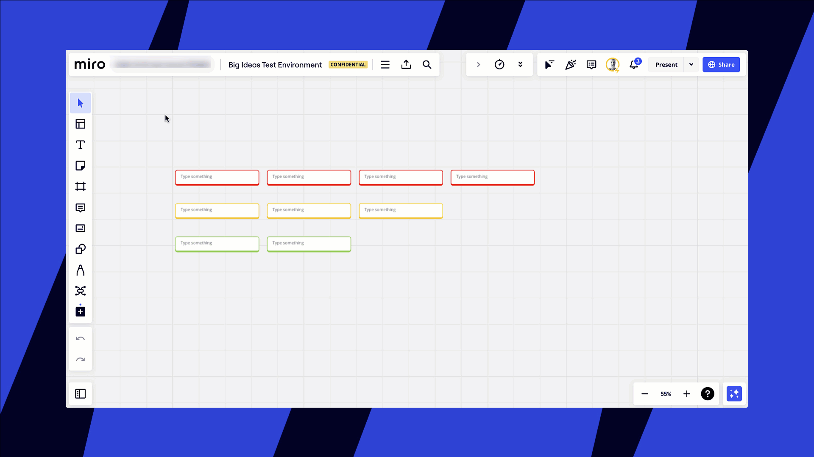
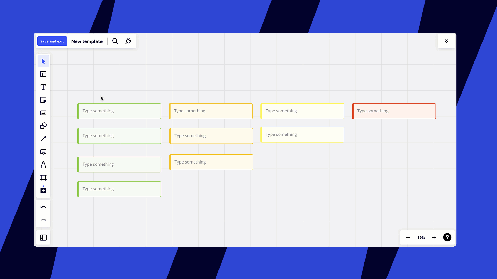
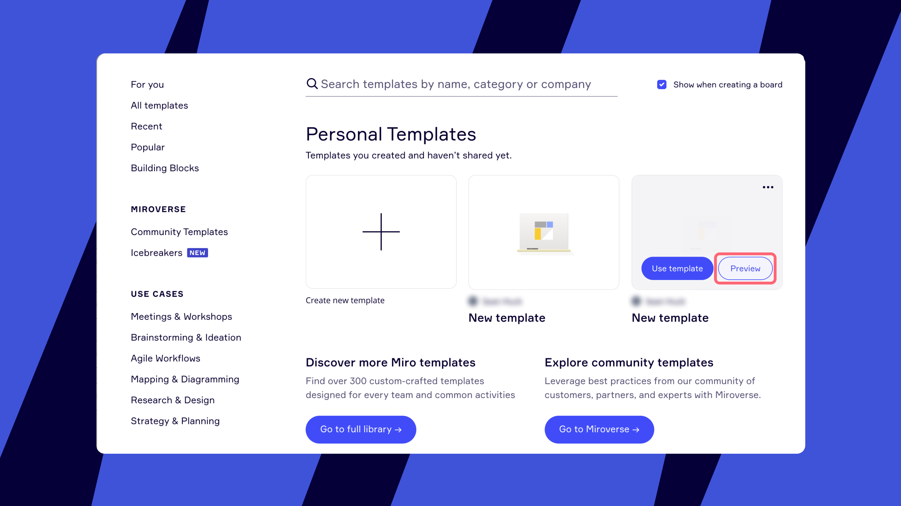
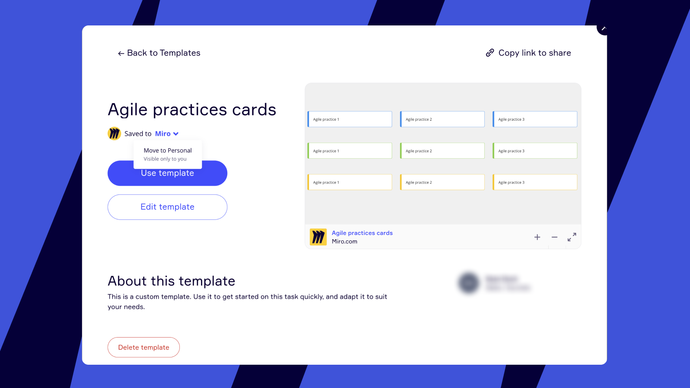
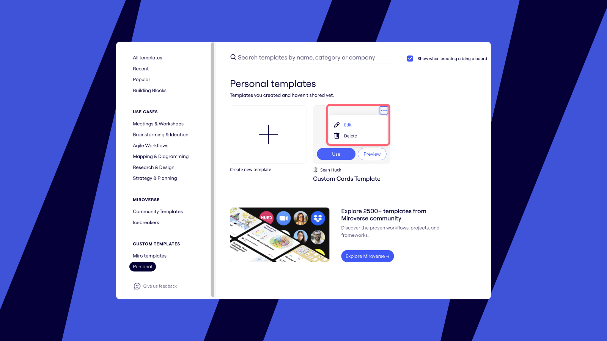
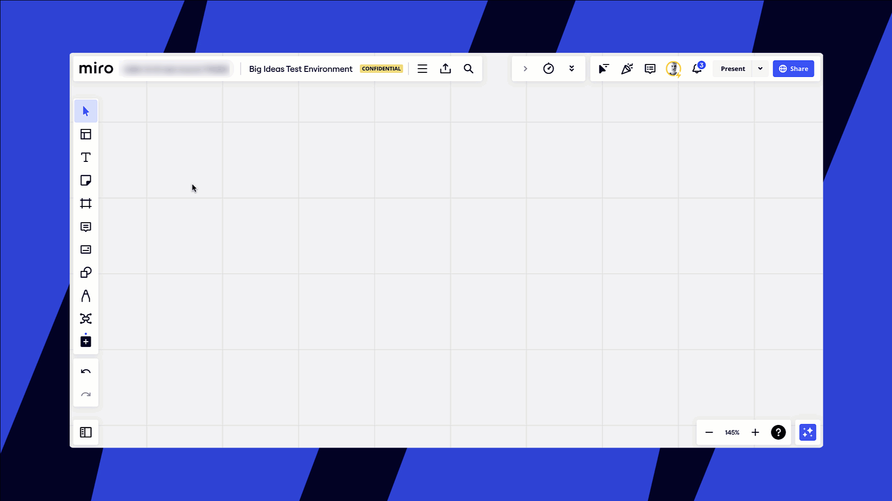
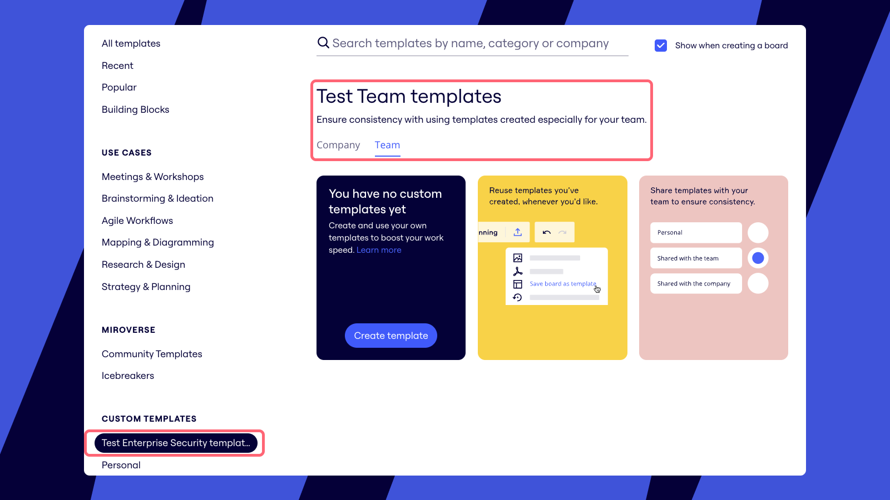
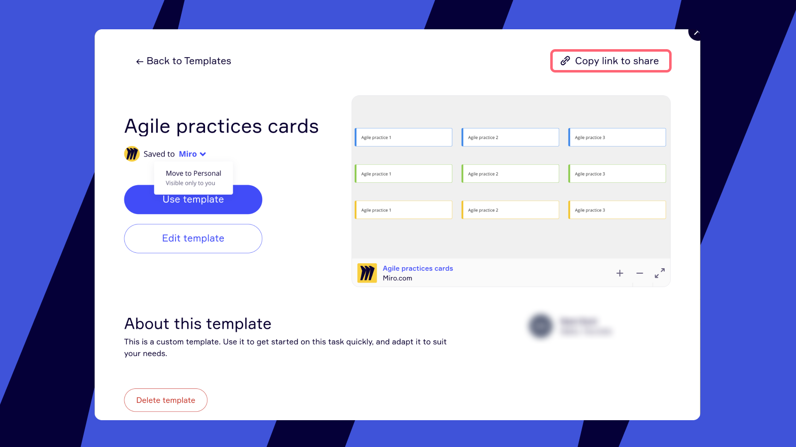
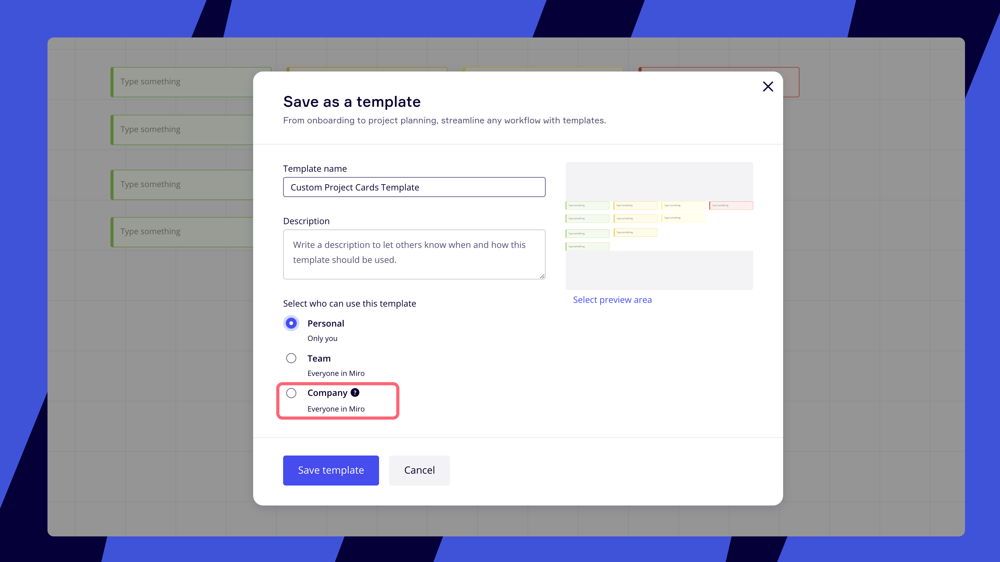
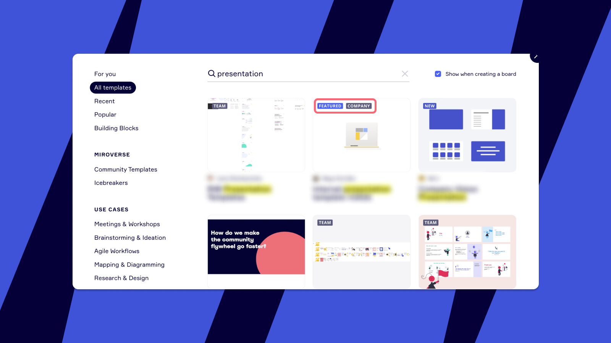

Crea y comparte plantillas personalizadas para estandarizar procesos y evitar que se duplique el trabajo.

> 🚀 Comparte tus plantillas personalizadas con el mundo. [Publica en Miroverse](https://miro.com/miroverse/submission/?backToUrl=/) y ayuda a más de 60 millones de usuarios a poner en marcha su trabajo.

> **Disponible para: planes Starter, Business, Enterprise y Education**Quién puede hacerlo:/strong> Miembros de equipo

## Cómo crear una plantilla personalizada

Desde un tablero completo  Desde cualquier parte de un tablero  Desde cero

1. Selecciona los tres puntos verticales en la barra del tablero.
   Se abre el menú **principal** .
2. Selecciona **Tablero** > **Exportar** > **Guardar tablero como plantilla**.
   Se abre el modal **Guardar como plantilla**.
3. Sigue las instrucciones que aparecen en pantalla.
4. Selecciona **Guardar plantilla**.

:::warning
El contenido de las [notas](../../../using-miro/essential-tools/17-visual-notes.md) no se guarda como parte de una plantilla personalizada.
:::

1. [Selecciona un grupo de objetos](../../../using-miro/working-on-the-board/10-working-with-objects.md) que quieras guardar como plantilla.  Asegúrate de que estén desbloqueadas. Si quieres usar objetos bloqueados, desbloquéalos primero y guarda la plantilla y, luego, vuelve a bloquearlos en el modo de edición.
2. Haz clic en los tres puntos en el menú contextual.
3. Elige **Save as template** (guardar como plantilla) o, como alternativa, puedes actualizar los detalles de tu plantilla y luego hacer clic en **Save** (guardar).

*Opción Guardar como plantilla en el menú contextual del objeto*

1. Haz clic en el icono de **plantillas** en la barra de herramientas de creación.
2. Busca en la sección **CUSTOM TEMPLATES** (plantillas personalizadas) del selector de plantillas.
3. Haz clic en la opción que se adapte mejor a tus necesidades según tu plan: Company, Team o Personal (empresa, equipo o personal).
   > ✏️ Las opciones que veas dependerán de tu plan. En el plan Starter, verás las opciones "Personal" y "Equipo" en Plantillas personalizadas.
   > Las opciones "Empresa", "Equipo" y "Personal" estarán disponibles en los planes Business, Enterprise y Education.
4. Haz clic en **Create new template** (crear nueva plantilla).  Se abrirá un tablero nuevo donde puedas crear una plantilla nueva desde cero.

*una nueva plantilla desde cero*

Tu plantilla se llamará **New template** (plantilla nueva) de forma predeterminada.

Para actualizar los detalles de tu plantilla (nombre, descripción, estado para compartir, vista previa) haz lo siguiente:

1. Selecciona el nombre de la plantilla en la esquina superior izquierda.
2. Realiza los cambios y haz clic en **Guardar cambios** para actualizar.*Guardar una nueva plantilla*

:::note
Las plantillas personalizadas se guardan en la biblioteca del equipo al que pertenece tu tablero actual. Si guardas tu plantilla personalizada en un equipo, no podrás acceder a ella en otro equipo a menos que la crees allí por separado o que la plantilla se comparta con toda la empresa (en el plan Enterprise y el plan Business).
:::

## Usar y administrar tus plantillas

### Mezcla y combina las plantillas

Puedes agregar todas las plantillas que quieras a tu tablero.  Siéntete libre de combinar plantillas para que se adapten mejor a las necesidades de tu proyecto.

### Consulta una vista previa, obtén detalles y usa una plantilla personalizada

A la hora de ver plantillas personalizadas, el nombre y la imagen de perfil del creador de la plantilla se muestran debajo de la tarjeta de la plantilla.  Pasa el cursor sobre una plantilla para ver las opciones de uso o la vista previa de la plantilla.

*Plantillas personalizadas en el selector de plantillas*

La vista previa ayuda a identificar fácilmente la plantilla correcta antes de agregarla a un tablero.  La vista previa muestra el nombre, la descripción y un pequeño ejemplo de la plantilla. También puedes editar y eliminar tu plantilla aquí.

:::note
Si quieres cambiar el área de vista previa del tablero, edita tu plantilla y [restablece el área de vista de inicio](../../../using-miro/sharing-boards/03-sharing-boards-and-inviting-collaborators.md).
:::

*Vista previa de la plantilla personalizada*

### Edita y elimina la plantilla

> **Configurado por:** Propietarios de plantillas, admins de empresa con [permisos de admin de contenido](../../../enterprise-administration/managing-enterprise-teams-and-content/12-content-admin-permissions.md) (en el plan Enterprise)

:::warning
Los admins de contenido pueden borrar plantillas y editar los detalles de los tableros. Si quieren editar el contenido de una plantilla, tendrán que añadirse al tablero a través de la configuración para compartir.
:::

Puedes modificar o eliminar fácilmente plantillas que hayas creado.  Si quieres editar o eliminar una plantilla, haz lo siguiente:

1. Busca en la galería la plantilla que quieras editar o eliminar.
2. Pasa el cursor sobre la plantilla que quieras modificar y haz clic en los tres puntos en el menú contextual.  Aparecerán las siguientes opciones:
   editar
   - Borrar*Botones Editar y Borrar en el selector de plantillas*
3. Para editar los detalles de la plantilla, haz clic en la opción **Edit** (editar).
4. Haz clic en el nombre de la plantilla en la esquina superior izquierda.  Puedes cambiar el nombre, la descripción, el área de vista previa y las opciones para compartir. Haz clic en **Save changes** (guardar cambios) cuando hayas terminado.
5. Para eliminar una plantilla, haz clic en la opción **Delete** (eliminar).  Si haces esto, eliminarás de inmediato la plantilla. Si quieres anular la eliminación, verás un mensaje en la parte inferior del tablero con la opción para deshacer la eliminación.

#### **Editar plantillas en colaboración**

> Quién puede hacerlo: Propietarios de tableros y editores, cualquiera con permisos para compartir

Editar plantillas personalizadas puede hacerse ahora en colaboración, eliminando la necesidad de control de versiones y correos electrónicos de ida y vuelta. Mediante herramientas para compartir y colaborar, los equipos pueden trabajar sin problemas para crear plantillas para sus grupos o para toda la empresa.

Para habilitar el compartir y la colaboración, haz lo siguiente:

1. Haz clic en el icono **Tempates** de la barra de herramientas de creación.
2. Selecciona la plantilla que quieras editar, haz clic en **...** en la esquina superior derecha de la plantilla y elige **Editar**.
3. Cuando se cargue la plantilla, tendrá su propia URL única. Ahora puedes hacer clic en el botón **Compartir** y elegir a quién quieres invitar a colaborar contigo.
4. Tú y tus colaboradores veréis ahora los botones de la barra de herramientas "Mostrar cursores de colaboradores" y "Comentar", y todos los invitados podrán trabajar juntos en la plantilla.
5. Cuando hayas terminado de editar, haz clic en **Guardar y salir** en la esquina superior izquierda de tu tablero para guardar los cambios.
   *Habilitar la colaboración en plantillas personalizadas*

### Acceder a las plantillas de Empresa y Equipo

Para facilitar la navegación, ahora las plantillas de Empresa y Equipo se pueden encontrar bajo un único nombre de empresa personalizado en la sección Plantillas personalizadas. Aparecerá el nombre de la empresa tal y como se encuentra en tus ajustes de Empresa, seguido de la palabra "plantillas" (por ejemplo, **plantillas de Miempresa**).

Cuando accedas a esta área, verás dos pestañas en la parte superior del panel derecho: **Empresa** y **equipo**. Las plantillas que hayas creado o compartido con tu equipo se encontrarán en la pestaña Equipo. Las plantillas compartidas con la empresa se encontrarán en la pestaña Compay.
*Navegar por plantillas personalizadas con pestañas Empresa y Equipo*

### Cómo destacar una plantilla personalizada

> **Disponible para:**Planes Starter, Business y EnterpriseQuién puede hacerlo:/strong> admins de empresa

Los admins de empresa pueden destacar plantillas compatibles con sus formas únicas de trabajo y con las prácticas recomendadas internas.  Las plantillas destacadas tienen una insignia azul y aparecen en la parte superior de una carpeta de plantillas personalizadas. Los usuarios pueden encontrar y reutilizar fácilmente las plantillas personalizadas destacadas.

Para destacar una plantilla, abre la página de plantillas, desplázate hasta **About this template** (Acerca de esta plantilla) y haz clic en **Make featured** (Destacar)**.**

*Hacer una plantilla personalizada*

## Cómo compartir una plantilla personalizada

### Niveles de acceso a las plantillas

Haz que las plantillas se mantengan privadas o compártelas con tu equipo o empresa para evitar la duplicación de esfuerzos.

Hay tres niveles de acceso para las plantillas personalizadas: *Personal*, *Equipo* y *Empresa*.

- **Las plantillas personales** son visibles solo para su creador
- **Las plantillas compartidas con el equipo** están disponibles para todos los miembros del equipo
- **Las plantillas compartidas con la empresa** se comparten con todos los equipos dentro de la subscripción

:::note
En el plan Business, todos los miembros del equipo pueden publicar  **plantillas de la empresa** sin la aprobación previa del admin. Esta configuración se aplica de forma predeterminada.
:::

Puedes actualizar niveles de acceso desde el selector de plantillas al ingresar al modo de edición:

1. Haz clic en el botón **Templates** (plantillas) en la barra de herramientas de creación.
2. Elige el nivel de acceso de tu plantilla (personal, equipo o empresa).
3. Haz clic en los **tres puntos** en la esquina superior derecha de tu plantilla y elige Edit (**Editar**).
4. Haz clic en el nombre de la plantilla en la esquina superior izquierda del tablero, cambia tu nivel de acceso y, luego, haz clic en **Save changes** (guardar cambios) para actualizar.

### Cómo compartir enlaces para plantillas

Compartir enlaces te ayuda a orientar a otros para que encuentren rápidamente la plantilla correcta, amplía el alcance de los recursos recomendados y te ayuda a crear tu propio [Miroverse](../../../using-miro/miroverse/01-what-is-miroverse.md) privado.

Ve a la plantilla que quieres compartir y copiar el enlace pertinente de dos formas:

- Haz clic en los tres puntos en el menú contextual y selecciona **Copiar enlace**
- Haz clic en la vista previa para ver los detalles de la plantilla y selecciona **Copy link** (copiar enlace) **para compartir** en la parte superior derecha.

*La opción de copiar un enlace de plantilla en la vista previa de la plantilla*

Cuando se abre el enlace, el miembro de tu equipo llegará a la página de vista previa de la plantilla.  Ten en cuenta que solo puedes copiar los enlaces de las plantillas Equipo y Empresa.

:::note
Las notas de visibilidad indican quién puede ver ciertas plantillas personalizadas.  Podrás encontrarlas haciendo clic en los tres puntos de la tarjeta de la plantilla (visible para) y en la vista previa de la plantilla (visible solo para). Por ejemplo, si creas una plantilla solo para el equipo de desarrolladores, cuando alguien previsualice la plantilla, verá el mensaje "Visible only to Developer team" (solo visible para el equipo de desarrolladores).
:::

## Plantillas de la empresa y características del admin

> **Disponible para:** Plan Enterprise, plan BusinessConfigurado por: admins de empresa

Hay varias características de plantilla disponibles para los admins de empresa:

- Crea plantillas para la empresa.
- Administrar (editar y eliminar) las plantillas compartidas de empresa/equipo
- Accede a los Insights del admin sobre el uso de plantillas

> Obtén más información sobre [las políticas para compartir del plan Enterprise.](../../../enterprise-administration/canvas-25-admin-features/data-security/07-sharing-policy-on-enterprise-plan.md)

Crear plantillas de empresa Administrar plantillas compartidas  Acceder a los Insights del admin

En los planes Enterprise y Business, los admins de empresa pueden compartir una plantilla personalizada con toda la empresa para que los usuarios de todos los equipos existentes y futuros puedan utilizarla.

Todos los miembros del equipo en el plan Business pueden crear plantillas y compartir con la empresa.

Para los miembros de equipo en el plan Enterprise, esta capacidad depende de [las opciones configuradas por el admin de empresa](../../../enterprise-administration/canvas-25-admin-features/data-security/07-sharing-policy-on-enterprise-plan.md).

*Los admins de empresa pueden compartir una plantilla personalizada con toda la empresa*

Puedes identificar fácilmente las plantillas de la empresa, ya que están marcadas con la etiqueta **COMPANY** (EMPRESA).  Ten en cuenta que la etiqueta COMPANY (EMPRESA) solo es visible en los resultados de búsqueda de plantillas.

*de con una etiqueta*

Si los permisos para el admin de contenido están habilitados en el plan Enterprise, puedes cambiar las [plantillas personalizadas que están compartidas con un equipo o con una empresa](04-templates.md) para ocultar las plantillas que no deberían compartirse fuera de equipos específicos.  Navega a la sección Custom Templates (Plantillas personalizadas), elige la opción adecuada y podrás editar o eliminar cualquiera de las plantillas creadas aquí. Obtén más información sobre los permisos del admin de contenido.
:::note
Los admins de empresa pueden editar lo que quieran en el diálogo de ajustes de la plantilla, pero no pueden editar contenido del tablero en sí.
:::

Ve qué plantillas se usan con más frecuencia y si las personas usan tus plantillas personalizadas.  Los admins de empresa en el plan Enterprise/span> [pueden ver cuántas veces se usó Miro, Miroverse o las plantillas personalizadas en tu empresa en el último año y 30 días en el panel de Insights del admin.](../../../plans-billing/miro-plans/04-enterprise-plan.md)  Obtén más información sobre el panel de Insights del admin *Plantillas populares en Insights*

## Preguntas frecuentes

¿Puedo compartir mis plantillas personalizadas con otros usuarios?

Sí. La forma más rápida de hacerlo es usar la opción Copy link to share (Copiar enlace para compartir) cuando se obtiene la vista previa de una plantilla. Si estás en el plan Business, puedes compartir tu plantilla con tu equipo o con tu organización a través del selector de plantillas. Solo tienes que indicarles el nombre de la plantilla y podrán verla en las plantillas de equipo y en la barra de búsqueda.
Si estás en el plan Enterprise, compartir dependerá de [la configuración elegida por el admin de empresa](../../../enterprise-administration/canvas-25-admin-features/data-security/07-sharing-policy-on-enterprise-plan.md).

¿Puedo compartir tablero como plantilla a través de un enlace?

Sí, con los ajustes de contenido de tablero correctos, ahora cualquier persona puede hacer una copia de tu tablero con solo un enlace.

1. Abre el menú **Share** (compartir) del tablero > **Sharing settings** (ajustes para compartir) > **Permissions (permisos).**
2. Permite que cualquier persona con acceso al tablero copie el contenido del tablero (ten en cuenta que el menú solo está disponible para planes de pago; la opción está habilitada y no se puede configurar en tableros del [plan Free](../../../plans-billing/miro-plans/09-free-plan.md)).
3. Comparte el tablero para [la visualización pública](../../../using-miro/sharing-boards/03-sharing-boards-and-inviting-collaborators.md#compartir-tableros-a-traves-de-un-enlace-publico).
4. Después de compartir el enlace de un tablero, los usuarios registrados de Miro ahora pueden ir al tablero, donde encontrarán la opción para duplicar el tablero.

¿Puedo importar la plantilla de otro usuario a mi Miro?

Sí. Solo tienes que seleccionar y copiar la plantilla y pegarla en tu propio tablero o duplicar el tablero de la plantilla en tu propio equipo y guardarla como plantilla. Ten en cuenta que el propietario del tablero puede restringir la opción de copiar el contenido y el tablero.
También puedes consultar más información sobre [cómo desactivar la capacidad de copiar o exportar plantillas](../../../using-miro/sharing-boards/14-how-to-allow-or-restrict-copying-and-exporting-boards-and-content.md).

¿Cómo puedo eliminar una plantilla?

1. Abre el selector de plantillas y encuentra tu plantilla en el área de CUSTOM TEMPLATES (plantillas personalizadas).
2. Haz clic en los tres puntos de tu plantilla y elige **Delete** (eliminar). Ten en cuenta que solo los propietarios de la plantilla y los admins de empresa con los permisos de admin de contenido en el plan Enterprise pueden eliminar plantillas.

Mi subscripción expiró. ¿Perderé mis plantillas personalizadas?

Cuando expire tu subscripción de pago, las plantillas personalizadas dejarán de estar disponibles hasta que renueves tu subscripción. Las plantillas que ya se han insertado en los tableros se mantendrán intactas.
