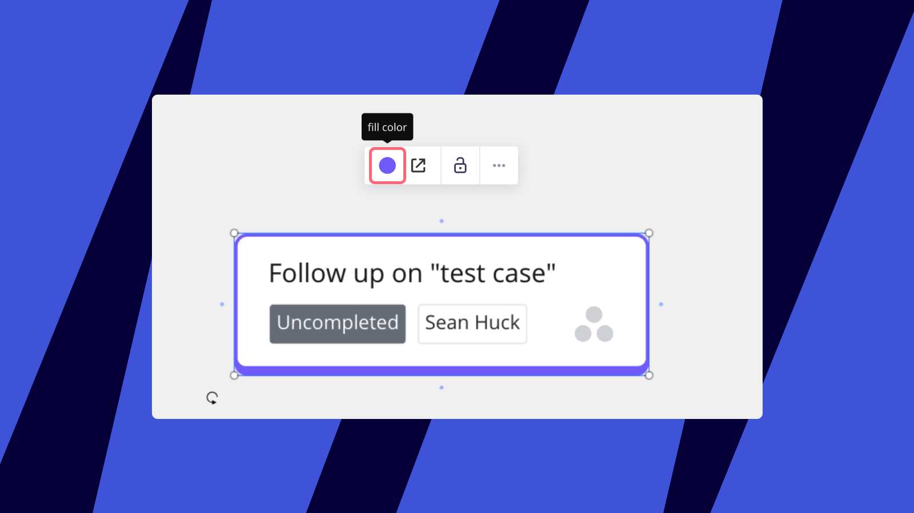

:::warning
Esta página describe nuestra integración de Asana en versión anterior. Para la nueva integración, consulta la [documentación de Asana (Beta)](asana).
:::

**Funciones clave**

- Importa tareas de Asana a tus tableros de Miro para visualizar el avance de tu equipo
- Encuentra tareas específicas para importar directamente de Miro usando filtros de Asana o buscando por el nombre de la tarea
- Sincronización automática: todos los cambios realizados en las tareas de Asana se muestran automáticamente en las Tarjetas de Asana en Miro

> **Disponible para**: los planes Starter, Business, Enterprise. *Es posible que los administradores necesiten autorizar el uso de Asana para su equipo de Miro. Los miembros del equipo solo pueden usar la aplicación de Tarjetas Asana si está instalada a nivel del equipo.*

### Cómo instalar Tarjetas de Asana

1. Primero, necesitarás una cuenta Miro activa y una cuenta de Asana activa. Si no tienes un perfil de Miro, regístrate [aquí](https://miro.com/signup/).
2. En el Marketplace de Miro, abre [Asana Cards](https://miro.com/marketplace/asana-cards/?backUrl=%2Fmarketplace%2F)*.* Haz clic en el botón **Get app**.
   Se te pedirá que selecciones el equipo en el cual deseas instalar Asana. Selecciona un equipo y haz clic en **Install & authorize**.
   > ⚠️ Los usuarios que no sean admins no pueden instalar la aplicación si esto no está permitido en la configuración.

*Autorización para Tarjetas de Asana*

3. El siguiente paso es hacer clic en **Conectar** en la configuración de la aplicación Tarjetas de Asana.

*Configuración de la aplicación Tarjetas de Asana en la configuración de Equipo*
Otros miembros del equipo encontrarán el icono de Tarjetas de Asana en la barra de herramientas de creación de tableros y podrán conectar sus cuentas de Asana desde allí.

*Tarjetas de Asana en la barra de herramientas*

4. Permite que Asana Connect acceda a tu cuenta de Asana. Si no estás conectado a la aplicación en ese momento, se te pedirá que te autorices a ti mismo en Asana.

*******Cómo permitir que Miro acceda a la cuenta de Asana***

### Cómo importar y usar las Tarjetas de Asana

1. Una vez que conectes Miro con tu cuenta de Asana, no dudes en agregar Tarjetas de Asana a tus tableros de Miro. Para obtener el selector, en la barra de Creación selecciona **Herramientas, Medios e Integraciones** (**+**)**.** Se abrirá un panel. Busca y selecciona Tarjetas de Asana.
2. El seleccionador dará la opción de filtrar las tareas. En primer lugar, elige un espacio de trabajo y luego filtra las tarjetas por proyectos, etiquetas o asignados. La lista de proyectos está ordenada por fecha de creación.

   > ⚠️ El seleccionador mostrará solo aquellas tareas a las que tengas acceso en Asana. Si un usuario de Miro abre la página de origen de una tarea a la que no tienen acceso, verá un mensaje diciendo que no se puede acceder a la tarea.

   
   **Importando tarjetas de Asana a un tablero**

Haz clic en el botón de **origen** para abrir la tarjeta en Asana.

**El botón de origen de la tarjeta**

Siéntete libre de agregar tus tarjetas de Asana a [Kanban](../../using-miro/advanced-tools/02-columns-formerly-kanban.md) y [mapas de historias de usuario](../../using-miro/advanced-tools/07-user-story-mapping.md) simplemente arrastrándolas.

:::warning
Aunque aún no existe la opción de crear o editar Tarjetas de Asana desde Miro, todos los cambios realizados desde Asana se sincronizan en Miro (ten en cuenta que puede haber un ligero retraso en la actualización de la tarjeta).
:::

*Agregar Tarjetas de Asana a Kanban*

### Cambiar el color de una tarjeta

Para cambiar el color de una tarjeta, haz clic en la tarjeta o las tarjetas y elige **el color de relleno** del menú contextual. Si duplicas la tarjeta, se aplicará el nuevo color. 
*Cambiar el color de relleno de una tarjeta*

### Cómo desinstalar Tarjetas Asana

Para desinstalar Tarjetas Asana a nivel de equipo, abre Configuración del equipo **> Apps & Integraciones > Tarjetas Asana**, desplázate hacia abajo y haz clic en **Desinstalar para el equipo.**

**Si deseas desinstalar la app a nivel individual, haz clic en** **Desinstalar para mí.**

*Desinstalando Tarjetas Asana*

### Preguntas frecuentes

1. *¿Qué IPs deben estar en la lista de admitidos para las Tarjetas Asana?*
   *-*18.203.61.162, 54.220.74.201, 54.216.81.236, 54.73.153.141, 52.215.228.26, 52.16.47.17, 54.217.180.21.
