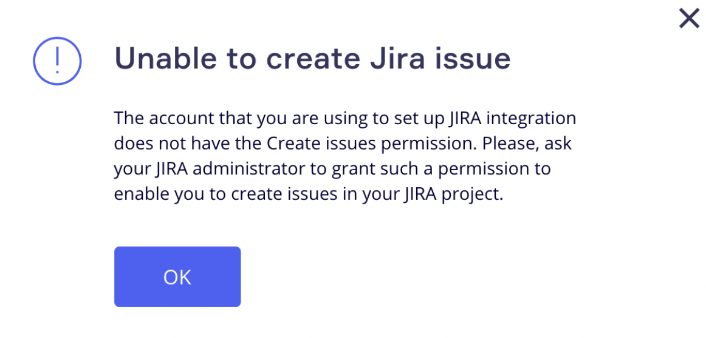

:::note
El método de autenticación OAuth1.0 ya no será compatible en Miro a partir del 31 de julio de 2025. OAuth1.0 es un [protocolo de autenticación obsoleto en Jira](https://developer.atlassian.com/cloud/jira/software/jira-rest-api-oauth-authentication/#:~:text=Deprecation%20Warning&text=Additionally%2C%20if%20you%20have%20existing,OAuth%202.0%20and%20JWT%20respectively.) y no debería usarse. Este cambio es parte de una transición más amplia a OAuth2.0, que se recomienda según las mejores prácticas de seguridad. Se aconseja a los usuarios migrar a OAuth2.0 para asegurar soporte y compatibilidad continuos con los servicios de Miro.
:::

## Configurar Miro en Jira

:::warning
Si encuentras algún problema técnico, consulta nuestro artículo sobre [Posibles problemas y cómo resolverlos](https://help.miro.com/hc/articles/360017572654).
:::

:::tip
Obtén más información sobre las tarjetas de Jira en los artículos [Preguntas frecuentes sobre las tarjetas de Jira](https://help.miro.com/hc/articles/360013463739) y [Cómo configurar webHook para tarjetas de Jira](https://help.miro.com/hc/articles/360017731113).
:::

Configuración de Jira Cloud Servidor de Jira y centro de datos de Jira

:::note
Ten en cuenta quelos menús de Jira pueden diferirdependiendo de la versión de Jira que estés usando. Sin embargo, el flujo general debería ser el mismo. Las instrucciones a continuación también se pueden encontrar en [Soporte de Atlassian](https://confluence.atlassian.com/adminjiraserver071/using-applinks-to-link-to-other-applications-802592232.html).
:::

### Paso 1: enlace de la aplicación

Primero, crea un enlace de la aplicación y configúralo.

1. Ve a **Configuración de Jira** > **Productos** > **Integraciones** > **Enlaces de aplicación** > **Crear enlace:
   ***Ten en cuenta que la interfaz de Jira puede diferir según tu versión de Jira*
2. Elige **Enlace directo de la aplicación** y escribe `https://miro.com/` en el campo **URL de la aplicación**.
   Importante: debes escribir la URL en este formato exacto. Haz clic en **Continuar**.
   
    *Crear el enlace*
3. En el siguiente menú, simplemente haz clic en **Continuar** nuevamente.
4. En el menú **Revisar enlace**, verifica que la URL siga siendo exactamente `https://miro.com/` y escribe el **Nombre de la aplicación** que elijas. Desplázate hacia abajo y, en la parte inferior, marca la casilla **Crear enlace entrante**. *Omite el resto de los campos* y haz clic en **Continuar**.
     *Solo debes completar el campo Nombre de la aplicación*
5. Aquí verás los campos de los valores de Miro. Para obtener los valores, inicia sesión en Miro.
   - Para la integración a nivel de equipo, ve a **[Configuración del equipo](https://help.miro.com/hc/articles/360021841280)** > **Aplicaciones e integraciones** > **Tarjetas de Jira.**
   - Para la integración a nivel de organización, ve a [**Configuración de la compañía**](https://help.miro.com/hc/articles/360021841280-I-am-a-new-Miro-Admin-Where-to-start) > **Apps** > **Gestionar apps** > **Tarjetas de Jira** > **Configuración**.
     > Si no tienes tarjetas de Jira en tu lista de aplicaciones, desplázate hasta la parte superior de la sección, haz clic en **Instalar aplicaciones** y procede a instalar la aplicación desde el Marketplace de Miro. Después de que veas la opción Tarjetas de Jira en la lista, haz clic para abrirla.

     La pestaña del plugin se abrirá y podrás ver el **Paso 1** para obtener los valores requeridos:

     *Valores de tarjetas de Jira*
     Copia los valores y agréguelos al menú **Revisar enlace** de Atlassian.
6. Verás el mensaje de procesamiento durante uno o dos momentos:
   
    *El último paso de la creación del enlace*

Esto completa los pasos del lado de Atlassian. El enlace aparecerá en la lista de enlaces de tu aplicación.

### Paso 2: conexión

Vuelve a la configuración de tu tarjeta de Jira en Miro y elige una de las dos opciones: crear un webhook de forma manual o automática. Si eliges manualmente, desmarca la opción. Consulta más información en [este artículo](https://help.miro.com/hc/articles/360017731113). Recomendamos encarecidamente usar el webhook automático para que no tengas que restablecerlo en caso de que apliquen grandes actualizaciones al plugin.

Por último, ingresa tu URL de Jira y haz clic en **Conectar:**

*Conectar tarjetas de Jira*

Para obtener la URL de Jira, copia el URL base de tu instancia de Jira. Aceptamos los siguientes formatos:

`https://your-server.example.com/`
[https://your-server.example.com/
https://your-ip-address/](https://your-server.example.com/)[https://your-ip-address/](https://your-server.example.com/)

Si tu URL de Jira no es aceptada, consulta [este artículo.](https://help.miro.com/hc/articles/360017572654) Comprueba también que Miro tenga suficiente acceso a tu Jira para [establecer la conexión.](https://help.miro.com/hc/articles/360017572694)

Ya tienes conectada tu instancia de Jira a tu equipo de Miro.

:::warning
Aunque Atlassian ha descontinuado el soporte para Jira Server a partir de febrero de 2024, Miro continuará ofreciendo soporte para la integración de tarjetas de Jira para Jira Server en el futuro previsible.
:::

1. Ve a `https://your-jira-server/plugins/servlet/applinks/listApplicationLinks`[.](https://your-jira-server/plugins/servlet/applinks/listApplicationLinks) Si no está seleccionado "Enlaces de aplicación", haz clic en él. *Enlaces de aplicación de Jira Server*
2. Haz clic en **Crear enlace**. Selecciona "producto de Atlassian" y proporciona la **URL de la aplicación**, "https://miro.com". Haz clic en **Continuar**. *Configurar la URL de la aplicación*
3. Se te llevará al cuadro de diálogo "Vincular aplicaciones". Añade un **Nombre de la Aplicación** (por ejemplo, Miro tarjeta de Jira) y selecciona "Aplicación Genérica" para **Tipo de Aplicación**.
   Deberías ver tu URL de la aplicación de Jira bajo "Estás creando un enlace desde:", y deberías ver `https://miro.com` bajo "A esta aplicación:". Haz clic en **Continuar**.*Configurando detalles de aplicaciones del enlace*
4. La configuración del enlace se procesará. Cuando termine, verás tu nuevo enlace en el área de "Enlaces de aplicación" de Jira Server. *Tu aplicación configurada en Jira Server*
5. A continuación, necesitarás configurar los detalles de tu aplicación. Haz clic en el icono de lápiz de tu aplicación para editar los detalles de la aplicación.
6. En el cuadro de diálogo de Configuración, haz clic en la opción **Autenticación entrante**. Completa con la **Clave del Consumidor, Nombre del Consumidor, Clave Pública** y opcionalmente una descripción.
   - Para la integración a nivel de equipo, esta información está disponible en [**Configuración del equipo**](https://help.miro.com/hc/articles/360021841280) > **Aplicaciones e Integraciones** > **Tarjetas de Jira**.
   - Para la integración a nivel de la organización, esta información está disponible en [**Configuración de la empresa**](https://help.miro.com/hc/articles/360021841280-I-am-a-new-Miro-Admin-Where-to-start) > **Apps** > **Gestionar apps** > **Tarjetas de Jira** > **Configuración**.
     *Configurar los detalles de autenticación entrante en Jira Server*
     *Detalles del enlace de aplicación de Jira en Miro*
7. Desplázate hasta el final de las opciones de autenticación entrante y haz clic en **Guardar**. Tu estado de verificación debería estar ahora confirmado, y este servidor de Jira se puede usar dentro de Miro con las tarjetas de Jira. Asegúrate de elegir "Jira Server" y "OAuth 1.0" en el lado de Miro.

### Autorización del usuario

Después de que se conecte la integración, cada uno de tus usuarios finales debe conectar su perfil personal de Jira para establecer los permisos correspondientes; esto asegura que el acceso de cada usuario del lado de Miro sea *exactamente el mismo que del lado de tu instancia de Jira*. Cuando los usuarios finales intenten importar o editar una tarjeta de Jira por primera vez, se les pedirá que inicien sesión en Jira con sus credenciales de usuario individuales.

Después de hacer esto, los usuarios pueden agregar tareas como tarjetas en la pizarra. Todos los cambios realizados en Jira se reflejan en las tarjetas de Jira en el tablero.

:::note
Si un usuario no tiene credenciales de Jira y tiene acceso al tablero al que se agregó la tarjeta, podrá ver el título de la tarjeta, el tipo de incidencia, la prioridad, el asignado y todos los atributos configurados para ser mostrados en la tarjeta de Jira. Sin embargo, no podrán expandir la tarjeta para ver otros atributos ni editarla, a menos que autoricen. Si el usuario no conecta sus credenciales de Jira, no verá el avatar de la persona asignada y la apariencia general de la tarjeta será diferente.
:::

### Usar una instancia de Jira para varios equipos de Miro

Puedes instalar tarjetas a nivel del equipo o a nivel de la organización. Si tienes varios equipos, puedes aprovechar la configuración a nivel de organización para evitar repetir el procedimiento de configuración para cada equipo. El enlace de la aplicación existente se usa para todos los equipos.

Después de que conectes tu equipo u organización a una instancia de Jira, se crea un nuevo webhook en tus webhooks de Jira para ese equipo u organización de Miro. Crear un webhook establece un canal para las solicitudes de actualización.

Si especificas la configuración a nivel de organización, los equipos que ya están conectados mantienen su configuración actual. Sin embargo, pueden cambiar a la configuración a nivel de la organización en cualquier momento.

Además, si es necesario, los equipos pueden anular la configuración a nivel de organización para conectarse a una instancia diferente de Jira.

Si eres un cliente Enterprise que desea migrar múltiples conexiones a nivel de equipo a la conexión predeterminada a nivel de organización, contacta a tu equipo de cuenta.

:::warning
Si quieres conectar varios equipos por separado, te recomendamos darle al webhook de cada equipo un nombre único. Ve a tu página de webhooks de Jira y edita cada webhook recién creado.
:::

No es posible conectar varias instancias de Jira a un equipo de Miro.

## Cómo deshabilitar el plugin

Para la integración a nivel de equipo, ve a **Team Settings** > **Apps & Integrations** > **Jira Cards**. Luego selecciona **Eliminar para el equipo**.

Para la integración a nivel de organización, para restringir el uso de la aplicación Jira, ve a **Configuración de la empresa** > **Aplicaciones** > **Gestionar aplicaciones** > **Tarjetas de Jira**. Luego mueve el interruptor a la posición de apagado.

:::warning
Si deshabilitas Jira para la organización, entonces los usuarios de todos los equipos de Enterprise no podrán usar las tarjetas de Jira. Para obtener más información sobre la gestión de aplicaciones y las restricciones, consulta [gestión de aplicaciones](https://help.miro.com/hc/articles/4404659741458).
:::

**Más información:** Consulta [Cómo usar tarjetas de Jira](https://help.miro.com/hc/articles/360017572434).
