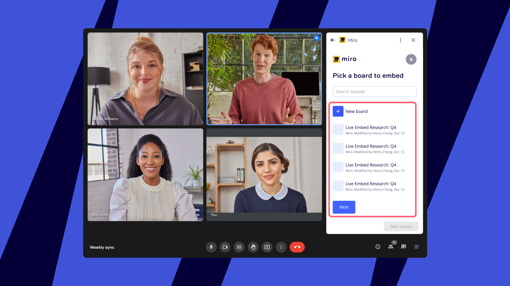
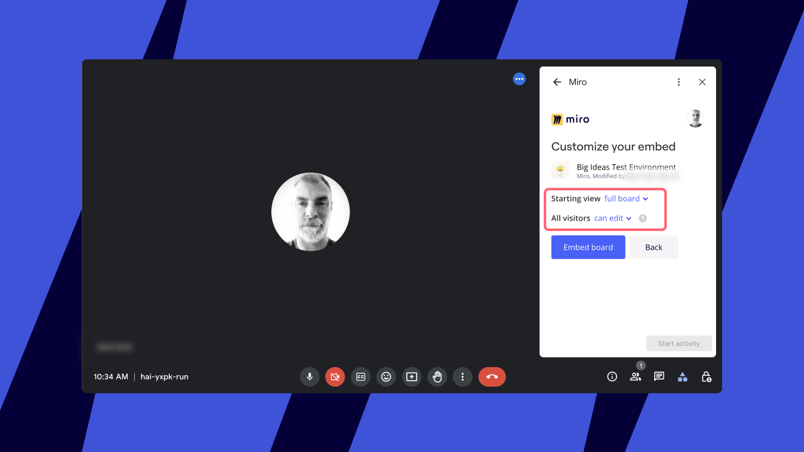
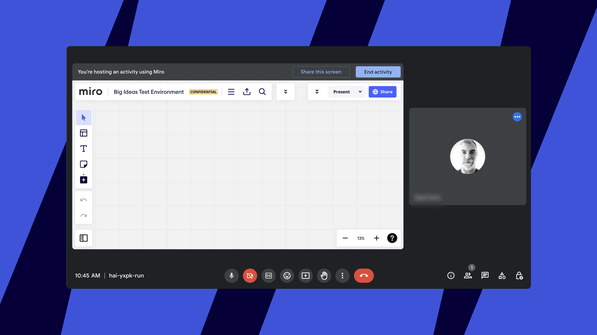
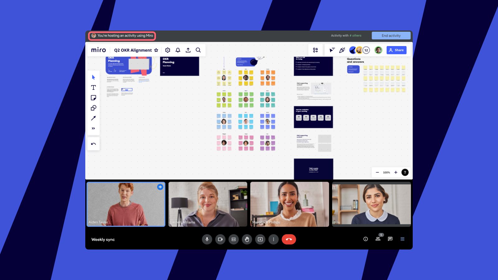
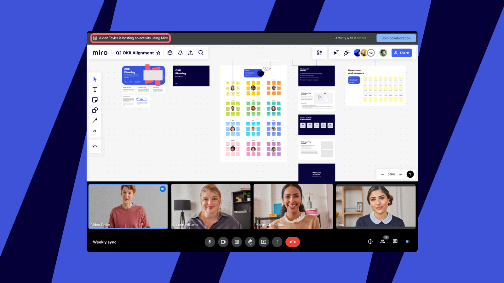
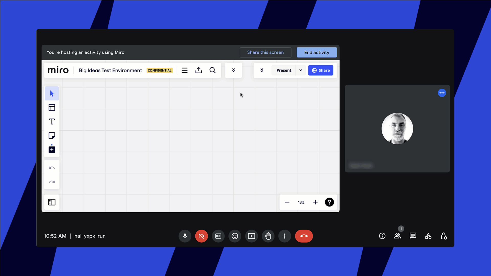

Haz que tus reuniones sean aún más atractivas e interactivas con Miro en Google Meet.  Visualiza y abre cualquiera de tus tableros de Miro o incluso comienza uno nuevo, y colabora con cualquier persona, incluso si no tiene un perfil de Miro. Guarda tu trabajo para más adelante y accede a él en cualquier momento.

Las integraciones de Google Meet ahora son parte del complemento de Google Workspace; esto significa que los usuarios que ya tengan instalado el complemento de Miro seguirán teniendo acceso a Google Meet.  Los usuarios que no tengan instalado el complemento de Miro lo necesitarán para acceder al complemento de Google Meet.

Más información sobre [cómo instalar el complemento de Miro para Google Workspace](07-miro-for-google-workspace.md).

## Cosas importantes a tener en cuenta

- No tienes que ser anfitrión de una reunión para abrir un tablero de Miro dentro de Google Meet: cualquier participante de la reunión puede abrir tableros de Miro.
- Los usuarios que no tengan un perfil de Miro o aquellos que no hayan iniciado sesión podrán ver y participar en el tablero de Miro como [invitados](../../using-miro/sharing-boards/07-collaboration-with-guests.md) sin crear un perfil, siempre que se hayan establecido los permisos correspondientes en el tablero.
- Si creas un tablero de Miro sin perfil, primero se te pedirá que proporciones tu correo electrónico a Miro; luego recibirás información por correo electrónico para guardar tu trabajo y crear un perfil de Miro en un plazo de 24 horas.
- Los admins tienen la opción de restringir el uso de Miro con Meet a ciertos equipos o usuarios individuales de una organización, [más información](https://support.google.com/a/answer/6089179?hl=en)

:::warning
Miro en Google Meet no es compatible con el modo Incognito de Chrome ni con el modo Companion, y solo es compatible con los navegadores Chrome y Edge.
:::

## Cómo configurar Miro para Google Meet

1. Comienza una reunión de Google Meet.
2. Para abrir Miro, haz clic en la pestaña **Actividades**.

   Activities.jpg
   *Actividades en Google Meet*
3. Selecciona Miro en la lista de apps.

   *Complemento de Miro en Google Meet*
4. Aquí tendrás la opción de iniciar sesión en tu perfil de Miro o iniciar un tablero sin perfil.
   Si creas un tablero de Miro sin perfil, recibirás información mediante email para que puedas guardar tu trabajo y crees un perfil de Miro dentro de las siguientes 24 horas

   Para registrar un nuevo perfil de Miro, elige iniciar sesión y luego haz clic en **Registrarse** en la esquina superior derecha de la ventana de inicio de sesión.

   sign_in_or_create_a_board.jpg
   *Opción de inicio de sesión para nuevos usuarios de Miro*
5. Una vez que hayas iniciado sesión, verás todos tus tableros.  Selecciona el tablero que quieras usar en la reunión. Sólo puedes seleccionar los tableros que estás autorizado a editar. 
   El selector de tableros en Miro para Google Meet/span>
6. Selecciona el nivel adecuado de acceso al tablero para todos los participantes de la reunión y haz clic en **Insertar tablero**.  Puedes elegir entre cuatro opciones: permitir acceso para ver, para comentar, para editar o dejar el tablero privado y disponible para los usuarios que iniciaron sesión en Miro y tienen acceso al tablero desde Miro.
   > ⚠️ La opción **Anyone can comment** (Cualquier persona puede comentar) no es compatible si integras un tablero ubicado en un [equipo Free](../../plans-billing/miro-plans/09-free-plan.md).

   > ✏️ Si seleccionas Privado en este flujo, pero el tablero está[configurado para disponibilidad pública en Miro](../../using-miro/sharing-boards/03-sharing-boards-and-inviting-collaborators.md#compartir-tableros-a-traves-de-un-enlace-publico), quedará disponible en modo público de forma predeterminada también en Google Meet.  Sin embargo, el nivel de acceso que configures para el tablero integrado del lado de Google Meet no afecta la configuración de uso compartido de tableros establecida del lado de Miro.  Más información:

   > ✏️ Para los usuarios del [plan Enterprise](../../enterprise-administration/user-management/05-manage-user-invitations-on-enterprise-plan.md) de Miro, tu configuración de acceso respetará los controles de acceso de toda la organización, lo que podría implicar que algunas opciones para compartir estén restringidas. Más información: [Cómo administrar la política de uso compartido de Enterprise respecto de las integraciones insertadas](../../enterprise-administration/managing-apps-on-enterprise-plan/05-how-to-allow-or-restrict-embedding-miro-boards-in-supported-apps.md)./span>

   *Configuración de acceso al tablero dentro de Google Meet*
7. Haz clic en **Iniciar actividad** para compartir el tablero de Miro con todos en la reunión.  La reunión se abrirá en el panel central. Verás un mensaje de confirmación con todos los usuarios a los que has invitado a trabajar en el tablero.

   *Iniciar una actividad en un tablero de Miro en Google Meet*Los asistentes a la reunión recibirán una notificación emergente solicitándoles que se unan al tablero para colaborar.

   Colaboración_Google_Meet_Miro.jpg

Así es como se ve Miro para Google Meet para los presentadores y asistentes:

*Vista del presentador en Miro para Google Meet*

*Vista de asistente en Miro para Google Meet*

## Finalizar la actividad en Google Meet

Si terminaste de trabajar en el tablero de Miro, puedes finalizar la actividad y permanecer en la llamada de Google Meet.

1. Haz clic **en Finalizar actividad.**
2. Se abrirá una nueva ventana emergente donde se te pedirá que confirmes. Haz clic **en Continuar** para finalizar la actividad y volver a la llamada.  Esto finalizará la colaboración con Miro, pero siempre puedes iniciar una nueva colaboración o seleccionar un tablero diferente haciendo clic en el ícono Actividades en la esquina inferior derecha de Meet.

   *Fin de la colaboración en un tablero de Miro en Google Meet*

Obtén más información sobre [Miro para Google Meet](https://support.google.com/meet/answer/12312774).
