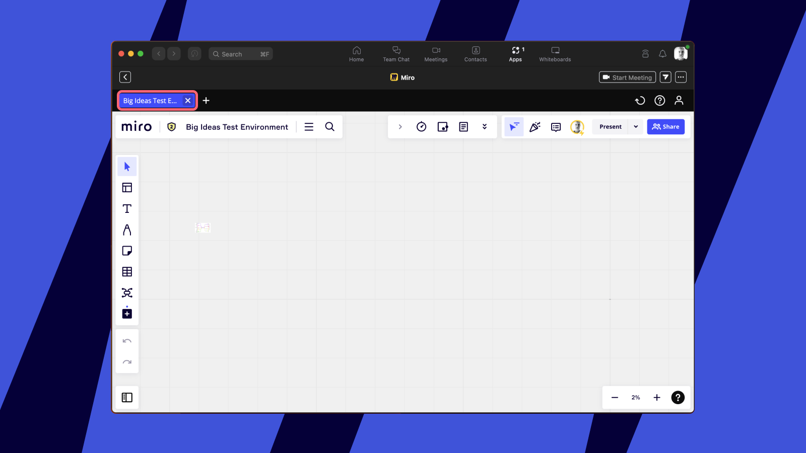

La aplicación Miro para Zoom permite que los equipos organicen una sala de reuniones digital integral y que colaboren de manera eficaz durante las reuniones y los talleres. La aplicación ofrece las capacidades de colaboración de Miro, dentro de Zoom. Para quienes son nuevos en Miro, ofrecemos pizarras virtuales con acceso sin registro.

Tan pronto como instalas la aplicación en Zoom, puedes comenzar a compartir tableros de Miro en tus reuniones de Zoom y crear otros nuevos directamente dentro de Zoom.

aplicación_Miro_para_Zoom_.jpg
La aplicación Miro para Zoom permite trabajar en tableros de Miro con participantes en reuniones de Zoom

:::note
Consulta la [Guía para el administrador para la aplicación de Miro para Zoom](01-miro-app-for-zoom-admin-guide.md) y verás cómo los administradores de Zoom y de Miro pueden habilitar la experiencia para sus usuarios.
:::

> **Disponible para:** todos los planes Miro, todos los planes Zoom
> *Para los planes Business y Enterprise de Zoom, es posible que el admins tenga que aprobar previamente la app Miro
> **Disponible en**: versión de escritorio

## Cómo instalar la aplicación

Los usuarios pueden encontrar la aplicación de Miro para Zoom en la [página de inicio de Zoom de Miro](https://miro.com/works-with-zoom/) o en el [Marketplace](http://miro.com/marketplace/zoom-app) de Miro.

**Nota**: *Para los planes de Zoom Business y Enterprise, un administrador podría tener que preaprobar la aplicación de Miro para usarla en tu organización.

Haz clic en el botón **"Request pre-approve"** (solicitar preaprobación) para solicitar acceso al administrador de Zoom de tu empresa.

solicitar_preaprobación.jpg
/span>Solicitar preaprobación para la aplicación de Miro

Cuando reciben la aprobación, los usuarios pueden autorizar la aplicación de Miro para Zoom a través del flujo de instalación.

solicitud_acceso_Miro.jpg
/span>Permitir que Miro acceda a tu cuenta de Zoom

## Cómo usar la aplicación de Miro en el cliente de escritorio de Zoom

Una vez autorizado, la app te redirigirá a tu cliente de escritorio Zoom y te mostrará la app Miro recién instalada. Ten en cuenta que necesitas tener el [cliente de escritorio](https://zoom.us/download) **[Zoom](https://zoom.us/download) (Versión: 5.7.3 o superior)** instalado y haber iniciado sesión en tu cuenta de Zoom para añadir la app.

crear_un_tablero_o_registrarte.jpg
*/span>Tienes la opción de crear un tablero de Miro sin registrarte o registrarte en tu perfil existente de Miro*

### Crear un tablero sin perfil de Miro

Ofrecemos a los usuarios de Zoom que son nuevos en Miro la opción de probar una pizarra online sencilla y gratuita sin registrarse, creando un tablero de Miro. Esta experiencia es una versión más sencilla y ligera de Miro, perfecta para la colaboración o un proceso creativo instantáneo. Esos tableros están disponibles durante 24 horas. Si quieres continuar usándolos después, simplemente inicia sesión o regístrate para que Miro guarde tu trabajo.

pizarra_web_en_zoom.jpg
/span>Tableros sin registro con Zoom

### Iniciar sesión para acceder a tu perfil de Miro

Los usuarios existentes de Miro necesitan **iniciar sesión** para ver sus tableros. Esto los redirigirá al navegador de su sistema para iniciar sesión en Miro o autorizar directamente la aplicación en Miro. Puedes elegir instalar la aplicación para cualquier equipo.

instalar_aplicación_miro_para_Zoom.jpg
*/span>Instala la aplicación para uno de tus equipos de Miro*

Luego, te dirigirán nuevamente a la aplicación de escritorio de Zoom, donde verás un selector con tus tableros.

Selector_Miro_en_Zoom.jpg
/span>Selector de Miro dentro de la aplicación de Zoom

## Cómo usar la aplicación en reuniones

### Usar un tablero durante una reunión

Los usuarios existentes de Miro pueden aprovechar la experiencia completa dentro de Zoom. Después de iniciar sesión y conectar Miro a Zoom, los participantes pueden crear un tablero nuevo o/span> elegir un tablero existente.

aplicación_Miro_para_Zoom_.jpg
/span>Elige un tablero para abrirlo dentro de Zoom

### Configura los parámetros de acceso del tablero

Define los permisos apropiados para compartir este tablero dentro de Zoom.  Puedes elegir entre cuatro opciones:

- Cualquier persona en Zoom puede editar
- Cualquier persona en la reunión de Zoom puede comentar (ten en cuenta que esta opción no está disponible si compartes un tablero de un [equipo con plan gratuito](../../plans-billing/miro-plans/09-free-plan.md))
- Cualquier persona en la reunión de Zoom puede ver solamente
- Privado, solicitar acceso (lo que significa que la configuración de uso compartido será la del lado de Miro)
  > ✏️ Al elegir la configuración de acceso "Anyone can edit/comment/view" (Cualquiera puede editar/comentar/ver) estás compartiendo el tablero con los participantes de la reunión de Zoom de forma gratuita.

  > ✏️ Si seleccionas Privado en este flujo, pero el tablero está [configurado para disponibilidad pública del lado de Miro](../../using-miro/sharing-boards/03-sharing-boards-and-inviting-collaborators.md#compartir-tableros-a-traves-de-un-enlace-publico), de forma predeterminada quedará como de disponibilidad pública también en Zoom. Sin embargo, el nivel de acceso que configures para el tablero integrado del lado de Zoom no afecta la configuración de uso compartido de tableros establecida del lado de Miro. Más información:

configuración_de_acceso_para_tableros_en_Zoom.jpg
Configuración de ajustes de acceso para tu tablero

:::note
Para los usuarios del [plan Enterprise](../../enterprise-administration/user-management/05-manage-user-invitations-on-enterprise-plan.md) de Miro, tu configuración de acceso respetará los controles de acceso de toda la organización, lo que podría implicar que solo puedas compartir el tablero tal como está configurado.  Más información: Cómo administrar la política de uso compartido de Enterprise respecto de las integraciones insertadas.
:::

sin_opción_de_integrar_un_tablero.jpg
/span>La opción de integrar tableros podría estar restringida por los administradores de la compañía en un plan Enterprise

Si necesitas cambiar los derechos de acceso para un tablero integrado, elimínalo haciendo clic en el ícono de la cruz (x) en el menú desplegable y vuelve a agregarlo con un nivel de acceso diferente. Cuando hagas clic en la x, volverás a la pantalla **Seleccionar un** tablero.

*Elimina un tablero y vuelve a añadirlo pulsando **x en** el tablero del tablero*

### Comparte y colabora en tableros con participantes de reuniones

Usa los controles de la aplicación de Zoom para compartir o colaborar en un tablero con los participantes:

- **Share screen (Compartir pantalla)**: Esto funciona como la opción estándar de "Compartir pantalla" y te permite compartir la ventana en la cual está tu tablero de Miro. Recomendado para cuando solo quieres compartir contenido, pero no permitir el acceso al tablero
- **Send (Enviar)**: Esto te permite compartir el tablero con los participantes para que accedan y colaboren en el tablero dentro de Zoom. Cada destinatario tendrá que instalar la aplicación y podría tener que iniciar sesión para colaborar en el tablero
- **Expand** (Ampliar): Esto te permite ampliar el tablero de Miro en la pantalla principal de la reunión para que puedas colaborar en el tablero sin dejar de ver a los participantes
- **Collapse (Contraer)**: Volverá a poner la aplicación de Zoom en la experiencia del panel lateral más pequeño

controles_Zoom.jpg
/span>Usa los controles de la aplicación de Zoom para compartir o colaborar con los participantes según sea necesario

### Cómo funciona para los participantes de la reunión

Cuando hagas clic en "**Invite**" (Invitar) y especifiques el grupo de usuario a notificar, los participantes de la reunión verán una notificación que sugiere ver el tablero.

botón_invitar.jpg
**Haz clic en Invite (invitar) para invitar a los participantes de la reunión a tu tablero de Miro**

A los participantes se les pedirá que instalen la aplicación y se les podría pedir que inicien sesión para colaborar en el tablero (dependiendo de los parámetros de acceso que hayas configurado para el tablero integrado).

notificación_de_Zoom.jpg
/span>La notificación que verán los participantes de la reunión de Zoom/em>

### Cambiar de un tablero a otro durante la reunión

Puedes alternar entre varios tableros durante tu reunión utilizando el menú de tableros en la parte superior izquierda de la ventana de la aplicación de Miro.

:::note
Solo el tablero que estaba activo cuando se hizo el envío estará disponible para otros participantes.
:::

alternar_entre_varios_tableros.jpg
/span>Cambia de tablero y agrega tableros nuevos

### Accede a la aplicación de Miro antes o después de una reunión

También puedes acceder a la aplicación de Miro desde dentro del cliente de Zoom fuera de las reuniones. Simplemente haz clic en el ícono de **Aplicaciones** de tu pantalla de inicio de Zoom y selecciona Miro. Desde la aplicación, puedes usar el selector con los tableros.

Miro_en_aplicaciones_Zoom.jpg
/span>Miro en las aplicaciones de Zoom

:::note
Todos los tableros fuera de la reunión en el cliente principal estarán disponibles automáticamente en la aplicación de Miro para Zoom cuando se la abra en una reunión.
:::

### Mejores prácticas para usar Miro y Zoom en una reunión

Durante tu reunión, puedes aprovechar las herramientas de colaboración de Miro como el [temporizador](../../using-miro/facilitation-tools/16-timer.md), la función de [votación](../../using-miro/facilitation-tools/19-voting.md), el [videochat](../../using-miro/facilitation-tools/18-video-chat.md) y la función [compartir pantalla](../../using-miro/facilitation-tools/14-screen-sharing.md).

Aprende más sobre cómo preparar un tablero de Miro para una reunión y encuentra las mejores prácticas para organizar un taller o una reunión con Miro en este artículo: [Miro para talleres y reuniones](../../getting-started/feature-intros/03-miro-for-workshops-meetings.md)

## Cómo desinstalar la aplicación

### Desinstalar en Zoom

1. Accede a tu cuenta de Zoom y ve a **Soluciones** > Zoom App **Marketplace**.
   Zoom-marketplace.jpg
   *Abrir el Mercado Zoom*
2. Haz clic en **Manage (Administrar) > Installed Apps** (Aplicaciones instaladas) o busca la aplicación de Miro.
3. Haz clic en **Desinstalar**.
   desinstalar_aplicación_Miro_para_Zoom.jpg
   *La opción de desinstalar la app Miro Zoom en Zoom*

### Desinstalar en Miro

1. Inicia sesión en Miro y navega hasta [Team settings](../../administration/get-started-as-a-miro-admin/01-i-am-a-new-miro-admin.-where-to-start.md) (ajustes de equipo).
2. Ve a **Apps & Integrations (Aplicaciones e integraciones).**
3. Busca la aplicación de Miro para Zoom.
4. Desinstala la app para ti o para todo el equipo.
   desinstalar_en_Miro.jpg
   *La opción de desinstalar la app Miro Zoom en Miro*

## Limitaciones

Las siguientes características actualmente no son compatibles con los tableros de Miro dentro de Zoom:

- Descargar contenido en la aplicación de Zoom
- Aplicaciones de Marketplace de terceros (por ejemplo, Clusterizer)
- Aplicaciones privadas que construyes solo para tu equipo
- Integrar contenido externo (prototipos iframed de otras herramientas)

:::note
Estas características no son compatibles debido a los requisitos de seguridad de Zoom.
:::

## Preguntas frecuentes

1. *¿Qué versión de Zoom se necesita?*
   Versión: 5.7.3 que puedes descargar [aquí](https://zoom.us/download). Versión de escritorio solamente.
2. ¿Qué hacer cuando los participantes se unen a una reunión de Zoom desde una tableta, un móvil o un sistema operativo Linux?
   *- Comparte el enlace al tablero en el chat de Zoom y habilítalos [para acceder al tablero](../../using-miro/sharing-boards/03-sharing-boards-and-inviting-collaborators.md) en un navegador.*

:::note
Véase también: [Preguntas frecuentes sobre las apps de Zoom](https://support.zoom.us/hc/articles/4405084475277-Frequently-asked-questions-about-Zoom-Apps).
:::

## Posibles dificultades y cómo resolverlas

1. *Cuando intento usar la aplicación, obtengo el mensaje de error "**Unable to get Miro access token.*  Usuario de zoom no encontrado".
   - Intenta desinstalar la app de Zoom e instala el último cliente de Zoom Desktop desde [aquí](https://zoom.us/download).
2. *Cuando hago clic en la sección de aplicaciones de Zoom, me dirige a Miro en un navegador.* Inicio sesión para seleccionar un equipo de Miro./em> Cuando hago clic en el botón para instalar, el enlace me dirige a una página vacía con el mensaje de error "Este enlace no es válido".
   - Asegúrate de que has iniciado sesión en tu cliente Zoom Desktop y en el navegador con la misma dirección de correo electrónico.
3. *Estoy intentando configurar la integración Miro-Zoom pero recibo el error "Miro volverá pronto" durante el proceso de registro para elegir el tablero de Miro.*
   - Intenta desconectarte de Zoom en el navegador y en la app de Zoom, conéctate y vuelve a configurar el plugin. Si eso no ayuda, consulta la página de estado de Miro/span> para ver si hay algún problema de rendimiento conocido./span>
