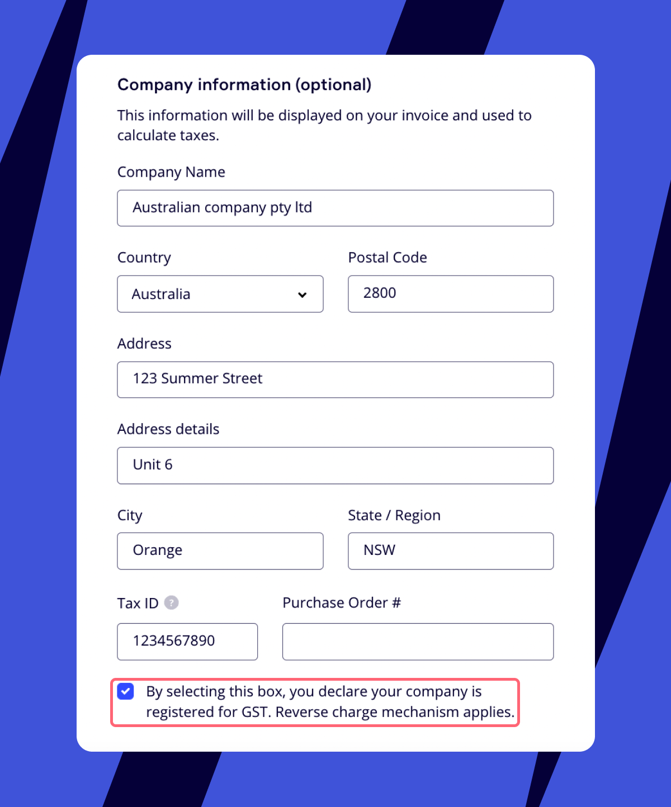
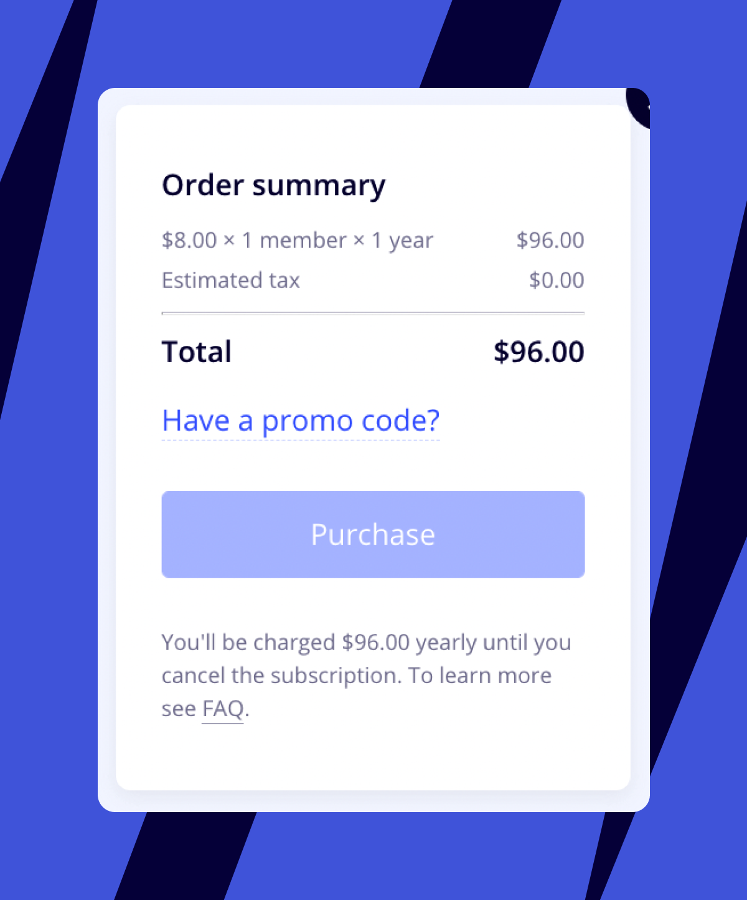
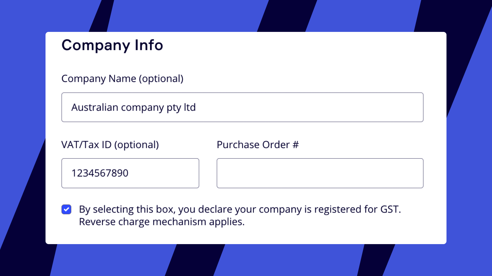

## Impuesto de Ventas, Impuesto al Valor Agregado e Impuesto a Bienes y Servicios

Miro evalúa los impuestos aplicables sobre las tarifas de subscripción de acuerdo con las exigencias de la ley local. Dependiendo de tu ubicación, es posible que se te cobren impuestos al comprar un plan pago de Miro. Cuando Miro recauda estos impuestos, el monto completo se remite en tu nombre a las autoridades tributarias pertinentes.

- El Impuesto de Ventas, el Impuesto de Bienes y Servicios (GST) o el Impuesto al Valor Agregado (IVA) no están incluidos en los precios que se muestran en nuestra página de precios
- La *dirección de la empresa* proporcionada en la sección de información de facturación de tu perfil se usa para determinar la tasa de impuestos correcta, si es que aplica
- Solo los admins de equipo en el plan Starter, los admins de empresa en el plan Business y los [admins de facturación](../../administration/admin-faq/01-admin-faq.md) pueden actualizar información como el país de facturación y el número de identificación de impuestos asociado con la subscripción.

## Impuesto al Valor Agregado (IVA)

Si tu organización se encuentra en la Unión Europea, Noruega, Turquía o el Reino Unido, se agregará el impuesto sobre el valor agregado (o IVA) a tus compras (por ejemplo, suscripciones, licencias adicionales y renovaciones) y verás el impuesto como una línea separada en tus facturas.

### Exención de IVA

Si se trata de un negocio registrado, es posible que estés exento de IVA (es decir, puede aplicarse un cargo invertido) en tus futuras compras si se introduce un ID de IVA válido a través de la página [Billing settings](../manage-your-subscription-and-plan/01-manage-your-subscription.md) (Ajustes de facturación).

Si tu dirección de facturación está en la UE, ten presente que el ID de IVA que proporciones debe estar registrado en la [base de datos de VIES](https://ec.europa.eu/taxation_customs/vies/) para que se considere válido. En ciertos países de la UE donde este proceso no es automático, es posible que debas solicitar a tu autoridad tributaria que incluya tu ID de IVA en la base de datos de VIES.

### Cómo ingresar tu ID de IVA en el punto de compra

Después de seleccionar el tamaño de tu equipo, el ciclo de facturación y el método de pago:

1. Ingresa tu país en la sección de información de facturación (aparecerá un campo de ID de IVA).
2. Introduce tu NIF.

### Cómo actualizar tu ID de IVA

1. Haz clic en el avatar de tu perfil y, a continuación, en **Consola admin**.
2. En la barra lateral izquierda, haz clic en **Facturación** y, a continuación, en la pestaña **Información de facturación**.
3. Ingresa la dirección de la empresa e introduce el ID de IVA (asegúrate de incluir el código de país de 2 letras asociado a tu ID de IVA).

### ID de IVA de Miro

Miro está registrado para el IVA a través del esquema One Stop Shop (‘OSS’) en la UE y no tiene un registro de IVA en cada Estado Miembro de la UE. El esquema OSS está disponible para las personas imponibles no establecidas en la UE para recaudar y remitir el IVA por servicios suministrados electrónicamente a clientes no empresariales, dentro de los Estados Miembros de la UE. Miro eligió a los Países Bajos como país de identificación para el OSS.

## Impuesto sobre bienes y servicios (GST)

Si tu organización está ubicada dentro de Australia o Nueva Zelanda, se agregará el impuesto sobre bienes y servicios o GST a tus compras (subscripciones, licencias adicionales y renovaciones) y verás el impuesto como una línea aparte en tus facturas.

### Exención del GST

Si se trata de un negocio registrado y la dirección de tu empresa está en Australia o Nueva Zelanda, es posible que estés exento de pagar el GST en las compras de Miro a través del mecanismo de ‘Reverse Charge’ (cargo invertido).

### Cómo ingresar tu ID de impuestos

Si se introduce un número de negocio australiano (Australian Business Number, ABN) o número de GST de Nueva Zelanda en la comprobación o a través de la página Billing settings (Ajustes de facturación), no se cobrará el GST por las compras actuales o futuras.

Si no se proporciona ninguna información de la empresa ni el ID de impuestos, se cobrará el GST en todas las compras.

#### **Al finalizar la compra**

Después de seleccionar el tamaño del equipo, el ciclo de facturación y los detalles de los métodos de pago tendrás la oportunidad de agregar los detalles de tu empresa (opcionalmente):

1. Haz clic en el botón **+ Add company info** (+Añadir información de la empresa) y completa los campos que se muestran. Tendrás que tener seleccionado "Australia" o "Nueva Zelanda" como país.
   formato_información_facturación_impuestos.png
   *Campos de información de la empresa en los ajustes de facturación*
2. Completa los detalles de **Company Name** (Nombre de la empresa) y **Address** (Dirección) y agrega tu ID de ABN o GST (NZ) al campo **Tax ID** (ID de impuestos).
   - Si estás en Australia y estás registrado para el GST, tendrás que hacer clic en la casilla de verificación para poder optar por el mecanismo de cargo invertido.
   - Los clientes de Nueva Zelanda no verán esta casilla.
     *Información de la empresa con casilla de registro del IVA*
3. Miro ahora comprobará automáticamente el ID de impuestos proporcionado con el proveedor de impuestos para asegurarse de que el ID de impuestos que se proporciona sea válido. Si es válido, el monto de los impuestos que se muestra en el resumen de pagos se reducirá a cero.
   - Los ID no válidos o cuando no se proporcione una casilla de verificación darán lugar al cobro del IVA.
     *Resumen del pedido sin impuestos*

### Cómo actualizar tu ID impositivo

1. Abre [Team settings](../../administration/get-started-as-a-miro-admin/01-i-am-a-new-miro-admin.-where-to-start.md) (Ajustes de equipo). Tendrás que ser admin de facturación.
2. Ve a la pestaña **Billing** (Facturación) **> Billing information** (Información de facturación).
3. Completa los campos Company Address (Dirección de empresa) y Tax ID (ID de impuestos).
4. Selecciona el cuadro de verificación para declarar que tu empresa está registrada para el GST (solo Australia)
5. Miro realizará automáticamente una verificación con el proveedor de impuestos para asegurarse de que el ID de impuestos proporcionado sea válido. Si es válido, no se aplicarán impuestos a las futuras compras.
   - Si los ID no son válidos o si no se marca la casilla de verificación, se cobrará el GST.
   - Miro no ajustará las compras históricas si no se facilitaron los identificadores fiscales en el momento de la compra.*Declarar el registro GST de la empresa*

### ID de GST de Miro

Miro está registrado para GST a través del proceso de registro simplificado como empresa no residente que suministra servicios por vía electrónica. Como tal, Miro tiene un Número de Referencia ATO (ARN) y solo recaudará el GST sobre suministros a clientes no empresariales.
