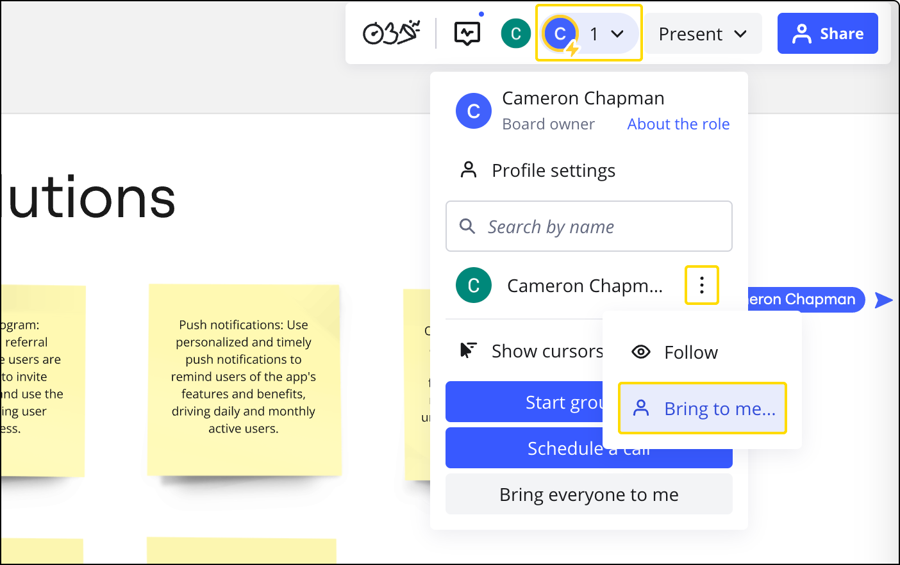

El Manejo de Atención es un conjunto de poderosas funciones de facilitación diseñadas para [reuniones y talleres](../../getting-started/feature-intros/03-miro-for-workshops-meetings.md). Permite a los organizadores de las reuniones y a los facilitadores de los talleres guiar a los participantes y asegurarse de que todos entiendan y participen. Esta capacidad es particularmente vital para gestionar efectivamente talleres grandes con numerosos participantes, ya que ayuda a dirigir su enfoque al área específica del tablero donde ocurre la colaboración. Como facilitador, puedes cambiar sin problemas entre presentar contenido y participar en actividades colaborativas, asegurando una sesión fluida y productiva.

> Gracias a la alineación de color, nunca te perderás en el tablero: el color de los cursores y los bordes de los avatares de los colaboradores se sincronizan para todos los participantes del tablero.

## Uso de las funciones de manejo de atención

El manejo de atención abarca varias características que te ayudan a guiar a los participantes en el tablero. Estas herramientas te permiten seguir a los colaboradores o atraer su atención hacia áreas específicas.

### Seguir a un colaborador

> **Disponible para:** planes Free, Starter, Business y Enterprise

Si trabajas con varios facilitadores o presentadores, puedes elegir seguir a una persona específica. Esta función te permite cambiar fácilmente entre diferentes áreas del tablero al reflejar lo que otro participante está viendo y haciendo.

Para utilizar esta función:

1. Navega a la barra de herramientas de colaboración ubicada en la esquina superior derecha del tablero.
2. Haz clic en el **avatar de un colaborador en particular** para comenzar a seguir su vista.
3. Para dejar de seguir a un usuario, puedes hacer clic en cualquier parte del tablero, mover el cursor o acercarte o alejarte.

El usuario a quien están siguiendo verá un mensaje de notificación en su avatar, indicando que otros están viendo lo que ellos ven.

### Trae a todos a tu vista

> **Disponible para:** planes Starter, Education, Business y Enterprise
> **Configurado por**: propietarios de tableros, [copropietarios](../sharing-boards/06-co-owners-of-boards-and-spaces.md), editores que tienen acceso de edición mediante invitación por correo electrónico o porque son parte de un [espacio](../spaces/01-spaces.md) o equipo

La funcionalidad **Traer a todos hacia mí** te permite dirigir fácilmente a todos los colaboradores al área específica del tablero en la que deseas que se enfoquen. Cuando activas esta función, el seguimiento automático se habilita para todos los participantes. Esto significa que todos verán exactamente el mismo contenido que tú *hasta que muevan sus cursores, se acerquen o hagan clic en el tablero.*

Para usar esta función:

1. Ve a la barra de herramientas de comunicación en la esquina superior derecha.
2. Haz clic en **tu propio avatar**.
3. Elige la opción para llevar a todos los colaboradores a tu vista actual en el tablero.

### Trae a un colaborador específico a tu vista

> **Disponible para:** planes Free, Starter, Education, Business y Enterprise
> **Configurado por**: propietarios de tableros, [copropietarios](../sharing-boards/06-co-owners-of-boards-and-spaces.md), editores que tienen acceso de edición mediante invitación por correo electrónico o porque son parte de un espacio o equipo

Si notas que un participante específico se ha alejado o parece perdido en el tablero, puedes traerlo de vuelta al área de enfoque deseada individualmente.

Para hacerlo:

1. Ve a la barra de herramientas de comunicación en la esquina superior derecha.
2. Haz clic en **tu propio avatar**.
3. Haz clic en el icono **tres puntos** (**...**) junto al nombre de un colaborador.
4. Selecciona la opción para llevar a esa persona en particular al área del tablero en la que quieres que se concentre.
5. El usuario seleccionado seguirá entonces la vista de tu pantalla hasta que mueva su cursor, se acerque o aleje, o haga clic en el tablero.

*Cómo traer a un colaborador*

## Disponibilidad y limitaciones de funciones

Las capacidades de las funciones de manejo de atención varían según los roles de usuario y los niveles de acceso. Comprender estas limitaciones garantiza una experiencia de moderación fluida.

Las características **Seguir**, **Traerme**,  y **Traerme a todos** están disponibles para todos los editores que fueron invitados explícitamente al tablero [por correo electrónico](../sharing-boards/03-sharing-boards-and-inviting-collaborators.md) (incluidos [invitados](../sharing-boards/07-collaboration-with-guests.md) con acceso de edición) o tienen acceso al tablero porque son parte de un [espacio](../spaces/01-spaces.md) o [equipo](../sharing-boards/03-sharing-boards-and-inviting-collaborators.md) en Miro. [Los visitantes con acceso de edición](../sharing-boards/08-collaboration-with-visitors.md) solo pueden usar la función de **seguir** para observar a otros colaboradores.

*Visualizadores con sesión iniciada (registrados)* [y](../sharing-boards/01-board-access-rights.md) [comentadores](../sharing-boards/01-board-access-rights.md) también están limitados a solo poder **seguir** a otros colaboradores.

Los [visitantes](../sharing-boards/08-collaboration-with-visitors.md) no registrados que tienen acceso solo para ver o solo para comentar no tienen acceso a ninguna de las características de manejo de atención.
