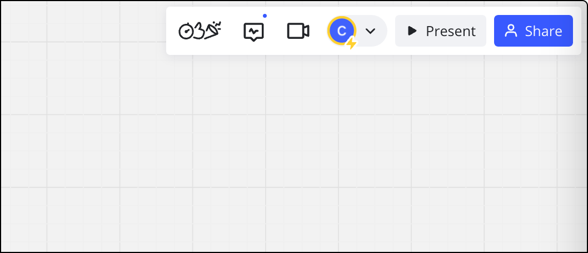
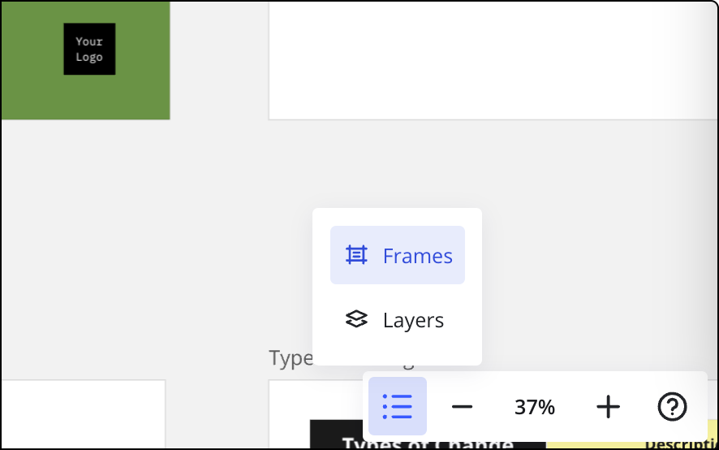
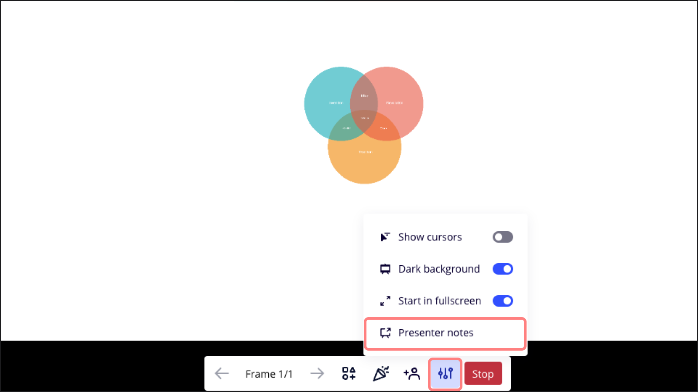
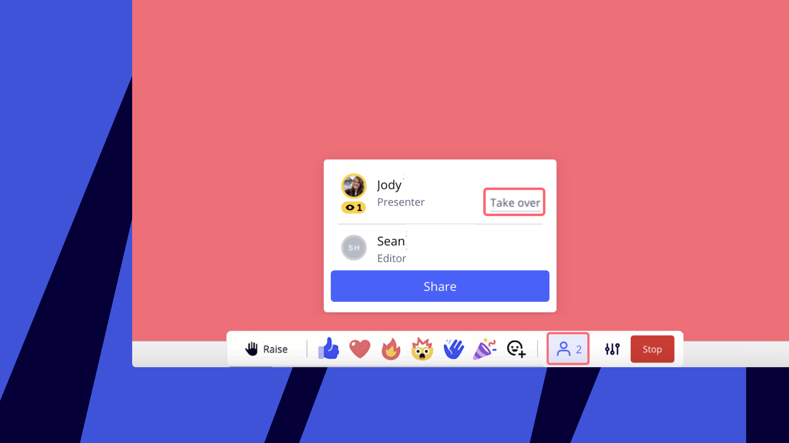

El Modo Presentación Interactiva permite a los equipos colaboradores presentar sus tableros de Miro con el máximo nivel de interactividad y flexibilidad.

> 🚀 Muestra tus habilidades de presentación en Miroverse. [Publica tu plantilla](https://miro.com/miroverse/submission/?backToUrl=/) y ayuda a más de 60 millones de usuarios a relacionarse mejor con su público.

> **Disponible para:** planes Free, Starter, Business y Enterprise
> **Quién puede hacerlo:** propietarios de tableros, copropietarios de tableros y editores de tableros (excepto visitantes).
> **Disponible en:** navegador de escritorio, app de escritorio, navegador de tableta

## Cómo presentar

Culsar el botón **Presentar** en la esquina superior derecha de tu tablero.

Cuando pulses **Presentar**se iniciará el modo de presentación a pantalla completa.

*El botón Presentar se encuentra en la barra de herramientas Personas*

Puedes salir del modo de pantalla completa pulsando **Escape** en el teclado. Si haces clic en **Detener** en la barra de herramientas de la parte inferior de la pantalla, saldrás del modo presentación.

### Gestionar los marcos de presentación

Los marcos de [Miro](../essential-tools/07-frames.md) funcionan como diapositivas en tu presentación. Puedes gestionar tus marcos haciendo clic en el icono **Marcos y capas** de la esquina inferior derecha de tu tablero de Miro y, a continuación, haciendo clic en **Marcos**.

*El icono Marcos y capas abre un submenú*

Esto abrirá el panel Frames (Marcos).  Desde allí puedes establecer el orden de los marcos si los arrastras desde la barra lateral.

Puedes cambiar el nombre haciendo clic en el campo debajo del marco.  Si haces clic en los tres puntos junto al nombre de un marco, encontrarás más opciones para esconderlos o exportarlos, añadir otro, copiar el enlace correspondiente y eliminarlo. /span>

> **💡**Utiliza [Organizar mágicamente](../essential-tools/07-frames.md) para reorganizar los marcos automáticamente.

### Notas del presentador

Añade notas del presentador a tus marcos para una presentación más organizada. Las notas del presentador aparecerán en una ventana aparte que sólo es visible para ti. Utiliza estas pistas y recordatorios privados para realizar una presentación fluida y segura mientras navegas por tus diapositivas.

Hay dos formas de acceder a tus notas de presentador:

1. Accede a las notas del presentador desde el tablero.

En la esquina inferior derecha del tablero, haz clic en el icono **Marcos y Capas** y, a continuación, en **Marcos** para abrir el panel de marcos. Junto al botón **Presentar**, haz clic en los tres puntos (**...**) y selecciona **Notas del presentador**.

2. Accede a las notas del presentador mientras estás en modo presentación.

En la barra de herramientas de la presentación, en la parte inferior de la pantalla, haz clic en el icono **Preferencias** y selecciona **Notas del presentador**.

*notas del presentador en modo presentación*

### Aplicaciones de actividades

> Relevante para: planes Starter, Business, Enterprise y Education

Cuando inicias tu presentación interactiva, puedes colaborar con tu audiencia iniciando una aplicación de colaboración.  Sólo tienes que hacer clic en el icono de **apps de Actividades de** , en la parte inferior de la pantalla, y seleccionar [marcos separadas](05-breakout-frames-beta.md), [temporizador](16-timer.md) o [votación.](19-voting.md)

Apps_de_actividad.png
*Lanzar una app de colaboración*

A partir de ahí, también puedes gestionar las herramientas de los participantes durante la presentación.  Activa la opción **Show creation tools** (Mostrar herramientas de creación) y selecciona las herramientas que los participantes pueden usar durante la sesión./span>

:::note
La capacidad de restringir las herramientas de los participantes no está disponible en el plan Starter.
:::

## Modo de presentación

En cuanto hagas clic en **Presentar**, ya sea en la barra de herramientas de colaboración o en el panel de marcos, iniciarás el modo de presentación.

### Vista del público

En cuanto el presentador inicie la presentación, los demás participantes del tablero verán un modal con la opción de unirse.

Invitación_para_unirte_a_una_sesión.jpg
*La opción para unirse a una presentación*

Cuando los participantes se unen, se los guiará mediante la vista del presentador.  Pueden moverse por el tablero y cambiar a la vista del presentador si hacen clic en **Return to presenter** (Volver al presentador)./span>

La experiencia de la presentación sigue siendo interactiva: los participantes pueden usar las reacciones o levantar la mano seleccionando las opciones correspondientes en la barra de herramientas inferior.

En la barra de herramientas de creación del lado izquierdo pueden usar las herramientas habilitadas por el presentador.

Usuario_interactuando_con_el_tablero_durante_una_presentación.gif
/span>Interacción de los usuarios con el tablero

### Manejo de atención

Mantén a tu audiencia enfocada y activa. En Miro, puedes pasar sin problemas de una presentación de contenido *con diapositivas* a *otra en formato de lienzo*.

**Efecto caja de luz:** Crea un borde negro alrededor de los marcos para que los usuarios puedan ver exactamente en qué contenido te estás centrando. Si desplazas la pantalla o alejas la imagen, el efecto caja de luz desaparece.

Ve a la barra de herramientas del presentador en la parte inferior de la pantalla y haz clic en **Preferences** (Preferencias) > activa la opción **Dark background** (Fondo oscuro).

Efecto_caja_de_luz.png
/span>*Activar el fondo oscuro para lograr un efecto de caja de luz*

**Haz clic para ampliar:** Destaca el contenido durante tu presentación. Simplemente, haz clic para acercar cualquier marco.

*Haz clic para ampliar con el efecto lightbox habilitado*

### Cómo salir de una presentación y volver a unirse

Para salir del modo de presentación y volver a la vista de tablero estándar, haz clic en **Leave** (salir) en la barra de herramientas inferior.

*Salir de una reunión*

Si sales de una presentación, puedes volver a unirte al hacer clic en **Join** (unirse) en la esquina superior derecha de tu tablero.

*La opción de reincorporarse a una reunión*

### Entregar a un presentador

> **Relevante para:** Planes Starter, Business, Enterprise y Education
> **Quién puede hacerlo:** Tableros propietarios, copropietarios y editores

Si tu reunión es grande y tiene muchos oradores, puedes entregar la presentación a otro orador.

1. En la barra de herramientas del presentador que se encuentra en la parte inferior de tu pantalla, abre la lista de personas en la presentación.
2. Haz clic en **Entregar** y selecciona un usuario al que entregarle la presentación.

El presentador original pasará a la vista del público y el nuevo presentador podrá controlar la presentación.  El público recibirá un aviso donde se notifica sobre el nuevo presentador.

*Entrega a otro presentador*

### Relevar a un presentador

> **Relevante para:** Planes Starter, Business, Enterprise y Education
> **Quién puede hacerlo:** Tableros propietarios, copropietarios y editores

En lugar de esperar la entrega, puedes tomar el control de la presentación en cualquier momento.

1. En la barra de herramientas del presentador que se encuentra en la parte inferior de tu pantalla, abre la lista de personas de la presentación.
2. Haz clic en **Relevar** y selecciona al usuario que quieras relevar.

El presentador original pasará a la vista del público y el nuevo presentador podrá controlar la presentación.  El público recibirá un aviso donde se notifica sobre el nuevo presentador.

*Tomar el relevo de un presentador*

### Finalizar la presentación

Cuando el presentador hace clic en **Detener** en la barra de herramientas inferior, todos los colaboradores del tablero pasan a la vista estándar del tablero.

Cómo_detener_una_presentación.jpg
Cómo detener la presentación

## Preguntas frecuentes

**¿En qué difiere el modo de presentación interactiva de las otras herramientas de presentación?**

El modo de presentación interactiva admite una experiencia de presentación interactiva bidireccional. Los participantes no solo pueden usar reacciones, publicar stickers o levantar la mano directamente dentro del modo; también pueden participar en aplicaciones de actividad como temporizadores, votaciones y sesiones separadas. Otro punto importante es que el modo de presentación interactiva te permite cambiar fácilmente de presentar diapositivas a desplazarte para mostrar el tablero a las personas, y viceversa. Esto significa que puedes presentar lo que quieras, con o sin diapositivas en Miro.

**¿Cómo excluyo una diapositiva de mi presentación en marcos?**

Para excluir una diapositiva de la presentación, puedes utilizar el icono **Ocultar marcos** del menú contextual de la diapositiva o diapositivas que quieras excluir. Alternativamente, puedes eliminar el marco correspondiente (puedes hacerlo sin eliminar el contenido que contiene) o puedes mover el marco a la parte inferior del panel Marcos.

**¿Puedo exportar mi tablero como presentación de PowerPoint?**

No, pero puedes exportar cada marco como una imagen y agregarlas a tu presentación. Aprende [cómo exportar tu tablero](../import-and-export/export/03-how-to-export-your-board.md).

**¿Puedo importar una presentación de PowerPoint a Miro?**

Sí, aquí tienes más información sobre cómo [añadir archivos a tus tableros](../working-on-the-board/07-ways-to-add-content.md).

**¿Puedo crear notas de presentación ocultas para otros participantes?**

Esta función no está disponible actualmente, pero esperamos presentarla próximamente.

**¿Quién puede iniciar o unirse a una presentación en el tablero?**

Los editores que sean miembros de un equipo o invitados tendrán el botón Presente. Los visitantes no lo harán. Cualquiera que esté actualmente en el tablero cuando se inicie una Presentación puede unirse a.
