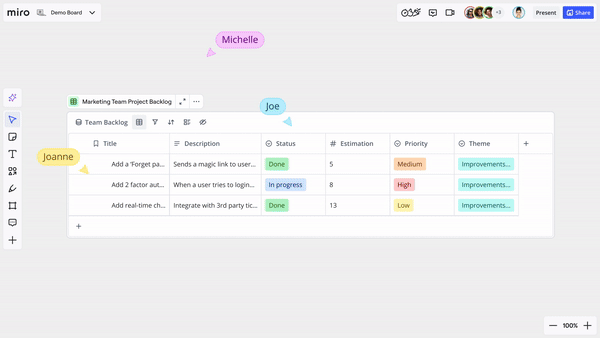
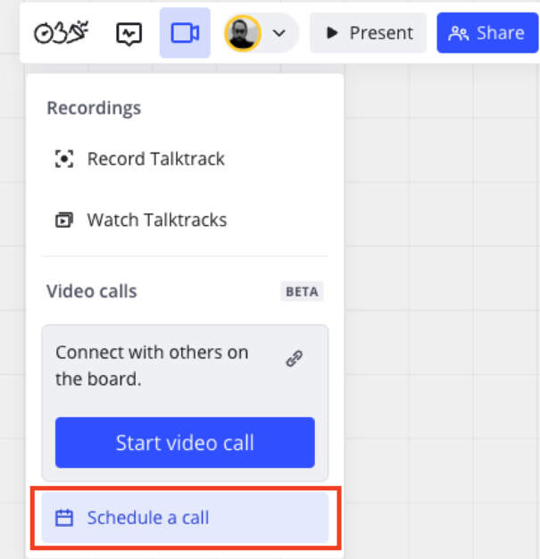
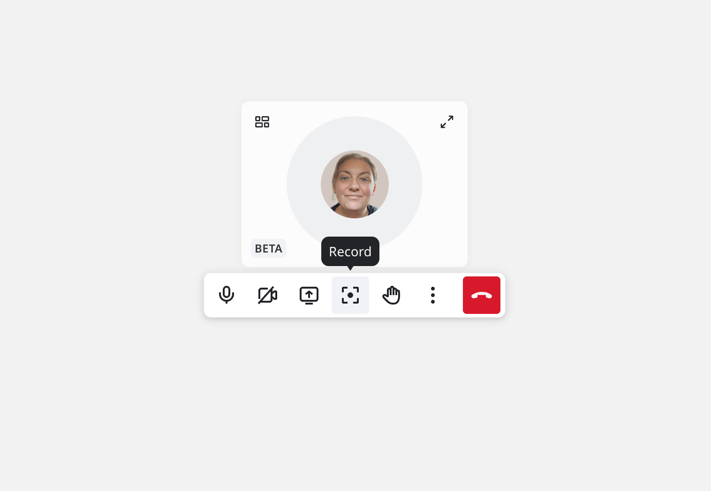
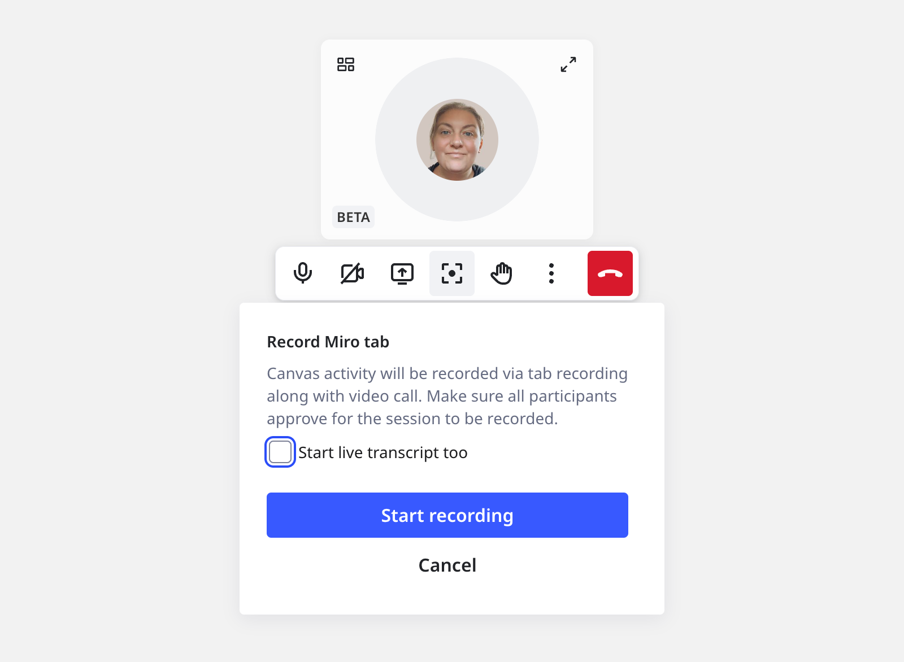

Inicia y participa en videoconferencias directamente dentro de un tablero de Miro. Con solo unos clics, puedes invitar a todos los colaboradores del tablero a una rápida sincronización o una llamada programada. Puedes compartir tu pantalla, aplicar filtros de color a tu avatar y alternar entre encender y apagar tu cámara y micrófono.

Las videoconferencias te permiten facilitar el trabajo y la comunicación en tiempo real sin salir de tu tablero de Miro. Las discusiones de equipo, decisiones y acciones ocurren simultáneamente sin software adicional.

> **Disponible para:** Business, Enterprise, Enterprise Guard, Starter
> **Disponible en:** Chrome, Edge, Firefox, Safari
> **Quién puede hacerlo:** Editores de tablero, propietarios de tablero, autores del comentario, admins de empresa, admins de contenido, miembros, admins de equipo, admins de usuario, visualizadores

## Características principales

Las videoconferencias incluyen las siguientes funciones principales:

- Videoconferencia para hasta 25 participantes del tablero
- Desenfoque de fondo y filtros de cámara
- Compartir pantalla para cualquier pestaña o ventana que desees presentar.
- Integración con Google Calendar y Outlook
- Grabar videoconferencias
- Transcripción en vivo a un Doc en el tablero

## Habilitar y deshabilitar las videoconferencias para tu organización

Como admin de empresa, puedes deshabilitar y habilitar las videoconferencias para tu organización.

Sigue estos pasos:

1. En Miro, accede a la configuración de tu perfil.
   Desde el panel, selecciona tu avatar en la esquina superior derecha y selecciona **Configuración**.
   Desde un tablero, selecciona tu avatar en la barra de Colaboración y selecciona **Configuración de perfil**.
2. Selecciona **Aplicaciones e integraciones** > **Aplicaciones**.
3. Selecciona **Administrar aplicaciones**.
4. Para **videoconferencias**, cambia **Permitido** a la posición desactivada.

   Has deshabilitado exitosamente las videoconferencias para tu organización.

:::note
Para volver a habilitar las videoconferencias, sigue el mismo procedimiento. Para el paso 5, cambia **Permitido** a la posición activada.
:::

### Añadiendo videoconferencias

Cuando las videoconferencias están habilitadas, los admins de equipo, los admins de contenido y los admins de usuario pueden agregar la aplicación de videoconferencias para todos los equipos o para equipos seleccionados.

Sigue estos pasos:

1. En Miro, accede a la configuración de tu perfil.
   Desde el panel, selecciona tu avatar en la esquina superior derecha y selecciona **Configuración**.
   Desde un tablero, selecciona tu avatar en la barra de Colaboración y selecciona **Configuración de perfil**.
2. Selecciona **Aplicaciones e integraciones** > **Aplicaciones**.
3. Selecciona **Agregar aplicaciones**.
4. Busca y selecciona **Videoconferencias**.
5. Selecciona **Agregar**.
   La ventana de **Seleccionar dónde agregar videoconferencias** se abre.
6. Haz una de las siguientes acciones:

   **Agregar videoconferencias para todos los equipos de tu organización**

   1. Selecciona **Todos los equipos en &lt;org name&gt;**.
   2. Selecciona **Próximo paso**.
   3. Luego selecciona **Agregar**.

   **Agregar videoconferencias solo para equipos específicos**

   1. Selecciona **En equipos específicos...**
   2. Selecciona **Agregar equipos**.
      La ventana de **Elegir equipos para agregar videoconferencias** se abre.
   3. Busca y selecciona tu(s) equipo(s).
   4. Haz clic en **Agregar equipos**.
      Regresas a la ventana de **Seleccionar dónde agregar videoconferencias**, que ahora muestra una lista de los equipos seleccionados.
   5. Selecciona **Próximo paso**.
   6. Selecciona **Agregar**.

## Usando videoconferencias

### Iniciar una videoconferencia

Los siguientes roles de Miro Business y Miro Enterprise pueden iniciar una videoconferencia:

- Propietario del tablero
- Copropietario del tablero
- Editor del tablero

:::note
Los autores del comentario y los visualizadores solo pueden iniciar videoconferencias si son miembros de la organización para un tablero determinado.
:::

Para iniciar una videoconferencia, sigue estos pasos:

1. En la barra de colaboración, selecciona el icono de la cámara.
2. En **videoconferencias**, selecciona **Iniciar videoconferencia**. 
   ***Botón para iniciar videoconferencia** en videoconferencias*
   Para un usuario que lo usa por primera vez, se abre un cuadro de diálogo que permite habilitar el acceso de Miro a tu micrófono y cámara. Asegúrate de permitir el acceso.
   El modal **Prepárate** se abre.
3. Configura tus preferencias de audio y video.

   > 💡 Para iniciar la llamada con el micrófono y/o la cámara deshabilitados, haz clic en los iconos de micrófono o cámara.
4. Selecciona **Iniciar videoconferencia**.

   Has iniciado exitosamente una videoconferencia.

:::tip
Para mejorar los rituales de sincronización Agile, las plantillas inteligentes de Miro para Stand-up, Planning y Retro incluyen un atajo de acción llamado **Iniciar llamada grupal** que inicia una videoconferencia de inmediato.
:::

### Unirse a una videoconferencia

Cuando se inicia una videoconferencia, la notificación de **VIDEOCONFERENCIA** aparece en el tablero de Miro. Para unirse a la videoconferencia, en la notificación selecciona **Unirse**.

Si pierdes la notificación, sigue estos pasos:

1. En la barra de colaboración, selecciona el icono de la cámara.
2. En **videoconferencias**, selecciona **Unirse**.
   .png)
   *El botón **Unirse** durante una llamada activa.*
   El modal **¿Listo para unirte?** se abre.
3. Configura tus preferencias de audio y video.
4. Selecciona **Unirse a la llamada**.

   Te has unido exitosamente a una llamada activa.

### Comparte tu pantalla

Para aprender más sobre compartir pantalla en videoconferencias, consulta Controles de micrófono y cámara en videoconferencias.

### Abandonar una videoconferencia

Para abandonar una videoconferencia activa, en la barra de colaboración selecciona el icono de la cámara. En **videoconferencias**, selecciona **Abandonar**.

:::tip
También puedes abandonar una llamada activa desde la barra de acción. Para más información, consulta Controles de micrófono y cámara en videoconferencias.
:::

### Programar una videoconferencia

Para programar una videoconferencia, en la barra de colaboración selecciona el icono de la cámara. En **videoconferencias**, selecciona **Programar una llamada**.

*Botón **Programar una llamada** para videoconferencias*

Para la primera vez que programes una videoconferencia, aparecerá el modal de **Seleccionar tu calendario**. Puedes seleccionar Google Calendar o Outlook Calendar. Tu elección se guarda para llamadas programadas futuras.

La invitación del calendario se abre en una nueva ventana. Puedes editar y guardar la invitación.

:::tip
La invitación de tu calendario incluye un enlace a la videoconferencia.
:::

## Cambiar la orientación, el tamaño y la ubicación de las videoconferencias

En una videoconferencia, arrastra y suelta el cuadro de la llamada en cualquier lugar del tablero de Miro.

Para cambiar la orientación y el tamaño del cuadro de la llamada, sigue estos pasos:

1. En una llamada activa, en el cuadro de llamada selecciona el ícono de engranaje para acceder a **Configuración de diseño**.
2. Selecciona **Horizontal** o **Vertical** para ajustar la orientación del cuadro de la llamada.
3. Selecciona **pequeño**, **mediano** o **grande** para ajustar el tamaño del cuadro de la llamada.

   Has cambiado exitosamente la orientación y el tamaño del cuadro de la llamada.

:::tip
En una llamada activa, puedes arrastrar cualquier esquina del cuadro de la llamada para cambiar su tamaño manualmente.
:::

## Controles de micrófono y cámara para videoconferencias

En una videoconferencia activa, pasa el cursor sobre tu avatar para mostrar la barra de acción de las videoconferencias.

La barra de acción te permite modificar la configuración de la llamada siguiente:

- **Micrófono**
  Silencia o activa tu micrófono. Si tienes dispositivos adicionales conectados, selecciona la flecha hacia abajo para elegir qué micrófono deseas utilizar y elige una salida de audio.
- **Cámara**
  Activa o desactiva tu cámara. Si tienes dispositivos adicionales conectados, selecciona la flecha hacia abajo para especificar qué cámara deseas utilizar. La flecha hacia abajo de la cámara también incluye las siguientes opciones:
  - **Aplicar filtro de color**
    Te permite aplicar un filtro de color a tu avatar. Para elegir un filtro de color, asegúrate de que tu cámara esté encendida y **Aplicar filtro de color** esté habilitado. Luego haz clic en tu avatar para aplicar y cambiar filtros.
  - **Desenfocar el fondo**
    Añade un efecto de desenfoque al fondo de tu avatar.
- **Comenzar a compartir**
  Te permite compartir tu pantalla con los participantes de la llamada. Para compartir tu pantalla, selecciona el icono **Comenzar a compartir**.
  
  *Icono de **Comenzar a compartir** para videoconferencias*

  > 💡 Dependiendo de tu navegador, puedes tener la opción de especificar si compartir una pestaña determinada, ventana o toda tu pantalla.

  > 💡 En el modo de compartir pantalla, selecciona **Minimizar compartir pantalla** para colaborar en tu tablero de Miro mientras compartes tu pantalla activamente. Solo tú minimizaste tu pantalla. Cada participante puede controlar si la pantalla compartida está minimizada.
- **Salir**
  Te permite salir de la videoconferencia.

## Grabar una videoconferencia

> **Quién puede hacerlo:** Propietarios de tableros, copropietarios de tableros, editores de tableros
> **¿Qué plataformas?:** Navegador

Al grabar una videoconferencia, todo lo que hagas en el lienzo se incluirá en el video final. Eso incluye cualquier menú que abras y cualquier interacción que tengas en el lienzo o barras de herramientas.

Además de grabar el lienzo, se grabarán las transmisiones de video y audio de todos los participantes en la llamada. Las pantallas compartidas por cualquiera en la llamada también se grabarán.

Para grabar una videoconferencia en curso:

1. Haz clic en tu **avatar** en la ventana de videoconferencia para abrir el menú contextual.
2. Haz clic en el icono de **Grabar**.
   Se abrirá un cuadro de diálogo.
   
   *El icono para grabar en una videoconferencia*
3. Selecciona si deseas **Iniciar la transcripción en vivo también** en la llamada.
   Opcional: selecciona el idioma para la transcripción en vivo.
   
   *Selecciona si deseas incluir una transcripción en vivo en tu grabación*
4. Haz clic en **Comenzar a grabar**.
   Se abrirá un modal del navegador.

   > ✏️ En Firefox, Safari y otros navegadores no basados en Chromium, necesitarás compartir tu pantalla una vez en la llamada para poder grabar acciones en el lienzo.
5. Haz clic en la pantalla de Miro en el modal del navegador y luego haz clic en **Permitir**.
6. La grabación comenzará.

Para detener la grabación cuando estés en modo imagen en imagen:

1. Haz clic en el icono de **tres puntos verticales** () en la ventana de imagen en imagen para abrir el menú principal.
2. Haz clic en **Dejar de grabar**.

Para detener la grabación desde el modal de videoconferencia en el lienzo:

1. Haz clic en el ícono de **Dejar de grabar**.
   Se abre un cuadro de diálogo de confirmación.
2. Haz clic en **Detener la grabación**.

La grabación del lienzo se detendrá cuando la persona que está compartiendo su lienzo deje la llamada (otro usuario puede compartir su lienzo si es necesario). La grabación de video terminará si todos los usuarios abandonan la llamada.

### Ver una grabación de videoconferencia

El video grabado está disponible unos minutos después de completar la grabación y es visible para todos los miembros del tablero. Para ver las grabaciones:

1. Haz clic en el icono de **Video** en la barra de herramientas superior derecha.
2. Haz clic en **Ver Talktracks**.
   Se abrirá un panel con las grabaciones de Talktrack.
3. Selecciona la pestaña de **Grabación de llamada**.
4. Selecciona la grabación que quisieras ver.

### Transcripción en vivo

La transcripción en vivo puede realizarse mientras se graba una llamada. Aparecerá en el lienzo como un nuevo documento, visible para todos los usuarios del tablero. Al iniciar una nueva grabación, selecciona la casilla **Iniciar también la transcripción en vivo**.
