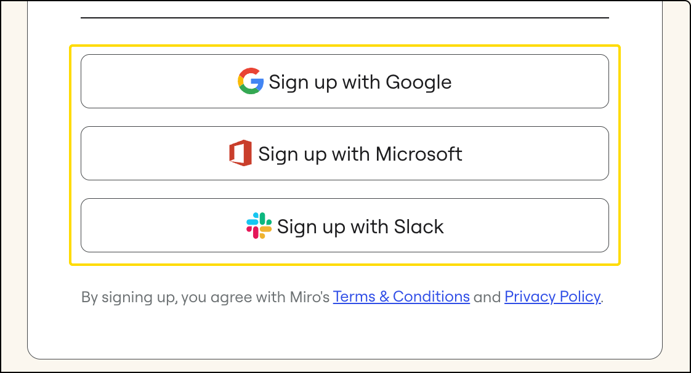

Si no recibiste un código de confirmación o email para restablecer contraseña, puede deberse a varias razones. La siguiente información puede ayudarte a resolver la situación dándote opciones que puedes probar.

## Razones comunes por las que los códigos o emails no llegan

Dos de las razones más comunes por las que no estás recibiendo email de restablecimiento de contraseña o no puedes solicitar un nuevo código de confirmación son los siguientes:

1. Tu empresa está usando un firewall y este está bloqueando los emails de los dominios de miro.com. Pide a tu administrador de TI que permita emails de los dominios de [miro.com](http://miro.com/).  Si tú eres el administrador, consulta la sección a continuación para obtener instrucciones sobre cómo permitir los dominios de Miro.
2. Tu empresa usa SSO. Consulta la siguiente sección para obtener instrucciones sobre cómo abordar esto.

## Cómo resolver problemas de emails/códigos de confirmación perdidos

1. Si tu empresa usa SSO, debes iniciar sesión con tus credenciales SSO corporativas. Si intentas restablecer tu contraseña con Miro, sencillamente serás redirigido a la página de inicio de sesión SSO. Si esto sucede, intenta usar tus credenciales SSO corporativas. Si eso no funciona, prosigue con la resolución de problemas siguiente.
2. Un firewall podría estar impidiendo que el mensaje llegue a tu bandeja de entrada. Comunícate con tu administrador de sistema y pídele que permita incluir nuestros dominios y subdominios: miro.com*, *.miro.com, mirostatic.com*, *.mirostatic.com y realtimeboard.com*, *.realtimeboard.com.

   Esta es una lista de IP dedicados: 198.2.178.132, 198.2.178.117, 198.2.128.203, 198.2.178.252, 198.2.178.205. 198.2.178.132, 198.2.178.117, 198.2.128.203, 198.2.178.252, 198.2.178.205. Ver más sobre [listas permitidas de email de Miro.](../../tools/troubleshooting/02-allowlist-miro-mailers.md)
3. Asegúrate de que no haya errores de tipeo en la dirección de email que enviaste. Si encuentras un error de tipeo, [registra el perfil de nuevo](../../../getting-started/start-here/02-how-to-register-with-miro.md) o restablece la contraseña mediante la dirección de email correcta.
4. Revisa las carpetas **de spam, promociones,** **correo no deseado**, redes sociales y **actualizaciones** en tu email.
5. También puedes registrarte o iniciar sesión mediante las opciones de inicio de sesión/registro alternativas: inicia sesión o regístrate con Google, Slack, Office 365, Apple o Facebook.
   > ⚠️ Ten en cuenta que los inicios de sesión alternativos **no** están conectados a inicios de sesión SSO corporativos. Si estás usando Miro en un entorno corporativo, usa las credenciales que tu admin de Miro ha configurado para ti.

   
   Métodos de autenticación disponibles

Realiza lo siguiente si no puedes registrarte o iniciar sesión mediante otros métodos de autenticación:

- Verifica si tu bandeja de entrada está llena y llegaste al límite del almacenamiento de email. Si está llena, es posible que tengas que eliminar algunos mensajes para recibir nuevos. Después de eliminar emails, regresa a nuestra página de registro y haz clic en **Send code again (Enviar código nuevamente).**
- Deberías recibir el mensaje de email de inmediato. Si no es así, es posible que tengas que esperar hasta 24 horas.
- Si estás usando tus credenciales de SSO corporativas y no puedes iniciar sesión, puedes leer sobre [los errores comunes de SSO y cómo resolverlos](../../tools/troubleshooting/10-i-can't-log-in-via-sso.md).

### Otros problemas de confirmación

Mi código no es válido

Si el código que ingresaste **no es válido,** haz lo siguiente:

1. Revisa tu bandeja de entrada y asegúrate de estar ingresando el código que recibiste más recientemente. Si el código aún no es válido, haz clic en **Send code again** (Enviar código nuevamente) e ingresa el código del nuevo email.
2. Otra manera de finalizar el registro es hacer clic en **Confirm your email** (Confirma tu email) en el mensaje que contiene el código de confirmación. En este caso, no necesitas el código de confirmación.
   
   *La opción de confirmar tu email*

Superé los intentos de confirmación de email

Si no lograste confirmar tu email después de cuatro intentos, verás el mensaje  **Email confirmation attempts exceeded (Se han superado los intentos de confirmación de email)** en la página de registro.

Espera 60 segundos y haz clic en **Send code again** (Enviar código nuevamente). Esto generará un nuevo código para ti. Ingresa el código y finaliza el registro.

Cerré accidentalmente la pestaña en la que se ingresa el código de confirmación

[Inicia](https://miro.com/login/) sesión con el email y la contraseña que ingresaste durante el registro y se te redireccionará a la [página de confirmación](https://miro.com/email-confirm/) nuevamente.

:::note
Si no confirmas tu email, recibirás recordatorios después de 12 y 24 horas. Si no confirmas tu email en el transcurso de siete días, **se eliminará tu perfil**. Podrás registrar un perfil nuevo con la misma dirección de correo electrónico.
:::

:::note
Los códigos de confirmación solo se pueden enviar por email.
:::

:::note
Si sigues teniendo problemas, [comunícate con el Soporte de Miro](https://miro.com/contact/recover/).
:::
