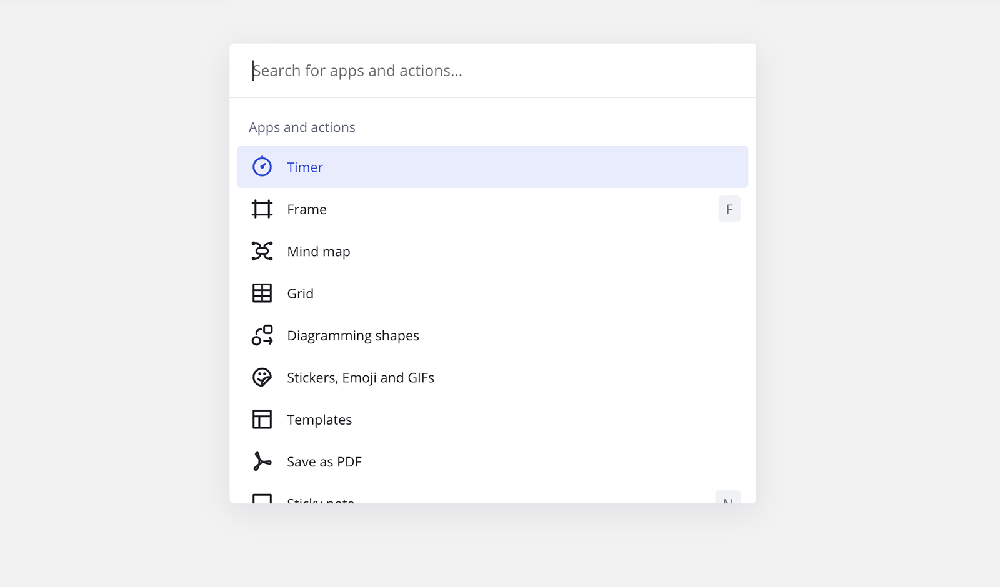

La paleta de comandos te permite buscar rápidamente y lanzar herramientas y aplicaciones de Miro. La paleta de comandos también te permite buscar tableros recientes.

La paleta de comandos solo está disponible para usuarios con [acceso de edición](../sharing-boards/01-board-access-rights.md) y mientras se encuentran en el modo de tablero estándar. No podrás iniciar la paleta de comandos si estás en el modo de presentación.

## Cómo usar la paleta de comandos

1. Selecciona el icono de **tres puntos verticales** () en la barra de herramientas del tablero.
   El menú principal se abre.
2. Selecciona **Editar** > **Comandos**. Alternativamente, usa el atajo del teclado **Cmd** + **K**.
   Se abre la paleta de comandos.
3. En el campo de búsqueda, comienza a escribir el nombre de una aplicación o herramienta, o desplázate por la lista.
4. Haz clic para iniciar la aplicación o la herramienta

*La paleta de comandos*
