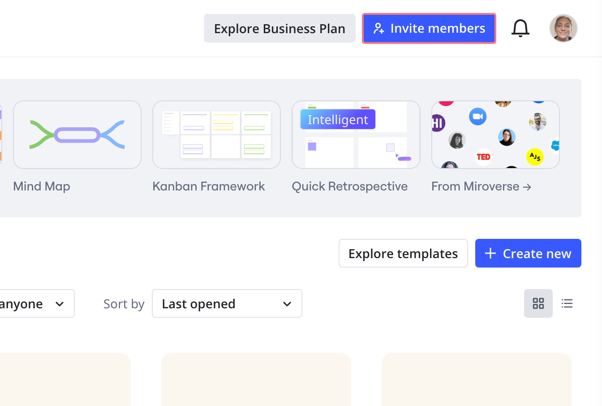
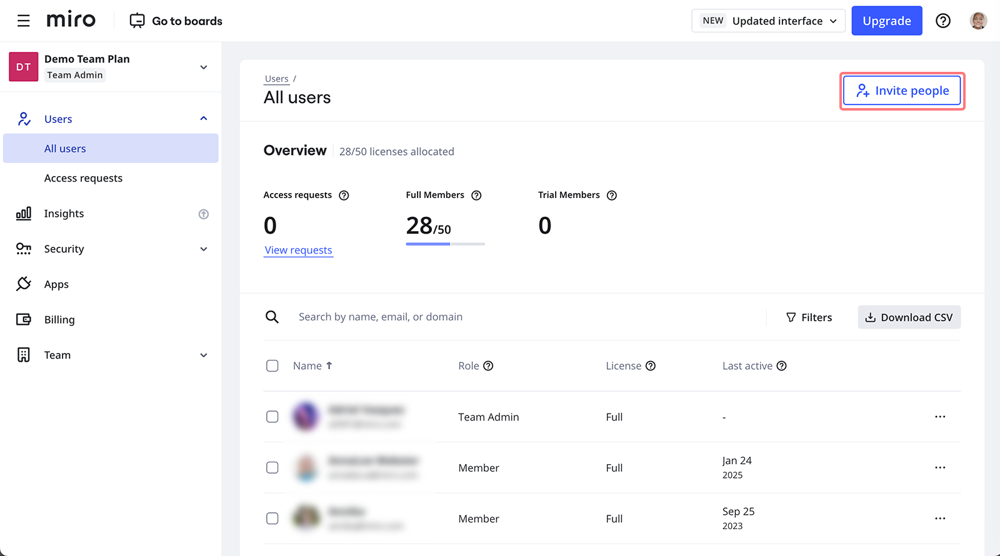

Invitez aisément des personnes à rejoindre votre équipe et vos tableaux pour collaborer et pour créer ensemble. En fonction des [paramètres d’invitation](02-invitation-settings.md), l’option d’inviter de nouveaux utilisateurs peut être disponible pour les admins uniquement ou pour tous les membres.

:::note
Consulter [cet article](../../enterprise-administration/user-management/05-manage-user-invitations-on-enterprise-plan.md) pour apprendre à inviter des utilisateurs sur le forfait Enterprise.
:::

## Inviter des membres

Il existe plusieurs options pour ajouter des membres à votre équipe.

- Depuis votre tableau de bord. Cliquez sur **Inviter des membres** dans le coin supérieur droit
  
  *La possibilité d’inviter des membres à partir du tableau de bord*
- Depuis la console d’admin : ouvrez l’onglet **Tous les utilisateurs**. Vous pouvez y consulter la liste des membres de l’équipe et des utilisateurs invités.

  
  *L’option pour inviter de nouveaux membres depuis la console d’admin*

  Cliquez sur **Inviter de nouveaux membres** dans le coin supérieur droit et saisissez les adresses e-mail de vos invités. Vous pouvez entrer jusqu’à 500 adresses e-mail dans la fenêtre modale d’invitation.

  
  *Fenêtre modale d’invitation*
- Dans ce menu, vous pouvez également **copier** le [**lien d'invitation d'équipe**](../../using-miro/sharing-boards/03-sharing-boards-and-inviting-collaborators.md) - toute personne qui suit le lien pourra rejoindre votre équipe (disponible sur les forfaits [Free](../../plans-billing/miro-plans/09-free-plan.md), [Starter](../../plans-billing/miro-plans/08-starter-plan.md), [Éducation](../../plans-billing/miro-special-pricing/03-education-plan.md)). Les admins peuvent activer ou désactiver le lien dans les [paramètres d'invitation](02-invitation-settings.md)
- Avec le plan Free, **chaque utilisateur** [**invité par e-mail à rejoindre un tableau**](../../using-miro/sharing-boards/03-sharing-boards-and-inviting-collaborators.md) est également invité à rejoindre l’équipe et devient membre de l’équipe.
- Avec le plan Starter, **chaque éditeur** [**invité par e-mail à rejoindre un tableau**](../../using-miro/sharing-boards/03-sharing-boards-and-inviting-collaborators.md)devient membre de l’équipe. La notification ci-dessous s’affichera et vous pourrez également inviter l’utilisateur avec un accès de commentateur sans l’ajouter à l’équipe.
  
  *Une notification indiquant que seuls les membres peuvent modifier les tableaux pour ce plan.*

La personne que vous invitez recevra une invitation par e-mail et pourra immédiatement commencer à travailler.

Si la personne que vous invitez n’est pas inscrite sur Miro, l’invitation restera active pendant 30 jours. Elle recevra également une notification par e-mail les 3e et 7e jours si elle n’accepte pas l’invitation immédiatement. En cliquant sur le lien dans l'e-mail de notification, elle sera invitée à [s'inscrire](../../getting-started/start-here/02-how-to-register-with-miro.md). Si un invité non inscrit n’accepte pas l’invitation sous 30 jours, l’invitation expire et l’utilisateur est supprimé de la liste des **Utilisateurs actifs**.

Une fois invités, les utilisateurs inscrits sur Miro pourront trouver votre équipe sur la barre latérale gauche de leur [tableau de bord](../../getting-started/start-here/miro-dashboard/01-what-is-on-your-dashboard.md).

Si vous avez par erreur envoyé une invitation à une mauvaise adresse e-mail ou si vous avez fait une faute de frappe et que vous souhaitez supprimer cette invitation, cliquez sur les trois points à côté de l’utilisateur invité et choisissez **Annuler l’invitation.**

### Période d’essai pour les membres du forfait Starter

:::note
Disponible uniquement pour le [forfait Starter](../../plans-billing/miro-plans/08-starter-plan.md).
:::

Lorsque vous invitez des membres à l'équipe, au lieu de les ajouter immédiatement en tant que licence payante, ils seront d'abord ajoutés en tant que **membres** **gratuits**.

La licence gratuite reste activée pour l’utilisateur invité jusqu’à ce qu’il effectue une action payante dans l’équipe, par exemple ouvrir un tableau ou créer son propre tableau/projet.

Une fois l’action payante effectuée, leur licence est convertie en version d’essai pour 7 jours - aucune licence n’est consommée à ce stade.

Les utilisateurs peuvent avoir un accès complet et payant à l’équipe gratuitement pendant 7 jours - ceci permet la collaboration sans s’engager immédiatement sur les coûts.

Au cours de leur période d’essai, les nouveaux membres peuvent être promus au statut de membres avec un accès complet ou transformés en invités dans la section **Tous les utilisateurs** de la console d’admin.

Les membres temporaires deviennent des membres payants si aucune action n’est entreprise à la fin de la période d’essai (7 jours). Si vous ne souhaitez pas ajouter les membres temporaires comme **membres de l’équipe complète** après leur essai, vous pouvez les [retirer](08-remove-users.md) de l’équipe ou les convertir en utilisateurs invités (ce qui signifie qu’ils pourront consulter et commenter le tableau auquel ils ont été invités explicitement) à tout moment pendant l’essai.

Veuillez noter que le statut de membre temporaire est disponible une seule fois pour chaque nouveau membre. Une fois utilisée, les membres réajoutés occuperont immédiatement une licence payante.

Si le forfait Starter est [changé en forfait Business](https://help.miro.com/hc/articles/360011780620-How-to-Change-Your-Plan#h_8315f4f8-9f5b-4665-b271-e438aedaf289), tous les membres temporaires actuels sont convertis en membres avec un accès complet au moment du changement.

Le coût de la nouvelle licence **est calculé au prorata**du temps restant sur votre période d’abonnement actuelle (au jour près), de sorte que les dates de renouvellement des nouvelles licences coïncident toujours avec celles de vos licences existantes. Si vous avez des licences vacantes pendant votre période d’abonnement et que vous ajoutez un nouveau membre - aucun frais n’est appliqué. Pour en savoir plus sur le système de facturation au prorata, consultez notre article - [Facturation et paiements](../../plans-billing/billing-and-payments/04-miro-billing.md).

## Inviter des invités

Vous pouvez partager vos tableaux avec des utilisateurs par e-mail sans les ajouter à votre équipe comme membres. Ces utilisateurs seront répertoriés comme invités dans vos paramètres d’équipe.

:::warning
Notez que les invités ne sont pas disponibles sur le [Free](../../plans-billing/miro-plans/09-free-plan.md).
:::

:::note
L'option pour inviter des invités peut être restreinte dans les [paramètres d’invitation](02-invitation-settings.md) sur les forfaits Business.
:::

Dans les forfaits Starter et Education, vous pouvez inviter des invités avec un accès en lecture ou commentaire uniquement.

Si vous disposez d’un forfait Business, vous pouvez inviter des invités qui pourront lire, commenter ou modifier vos tableaux.

Ces utilisateurs sont listés comme **invités** dans votre console d’admin. Les admins peuvent les convertir en membres ou les supprimer de l'équipe/révoquer leur invitation.

Les invités ne peuvent pas créer leur propre tableau dans l’équipe et n'ont pas accès aux [tableaux partagés de l’équipe](../../using-miro/sharing-boards/03-sharing-boards-and-inviting-collaborators.md) et aux projets. S’ils demandent à rejoindre l’équipe, une notification sera envoyée aux admins.

:::note
Apprenez à convertir des membres en invités sur [cette page](../../using-miro/sharing-boards/07-collaboration-with-guests.md).
:::

## Inviter des visiteurs

Vous pouvez également partager vos tableaux avec des visiteurs - ces utilisateurs ne sont pas ajoutés à votre équipe et peuvent consulter/commenter/modifier les tableaux publics sans être des utilisateurs enregistrés. L’option est disponible sur tous les forfaits payants. En savoir plus : [Collaboration avec les visiteurs](../../using-miro/sharing-boards/08-collaboration-with-visitors.md).

:::note
Voir la différence entre membres, invités et visiteurs sur [cette page](../../using-miro/sharing-boards/07-collaboration-with-guests.md).
:::

## Foire aux questions

1. *La personne que j’ai invitée ne reçoit pas l’e-mail d’invitation que je lui ai envoyé. Comment peut-elle accéder à mon équipe ?*
   - Demandez à l’utilisateur de s’inscrire sur Miro ou de se connecter s’il dispose d’un profil Miro. L’utilisateur trouvera votre équipe dans la barre latérale gauche de leur [tableau de bord](../../getting-started/start-here/miro-dashboard/01-what-is-on-your-dashboard.md).
2. *J'ai reçu une invitation à rejoindre une équipe Miro, mais je ne la vois pas lorsque je me connecte.*
   - Essayez de trouver l'équipe dans la barre latérale gauche de votre [tableau de bord](../../getting-started/start-here/miro-dashboard/01-what-is-on-your-dashboard.md) et basculez vers celle-ci. Si aucune équipe n'apparaît, assurez-vous d'être connecté(e) à Miro avec la même adresse e-mail que celle qui a été invitée à rejoindre l'équipe.
3. *Il n'y a pas de bouton "Inviter des membres" sur mon tableau de bord. Pourquoi ?*
   - Les admins ont restreint l'option pour inviter de nouveaux membres dans les [paramètres d'invitation](02-invitation-settings.md). Notez que cette option peut être restreinte pour les admins d’équipe du forfait Enterprise.
4. *Puis-je inviter des utilisateurs sans qu’ils s’inscrivent sur Miro ?*
   - Oui, vous pouvez [partager gratuitement vos tableaux via des liens publics](../../using-miro/sharing-boards/03-sharing-boards-and-inviting-collaborators.md#partage-de-tableaux-via-un-lien-public) avec des utilisateurs non inscrits.
5. *Que faire si j’ai accidentellement invité de nouveaux membres payants ?*
   - Veuillez [suivre ces étapes](../../plans-billing/billing-and-payments/04-miro-billing.md).
