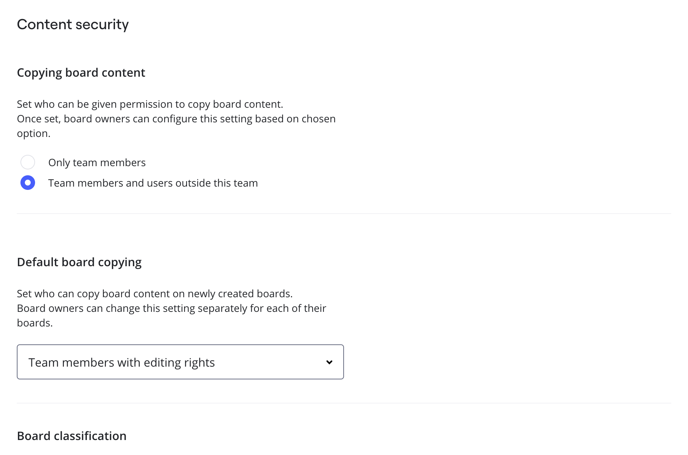

Le forfait Enterprise fournit les paramètres d’autorisation avancés et vous permet de configurer facilement le niveau d’accès et de sécurité nécessaires pour vos équipes. Vous pouvez définir les paramètres de Découverte de l’équipe, d’Invitation, de partage et de Contenu des tableaux qui répondent aux besoins et aux politiques de votre entreprise. Les paramètres sont configurés pour chaque équipe faisant partie d’un abonnement Enterprise.

> [✏️ Lorsque vous créez une nouvelle équipe au sein d’un abonnement Enterprise, les admins d’entreprise peuvent sélectionner les autorisations par défaut ou choisir de copier les autorisations d’une équipe existante.](09-create-a-new-team-on-enterprise-plan.md)  Apprenez-en plus sur les paramètres par défaut ci-dessous.

> **Disponible pour** : le forfait Enterprise
> **Installation par :** Administrateurs d'entreprise, Administrateurs d'équipe

## Comment accéder aux autorisations et aux paramètres de l'équipe ?

Dans le tableau de bord Miro, sélectionnez votre avatar en haut à gauche. Sélectionnez ensuite **Paramètres** pour ouvrir la console d'administration.

Dans la console d'administration, sélectionnez **Équipes**. Sélectionnez ensuite l'équipe que vous souhaitez configurer. La vue de l'équipe s'ouvre. Ensuite, sélectionnez **Paramètres**.

:::tip
Pour trouver votre équipe, vous pouvez utiliser la barre de recherche en haut de la vue **Équipes**.
:::

La première configuration concerne les **paramètres de découverte de l'équipe.**

*Paramètres de découverte de l'équipe dans la console d'administration Enterprise.*

Vous pouvez ouvrir votre équipe aux autres utilisateurs Enterprise ou la cacher. Apprenez-en plus dans l’articleGestion de la confidentialité et de la découverte des équipes dans le forfait Enterprise. Ce paramètre peut être modifié par les admins d’entreprise et les admins d’équipe s’ils sont autorisés à inviter de nouveaux membres dans l’équipe.

Les paramètres d’invitation permettent aux admins d’entreprise de définir qui peut inviter des utilisateurs dans l’équipe et si le rôle d’**[invité](../../using-miro/sharing-boards/07-collaboration-with-guests.md)** est pertinent pour l’équipe.

*Paramètres d'invitation d'équipe dans la console d'administration Enterprise*

**En savoir plus :** Voir [Gérer les invitations d'utilisateurs sur Enterprise Plan.](../user-management/05-manage-user-invitations-on-enterprise-plan.md)

Les administrateurs d'entreprise peuvent également configurer les **paramètres de partage.**

Tout d'abord, vous pouvez définir qui peut créer du nouveau contenu (tableaux, Espaces et modèles) dans l'équipe et déplacer des tableaux vers l'équipe. Ces fonctionnalités sont très utiles, tout particulièrement si vous devez établir une équipe dédiée au [provisionnement automatique](../user-management/13-user-provisioning-on-enterprise-plan.md) ou si vous souhaitez utiliser une équipe comme stockage pour certains tableaux. Vous pouvez autoriser ces actions à tous les membres, aux admins d’entreprise uniquement ou aux admins d’entreprise et aux admins d’équipe.

*Partage des paramètres dans la console d'administration Enterprise*

Vous pouvez autoriser ou interdire aux membres de l'équipe de partager des tableaux et des espaces avec toute l'équipe, toute l'entreprise ou via des liens publics. Si vous restreignez ces types de partage, les options correspondantes seront supprimées des tableaux de l’équipe.

*Partage de tableaux sur la console d'administration Enterprise*

Il est également possible de définir des [**paramètres de partage** pour les tableaux et les espaces nouvellement créés par l'équipe.](../../using-miro/sharing-boards/11-default-sharing-settings.md) Les admins d’entreprise et d’équipe ont tous accès à ces paramètres.

> **⚠️ L’option [Toute personne faisant partie de l’entreprise peut trouver et consulter/commenter](07-team-management-on-enterprise-plan.md) n’est pas affichée si l’option Confidentialité de l’équipe est activée.**

**En savoir plus :** Voir la [politique de partage sur le plan Enterprise.](../canvas-25-admin-features/data-security/07-sharing-policy-on-enterprise-plan.md)

Les admins d’entreprise peuvent définirdes domaines autorisés pour une équipe.

Les administrateurs d'entreprise peuvent voir les paramètres permettant de [restreindre ou d'autoriser le déplacement des tableaux vers et depuis l'équipe](../canvas-25-admin-features/data-security/07-sharing-policy-on-enterprise-plan.md). 
*Domaines autorisés pour l'équipe sur la console d'administration Enterprise*

Les admins d’équipe et d’entreprise peuventconfigurer les paramètres de contenu des tableaux pour une équipe : choisissez si les utilisateurs qui ne font pas partie de l’équipe peuvent copier le contenu des tableaux (mais aussi dupliquer les tableaux de l’équipe et télécharger le contenu des tableaux) et définissez les utilisateurs qui auront accès à ces options sur les tableaux nouvellement créés (à moins que le propriétaire du tableau en question ne choisisse une autre option).

*Sécurité du contenu de la console d'administration Enterprise*

Dans le cadre des paramètres de sécurité du contenu, les admin d'entreprise et d'équipe peuvent également configurer une étiquette par défaut pour les tableaux nouvellement créés dans l'équipe, ou **classification des tableaux.** Le badge par défaut de l’équipe remplacera le badge par défaut de l’entreprise configurée dans les paramètres de classification des tableaux de l’entreprise.

Au bas de la page, vous verrez la sectionParamètres de collaboration. Dans cette section, les admins d’équipe et d’entreprise peuvent activer le rôle de copropriétaire de tableau, qui est désactivé par défaut. Notez que l’option est grisée si le rôle n’est pas autorisé au niveau de l’entreprise.  [En savoir plus](../../using-miro/sharing-boards/06-co-owners-of-boards-and-spaces.md).

*Classification du tableau et tableaux de collaboration dans la console d'administration Enterprise*

### Paramètres par défaut

Si vous choisissez l’option **Par défaut** dans les paramètres d’autorisations lorsque vous [créez une nouvelle équipe Enterprise](09-create-a-new-team-on-enterprise-plan.md), voici les paramètres qui seront sélectionnés :

- **Paramètres de découverte de l’équipe** : les membres peuvent rejoindre après approbation.
- **Paramètres d’invitation** : tous les membres de l’équipe peuvent inviter de nouveaux utilisateurs et le rôle d’invité est autorisé.
- **Paramètres de partage** :
  - tous les membres de l’équipe peuvent créer des **actifs dans cette équipe**.
  - **Partage de tableau** : les membres de l’équipe peuvent partager leur contenu avec l’équipe qui pourra le consulter, le commenter et le modifier, ils peuvent partager leur contenu avec l’ensemble de l’entreprise qui pourra le consulter et le commenter et ils peuvent partager leur contenu publiquement pour que les invités puisse le consulter ou le commenter (si [le partage public est autorisé au niveau de l’entreprise](../canvas-25-admin-features/data-security/07-sharing-policy-on-enterprise-plan.md)).
  - **Paramètres de partage de tableau** : seuls les propriétaires des tableaux peuvent accéder à ceux-ci.
  - **Paramètres de partage de l'espace**: seuls les propriétaires de l'espace peuvent y accéder.
  - **Domaines autorisés pour l’équipe** : le bouton pour restreindre les domaines autorisés est désactivé. [Les domaines autorisés configurés au niveau de l’entreprise](../canvas-25-admin-features/data-security/07-sharing-policy-on-enterprise-plan.md) sont appliqués.
- **Déplacer des tableaux vers d’autres équipes** : autorisé.
- **Paramètres de contenu des tableaux**
  - **Copie du contenu des tableaux** : autorisé pour les membres de l’équipe et les utilisateurs ne faisant pas partie de l’équipe.
  - **Copie des tableaux par défaut** : les membres de l’équipe dotés de droits de modification peuvent copier le contenu des tableaux sur des tableaux nouvellement créés.
- **Classification des tableaux : l’option pour outrepasser le badge par défaut est désactivée.**
- **Paramètres de collaboration : le rôle de copropriétaire est désactivé.**
