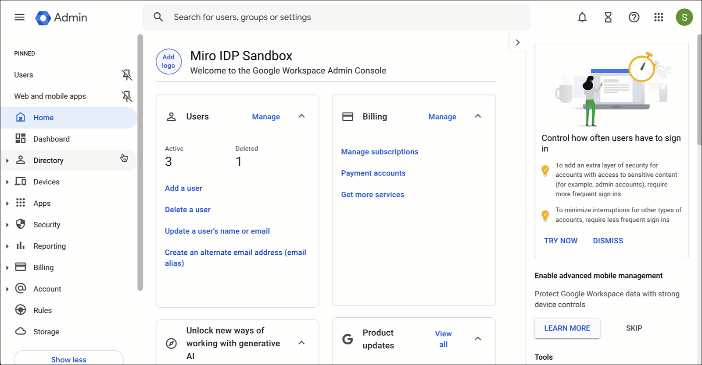
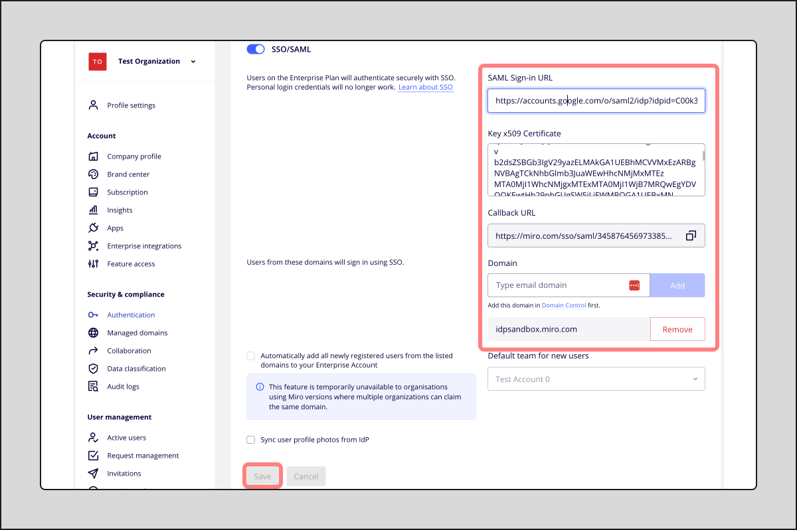
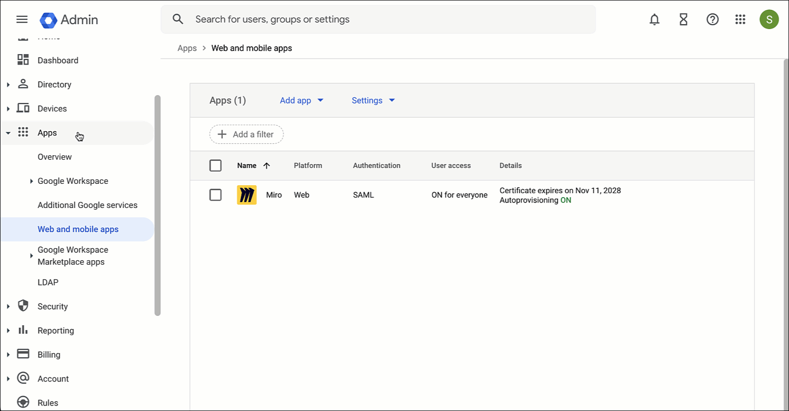
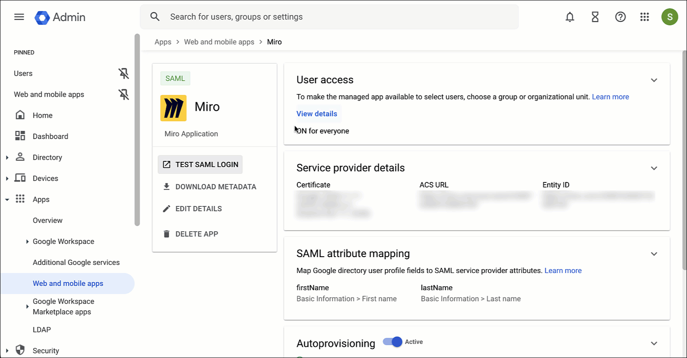

> Il est fortement recommandé de configurer l’authentification unique dans une fenêtre indépendante de votre navigateur, en mode navigation privée. De cette façon, votre session reste active dans la fenêtre standard, ce qui vous permet de désactiver l’autorisation de l’authentification unique si quelque chose est mal configuré.

La configuration de Miro au sein de votre organisation est plus facile que jamais grâce à l'application d'intégration créée par Google dans la console d'administration de Google Workspace. Cette application vous permet de configurer Google SSO pour une utilisation avec Miro, ainsi que le [provisionnement des utilisateurs SCIM](../../security-integrations/system-for-cross-domain-identity-management-scim/04-setting-up-automated-provisioning-with-google.md).

Cet article se concentre sur la configuration de Google SSO pour une utilisation avec Miro.

Si vous souhaitez configurer une instance de test avant d’activer l’authentification unique en production, veuillez en faire la demande auprès de votre responsable de compte ou de votre représentant commercial ou représentante commerciale. Seules les personnes qui configurent l’authentification unique seront ajoutées à cette instance de test.

:::tip
Consultez l'[article sur le](../../security-integrations/single-sign-on-sso/09-single-sign-on-sso.md)  Miro [SSO](../../security-integrations/single-sign-on-sso/09-single-sign-on-sso.md)  pour connaître les règles, les fonctionnalités prises en charge et les paramètres de configuration facultatifs.
:::

Pour en savoir plus sur la [configuration de Google SSO avec Miro](https://support.google.com/a/answer/14100608#zippy=%2Cstep-set-up-google-as-saml-identity-provider), consultez le Centre d'assistance de Google.

## Configuration de Google SSO pour Miro à l'aide de SAML

La configuration de Google SSO pour l'authentification auprès de Miro se fait en quatre étapes :

1. Configuration de Google en tant que fournisseur d'identité SAML
2. Configuration de Miro en tant que fournisseur de services SAML
3. Activation de Miro pour les utilisateurs
4. Test d'authentification

Configuration de Google en tant que fournisseur d'identité SAML

1. Dans la console d'administration de l'espace de travail Google, cliquez sur **Applications > Applications Web et mobiles.**
2. Dans le panneau Applications, cliquez sur le menu déroulant **Ajouter une application**, choisissez "Rechercher des applications" et tapez "Miro"
3. Choisissez "Miro Web (SAML)" et cliquez sur **Sélectionner**
4. Dans les "Détails du fournisseur d'identité Google", sous l'option 2, vérifiez que l'"URL SSO", l'"ID d'entité" et le "Certificat" sont tous renseignés, puis cliquez sur **Continue.** Vous copierez ces valeurs ultérieurement lorsque vous configurerez Miro
5. Dans la section "Service provider details", ajoutez les valeurs suivantes :
   **URL DE L'ACS :** https://miro.com/sso/saml
   **ID de l’entité :** https://miro.com
   **URL de départ :** vide
   **Réponse signée :** ne pas cocher
   Name ID (ID de nom) E-MAIL
6. Cliquez sur **Continuer**.
7. Dans "Attribute mapping", sous "Google Directory attributes", choisissez **First Name**, puis **Last Name**, en veillant à ce qu'ils correspondent aux applications.
8. Cliquez sur **Terminer**. Vous verrez maintenant votre application Miro ajoutée à l'espace de travail Google.
   *Configuration du fournisseur d'identité SAML de Google*

Configuration de Miro en tant que fournisseur de services SAML

1. Ouvrez un onglet Incognito dans votre navigateur et connectez-vous au tableau de bord Miro (miro.com/app/dashboard).
2. Cliquez sur votre avatar dans le coin supérieur droit et cliquez sur **Paramètres**.
3. Dans les paramètres de votre entreprise, cliquez sur **Authentication.** Si vous êtes un client Business plan, ce paramètre se trouve dans **Sécurité.**
4. Cliquez sur la case à cocher "Activer le SSO pour configurer le provisionnement du SCIM".
5. Vous accédez à la section Authentification des paramètres de l'entreprise. Cliquez sur la bascule **SSO/SAML**. Vous serez prompt à cliquer sur **Activer** pour activer le SSO pour votre organisation.
6. Pour obtenir l'**URL de connexion SAML**, retournez dans votre console d'administration Google Workspace et, dans l'application Miro, cliquez sur **DOWNLOAD METADATA.** Ce panneau vous donne la possibilité de copier les valeurs nécessaires
7. Sous **URL SSO**, cliquez sur le bouton **Copier**. Retournez à Miro et collez la valeur dans l'**URL de connexion SAML**.
8. Répétez ce processus pour le **certificat de clé x.509** en utilisant le certificat dans Google.
9. Ajoutez les informations relatives à votre **domaine**. Assurez-vous d'avoir déjà [configuré et vérifié votre domaine](../../canvas-25-admin-features/domain-control/01-domain-control.md)
10. Cliquez sur **Enregistrer***Configuration des paramètres d'authentification SSO dans Miro*

Activation de Miro pour les utilisateurs

1. Retour à la console d'administration de l'espace de travail Google
2. Si nécessaire, cliquez sur **Applications Web et mobiles** dans le menu Applications et sélectionnez **Miro**.
3. Cliquez sur **Accès utilisateur**
4. Cliquez sur **ON pour tout le monde** et cliquez sur **Save***Activation de l'application Miro pour tous les utilisateurs*

Si vous souhaitez activer Miro pour des unités organisationnelles spécifiques, cliquez d'abord sur le groupe dans les unités organisationnelles, puis sur **ON.** Il se peut que vous deviez cliquer sur **OVERRIDE** ou **HÉRITER** en plus.

Test d'authentification

1. Dans la console d'administration de l'espace de travail Google, lancez l'application Miro si nécessaire
2. Dans la section Miro, cliquez sur **TEST SAML LOGIN**
3. Un nouvel onglet devrait apparaître avec les options de connexion SSO de Google.
   .GIF
4. Pour tester l'authentification dans Miro, ouvrez un nouvel onglet Incognito et lancez le tableau de bord Miro (miro.com/app/dashboard).
5. Vous devriez voir une page de connexion. Cliquez sur **Se connecter avec l'authentification unique** et connectez-vous avec les identifiants de votre compte.
   *Test de l'authentification Google SSO avec Miro*

Vous pouvez également effectuer des tests à Miro :

1. Suivez les étapes ci-dessus pour configurer vos paramètres SSO.
2. Cliquez sur le bouton **Tester la configuration SSO**.
3. Examinez les résultats :
   1. Si aucun problème n’est détecté, un message de confirmation indiquant que **le test de configuration SSO a réussi s’** affiche.
   2. Si des problèmes sont détectés, un message de confirmation indiquant que **le test de configuration SSO a échoué s’** affiche, suivi de messages d’erreur détaillés pour vous indiquer ce qui doit être corrigé.*Test de la configuration SSO à partir de Miro*

> **⚠️** Si vous avez déjà configuré le SSO pour votre organisation et que vous devez le reconfigurer, il est fortement recommandé de **désactiver le** SSO dans Miro avant de continuer dans la console d'administration de Google ; sinon, vous risquez de vous bloquer hors de Miro. Pour éviter un verrouillage, créez un utilisateur "brisant la glace" avec un e-mail dont le domaine n'est pas celui indiqué dans les paramètres SSO, comme acmebreaktheglass@gmail.com. Autrement, vous pouvez contacter le service d’assistance qui peut désactiver l’authentification unique pour toute l’organisation.

Si vous souhaitez configurer le provisionnement des utilisateurs avec Google, vous trouverez des instructions dans l'article "[Configuration du provisionnement automatisé avec Google](../../security-integrations/system-for-cross-domain-identity-management-scim/04-setting-up-automated-provisioning-with-google.md)".
