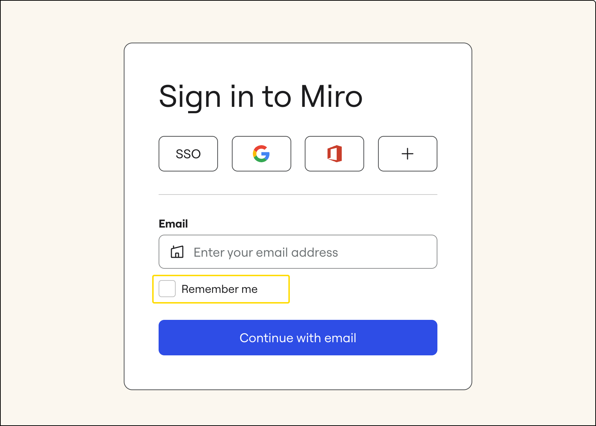
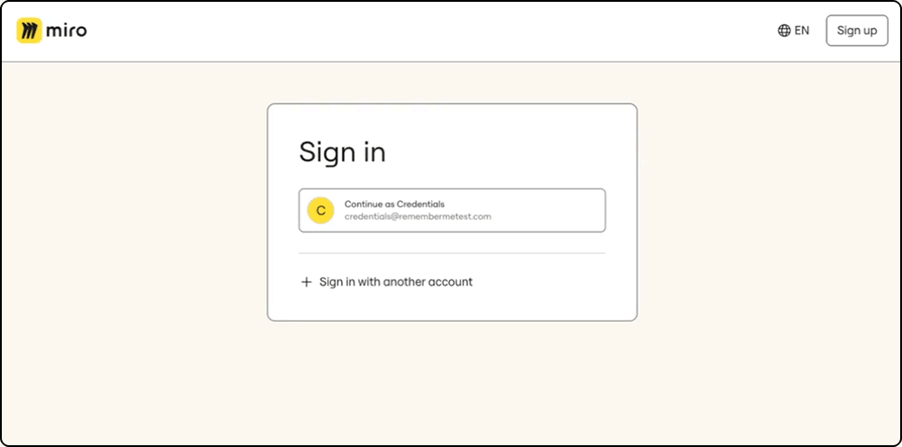
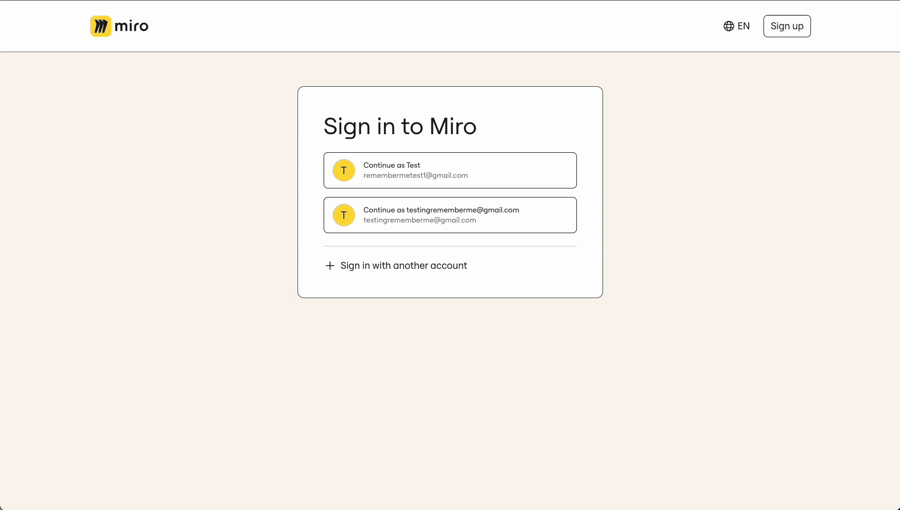

Lorsque vous vous connectez à Miro, vous pouvez choisir de mémoriser votre adresse e-mail et votre méthode d’authentification pour accélérer les connexions ultérieures. Vos trois derniers profils de connexion peuvent être mémorisés de cette manière.

1. Lors de la connexion, cochez la case **Se souvenir de moi** après avoir saisi votre adresse e-mail. *Sélectionnez Se souvenir de moi lors de la connexion*
2. Ensuite, lorsque vous vous reconnectez à Miro, vous verrez vos trois derniers profils de connexion enregistrés. Si vous choisissez de mémoriser un profil supplémentaire après en avoir ajouté trois, le profil le plus ancien sera oublié.
3. Cliquez sur le profil souhaité pour terminer la procédure de connexion.*Connexion à Miro à l’aide d’un profil mémorisé*

Pour oublier un signe mémorisé dans le profil :

1. Cliquez sur les **trois points** () à côté du profil.
2. Sélectionnez **Oublier cette méthode**.*Oublier une méthode de connexion mémorisée*
