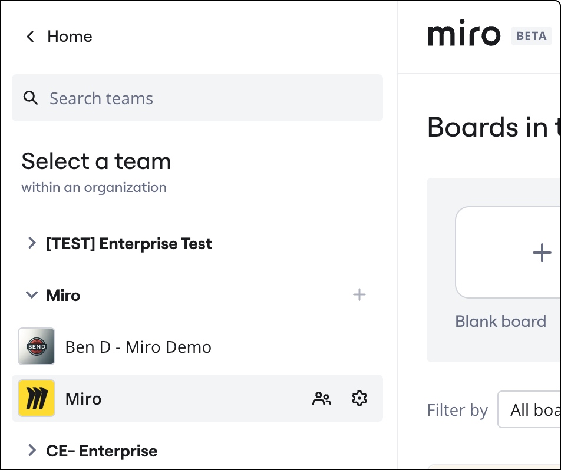
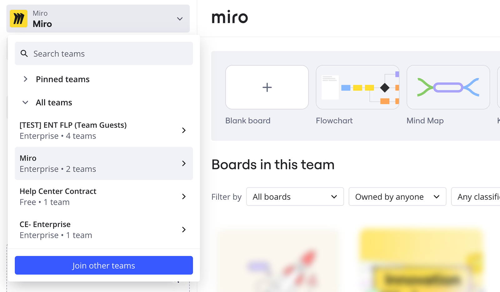
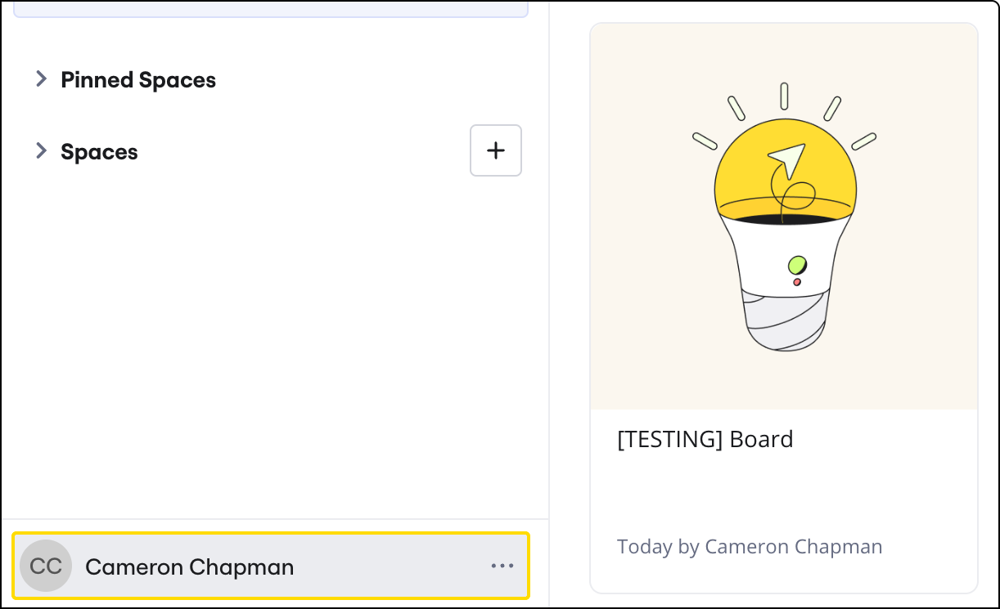
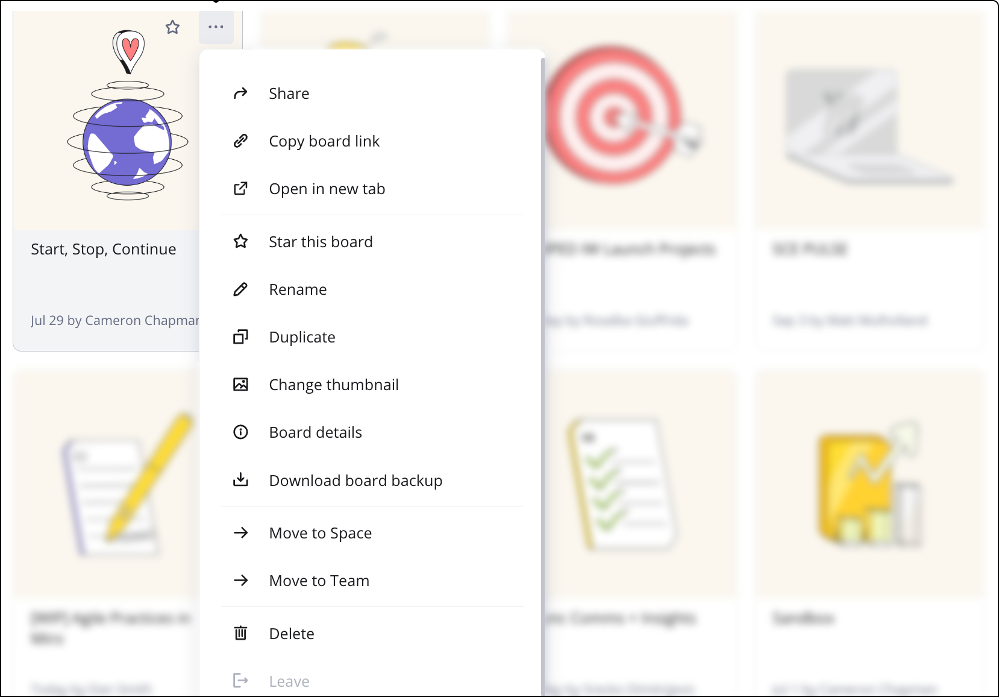
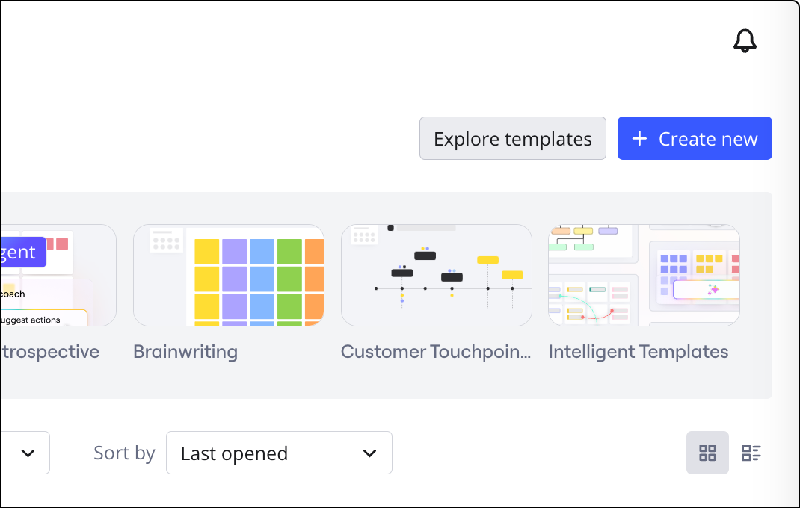
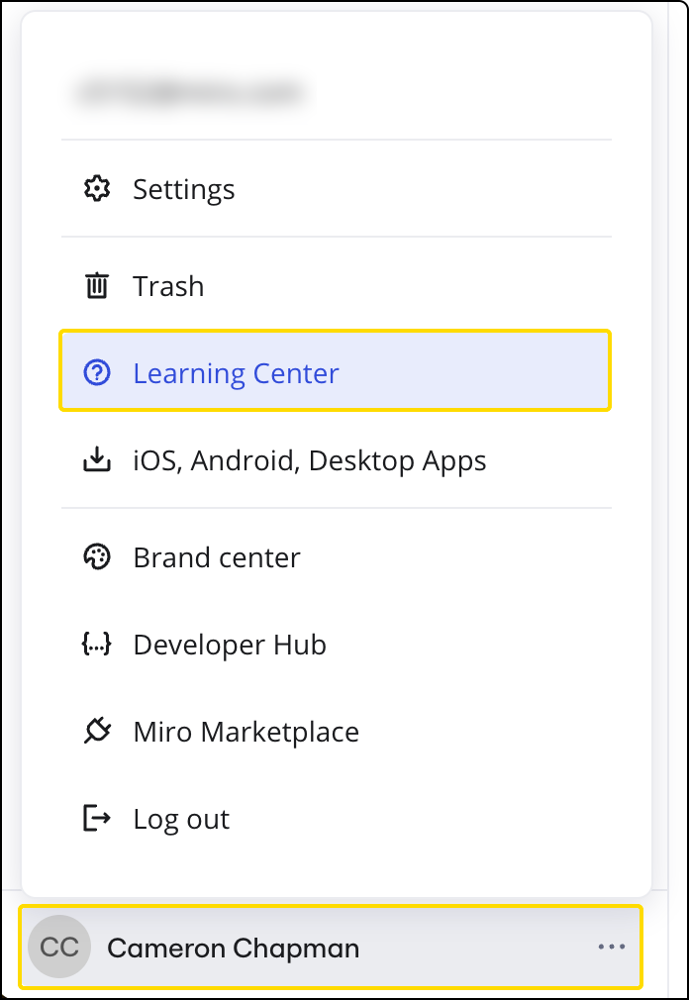

[Tableau de bord](https://miro.com/app/dashboard/) est votre espace de travail principal dans Miro. Vous l'utilisez pour naviguer entre vos équipes, [Espaces](../../../using-miro/spaces/01-spaces.md), et tableaux. Depuis le tableau de bord, vous avez un accès rapide à vos paramètres de profil, [paramètres de l'équipe](../../../administration/get-started-as-a-miro-admin/01-i-am-a-new-miro-admin.-where-to-start.md), projets, tous les tableaux partagés avec vous dans une équipe sélectionnée, et tous les tableaux que vous avez étoilés dans l'ensemble de votre profil. Le tableau de bord est également l'endroit où vous pouvez [créer un nouveau tableau](../your-first-board/01-create-a-miro-board.md), effectuer des recherches parmi vos tableaux existants, télécharger des [sauvegardes de tableaux](../../../using-miro/import-and-export/export/05-how-to-save-board-backup.md) et organiser vos tableaux.

## Comprendre la disposition de votre tableau de bord

Votre tableau de bord fournit une vue centralisée de vos équipes et tableaux, permettant une navigation et une gestion efficaces. Vous pouvez voir un aperçu des équipes disponibles et comment les tableaux sont affichés.

*Plusieurs équipes apparaissent sur le tableau de bord de cet utilisateur*

D'ici, vous pouvez accéder à des zones clés telles que votre profil, les paramètres de votre équipe, [Espaces](../../../using-miro/spaces/01-spaces.md), les tableaux partagés avec vous et vos tableaux favoris ★. Vous pouvez également effectuer des actions comme créer de nouveaux tableaux, effectuer des recherches, télécharger des sauvegardes et trier vos tableaux pour les adapter à votre workflow.

## Naviguer entre vos équipes

Vous pouvez facilement passer d'une équipe Miro à une autre dont vous êtes membre ou à laquelle vous avez été invité. Pour voir vos équipes, cliquez sur le nom de votre équipe actuelle dans le coin supérieur gauche du tableau de bord. Un menu déroulant apparaîtra, vous permettant de sélectionner et de passer à une autre équipe en cliquant sur son nom. Vous pouvez également épingler les équipes fréquemment utilisées pour un accès rapide et les réorganiser dans la liste par glisser-déposer. Si votre organisation dispose de la [découverte d'équipe activée](../../../administration/team-management/02-manage-team-signup-mode.md) ou d'un [plan Enterprise](../../../enterprise-administration/managing-enterprise-teams-and-content/11-manage-team-privacy-and-discovery-on-enterprise-plan.md), vous pouvez également trouver des options pour rejoindre ou demander l'accès à d'autres équipes.

*Équipes Miro sur le tableau de bord*

## Gérer les paramètres de votre profil

Vous pouvez mettre à jour vos informations personnelles et gérer les paramètres spécifiques au compte directement depuis le tableau de bord. Pour accéder aux paramètres de votre profil, cliquez sur votre nom et votre avatar dans le coin inférieur gauche du tableau de bord, puis cliquez sur **Paramètres** pour ouvrir vos **Détails du profil**.

*Ouverture des détails du profil*

Dans les paramètres de votre profil, vous pouvez modifier votre nom, votre entreprise et votre rôle. Vous pouvez aussi [modifier votre adresse e-mail](../../../using-miro/managing-your-profile/04-how-to-change-your-email.md), mettre à jour votre [mot de passe](../../../using-miro/managing-your-profile/05-how-to-change-your-password.md) ou [supprimer votre profil](../../../using-miro/managing-your-profile/07-how-to-delete-your-profile.md).

## Organisez et localisez vos tableaux

Le tableau de bord offre plusieurs façons d’organiser et de rechercher vos tableaux efficacement. Vous pouvez filtrer les tableaux par propriété (**appartenant à n'importe qui**, **vous appartenant** ou **ne vous appartenant pas**), les trier par ordre alphabétique ou par date (**création**, **dernière ouverture**, **dernière modification**), et basculer entre une **vue en grille** ou **vue en liste**. La section **Récent** dans le coin supérieur gauche affiche les tableaux que vous avez récemment ouverts depuis n'importe quelle équipe. Pour un accès rapide aux tableaux importants, vous pouvez **leur attribuer une étoile**, et ils apparaîtront dans la vue **Tableaux favoris** dédiée de votre tableau de bord.

:::note
**Remarque :** Les tableaux protégés par mot de passe sont seulement visibles dans les listes **Récent** et **Étoilé** tant qu'ils sont visibles pour vous. Une fois que la session expire, les tableaux sont retirés de ces listes jusqu'à ce que vous ouvriez à nouveau le tableau via un lien direct et que vous saisissiez à nouveau le mot de passe du tableau.
:::

## Utilisez le menu du tableau pour des actions rapides

Vous pouvez effectuer diverses actions sur vos tableaux directement depuis le tableau de bord en utilisant le menu du tableau. Pour ouvrir le menu d'un tableau spécifique, cliquez sur les trois points (**...**) sur la fiche du tableau.

*Menu du tableau*

Depuis ce menu, vous pouvez [partager](../../../using-miro/sharing-boards/03-sharing-boards-and-inviting-collaborators.md) des tableaux, les renommer, [déplacer les tableaux vers différents projets ou équipes](../../../using-miro/managing-boards/04-how-to-move-a-board.md), [dupliquer (copier)](../../../using-miro/managing-boards/03-how-to-duplicate-a-board.md) des tableaux, [supprimer](../../../using-miro/managing-boards/07-how-to-delete-a-board.md) des tableaux, modifier les vignettes des tableaux, ouvrir les détails du tableau, télécharger les [sauvegardes](../../../using-miro/import-and-export/export/05-how-to-save-board-backup.md) des tableaux et copier les liens des tableaux.

## Rechercher du contenu avec la recherche

Vous pouvez rapidement trouver un tableau spécifique en utilisant la fonction de recherche. Cliquez sur **Rechercher** en haut de la page du tableau de bord ou appuyez sur **Ctrl + E** (pour Windows) ou **Cmd + E** (pour Mac), puis commencez à taper le nom du tableau. Les résultats de la recherche afficheront tous les tableaux partagés avec vous dans l'équipe actuelle. Si vous avez un [plan Enterprise](../../../plans-billing/miro-plans/04-enterprise-plan.md), vous pouvez effectuer une recherche transversale complète, qui inclut les titres des tableaux, les descriptions et le texte des widgets, des commentaires et des pense-bêtes de toutes les équipes sous votre abonnement Enterprise. Vous pouvez également installer l’[extension de recherche Chrome pour Miro](https://miro.com/marketplace/chrome-search/?backUrl=%2Fmarketplace%2F) afin de rechercher des tableaux Miro directement à partir de la barre d'adresse de votre navigateur. Pour plus de détails, consultez [Recherche dans Miro](03-how-to-search-in-miro.md).

## Explorer les modèles et les ressources d’apprentissage

Miro offre des ressources pour vous aider à démarrer et à trouver l'inspiration. Vous pouvez explorer la galerie de modèles de la communauté Miroverse en cliquant sur le bouton **Explorer les modèles** dans la partie supérieure droite du tableau de bord. Cela vous donne accès à la fois aux modèles officiels de Miro et aux modèles créés par la communauté Miro.

*Accès au Miroverse depuis le tableau de bord*

Pour obtenir une aide supplémentaire, le Centre d’apprentissage propose des guides, des contenus spécifiques à chaque cas d’utilisation et des liens vers le support, les webinaires et l’Académie Miro. Accédez au Centre d’apprentissage en cliquant sur votre avatar de profil dans le coin inférieur gauche du tableau de bord, puis sur le bouton **Centre d’apprentissage**. Lorsque vous utilisez la fonction de recherche dans le Centre d'apprentissage, les articles pertinents du Centre d'assistance seront également mis en avant.

*Le Centre d’apprentissage est votre première source d’aide sur Miro*

## Fonctions détaillées du tableau de bord

Cette section fournit des détails plus spécifiques sur certaines des fonctionnalités du tableau de bord.

### Options de tri et de filtrage

Pour vous aider à gérer vos tableaux, le tableau de bord propose plusieurs options de tri et de filtrage :

- Filtrer par propriété du tableau : **appartenant à tous les membres** de l'équipe, **qui vous appartient**, ou **qui ne vous appartient pas**.
- Organisez les tableaux par **ordre alphabétique**, ou par date de **création**, de dernière **ouverture** ou de dernière **modification**.
- Basculer entre la **vue en grille** ou la **vue en liste** pour l'affichage du tableau.

### Accéder aux tableaux supprimés (Corbeille)

Si vous êtes sur un plan Starter, Business, Enterprise ou Education, vous pouvez restaurer les tableaux supprimés au cours des 90 derniers jours depuis la Corbeille. Pour accéder à la Corbeille, cliquez sur votre nom et votre avatar dans le coin inférieur gauche du tableau de bord.

:::warning
**Avertissement :** L'icône **Corbeille** n'est pas disponible sur le [forfait Free](../../../plans-billing/miro-plans/09-free-plan.md). Les utilisateurs du plan Free peuvent récupérer un tableau supprimé en [ouvrant le lien du tableau](../../../using-miro/managing-boards/08-how-to-restore-a-deleted-board.md) s'ils l'ont.
:::

*L’icône de la corbeille se trouve sous votre profil sur le tableau de bord Miro*

### Organiser votre tableau de bord (vidéo)

Découvrez les bases de l’organisation de votre tableau de bord dans cette vidéo :

<iframe allowfullscreen="" frameborder="0" height="315" src="//fast.wistia.com/embed/iframe/clvhobou8c" width="560"></iframe>

## FAQ

**Puis-je fusionner deux profils liés à deux adresses e-mail différentes ?**

Oui, vous pouvez le faire en [déplaçant vos tableaux d’un profil à un autre](../../../using-miro/managing-boards/04-how-to-move-a-board.md).

**Je ne parviens pas à charger mon tableau de bord Miro. Que puis-je faire ?**

Veuillez essayer les étapes de dépannage de [cet article](../../../using-miro/tools/troubleshooting/04-board-performance-and-loading-issues.md).

**Comment puis-je rejoindre une autre équipe ?**

Vous pouvez demander à un membre de l'équipe ou à un admin de [vous inviter dans l'équipe](../../../administration/user-management/01-invite-users.md). En outre, si la découverte des équipes est activée pour les [utilisateurs de votre domaine](../../../administration/team-management/02-manage-team-signup-mode.md) ou pour les [utilisateurs du plan Enterprise dont vous faites partie](../../../enterprise-administration/managing-enterprise-teams-and-content/11-manage-team-privacy-and-discovery-on-enterprise-plan.md), vous devriez être en mesure de rejoindre l'équipe en cliquant sur l'icône plus dans la barre latérale gauche de votre tableau de bord.
