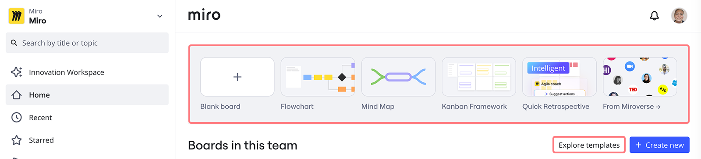
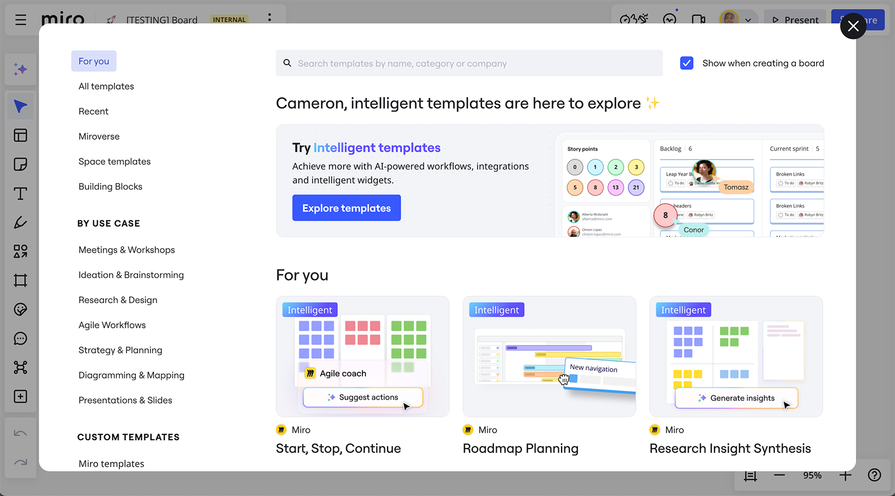
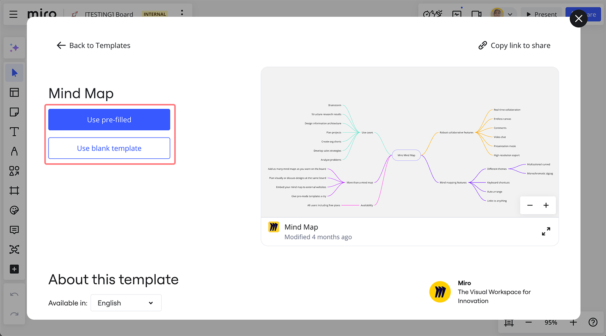
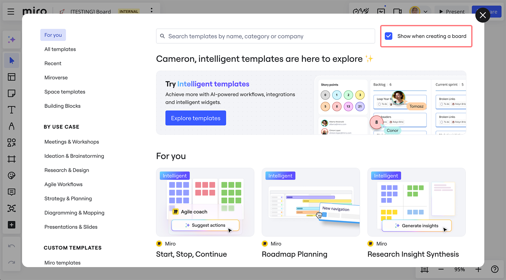
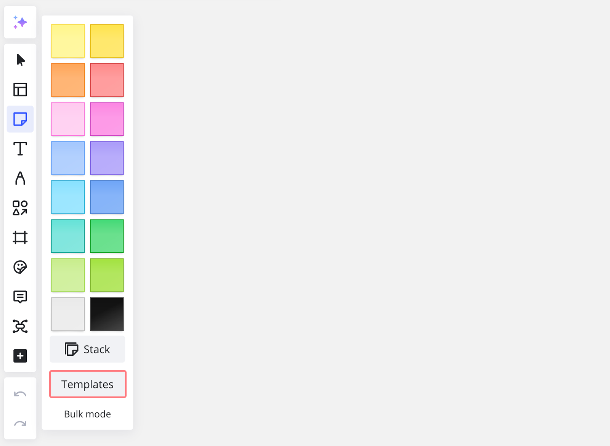

Qu’il s’agisse d’une étincelle d’inspiration ou d’un démarrage rapide pour tout projet, Miro propose une variété de **modèles** **pour vous aider à stimuler votre créativité et votre productivité.**

Des exercices de Design Thinking aux rituels Agiles en passant par les cadres de prise de décision, notre [bibliothèque de modèles](https://miro.com/templates/) contient plus de 300 modèles personnalisés conçus pour des cas d’utilisation quotidiens qui vous permettront de collaborer en quelques secondes.

Miro fournit également des modèles pour les espaces, appelés plans d’action. Vous pouvez sélectionner un espace prédéfini comprenant des tableaux et des formats qui correspondent le mieux à votre workflow. Pour en savoir plus sur les plans d’action, consultez Plans d’action.

> **Disponible sur** : version navigateur, [application de bureau](../../apps-for-devices/05-desktop-app.md), [application pour tablette](../../apps-for-devices/11-tablet-app.md)

:::tip
Vous n’avez pas trouvé le modèle dont vous avez besoin ? [Envoyez-nous votre idée](https://community.miro.com/wish-list-32) et nous pourrions l’ajouter à la bibliothèque dans le futur.
:::

:::tip
Visitez [Miroverse](https://miro.com/miroverse/) - Galerie de modèles de la communauté présentant les meilleurs tableaux Miro. Apprenez comment [publier votre propre modèle dans Miroverse](../../../using-miro/miroverse/06-how-to-get-published-on-miroverse.md).
:::

<iframe allowfullscreen="" frameborder="0" height="315" src="//fast.wistia.com/embed/iframe/zuw2ce5s0d" width="560"></iframe>

## Trouver et utiliser des modèles pour commencer

Parcourez la galerie de modèles pour démarrer avec un cadre prédéfini ou combinez différents modèles pour faire avancer votre projet.

Passez plus rapidement en mode collaboration en créant votre propre modèle, ou en utilisant un [modèle](02-custom-templates.md) créé par Miro qui répond à vos besoins. Les modèles peuvent être trouvés à l’un des quatre emplacements suivants :

- Votre tableau de bord est votre point de départ pour commencer quelque chose de nouveau
- Le sélecteur de modèles. Vos modèles personnalisés seront disponibles ici avec certains modèles Miroverse créés par Miro et par la communauté
- Le site de Miro. Vous pouvez trouver tous les modèles créés par Miro sur [miro.com/templates](https://miro.com/templates/)
- [Miroverse](../../../using-miro/miroverse/01-what-is-miroverse.md). Vous pouvez trouver tous les modèles créés par la communauté sur [miro.com/miroverse](https://miro.com/miroverse/)

### Depuis votre tableau de bord

Pour ajouter un tableau de modèles depuis le tableau de bord, sélectionnez un modèle ou cliquez sur **Explorer les modèles** pour ouvrir le sélecteur de modèles. Une fois que vous avez choisi un modèle, un nouveau tableau sera créé.

*Modèles sur le tableau de bord Miro*

### Dans le sélecteur de modèles – modèles et Plans d’action

Pour ajouter un modèle à votre tableau existant ou sélectionner un Plan d’action pour votre équipe, choisissez l'icône **Modèles** () **sur la barre d'outils.** Sélectionnez un modèle ou un plan d’action dans le sélecteur de modèles.

Le sélecteur de modèles vous permet de parcourir facilement les **300****+ modèles** de Miro, y compris les meilleurs modèles de leur catégorie réalisés par les créateurs de Miroverse. Utilisez la recherche pour trouver facilement le modèle qui répond le mieux à vos besoins. La recherche s'applique également à tous les [modèles personnalisés](02-custom-templates.md).

*Le sélecteur de modèles*

Parcourez les meilleurs cas d’utilisation à l’aide de catégories, d’étiquettes de sujet et de modèles présentés. Apprenez tout sur un modèle grâce aux auteurs de modèles, aux aperçus interactifs et aux ressources pédagogiques.

Choisissez de commencer avec du contenu d’exemple pré-rempli (disponible sur certains modèles) ou avec un modèle vierge.

*Les options pour utiliser un modèle pré-rempli ou vierge dans l’aperçu du modèle*

Si vous préférez commencer un tableau à partir de zéro, désélectionnez **Afficher lors de la création d’un nouveau tableau**, et le sélecteur de modèles n’apparaîtra plus chaque fois qu’un nouveau tableau est créé. Vous pouvez toujours rouvrir le sélecteur de modèles à partir de la barre d’outils.

*L’option d’afficher le sélecteur de modèles chaque fois que vous créez un tableau*

### Plans d’action

Le sélecteur de modèles vous permet également de sélectionner un [plan d’action](../../../using-miro/spaces/04-blueprints-beta.md).

Les plans d’action sont des modèles d’espace. Vous pouvez sélectionner un plan d’action d’espace pour préstructurer votre espace avec des tableaux et des formats adaptés à votre workflow et aux besoins de votre équipe. Les tableaux et formats sont préremplis avec tout ce dont vous avez besoin pour démarrer votre flux.

Pour accéder aux plans d’action à partir de votre tableau de bord Miro, sélectionnez à droite **Explorer les modèles**. Le sélecteur de modèles s’ouvre, puis sélectionnez **Plans d’action**.

:::tip
Vous pouvez également accéder au sélecteur de modèles et aux plans d’action à partir d’un tableau Miro. Sélectionnez **Modèles** () depuis la barre de création. Le sélecteur de modèles s'ouvre.
:::

:::note
Les plans d’action ne sont pas disponibles avec les forfaits Free. Les utilisateurs d’un forfait Free peuvent voir la fonctionnalité Plans d’action et décider de passer à un forfait supérieur.
:::

### À partir des panneaux de modèles

Les modèles sont intégrés dans les cadres, les pense-bêtes, les tables et les cartes mentales pour en faciliter l’accès. Pour créer plus rapidement, ouvrez simplement l’un de ces outils dans la [Barre de création](05-toolbars.md) et cliquez sur **Modèles**.

*Accès aux modèles depuis le panneau des pense-bêtes*

### Mélanger et associer des modèles

Vous pouvez ajouter à votre tableau autant de modèles que vous le souhaitez. Combinez les cadres et les activités de plusieurs modèles pour continuer à collaborer en toute transparence sur le même tableau. Accédez simplement au sélecteur de modèles depuis le tableau choisi et sélectionnez un modèle préconçu ou [l'un des vôtres](02-custom-templates.md).

Lorsque le modèle est ajouté, les éléments sont automatiquement dissociés. Vous pouvez cliquer individuellement sur un objet pour le déplacer ou le modifier. Si vous souhaitez déplacer plusieurs objets à la fois, vous pouvez [les regrouper](../../../using-miro/working-on-the-board/08-structuring-board-content.md) ou [créer un cadre autour d’eux](../../../using-miro/essential-tools/07-frames.md). Vous pouvez copier des éléments de modèle et les coller si vous avez besoin d’ajouter d’autres éléments similaires. N’hésitez pas à [sélectionner tous les éléments d’un modèle](../../../using-miro/working-on-the-board/10-working-with-objects.md) pour le déplacer ou le supprimer si vous n’en avez pas besoin sur votre tableau.

:::tip
Créez une cohérence et adaptez votre style unique en mettant à jour les [couleurs](../../../using-miro/working-on-the-board/14-colors.md) et/ou les [polices](../../../using-miro/essential-tools/06-fonts.md).
:::

## Effacer le contenu pré-rempli

Si les objets d'un modèle sont pré-remplis de contenu, vous pouvez effacer le contenu de plusieurs widgets (comme des pense-bêtes, des formes et des cartes) simultanément. Cette fonctionnalité vous permet de supprimer tout texte, étiquettes, émojis, auteurs, assignés et dates d'échéance des widgets sélectionnés, en les remettant à leur état vierge tout en conservant leur style (couleurs, tailles, etc.).

Pour effacer le contenu :

1. Sélectionnez les widgets que vous souhaitez effacer.
2. Faites un clic droit pour ouvrir le menu contextuel.
3. Choisissez "Effacer le contenu" dans le menu.
4. Vous pouvez également utiliser le raccourci Cmd + Suppr (Mac) ou Ctrl + Suppr (Windows).

## Travailler avec des modèles intelligents

Les modèles intelligents sont conçus pour rendre les workflows plus efficaces et maintenir l’engagement des équipes lors d’activités telles que la planification des sprints, les rétrospectives et les roadmaps. Les modèles intelligents incluent l’IA, des outils interactifs et des intégrations dans une seule expérience rationalisée.

Les modèles intelligents comprennent des fonctions telles que :

- Générer un Documents résumant les points à retenir d’une réunion.
- Générer les prochaines étapes dans une rétrospective.
- Ajouter des membres de l’équipe aux cartes à l’aide du widget Personnes.
- Générer des informations à partir de la recherche sur les utilisateurs.
- Obtenir un retour d’information sur les idées.

Vous pouvez ajouter des modèles intelligents à des tableaux nouveaux ou existants de la même manière que vous accédez à des modèles ordinaires : via votre tableau de bord ou le sélecteur de modèles. Une section est consacrée aux modèles intelligents, mais vous pouvez aussi les trouver dans les catégories de modèles. Recherchez la bannière **Intelligent** dans le coin supérieur gauche de la vignette du modèle.

*Exemples de modèles intelligents dans le sélecteur de modèles*

## Partage de liens pour modèles

En quelques secondes, et non en quelques heures, expliquez aux membres de l’équipe comment vous recommanderiez d’utiliser Miro. Les liens de partage vous aident à guider les autres pour trouver rapidement le bon modèle et étendre la portée des ressources recommandées.

Accédez au modèle que vous souhaitez partager. Vous pouvez ensuite copier le lien de partage de deux manières :

- Cliquez sur les trois points de la vignette du modèle et sélectionnez **Copier le lien**.
- Cliquez sur **Aperçu** pour voir les détails du modèle et sélectionnez **Copier le lien à partager** en haut à droite.

## Créer un modèle personnalisé

Si vous reconstruisez ou répétez constamment les mêmes activités, ou si vous voyez des gens faire beaucoup de copier-coller, c’est l’occasion d’utiliser un modèle personnalisé. Standardisez les processus et évitez de perdre du temps à dupliquer les efforts en créant des modèles personnalisés visibles par vous et votre équipe. [En savoir plus sur la création, le partage et la modification des modèles personnalisés](02-custom-templates.md).

:::note
Les forfaits Starter verront les options "Personnel" et "Équipe" sous Modèles personnalisés.
Les options "Entreprise", "Équipe" et "Personnel" sont disponibles pour les forfaits Starter, Business, Enterprise et Education.
:::

## FAQ

**Puis-je importer un modèle d’un autre service vers Miro ?**

Non, mais n’hésitez pas à utiliser n’importe quel modèle de la bibliothèque de modèles Miro ou à créer vos propres modèles personnalisés.

**Puis-je accéder au sélecteur de modèles à partir de l’application mobile ?**

Non, ce n'est pas possible actuellement.

**Les modèles Miro sont-ils gratuits ?**

Oui, les modèles de la bibliothèque et du sélecteur sont gratuits, tandis que les modèles personnalisés ne sont pris en charge que dans le cadre des forfaits payants et Education. Les modèles qui incluent des lots de formes de diagrammes intelligents ne sont disponibles que sur les forfaits Business, Enterprise et Education.

**Puis-je créer un tableau modèle pour que d’autres utilisateurs puissent le copier dans leurs équipes ?**

Oui, activez la copie du tableau dans les paramètres du tableau et partagez le tableau avec d’autres utilisateurs. Les utilisateurs enregistrés de Miro pourront dupliquer le tableau dans leurs propres équipes.
Si des modèles personnalisés sont disponibles dans votre équipe, vous pouvez créer votre propre modèle et le partager avec votre équipe. En savoir plus ici.
