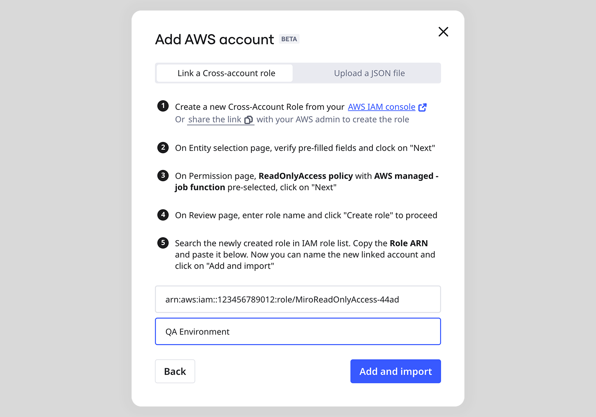
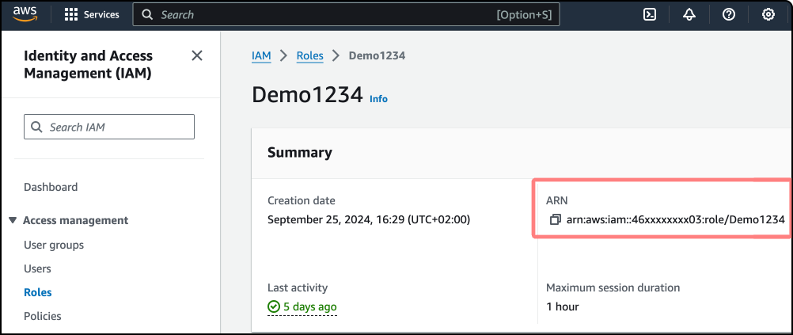
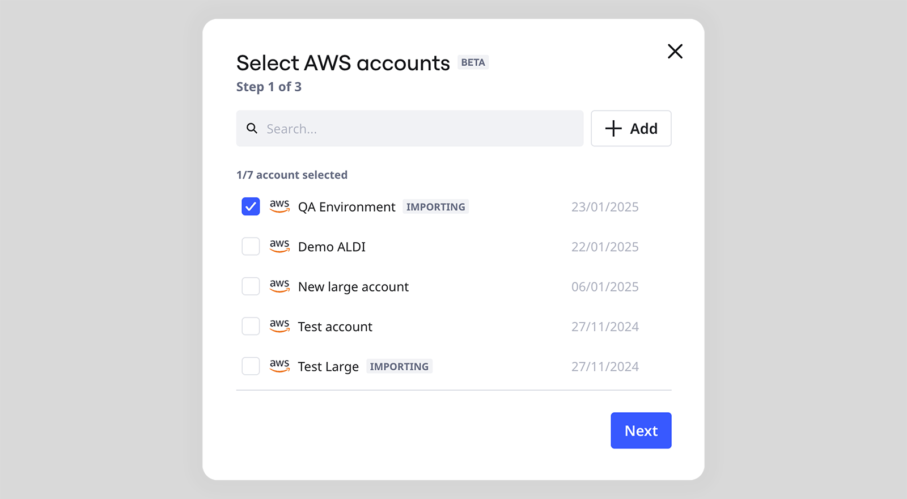
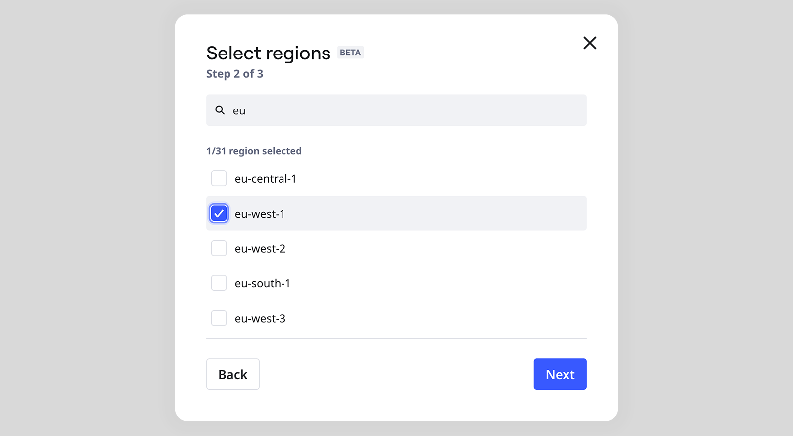
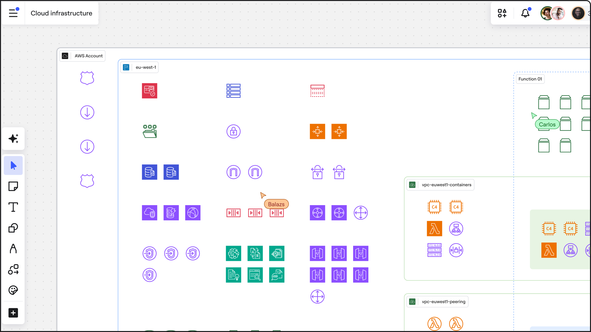
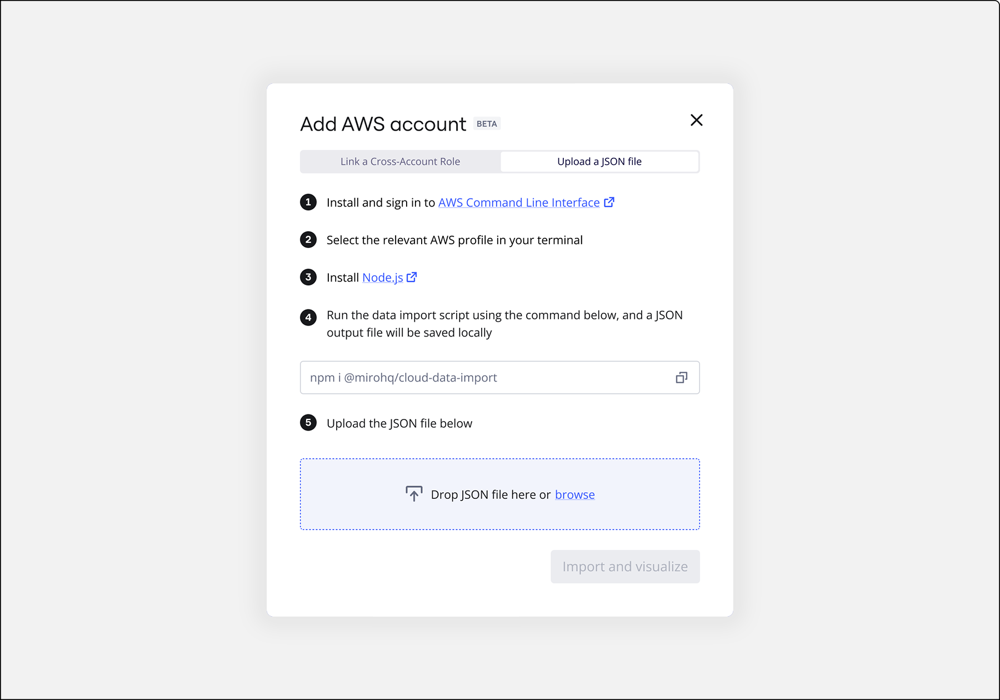
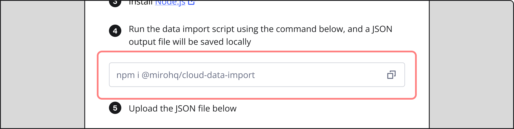

L'application AWS Cloud View de Miro vous permet de générer un diagramme de votre infrastructure AWS en important les données d’un compte AWS.

:::note
(Enterprise) L'intégration CloudView est disponible uniquement avec des licences Avancées. Pour plus d'informations, voir [Comprendre les licences Enterprise](../../plans-billing/miro-plans/05-understanding-enterprise-licenses.md).
:::

Il existe deux façons de générer ce diagramme :

- **Lier un rôle intercomptes** : connectez votre compte AWS à Miro en utilisant un rôle intercomptes pour visualiser automatiquement le compte AWS
- **Téléchargez un fichier JSON** généré en exécutant le script dans votre AWS CLI (Interface de Ligne de Commande)

## Lier un rôle intercomptes

Miro utilise un rôle intercomptes pour accéder en toute sécurité à votre compte AWS. Vous devez créer un rôle ReadOnly dans votre compte AWS spécifiquement conçu pour que Miro puisse accéder à votre compte. Ensuite, vous pouvez utiliser l'ARN de ce rôle pour connecter Miro à votre compte AWS.

Utilisez l'application AWS Cloud View en suivant ces étapes :

1. Cliquez sur l’**icône Outils, Médias et Intégrations (+)** en bas de la barre d’outils Miro et recherchez **AWS Cloud View**.
2. Lancez l’application à partir des résultats de recherche.
3. Dans la fenêtre modale, choisissez l’onglet **Lier un rôle intercomptes**.
   
   *Lier un rôle intercomptes*
4. Suivez les étapes dans la boîte de dialogue pour configurer un nouveau rôle intercomptes dans votre console AWS.
5. Une fois le rôle créé dans AWS, entrez l’ARN du rôle dans le champ **Role ARN**.
   
   *Où trouver le champ ARN dans AWS*
6. Donnez un nom au nouveau compte AWS que vous ajoutez.
7. Cliquez sur **Ajouter et importer**.
8. Le compte AWS récemment ajouté s'affichera dans l'étape suivante où les comptes sont listés.
   
   *Sélection de votre compte AWS*
9. Sélectionnez le compte que vous souhaitez visualiser et cliquez sur **Suivant**.
10. Sélectionnez la ou les régions que vous souhaitez visualiser. Notez que sélectionner plusieurs régions peut ralentir le processus de visualisation.
    
    *Sélectionner les régions à importer*
11. À l'écran suivant, appliquez tous les filtres nécessaires à votre diagramme, en utilisant soit le type de ressource, soit les étiquettes. (Notez que les filtres peuvent être appliqués ou modifiés après la création du diagramme via le menu contextuel.)

    > 💡 Utilisez des filtres pour réduire la taille du diagramme. Un diagramme plus petit est plus rapide à générer et plus facile à utiliser.

    Vous pouvez appliquer deux types de filtres à cette étape :

    1. **Ressources :** Par exemple, sélectionnez « Instances EC2 » pour ne voir que les instances EC2 dans ce compte AWS.
    2. **Étiquettes :** Si vos ressources AWS sont étiquetées, vous pouvez utiliser le filtre Étiquettes (paire clé et valeur) en plus du filtre Ressources. Par exemple, recherchez la clé d'étiquette « Propriétaire » et choisissez une valeur, disons « CheckoutStream ».
12. Cliquez sur **Visualiser** pour créer votre diagramme

Le diagramme pour le compte AWS sera généré.

*Exemple de diagramme d’infrastructure AWS généré par l'application Cloud View*

## Charger un fichier JSON

Vous pouvez exécuter un script dans votre CLI AWS (interface de ligne de commande) qui utilise des autorisations en lecture seule pour enregistrer en toute sécurité les données de vos ressources cloud dans un fichier JSON.

Une fois que vous avez utilisé AWS Cloud View pour visualiser votre infrastructure AWS dans Miro, vous pouvez apporter des modifications au diagramme créé, comme l’ajout de connexions, l’ajout de formes ou d’objets supplémentaires comme des pense-bêtes, ou utiliser l’application **AWS Cost Calculator** pour voir les coûts que la nouvelle conception entraînera.

Utilisez l'application AWS Cloud View avec un fichier JSON en suivant ces étapes :

1. Cliquez sur l'icône **Outils, Médias et Intégrations (+)** en bas de la barre d'outils Miro et recherchez **AWS Cloud View**
2. Lancez l’application.
3. Dans la fenêtre modale, suivez les instructions pour configurer l’environnement afin d’exécuter un script dans AWS.
   
   *Téléchargement d'un fichier JSON*

:::note
Vous avez besoin de [Node.js](http://node.js) sur votre machine et de [l'AWS CLI](https://docs.aws.amazon.com/cli/latest/userguide/getting-started-install.html#getting-started-install-instructions) (Command Line Interface) configurée avant de continuer.
:::

4. Sélectionnez votre profil AWS dans votre terminal.
5. Copiez la commande et exécutez-la dans votre terminal.
   
   *Exécutez la commande copiée dans votre Terminal*
6. Un fichier JSON contenant des données sur vos ressources AWS sera généré.
7. Chargez le fichier JSON dans la même fenêtre modale au sein de Miro.
8. Miro va générer une visualisation de votre infrastructure AWS.

*Exemple de diagramme d’infrastructure AWS généré par l’application Cloud View*

:::tip
Vous pouvez changer la couleur des icônes AWS directement dans l'application CloudView pour Miro. Cette option n'est pas disponible pour les icônes antérieures à 2025.
:::

## Foire aux questions

### Sécurité

**Comment Miro assure-t-il la sécurité de l'accès dans Cloud View ?**

Lors de la création d'un nouveau rôle AWS pour accorder l'accès à Miro, vous utilisez le lien fourni dans la fenêtre modale Cloud View. Ce lien contient à la fois un **ID de compte** et un **ID externe**. L'**ID externe** est dérivé d'un ID interne et d'une clé secrète gérée par Miro dans un schéma cryptographique à sens unique. Il garantit que chaque organisation Miro a son propre ID externe distinct, et rend impossible pour quiconque en dehors de votre organisation de revendiquer votre ID pour accéder à votre infrastructure AWS.

L'ID externe est un hash généré à l'aide d'un mécanisme géré par AWS et garantit que les connexions sont exclusives à votre organisation Miro.

#### Attribuer les ARN de rôle

En plus de l'ID externe, les utilisateurs doivent attribuer l'**ARN du rôle** du rôle créé pour se connecter à l'environnement AWS et analyser les ressources. L'attribution de l'ARN du rôle est entièrement de la responsabilité du client et est gérée par son administrateur AWS. L'administrateur décide à qui attribuer l'ARN du rôle, permettant ainsi de contrôler l'accès au rôle. Le même ARN de rôle peut être attribué à plusieurs utilisateurs de Miro, et toute personne à qui l'ARN de rôle et l'organisation correspondante de Miro ont été attribués peut se connecter à l'environnement AWS. Cependant, cet accès reste strictement limité à cette organisation Miro spécifique en validant l'ID externe lors de chaque processus d'authentification.

#### Responsabilités de sécurité du client

Pour maintenir la sécurité de vos ressources AWS lors de l'utilisation de Cloud View, veuillez prendre en compte les responsabilités suivantes :

- **Limitez l'adhésion à l'organisation :** Lorsqu'il s'agit d'un accès plus large, il est conseillé de créer une organisation Miro dédiée dans votre compte spécifiquement pour la visualisation de vos infrastructures cloud. En limitant le nombre de membres de l'organisation, vous pouvez vous assurer que seuls certains utilisateurs autorisés ont accès à vos informations sensibles de cloud.
- **Attribution prudente du Role ARN :** Lorsque vous accordez l'accès à de grandes organisations Miro, faites attention à la manière dont vous attribuez le Role ARN créé. Ne l'attribuez qu'à ceux qui en ont besoin. Cette décision vous appartient, car vous pourriez souhaiter donner un accès plus large à une petite organisation Miro tout en limitant l'accès à un compte AWS de test avec de plus grandes organisations Miro.

En suivant ces pratiques et en tirant parti du cadre sécurisé d'accès de Miro, vous pouvez utiliser Cloud View en toute confiance pour gérer vos ressources AWS.

**Qui aura accès à mes informations d'infrastructure connectées ?**

Lorsque vous connectez Miro à votre environnement AWS en utilisant un ARN de rôle, **seul vous** pouvez consulter, visualiser et gérer les données via cette connexion spécifique. Les autres membres de votre organisation Miro peuvent ajouter le même ARN de rôle pour établir leurs propres connexions, si nécessaire.

**Où puis-je trouver plus d’informations sur la manière dont Miro gère mes données ?**

Vous pouvez consulter les détails de notre engagement en matière de confidentialité et de sécurité des données (y compris les contrôles spécifiques et les politiques mises en place par nos équipes) dans le  [Centre de Confiance](https://trust.miro.com/) de Miro. Pour des questions plus détaillées, veuillez contacter votre équipe de compte ou soumettre un ticket d’assistance.

### Lier un rôle intercomptes

**Miro offre-t-il un accès API pour la création et la mise à jour programmatiques de diagrammes ?**

Pas encore. Actuellement, Miro ne propose pas d'accès API pour la création ou la mise à jour programmatiques de diagrammes.

**Puis-je mettre à jour un compte AWS existant pour récupérer les données les plus récentes ?**

Non, l'application AWS Cloud View ne permet pas actuellement la mise à jour des données de compte AWS. Cette fonctionnalité sera prise en charge à l'avenir.

**Quel est le nombre maximum de ressources que Miro peut gérer dans un diagramme ?**

Il n'existe pas de limite stricte quant au nombre de ressources qui peuvent être visualisées dans un diagramme. Toutefois, les diagrammes avec un grand nombre de ressources peuvent prendre plus de temps à charger et à être rendus.

**Quelles sont les politiques suivies par Miro pour garantir la sécurité des données et du contenu ?**

Nous nous soucions de la confidentialité et de la sécurité des données et nous nous efforçons de maintenir nos pratiques de sécurité à la hauteur des têtes de file du secteur. Lisez notre [foire aux questions à propos de la confidentialité et de la sécurité des données](../../administration/get-started-as-a-miro-admin/08-miro-security-and-compliance-faq.md).

**Miro prend-il en charge la version des diagrammes pour suivre les changements d'infrastructure au fil du temps ?**

Pas encore. Tous les diagrammes rendus sont statiques. Les utilisateurs peuvent créer de nouveaux diagrammes après avoir mis à jour les données et les placer à côté des anciennes versions pour les comparer.

**Miro peut-il s'intégrer avec des outils d'Infrastructure as Code comme Terraform ou CloudFormation pour générer des diagrammes à partir du code ?**

Pas encore. Actuellement, Miro ne prend en charge que l'importation de données depuis AWS.

**Quels types de ressources Miro scanne-t-il actuellement ?**

1. Requêtes nommées par Athena
2. Groupes Auto Scaling
3. Trails CloudTrail
4. Alarmes métriques CloudWatch
5. Flux de métriques CloudWatch
6. Tables DynamoDB
7. Instances EC2
8. VPC EC2
9. Points de terminaison VPC EC2
10. Sous-réseaux EC2
11. Tables de routage EC2
12. Passerelles Internet EC2
13. Passerelles NAT EC2
14. Passerelles de transit EC2
15. Volumes EC2
16. ACL réseau EC2
17. Passerelles VPN EC2
18. Interfaces réseau EC2
19. Ressources ECS
20. Systèmes de fichiers EFS
21. Clusters ElastiCache
22. Équilibreurs de charge ELBv2
23. Groupes cibles ELBv2
24. Équilibreurs de charge ELBv1
25. Clusters EKS
26. Fonctions Lambda
27. Clusters Redshift
28. Instances RDS
29. Clusters RDS
30. Proxys RDS
31. Zones hébergées Route 53
32. Compartiments S3
33. Sujets SNS
34. Files d’attente SQS

**Comment Miro se connecte-t-il à mon compte AWS ?**

Miro se connecte via un rôle cross-account que vous ou votre administrateur AWS créez. Ce rôle doit pointer vers le compte AWS de Miro et utiliser un ID externe unique fourni par Miro. Miro stocke et utilise cet ID externe de manière sécurisée pour endosser le rôle et récupérer les données. Miro scanne ensuite toutes les régions et ressources auxquelles il peut accéder. Cela vous permet de visualiser votre configuration AWS sous forme de diagrammes faciles à comprendre.

**Comment créer le rôle IAM nécessaire pour établir la connexion entre Miro et AWS ?**

Le rôle peut être créé à l'aide d'un lien dans la fenêtre modale de l'application Cloud Data Import contenant toutes les informations nécessaires pour créer le rôle. Les utilisateurs peuvent utiliser ce lien pour créer un nouveau rôle directement ou le partager avec leur administrateur s'ils n'ont pas les permissions requises.

**Quelle politique est requise pour le rôle IAM ?**

Miro attache la politique "Lecture seule - fonction de poste" au rôle. Pour une approche plus restrictive, vous pouvez attacher une politique personnalisée avec des permissions spécifiques. Miro scannera ensuite tout ce à quoi il a accès. Miro n'a pas besoin d'aucun accès en écriture.

**Y a-t-il des coûts associés à l'utilisation de l'application ?**

Miro peut scanner votre infrastructure sans ajouter de frais supplémentaires à votre compte AWS. Gardez à l'esprit que récupérer des données nécessite de faire des requêtes à vos services, ce qui utilise temporairement des quotas de limite de taux. Ces quotas s'appliquent par minute, donc ils reviennent à la normale une fois la tâche de découverte terminée.

**Comment puis-je consulter et supprimer les comptes AWS que j'ai ajoutés dans Miro ?**

Vous pouvez consulter et supprimer les liens vers votre compte AWS depuis le menu **trois points** (**...**) de l'écran de sélection de compte AWS. Supprimer le lien n'affecte pas vos diagrammes existants dans Miro.

**Puis-je partager le compte AWS que j'ai ajouté à Miro avec quelqu'un d'autre ?**

Il n’est pas possible de partager le compte via l’interface utilisateur pour le moment. Mais sachez que toutes les personnes au sein de la même organisation peuvent ajouter le même Role ARN pour accéder aux données si vous leur partagez le Role ARN. Personne en dehors de votre organisation Miro ne peut accéder aux données via le Role ARN.

**Puis-je partager le diagramme que j'ai généré avec l'application avec mon équipe ?**

Lorsque vous générez un diagramme sur un tableau, il est accessible à toute personne ayant accès à ce tableau. Vous pouvez partager le tableau avec des personnes spécifiques.

**Je n’ai pas accès à la création du rôle inter-comptes dans mon compte AWS. Que dois-je faire ?**

Il est courant que tout le monde dans un compte AWS n’ait pas la permission de créer un nouveau rôle IAM. Si c’est votre cas, demandez à votre administrateur AWS d’ouvrir la fenêtre modale de l'application d'importation de données AWS et de configurer un rôle IAM à l'aide du lien fourni. Votre administrateur a peut-être déjà créé un rôle spécifique avec certaines autorisations et pourrait vous partager uniquement l'ARN de ce rôle.

**Ma société a défini des alertes qui se déclenchent lorsque Miro commence à scanner. Est-ce normal ?**

Pour analyser votre infrastructure, Miro envoie plusieurs requêtes à divers services de votre infrastructure AWS, ce qui est probablement à l'origine des alertes. Veuillez en informer votre équipe de sécurité et demandez-leur de configurer l'alerte de manière à anticiper que cette intégration existe.

**Quand je partage un schéma visualisé avec mes collègues, est-ce que je partage uniquement la visualisation ou d'autres données également ?**

Lorsque vous visualisez un schéma AWS sur un tableau, vous créez essentiellement un schéma statique représentant votre infrastructure. En partageant le tableau, vous ne partagez aucun identifiant ni information d'accès avec d'autres. Cependant, il est important de savoir avec qui vous partagez la visualisation de l'infrastructure.

### Chargement JSON

**Que dois-je installer pour utiliser cette fonctionnalité ?**

Node.js doit être installé sur votre machine et l’interface de ligne de commande AWS (Command Line Interface) doit être configurée.

**De quelles autorisations ce script a-t-il besoin ?**

Le script requiert la politique "ReadOnly - job function" (**arn:aws:iam::aws:policy/ReadOnlyAccess**).

Vous pouvez définir une politique personnalisée pour le rôle et limiter Miro à des ressources ou régions spécifiques si vous le souhaitez. Par défaut, Miro recherche les ressources mentionnées sur cette page. Si vous avez défini une politique personnalisée, le script ne scannera que dans le cadre de ses accès.

**Où puis-je consulter le script pour comprendre comment il fonctionne et quelles sont les données qu’il récupère ?**

Le script est open source, vous pouvez donc revoir le mécanisme de découverte, et même commenter les ressources que vous n’avez pas besoin d’employer.

**Miro stocke-t-il les informations dans le fichier JSON qui est chargé ?**

Non, pour l'instant Miro ne stocke pas les informations.

**Comment l'utilisation de l'application AWS Cloud View affectera-t-elle mes quotas de service ?**

Vous pouvez utiliser l'application AWS Cloud View sans encourir de frais supplémentaires.

Exécuter l'application sur votre infrastructure utilisera une partie du quota de votre service pendant le temps spécifique où l'application scanne les ressources. Le balayage des ressources a lieu lorsque vous liez un nouveau compte AWS ou lorsque vous exécutez le script dans votre AWS CLI pour générer une sortie JSON. Il est généralement préférable de scanner l'infrastructure quand elle n'est pas déjà sous des charges lourdes.

Alternativement, vous pouvez réduire le nombre de requêtes que nous effectuons par seconde en utilisant le script AWS CLI avec **--call-rate-rps**. Par exemple, vous pouvez exécuter le script avec **--call-rate-rps 1** qui ne fait qu'une demande par seconde aux services, ce qui garantit des taux d'utilisation équitables.

Le script est équipé d’une stratégie de backoff exponentielle, ce qui signifie qu’il relance les requêtes qui ont échoué avec des délais de plus en plus longs, ce qui est la méthode standard suggérée par AWS.

**Où puis-je suggérer l’ajout d’un support pour un service spécifique dont j’ai besoin ?**

Vous pouvez faire des suggestions sur l’ajout d’un support pour des services spécifiques sur Github. Une fois là, cliquez sur "Request Cloud Resource/Service Support".
