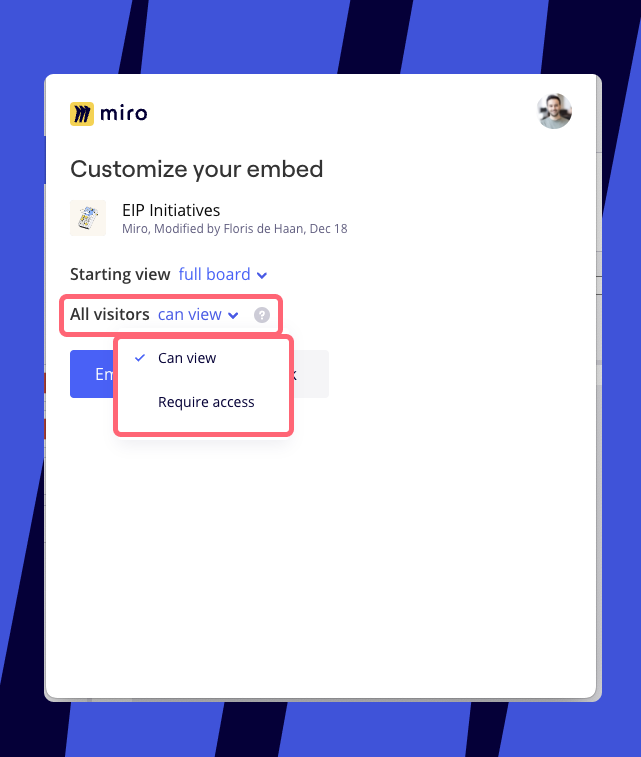

Miro et Confluence fonctionnent en synchronisation bidirectionnelle pour vous garantir le contenu le plus à jour des deux plateformes, où que vous travailliez.

## Comment Miro fonctionne avec Confluence

Intégrez vos tableaux Miro et vos documents Confluence, et suivez les changements grâce à la synchronisation instantanée. Vous pouvez définir le niveau d’accès afin que les bons utilisateurs aient accès aux bonnes informations à tout moment.

Intégrez des documents Confluence dans vos tableaux Miro

Intégrez des tableaux Miro dans des documents Confluence

## Intégrer des documents Confluence à des tableaux Miro

Vous pouvez intégrer des documents Confluence à Miro en collant simplement un lien dans le tableau Miro. Notez que **l'intégration de documents Confluence dans Miro nécessite Confluence Cloud.**

Lorsque vous collez un lien Confluence sur un tableau Miro, celui-ci apparaît comme un [lien intelligent Miro](https://help.miro.com/hc/articles/360017730993). Lors du collage d'un lien Confluence pour la première fois, vous devrez cliquer sur **Connecter** pour autoriser l'accès à Confluence.

:::warning
Pour des raisons de sécurité, nous n’affichons pas les détails d’un lien Confluence sur les tableaux Miro publics et les utilisateurs ne peuvent consulter que le titre d’un lien Confluence sur les tableaux privés. Les utilisateurs ne verront que le titre de la page au moment d’autoriser leur compte Confluence, après quoi ils pourront développer et modifier le document Confluence (en fonction du niveau d’accès autorisé).
:::

*Connecter la page Confluence dans Miro*

Une fois Confluence autorisé, les utilisateurs qui accèdent au tableau pourront désormais voir le titre du document, l’icône du fournisseur et la source du lien. Les utilisateurs pourront également agrandir le lien intelligent Miro en mode plein écran.

:::tip
Les titres des liens intelligents Miro sont extraits de l’URL. Si vous modifiez le titre du document Confluence, vous devrez coller à nouveau le lien pour voir le titre à jour dans votre lien intelligent Miro.
:::

*Une page Confluence connectée comme lien intelligent Miro*

Lorsque les utilisateurs cliquent sur l’icône d’agrandissement, ils sont invités à autoriser leur propre compte Confluence avant de pouvoir consulter et modifier le document dans Miro.

*Le document Confluence agrandi*

## Intégrer des tableaux Miro à des documents Confluence

Vous pouvez intégrer des tableaux Miro dans des documents Confluence avec le Plugin Miro pour Confluence, ou directement via les Atlassian Smart Links. Cette opération est possible avec Confluence Cloud, Server ou DC.

### Étape 1 : Paramétrer le Plugin Miro

Tout d’abord, installez l’[application Miro pour Confluence](https://marketplace.atlassian.com/apps/1217530/miro-for-confluence?tab=reviews&hosting=cloud) à partir de l’Atlassian Marketplace.

**Comment installer l’application Miro pour Confluence**

> **Qui peut le faire** : admin Confluence

1. Connectez-vous à votre instance Confluence en tant qu'admin
2. Cliquez sur le menu déroulant d’administration et choisissez **Add-ons (Modules complémentaires)**
3. Sélectionnez **Découvrir de nouvelles applications** ou **Découvrir de nouveaux modules complémentaires**
4. Cherchez **Miro pour Confluence**
5. Cliquez sur **Obtenir l'application**

*L’application Miro pour Confluence*

Vous verrez le message suivant une fois l’application installée avec succès :

*L’application a été installée avec succès*

### Étape 2 : intégrer un tableau à la page Confluence

Il existe trois façons d’intégrer un tableau Miro à une page Confluence :

1. En tapant **/miro** directement dans le document Confluence.
   
   *Taper /miro sur la page Confluence pour intégrer un tableau*
2. En recherchant Miro à partir de la barre d’outils de l’application. Depuis le document Confluence, cliquez sur **Insérer** et sélectionnez **Miro** dans la liste des applications.
   
   *Sélection de Miro dans la liste d'applications pour intégrer un tableau*
3. En collant un lien Miro directement dans Confluence grâce aux liens intelligents Atlassian.

### Étape 3 : sélectionner un tableau à partir de l’outil de sélection de tableaux

L’outil de sélection de tableaux s’ouvre. Sélectionnez le tableau que vous souhaitez intégrer à partir du menu déroulant ou recherchez un tableau. Les utilisateurs ne verront que les tableaux qui leur sont accessibles dans Miro et ne pourront intégrer que les tableaux pour lesquels ils ont un accès éditeur.

*Choisir un tableau à intégrer à partir de l’outil de sélection de tableaux*

Sélectionner la **Vue de départ** pour le tableau intégré.

*Définir la vue de démarrage pour le tableau Miro intégré*

Choisissez le niveau d’accès pour **Tous les visiteurs** de la page Confluence.

- **Peut consulter :** Permet à tout visiteur de la page Confluence de voir le tableau.
- **Nécessite un accès :** Limite la visualisation à ceux qui ont accès au tableau dans Miro.

*Définir le niveau d’accès au tableau Miro sur la page Confluence*

### Étape 4 : Intégrer le tableau

Après avoir cliqué sur **Embed board (Intégrer le tableau)**, le tableau Miro sera inséré sur la page Confluence en tant qu’iFrame. Les utilisateurs peuvent consulter et naviguer sur le tableau.

:::note
Pour les utilisateurs du forfait Enterprise, les niveaux d’accès suivront les paramètres d’accès à l’échelle de l’organisation, ce qui implique que certaines autorisations peuvent être restreintes. En savoir plus sur la [gestion de l'intégration des tableaux pour le forfait Enterprise](https://help.miro.com/hc/articles/4405088016274).
:::

*Tableau Miro intégré dans une page Confluence*

Pour ouvrir le tableau directement dans Miro, cliquez sur le logo Miro.

*L’option d’ouvrir le tableau dans Miro*

#### **Expérience utilisateur avec Confluence Cloud par rapport à Confluence Server**

Le menu de taille de fenêtre pour les tableaux intégrés est différent pour Confluence Cloud et Confluence Server.

Dans Confluence Cloud, vous verrez le menu de taille de fenêtre suivant, avec l’option de **Passer en plein écran** :

*Menu de taille de fenêtre dans le navigateur Confluence*

Dans Confluence Server, vous verrez un menu avec l’option permettant de sélectionner une taille de fenêtre petite, moyenne ou grande (**P/M/G**) :

*Menu de taille de fenêtre dans l’application Confluence*

## Intégrer des tableaux Miro via les liens intelligents Atlassian

Vous pouvez également intégrer des tableaux Miro dans Confluence à l’aide de la fonctionnalité de liens intelligents Atlassian. Cette fonctionnalité vous permet d’intégrer automatiquement un tableau sans avoir à installer une application.

Rendez-vous sur une page Confluence et collez simplement le lien du tableau ou saisissez **/link** pour l’insérer. Si vous utilisez cette fonctionnalité pour la première fois, vous devrez connecter une équipe Miro. Cliquez sur **Connect to preview**, autorisez dans Miro, et choisissez une équipe dans laquelle vous intégrerez vos tableaux.

:::note
Seuls les utilisateurs ayant accès au tableau intégré du côté Miro pourront travailler avec l’aperçu du tableau intégré Miro après avoir connecté leurs comptes Miro et Atlassian. Si vous souhaitez rendre l’aperçu du tableau disponible pour tous les utilisateurs de Confluence, vous pouvez utiliser l’application Miro.
:::

*Choix d'une équipe pour l'intégration des tableaux*

Lorsque vous collez un lien vers un tableau Miro dans une page Confluence, il se transforme automatiquement en widget. Cliquez sur le lien pour voir les options d’affichage. Vous pouvez choisir d’afficher le tableau Miro comme une **URL**, un texte **en ligne**, une **carte** ou une **intégration**.

*Widget de tableau Miro dans Confluence*

Si vous choisissez d’afficher le tableau sous forme d’intégration, vous pouvez modifier ses dimensions en faisant glisser ses côtés.

*Modification des dimensions d’un tableau Miro intégré dans Confluence*

:::warning
Si les cookies tiers sont bloqués dans votre navigateur, des problèmes inattendus peuvent survenir lors de l’affichage des tableaux intégrés.
:::

## Désactiver l’application Miro pour Confluence

Pour désactiver l’application, allez sur **Atlassian Marketplace** > **Gérer les applications** > **Miro for Confluence Cloud** > **Désinstaller.**

**
*Application Miro pour Confluence dans la liste des applications Atlassian installées*

## Migration et impact sur les tableaux dans Confluence

Que vous migriez d'une instance On-premise à Cloud, ou de Cloud à Cloud, le plugin Miro ne nécessite pas de étapes de migration spécifiques. Confluence affiche les tableaux Miro via des iFrames, qui sont des intégrations basées sur des URL, ce qui signifie que Confluence ne stocke que le lien du tableau, tandis que le tableau reste dans Miro.
