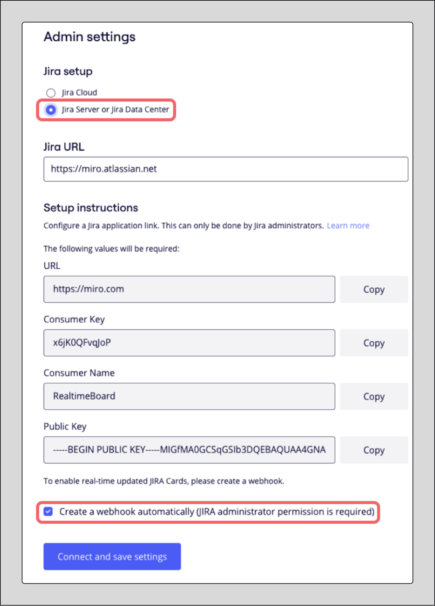
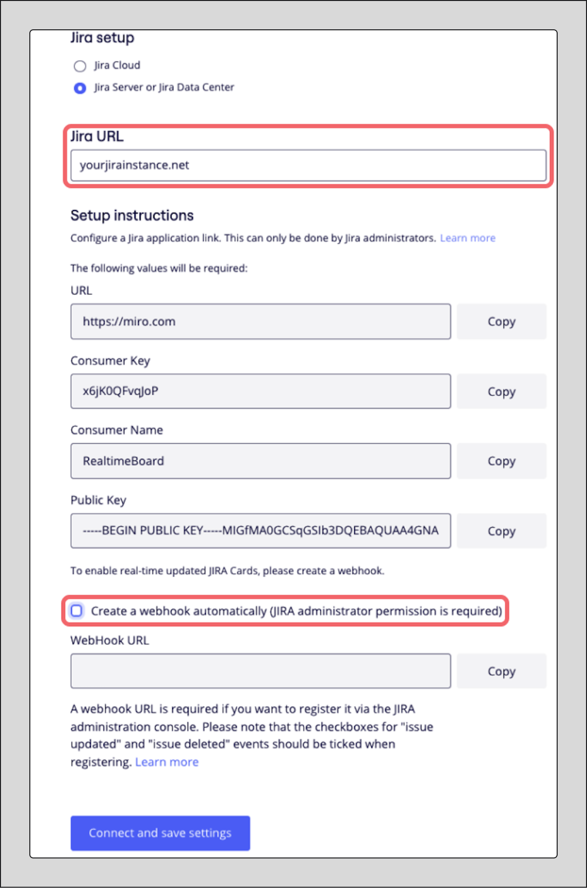

Pour garantir que vos [cartes Jira](https://help.miro.com/hc/articles/360017572434) sur un tableau Miro restent à jour, Miro doit recevoir des messages de Jira chaque fois qu'il y a des changements de données. Ces événements Jira sont transmis vers Miro via un webhook.

Ce guide fournit deux façons de créer des webhooks pour Jira Server et Jira Data Center en utilisant OAuth 1.0 et OAuth2.0.

## Créer un webhook automatiquement

Lors de la [configuration de l'intégration des cartes Jira](https://help.miro.com/hc/articles/360019501754), si vous vous connectez à Jira Server ou Jira Data Center, vous pouvez laisser l'option **Créer un webhook automatiquement** activée. C'est la méthode recommandée.

:::note
La création automatique de webhook nécessite d'être connecté à Jira en tant qu'administrateur système Jira.
:::

*Paramètres des cartes Jira, Étape 2 : "Créer un webhook automatiquement**"** est activée*

Après la création automatique du webhook, il est conseillé de se rendre sur votre page des WebHooks Jira et de modifier le webhook pour lui donner un nom unique. Cela est particulièrement important si vous prévoyez de connecter plusieurs équipes Miro à votre instance Jira.

:::note
Pour les connexions OAuth2.0, la connexion côté Miro est définie au niveau de l'entreprise. Un webhook est créé pour toutes les équipes Miro.
:::

:::note
Pour les connexions OAuth 1.0 au niveau de l'équipe Miro, un webhook est créé par équipe. Au niveau de l'entreprise Miro, un webhook est créé pour toutes les équipes.
:::

## Créer un webhook manuellement

Si vous préférez ou devez créer le webhook manuellement, suivez ces étapes.

**Obtenez l'URL du webhook depuis Miro**

1. Dans les paramètres des cartes Jira dans Miro (Étape 2, lors de la connexion à Jira Server/Data Center), désactivez l'option pour créer un webhook automatiquement.
2. Copiez et collez l'URL de Jira de votre organisation et cliquez sur Connecter et enregistrer les paramètres.
   
   *Paramètres des cartes Jira, Étape 2 : "Créer un webhook automatiquement" est désactivé*
3. Autorisez l'intégration à se connecter dans Jira lorsque cela est demandé.

- Après ces étapes, Miro vous fournira l'**URL du webhook** :
  *URL du webhook fournie par Miro*
:::note
Si vous n'êtes pas administrateur système Jira, veuillez copier l'**URL du webhook** fournie par Miro et l'envoyer à votre administrateur système Jira pour qu'il puisse créer le webhook dans Jira en utilisant les instructions ci-dessous.
:::

**Créer le webhook dans Jira**

Voici les étapes pour créer un webhook dans Jira en utilisant l'URL obtenue de Miro. Vous pouvez également consulter la documentation officielle d'Atlassian pour [Jira Server](https://developer.atlassian.com/server/jira/platform/webhooks/) et pour [Jira Cloud](https://developer.atlassian.com/cloud/jira/platform/webhooks/) (bien que cet article se concentre sur Server/Data Center).

1. Pour accéder à la page des **Webhooks** dans Jira, allez dans **Administration Jira** > **Système** > **Avancé > Webhooks** (le chemin exact peut varier légèrement selon votre version de Jira). Vous pouvez également utiliser un lien direct en ajoutant `/plugins/servlet/webhooks` à l'URL de votre instance Jira (par exemple, `https://YourJiraInstanceName/plugins/servlet/webhooks`).
2. Cliquez sur **Créer un Webhook** dans le coin supérieur droit de la page Webhooks.
3. Entrez un **Nom** descriptif pour le Webhook (par exemple, "Webhook d'intégration Miro").
4. Réglez l'**État** du Webhook sur **Activé**.
5. Collez l'**URL du webhook** copiée depuis les paramètres de Miro dans le champ URL.
   
   *Configuration des webhooks système dans Jira*
6. Dans la section **Événements**, sous **Problème**, sélectionnez les événements **mis à jour** et **supprimé**.
7. Cliquez sur **Créer** pour enregistrer le webhook.
   
   *Paramètres des événements du webhook Jira*
8. Après avoir créé le webhook dans Jira, retournez à **l'Étape 2** des paramètres des cartes Jira sur Miro, vérifiez que votre **Jira URL** est correctement renseignée, et cliquez sur **Connecter**.

Le webhook est maintenant créé et configuré. Les cartes Jira sur vos tableaux Miro se mettront à jour automatiquement lorsque des modifications sont apportées dans Jira.
