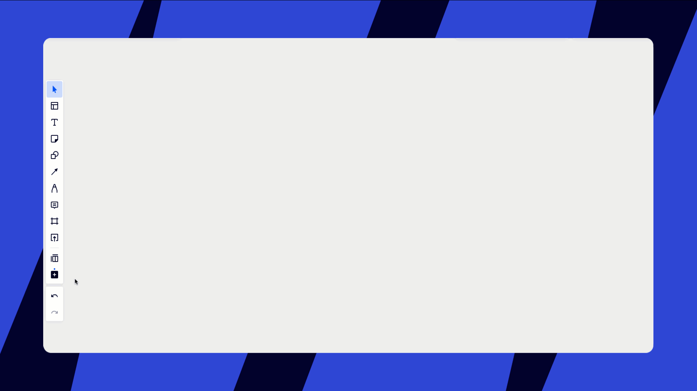
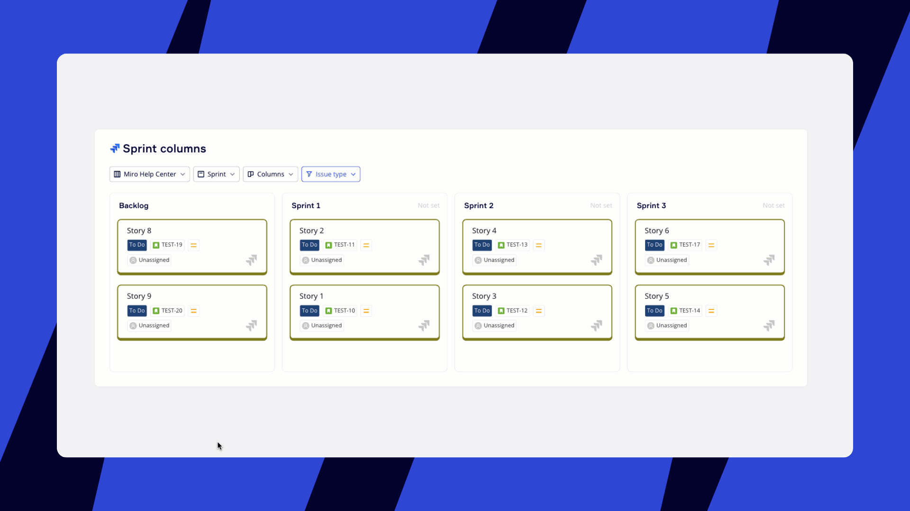
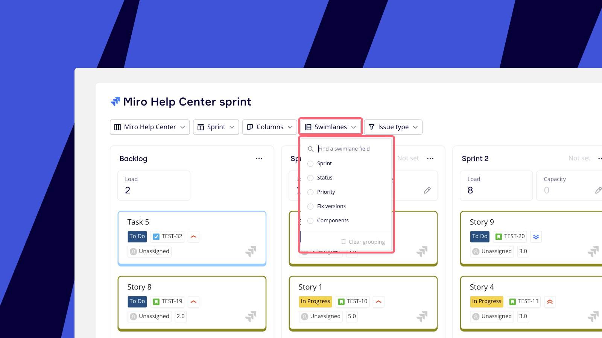
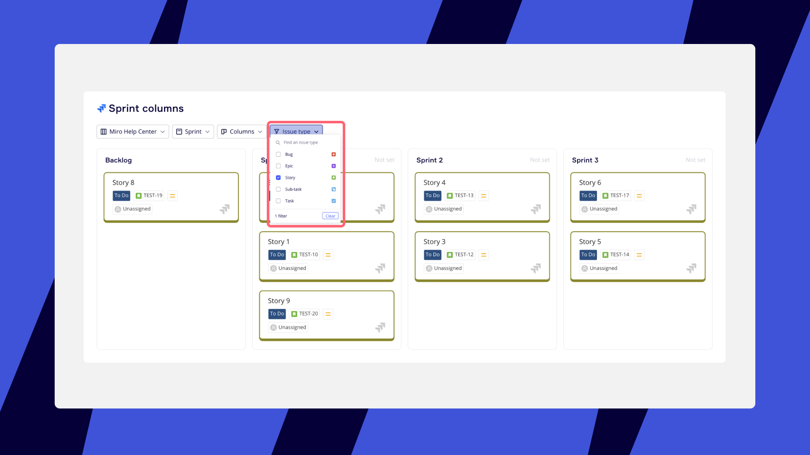
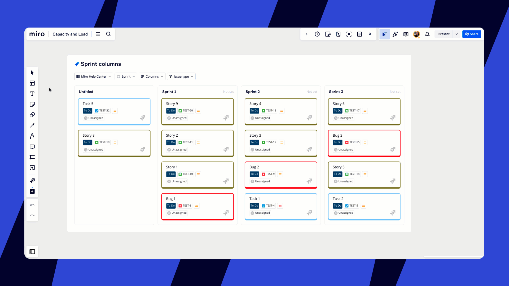
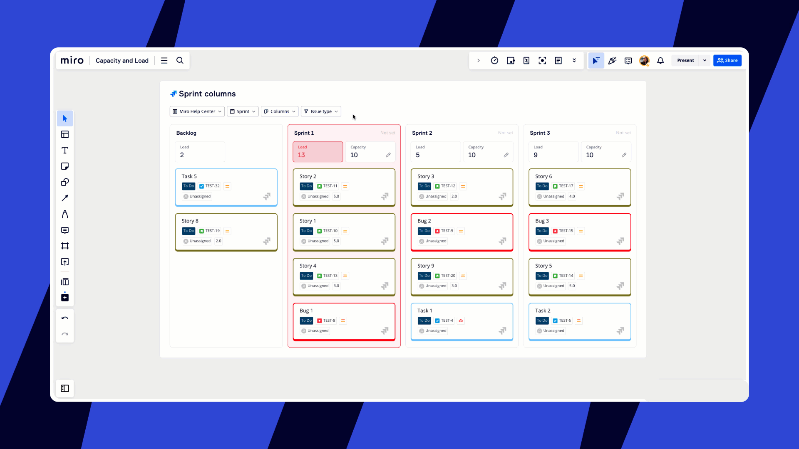
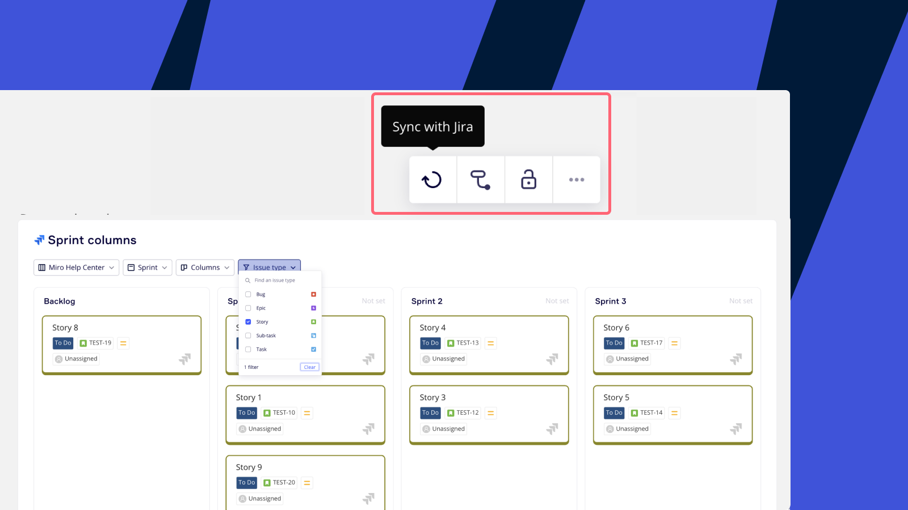

Avec le widget de planification pour Jira, les facilitateurs et les équipes peuvent exécuter et participer à des événements de planification sur un tableau Miro, tout en synchronisant les mises à jour avec leur tableau Jira en temps réel - ce qui permet d’économiser des heures de travail manuel.

> **Disponible pour :** les forfaits Business et Enterprise

Lors des évènements de planification de l’équipe et de l’entreprise, tels que les incréments de programme (PI), Big Room, Roadmapping et les sprints, les équipes de développement discutent et s’alignent les unes sur les autres.

:::tip
La planification est désormais disponible pour [Azure DevOps](https://help.miro.com/hc/articles/15280547945618).
:::

## Comment créer une planification pour Jira

- Rendez-vous dans la [barre d’outils de création](https://help.miro.com/hc/articles/360017730553-Toolbars) située sur le côté gauche de votre tableau.
- Cliquez sur **Plus d'applications** (**+**) et tapez ‘Planification’.
- Cliquez sur **Planification** pour lancer l'application.
- Un curseur va s’afficher sur le tableau. Cliquez n’importe où pour placer une planification vierge.
- Cliquez sur le menu déroulant **tableau Jira** et sélectionnez un tableau pour le connecter à la planification. Si vous n'avez pas encore autorisé votre compte Jira dans Miro, il vous sera demandé de vous connecter.
- Le premier champ **Colonnes** est votre *type de colonne*. Après avoir sélectionné le tableau Jira, le type de colonne par défaut sera **État**, et affichera jusqu'à 3 colonnes. Cliquez sur le premier champ **Colonnes** pour sélectionner un type de colonne différent dans le menu déroulant (vous pouvez choisir Sprint, État, Priorité, Versions de correction, Composants ou un champ personnalisé).
- Utilisez le deuxième champ **Colonnes** pour affiner votre Planification. Par exemple, si vous avez choisi 'Sprint' comme champ Colonne, vous pouvez alors sélectionner les sprints à afficher.
- Ajoutez des **couloirs** à votre planification, en plus des colonnes, pour organiser davantage les tâches par rapport à un deuxième champ Jira (vous pouvez choisir Sprint, État, Priorité, Versions de correction, Composants, ou un champ personnalisé).
:::note
Actuellement, le planificateur ne prend en charge qu'un seul tableau Jira. Cependant, vous pouvez créer plusieurs planifications sur un seul tableau Miro.
:::

*Créer un widget de planification*

## Comment travailler avec le widget de planification

Faites glisser les cartes Jira d’une colonne à l’autre pour les mettre à jour. Par exemple, si vous faites glisser une carte Jira du backlog vers un sprint dans la planification, elle sera mise à jour à la fois dans Miro et dans Jira.

*Déplacer des cartes Jira entre les sprints*

Choisissez un champ pour les **couloirs** afin de diviser votre travail en lignes ainsi qu’en colonnes. Le déplacement des cartes entre les couloirs mettra à jour à la fois le champ de la *colonne* et celui du *couloir* du ticket Jira.

*Choix d’un champ pour les couloirs*

Par défaut, la planification affiche tous les tickets dans votre backlog. Pour vous concentrer sur le sprint actuel, sélectionnez l'icône filtre en haut à droite, puis cochez **Sprint**. Ensuite, sélectionnez le filtre **Sprint** et activez **Filtrer par sprint actif**. Sélectionnez **Appliquer** pour appliquer votre filtre de sprint.

*Filtrer les tickets par sprint actif.*

Vous pouvez également utiliser le menu déroulant **Type de ticket** et sélectionner quels types de tickets afficher dans votre planification. Par exemple, vous pouvez filtrer par Story uniquement.

*Filtrer par type de ticket*

Les participants peuvent commenter les cartes Jira pour suivre les discussions et les notes en cours.

*Commenter une carte Jira dans le planificateur*

:::note
Les cartes Miro, les pense-bêtes et autres objets ne peuvent pas être placés dans une planification.
:::

## Capacité et charge

Prenez des décisions de priorisation éclairées pendant la planification de Sprint et le PI Planning en visualisant les totaux des story points dans des colonnes faciles à lire. Augmentez l’efficacité de votre équipe et assurez une répartition optimale du travail.

### Activer le champ Story points dans les cartes Jira

1. Accédez à la [barre d’outils de création](https://help.miro.com/hc/articles/360017730553-Toolbars#Creation_toolbar) sur le côté gauche de votre tableau.
2. Cliquez sur **Autres applications** (**+**) et recherchez 'Cartes Jira'.
3. Cliquez sur **Cartes Jira** pour lancer l’application.
4. Cliquez sur **Configurer les cartes**.
5. Faites défiler vers le bas et activez les **Story Points**.

*Activation des story points pour les cartes Jira*

### Utilisation de la capacité et de la charge

Une fois que vous avez activé les story points, vous pouvez créer une nouvelle planification ou actualiser un tableau avec une planification existante. Tant qu’au moins un ticket du tableau a des story points assignés, vous verrez instantanément les champs **Capacité** et **Charge** en haut de chaque colonne dans votre planification.

*Équilibrage de la capacité et de la charge*

### Compréhension de la capacité et de la charge

**Capacité** : Saisissez manuellement la capacité de chaque colonne dans votre planification. Si la capacité est inférieure à la charge, la colonne deviendra rouge, signalant que vous avez dépassé la capacité de votre équipe. Ce repère visuel vous invite à envisager de réaffecter les tickets pour maintenir une charge de travail équilibrée.

**Charge** : Cela représente la somme des story points de toutes les cartes d’une colonne donnée. Les cartes sans story points compteront pour 0 dans ce calcul.

## Configuration de Jira

Pour configurer la planification, commencez par choisir un tableau Jira à partir duquel vous souhaitez importer des tickets. Il peut s’agir d’un tableau Jira Scrum ou Kanban.

Lors de la création d'une planification, vous pouvez choisir le champ Jira à utiliser pour vos colonnes et lignes (couloirs), notamment :

- Sprints
- État
- Version du fix
- Composant
- Priorité
- Responsable
- Tout champ personnalisé avec une sélection déroulante à valeur unique
- Tout champ personnalisé avec une sélection déroulante multi-valeurs

Nous ne prenons pas en charge les autres champs Jira ou les champs de date pour le moment.

L'option Sprint n'apparaîtra que si le champ Sprint est disponible sur l’écran de modification du ticket dans Jira. Cela est généralement préconfiguré pour Jira Server/Data Center, mais souvent, Cloud nécessite que le champ sprint soit ajouté manuellement. En savoir plus sur [comment configurer les écrans des tickets](https://support.atlassian.com/jira-cloud-administration/docs/configure-issue-screens/).

:::note
Les sprints clôturés ne peuvent pas être affichés dans la planification.
:::

### Comment créer une planification à l’aide d’un JQL personnalisé

Pour créer une planification à l’aide d’un JQL personnalisé, commencez par créer un tableau Jira avec votre requête JQL. Une fois le tableau Jira créé, suivez les instructions ci-dessus pour créer une planification. Lorsque vous arrivez à l’étape 5, n’oubliez pas de choisir le tableau Jira que vous avez créé à l’aide de votre requête JQL personnalisée.

## Synchronisation de la planification

### De Miro vers Jira

Lorsque vous faites glisser une carte entre des champs personnalisés dans Miro, Jira est mis à jour automatiquement. Cela peut prendre quelques secondes.

### De Jira vers Miro

Si vous apportez des modifications à un sprint dans Jira, une **Mises à jour disponibles** notification apparaîtra dans le menu contextuel de la planification. Cela peut prendre quelques secondes après que vous ayez effectué les modifications dans Jira.

Cliquez sur la planification pour ouvrir le menu contextuel, puis cliquez sur l'icône **Synchroniser avec Jira** pour synchroniser les dernières modifications.

*Synchroniser les mises à jour de Jira vers Miro*

## Cartographie des dépendances

Les participants peuvent visualiser les dépendances entre les tâches sur la planification. Apprenez-en davantage sur les [dépendances pour Jira](https://help.miro.com/hc/articles/10649083010834).
