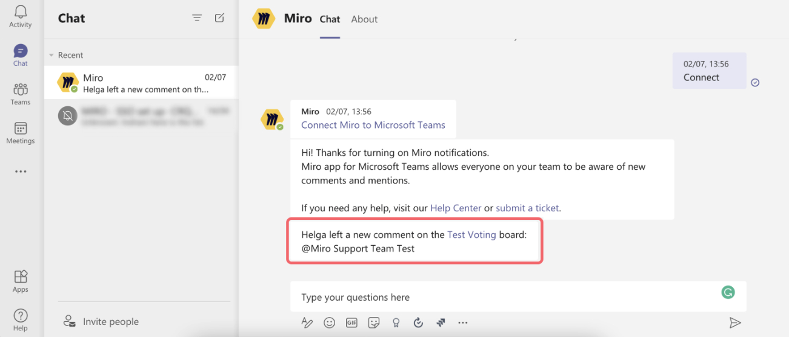
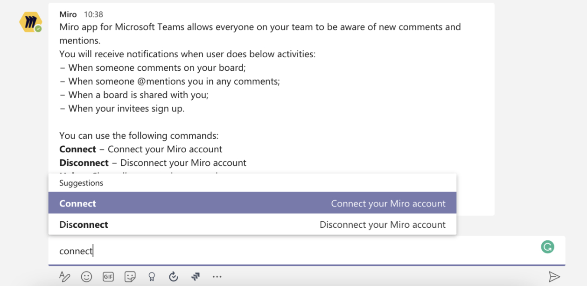
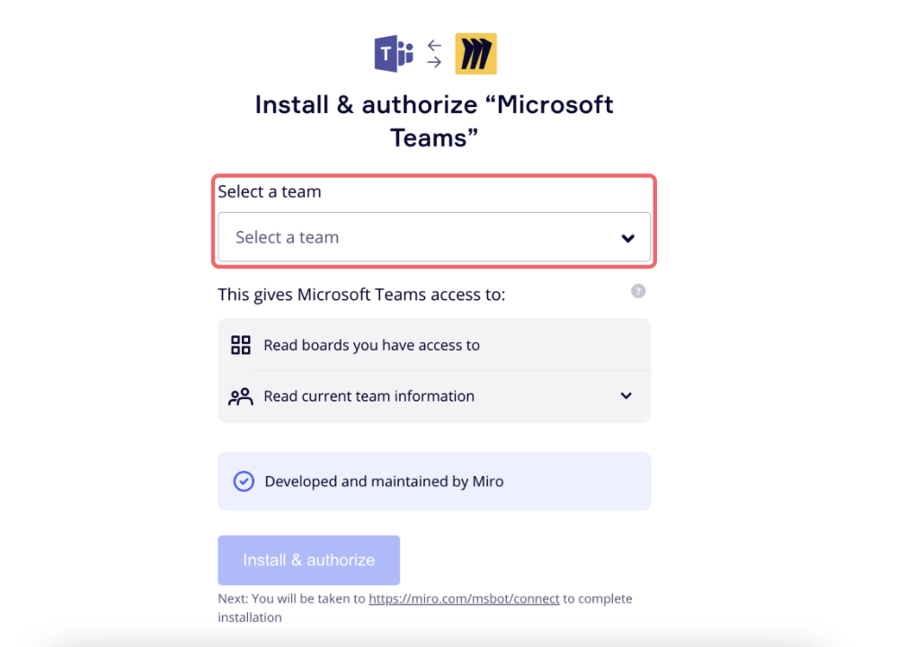

Recevez les notifications Miro sous forme de messages de chat au sein de Microsoft Teams (MS Teams). Restez informé, partagez des tableaux et gérez votre travail rapidement sans changer d'application.

*Notifications Miro dans les discussions Microsoft Teams*

Les notifications Miro vous permettent de suivre les événements suivants directement dans le chat MS Teams :

- Un tableau a été partagé avec vous.
- Un commentaire est posté sur un tableau
- Vous êtes mentionné dans un commentaire
- Vous recevez une demande d'accès au tableau, que vous pouvez approuver ou rejeter immédiatement
- Un invité s'inscrit

### Comment configurer les notifications Miro dans Microsoft Teams ?

#### Prérequis

Assurez-vous que l'option Miro pour Microsoft Teams est activée. Pour savoir comment procéder, consultez la [présentation de Miro pour Microsoft Teams](06-miro-for-microsoft-teams-overview.md).

#### Procédure

Pour ajouter des notifications Miro à Microsoft Teams, procédez comme suit :

1. Dans Microsoft Teams, ouvrez une discussion avec Miro.
2. Dans la barre de message, tapez "Connect".
   **Connexion de Miro à MS Teams**
3. Sélectionnez **Connecter votre compte Miro**.
   La modale **Installer et autoriser "Microsoft Teams"** s'ouvre dans un onglet séparé.
4. Sélectionnez l'équipe que vous souhaitez suivre.
   
   **Sélection d'une équipe Miro à suivre dans Microsoft Teams**
5. Sélectionnez **Installer et autoriser**.
   Dans votre discussion MS Teams avec Miro, un message d'accueil des notifications de Miro indique que l'installation est terminée.

   Vous avez configuré avec succès les notifications Miro dans MS Teams.
   > ✏️ Les notifications ne concernent que l'équipe Miro que vous avez sélectionnée. Pour suivre plusieurs équipes, vous pouvez répéter les instructions de configuration pour chaque équipe que vous souhaitez suivre.

### FAQ

**Pourquoi ai-je cessé de recevoir des notifications pour mon équipe ?**

Si vous aviez précédemment configuré les notifications Miro dans MS Teams, et que vous avez cessé de recevoir des notifications, répétez les instructions de configuration. Si le problème persiste, contactez le service d'assistance de Miro.

**Puis-je obtenir un résumé des modifications apportées à un tableau Miro ?**

Un résumé des modifications n'est actuellement pas disponible dans les notifications Miro dans MS Teams. Toutefois, cette fonctionnalité figure désormais dans notre backlog.
