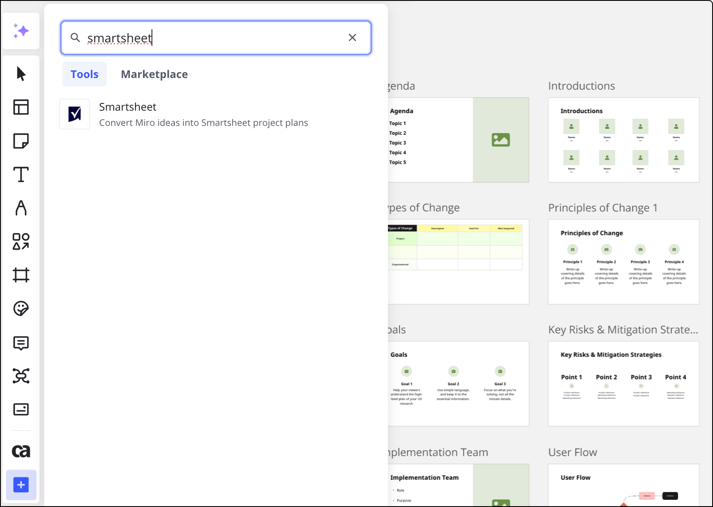

Fonctionnalités clés :

- Exporter des pense-bêtes de Miro vers des lignes dans une nouvelle feuille ou une feuille existante dans Smartsheet
- Importer des lignes depuis Smartsheet vers un tableau Miro sous forme de cartes
- Mettre à jour le travail à la fois dans Miro et dans Smartsheet avec la synchronisation bidirectionnelle

> Disponible pour : **tous les forfaits Miro
> **Disponible sur**: version navigateur sur desktop**

:::warning
Pour que l’application fonctionne dans Safari, désactivez l’option **Prevent cross-site tracking** (Prévenir le suivi intersite) dans les paramètres du navigateur.
:::

### Comment installer l’application

Vous pouvez installer l’application à partir du Miro Marketplace. Trouvez Smartsheet**pour Miro** et cliquez sur **Obtenir l'application.** Vous serez redirigé vers la page permettant de sélectionner l'équipe à laquelle vous souhaitez ajouter l'application Smartsheet. Choisissez l’équipe dans le sélecteur, puis cliquez sur Install & authorize (Installer et autoriser).

:::warning
Les utilisateurs qui ne sont pas dotés d’un rôle d’admin ne peuvent pas installer l’application s’ils ne sont pas autorisés à le faire dans les paramètres.
⚠️ Les admins d’entreprise du plan Enterprise devront peut-être approuver l’application dans les paramètres. /strong>/span> En savoir plus.
:::

installing_smartsheet_app.jpg
Sélection d’une équipe Miro pour installer l’application

Vous pouvez également installer **Smartsheet** à partir d'un tableau Miro :

1. Dans la barre de création, sélectionnez **Outils, médias et intégrations** **(+).**Le panneau **Outils, médias et intégrations** s'ouvre.
2. Dans l'onglet **Outils**, recherchez et sélectionnez Smartsheet.
   La fenêtre modale de **Smartsheet** s'ouvre et vous êtes prompt à autoriser les permissions.

/span>Installation de l’application à partir d’un tableau Miro

**Lorsque vous souhaitez connecter les comptes Miro et Smartsheet, connectez-vous à votre compte Smartsheet et autorisez l’accès à l’application.**

allow_access_to_Miro.jpg
**Autoriser l’application à accéder à votre compte Smartsheet**

### Comment exporter des pense-bêtes ou des cartes Miro vers des lignes dans Smartsheet

1. Ouvrez l’application Smartsheet dans la barre d’outils.  Si vous n’avez pas encore connecté votre compte Smartsheet, vous devrez d’abord le faire. Sélectionnez ensuite le pense-bête que vous souhaitez convertir.
2. Sélectionnez votre espace de travail Smartsheet, votre feuille (nouvelle ou existante) et la ligne où vous souhaitez que le contenu du pense-bête soit ajouté.  Vous pouvez également créer une nouvelle feuille et y exporter les pense-bêtes.
3. Sélectionnez enfin **Convert to Smartsheet row** (Convertir en ligne Smartsheet).  Le contenu sera maintenant exporté vers Smartsheet. Les pense-bêtes seront automatiquement converties en cartes Smartsheet.
   Notez que les cartes ne seront pas synchronisées avec Smartsheet à moins que vous n'importiez les lignes correspondantes de Smartsheet vers Miro (à venir). Voyez ci-dessous comment vous pouvez importer des données Smartsheet dans Miro.
   
   *Exportation de pense-bêtes de Miro vers Smartsheet*

### Comment importer des lignes de Smartsheet dans Miro

1. Ouvrez l'application Smartsheet dans Miro et modifiez l'onglet de **Convertir à partir de Miro** à **Choisir à partir de Smartsheet**.
2. Cliquez sur **Choose from Smartsheet** (Choisir depuis Smartsheet) et l’outil de sélection contenant vos feuilles existantes s’affichera. Vous pourrez filtrer les lignes en fonction d’un espace de travail spécifique et choisir une feuille.
3. Sélectionnez toutes les lignes que vous souhaitez importer en cochant les cases correspondantes et en sélectionnant **Import** (Importer).
4. Les lignes seront importées sous forme de cartes.
   import_from_smartsheet.gif
   *Importer des données de Smartsheet vers Miro*
5. Vous pouvez modifier les lignes directement dans Miro : sélectionnez une carte, cliquez sur l’icône développer, appliquez les modifications et cliquez sur **Save changes (Enregistrer les modifications)**.  Toute mise à jour des cartes sera répercutée dans Miro et Smartsheet.
   
   *Modifier une carte Smartsheet dans Miro*
