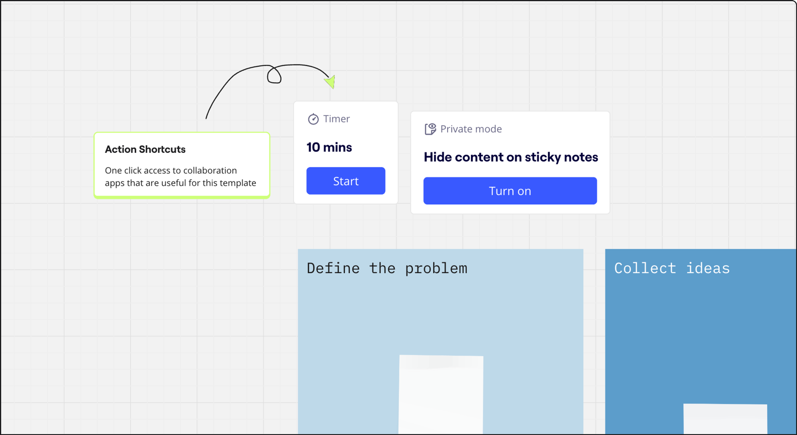
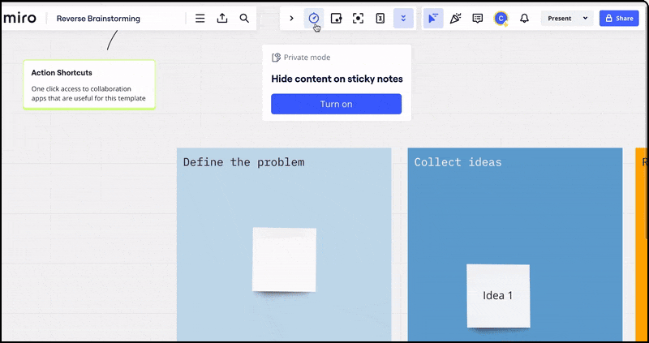

Les **raccourcis d'action** permettent aux utilisateurs de placer des actions prédéfinies sur un tableau afin que ces actions puissent être effectuées d'un simple clic au cours d'une réunion ou d'une présentation.

Les raccourcis d'action sont disponibles dans certains modèles utilisés par les facilitateurs pour des réunions telles que les rétrospectives, les réunions de planification, les sprints de conception, les révisions et les idéations ou brainstormings. Des raccourcis d'action sont disponibles pour déclencher instantanément 5 fonctions : démarrer un **minuteur**, activer le **mode privé**, afficher les **dépendances**, lancer des **estimations** et jouer un **Enregistrement.**

*Les raccourcis d'action permettent de déclencher certaines actions d'un simple clic.*

En plaçant ces raccourcis d'action sur des parties spécifiques de votre tableau, vous pouvez préparer le tableau à vos réunions afin qu'elles se déroulent plus facilement et qu'elles soient plus faciles à gérer. Il vous permet également de savoir quelles actions vous devez entreprendre à différents moments de votre réunion ou de votre présentation.

Vous pouvez également créer des raccourcis d'action directement depuis l'application dans vos propres tableaux. Pour ajouter la fonctionnalité, sélectionnez le type d'action que vous souhaitez ajouter, définissez les paramètres que l'action doit suivre, le cas échéant, et cliquez sur le bouton **Ajouter au tableau.**

*Créez vos propres raccourcis d'action pour faciliter les réunions.*
