Les notes visuelles de Miro sont un éditeur de texte avancé intégré à chacun de vos tableaux.  Travaillez avec du texte comme vous le feriez normalement dans n’importe quel éditeur de texte pour rédiger des notes faciles à lire.

### Collaboration dans les notes

Trouvez l'application **Note** dans le  menu**Outils, médias et intégrations** **(+**) de la barre d'outils Création, sur le côté gauche du tableau.

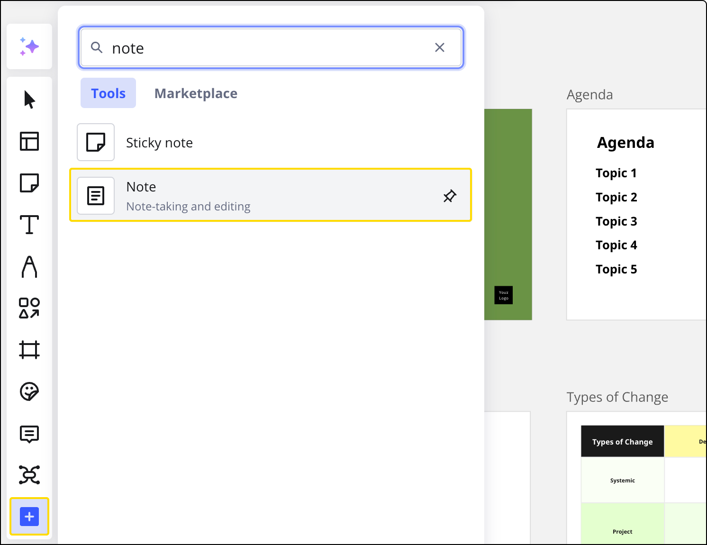
/span>L’accès aux notes

Vous pouvez facilement redimensionner le panneau Notes en faisant simplement glisser les trois points de la bordure de la section.

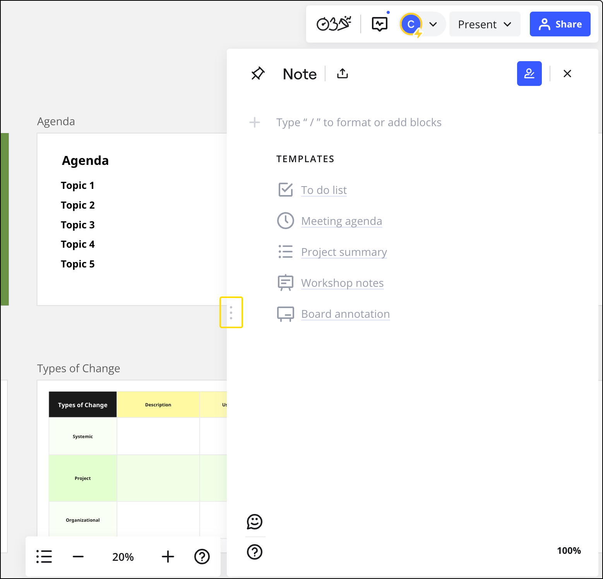
*Redimensionnement des notes*

Vous y trouverez des modèles prédéfinis tels qu’une *liste de tâches*, un *ordre du jour de réunion,* etc.  Cliquez sur un modèle pour l'ajouter à la note. Le modèle apparaîtra immédiatement dans les notes.

:::warning
Vous ne pouvez ajouter un modèle que lorsqu'il n'y a pas de contenu dans la section des notes.
:::

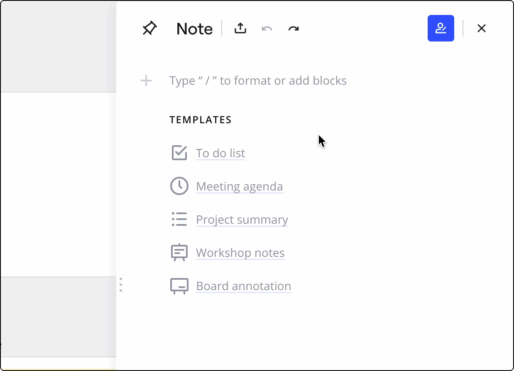*Ajouter un modèle*

Travaillez sur des notes avec votre équipe et voyez qui travaille sur quoi en temps réel, ce qui facilite la collaboration.  Tous les changements sont visibles en temps réel.

Cliquez sur l'icône **Afficher la paternité** pour afficher les initiales des créateurs de contenu afin de permettre aux autres contributeurs de déterminer plus facilement qui est responsable des modifications et des ajouts apportés à la note.

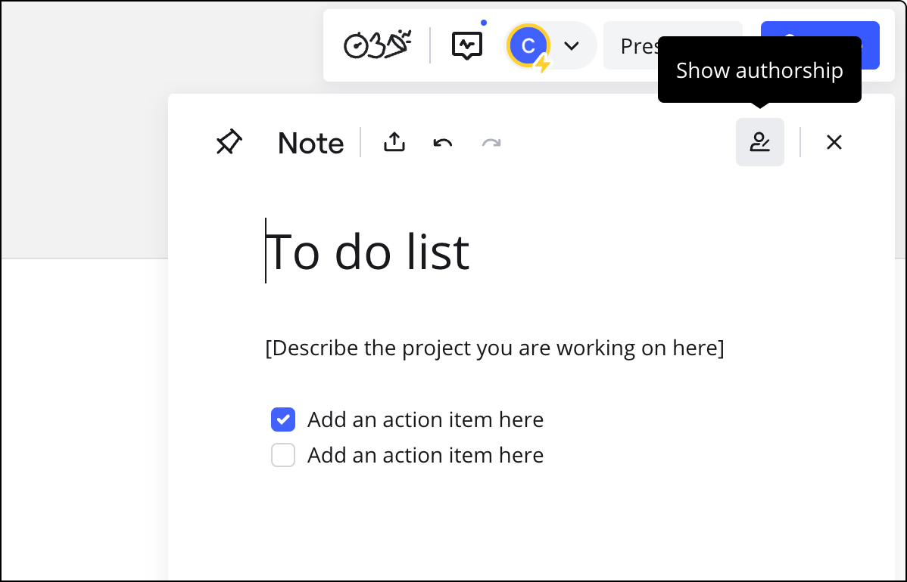
Activation du mode Show authorship (Afficher les auteurs) pour afficher les créateurs

Vous pouvez épingler les notes en cliquant sur l’icône **Pin** (Épingler) pour que la section reste ouverte aux yeux de tous les futurs visiteurs.  Ainsi, vos partenaires sauront que vous souhaitez qu’ils jettent un œil à la section des notes. N’importe quel éditeur peut désépingler les notes en cliquant simplement sur l’icône d’épingle :

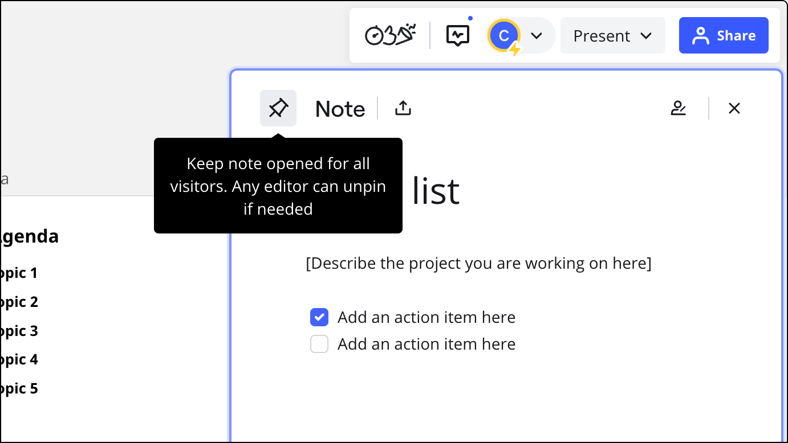
*Si une note est épinglée, les initiales de l'épingleur apparaissent sur l'icône.*

Vous pouvez facilement discuter de vos idées en laissant des commentaires directement dans les notes.  Taguez un ou une collègue dans la section des commentaires en utilisant les [@mentions](../facilitation-tools/01-@mentioning-people-on-the-board.md).

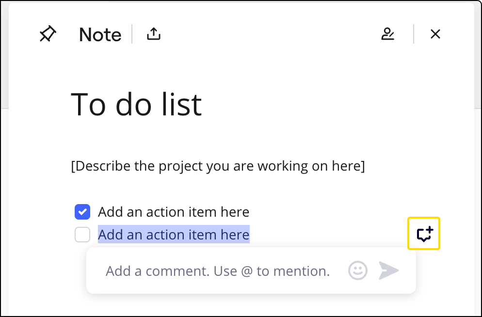
Cliquez sur l’icône de commentaire pour laisser/lire les commentaires

### Mise en forme

Dans les notes, vous pouvez travailler avec du texte comme vous le feriez normalement dans n’importe quel éditeur de texte pour rédiger des notes faciles à lire.  Cela permet au lecteur de repérer facilement les informations importantes du document, comme prévu. /span>

Mettez du texte en surbrillance pour afficher les options de mise en forme du texte :

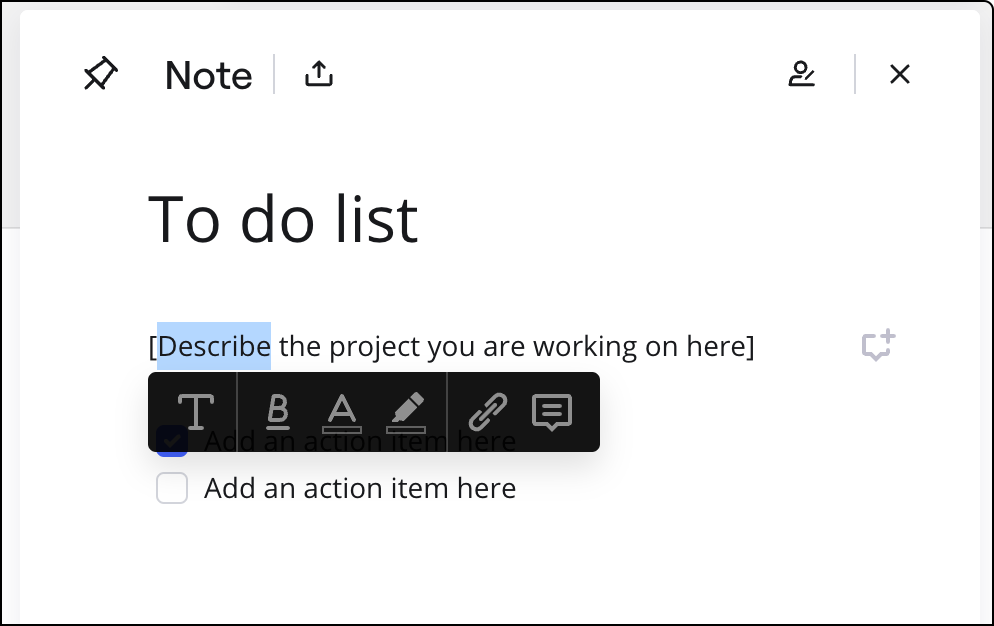
Choix de la mise en forme du texte

:::warning
Notez que la section des notes est soumise à **une limite de 200 000 symboles**.
:::

> Pour lier du texte dans les notes à un objet du tableau, [copiez le lien vers l’objet](../working-on-the-board/16-internal-and-external-linking.md), sélectionnez le texte dans les notes et liez-le.

### Contenu du tableau dans les notes

Intégrez des objets de votre tableau dans des notes pour faciliter la navigation et la contribution des autres membres de votre tableau.

Pour ajouter un objet du tableau à une note, sélectionnez le ou les objets et faites-les glisser vers les notes. Cette opération crée une copie du contenu du tableau dans la note.

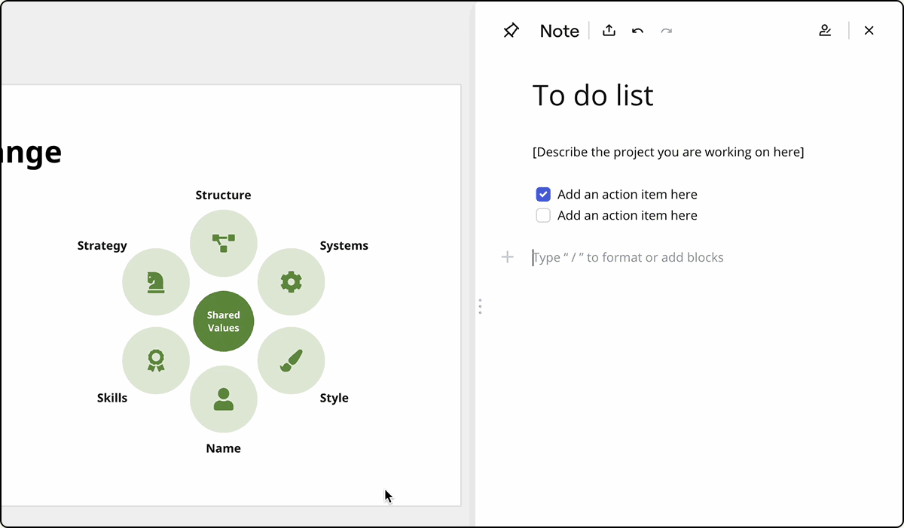
*et glissement d'objets du tableau dans les notes*

Vous pouvez facilement accéder au contenu du tableau à partir de sa copie dans les notes.  Pour ce faire, vous devez sélectionner le contenu et cliquer sur l’icône de flèche dans la fenêtre contextuelle :

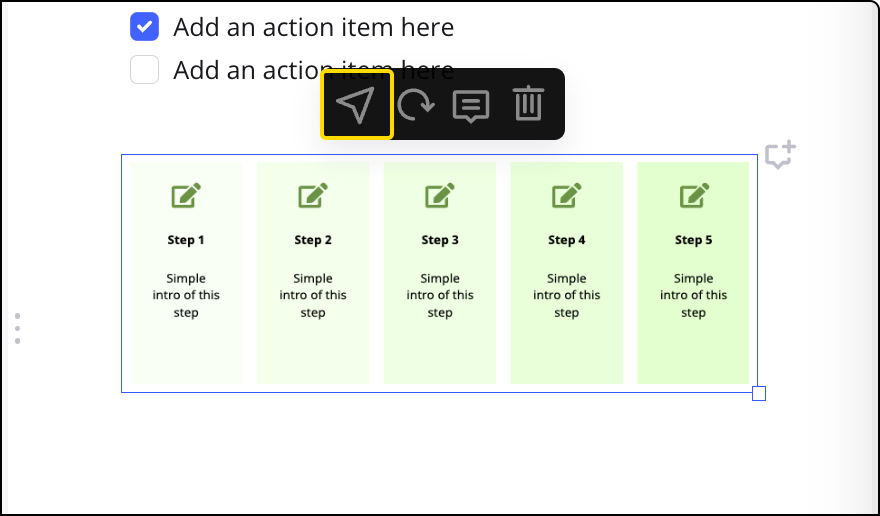
*Naviguer dans le tableau à partir du panneau des notes*

Si le contenu du tableau est mis à jour, vous pouvez actualiser manuellement la copie correspondante dans les notes.  Pour cela, vous devez mettre en surbrillance le contenu dans les notes et cliquer sur l’icône d’actualisation dans la fenêtre contextuelle des paramètres.

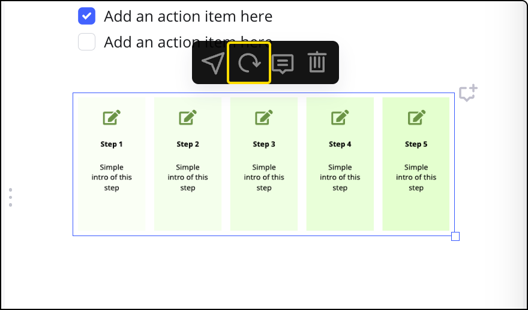
Mise à jour du contenu du tableau dans les notes

:::note
Si vous ajoutez un autre widget sur un élément qui était intégré dans les notes et que vous mettez à jour l’élément intégré, le nouveau widget n’apparaîtra pas dans les notes.  Veuillez supprimer l’élément intégré, sélectionner les deux widgets sur votre tableau et les ajouter aux notes.
:::

:::warning
Si l’élément copié dans les notes est supprimé, l’élément de tableau correspondant ne sera pas supprimé.
:::

### Exporter

Vous pouvez exporter vos notes visuelles au format PDF pour rendre votre contenu portable et ainsi travailler sur votre texte hors ligne.

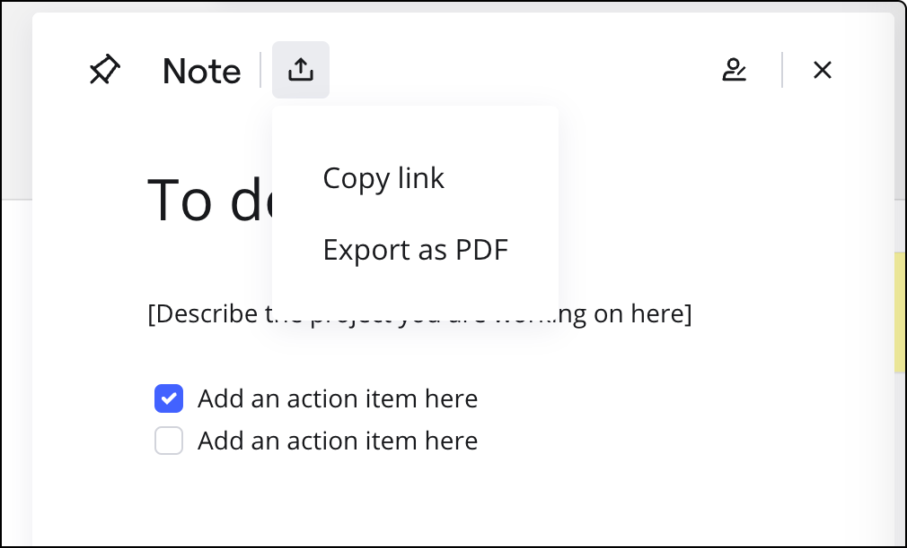
Possibilité d’exporter les notes en format PDF

### Notes sur les applications mobiles et tablettes

Les notes visuelles sont également disponibles dans l’[application mobile](../../getting-started/apps-for-devices/08-mobile-app.md) et [l’application pour tablette](../../getting-started/apps-for-devices/11-tablet-app.md) pour les utilisateurs Android et iOS. Pour utiliser cette fonctionnalité dans l’application mobile et l’application pour tablette Android et iOS, il convient d’utiliser la version **3.3.1** ou ultérieure de l’application Miro.

La fonctionnalité est presque la même que dans la version de bureau à quelques particularités près.

:::warning
Les notes occupent tout l’écran, vous travaillerez donc soit sur le tableau, soit sur les notes visuelles.
⚠️ Vous ne pouvez pas ajouter de contenu de tableau dans les notes. Les options d’actualisation, de navigation et de suppression sont toutefois disponibles.
⚠️ L’exportation de notes visuelles n’est pas possible dans l’application mobile.
:::

notes_on_mobile.jpg
Version des notes visuelles dans l’application mobile Android

## Foire aux questions

**Puis-je supprimer des tableaux de mon tableau ?**

Vous pouvez supprimer le contenu des notes. Si les notes sont ouvertes à chaque fois que vous chargez le tableau, vous pouvez les masquer en les désépinglant.

**Est-il possible de créer des notes à plusieurs listes ou à plusieurs sections ?**

Non, il s'agit d'une page par tableau.

**Puis-je ajouter le modèle de liste de contrôle à mon tableau ?**

Sur votre tableau, vous pouvez utiliser les cases à cocher de la [bibliothèque de wireframes](../miroverse/prototyping/02-prototyping-library.md).

**J’ai accidentellement supprimé du texte dans les notes.**  Que faire ?

Utilisez le bouton Annuler en haut des notes - il vous permettra d'annuler les actions de la *session de travail en cours*. Vous pouvez également utiliser le raccourci Ctrl + Z (**pour Windows**) ou *Cmd + Z* (**pour Mac**).
