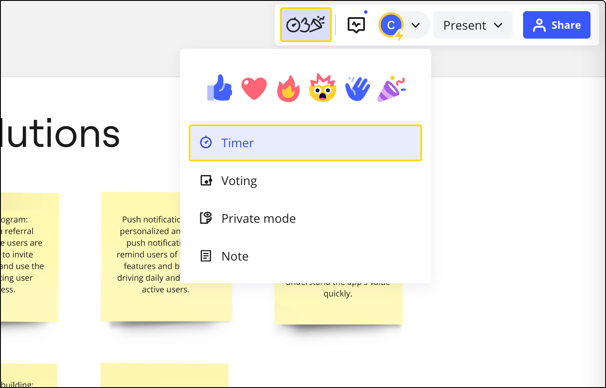
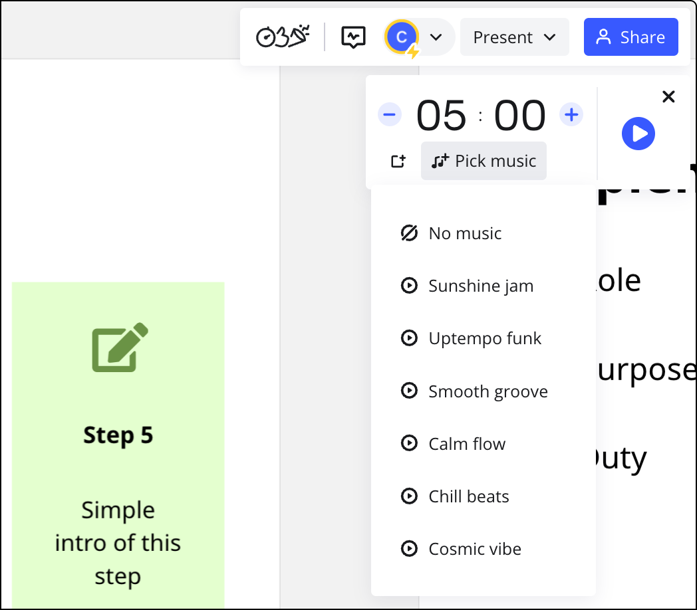
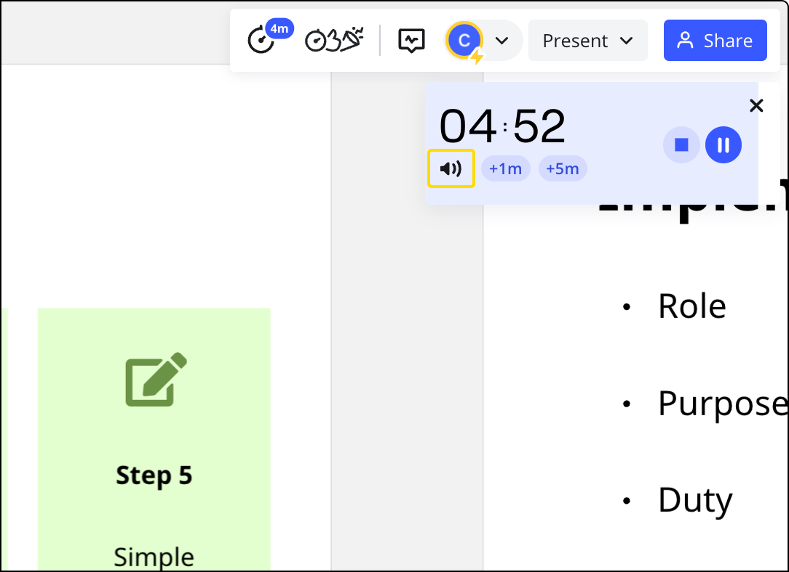

Le **minuteur** de Miro vous aide à gérer et à suivre votre temps tout au long de votre séance de tableau blanc en temps réel. Que vous soyez un membre d’une équipe, un chef de groupe ou que vous souhaitiez simplement gérer vos projets personnels et respecter les délais, notre minuterie augmentera votre productivité en prenant soin de votre ressource la plus précieuse.

> **Disponible pour :** les forfaits Starter, Business, Enterprise et Education
> **Mis en place par**: leséditeurs qui ont été explicitement invités au tableau [par e-mail](../sharing-boards/03-sharing-boards-and-inviting-collaborators.md) ou qui ont accès au tableau parce qu'ils font partie d'un [espace](../spaces/01-spaces.md) ou d'une [équipe de](../sharing-boards/03-sharing-boards-and-inviting-collaborators.md) Miro. Tous les utilisateurs enregistrés (lecteurs, commentateurs, éditeurs) et les [visiteurs non enregistrés disposant d’un accès d’édition](../sharing-boards/08-collaboration-with-visitors.md) peuvent voir le minuteur en cours sur le tableau.

### Utiliser le minuteur

Le minuteur se trouve dans la barre d'outils de collaboration, sous l'icône **Outils de facilitation et Réactions**, dans le coin supérieur droit du tableau.

*Bouton du minuteur dans la barre d'outils de la collaboration*

Cliquez sur le bouton du minuteur pour ouvrir le minuteur, définissez la période de temps en tapant le temps ou en utilisant les options **+** et **-**, et cliquez sur le bouton bleu de lecture pour démarrer.

Pendant le décompte du minuteur, vous avez la possibilité d’arrêter, de mettre en pause et d’ajouter du temps au minuteur. Cliquez sur les boutons **+1m** ou **+5m** pour ajouter du temps au compte à rebours.

Pour mettre le minuteur en pause, cliquez sur le bouton correspondant.

Pour arrêter le minuteur et réinitialiser le temps si nécessaire, cliquez sur le bouton d'arrêt.

Les options sont disponibles pour l'utilisateur qui a lancé le minuteur ainsi que pour les autreséditeurs du  tableauqui ont été explicitement invités au tableau [par e-mail](../sharing-boards/03-sharing-boards-and-inviting-collaborators.md) ou qui ont accès au tableau parce qu'ils font partie d'un [espace](../spaces/01-spaces.md) ou d'une [équipe](../sharing-boards/03-sharing-boards-and-inviting-collaborators.md) dans Miro.

Le minuteur démarre et s’arrête pour toutes les personnes présentes sur le tableau. Vous pouvez réduire le minuteur et l’icône de la barre d’outils indiquera toujours le temps restant.

Lorsque le temps est écoulé, tous les collaborateurs reçoivent une notification visuelle et sonore.

### Lecteur de musique intégré : lire de la musique directement à partir du minuteur

Lorsque vous configurez le minuteur, vous avez la possibilité de sélectionner de la musique libre de droits qui sera jouée tout au long du compte à rebours.

*Sélection de la musique à lire pendant le minuteur*

Vous pouvez également mettre la musique en sourdine.

*
La possibilité de mettre en sourdine la musique du minuteur*

## Foire aux questions

**L’icône du minuteur n’est pas présente dans la barre d’outils de collaboration. Pourquoi ?**

- Veuillez noter que le minuteur *ne peut pas* être mis en place par les [lecteurs](../sharing-boards/01-board-access-rights.md), les [commentateurs](../sharing-boards/01-board-access-rights.md) ou les [visiteurs](../sharing-boards/08-collaboration-with-visitors.md) et qu’il *n’est pas* disponible dans les [équipes gratuites](../../plans-billing/miro-plans/09-free-plan.md). Il se peut que vous deviez également [installer le minuteur de](https://miro.com/marketplace/) l’équipe où se trouve le tableau sur lequel vous travaillez ou demander à votre admin d’équipe de l’installer. Notez que le minuteur [peut être limité](../../enterprise-administration/managing-apps-on-enterprise-plan/02-app-management.md) sur le forfait Enterprise par les admins de votre entreprise.

**Puis-je voir le minuteur lorsque je suis en [mode présentation](https://help.miro.com/hc/articles/360017731073)?**

- Si vous passez en mode présentation *complète*, le minuteur apparaîtra dans le coin supérieur gauche de l’écran.

**Puis-je déplacer le minuteur à un autre endroit du tableau ?**

Non, ce n'est pas possible actuellement.
