Collaborez de manière asynchrone et de façon plus inclusive et efficace que jamais grâce à la fonctionnalité [Enregistrement de Miro](https://miro.com/talktrack/). Enregistrez un tutoriel audio ou vidéo immersif d’un tableau Miro et laissez les autres membres de votre équipe l’évaluer.

Vos collaborateurs pourront interagir avec les enregistrements d’un tableau en naviguant sur celui-ci.

<iframe allow="encrypted-media" allowfullscreen="" frameborder="0" src="//fast.wistia.com/embed/iframe/ixwer82pst" style="width: 100%; aspect-ratio: 16 / 9;"></iframe>

Que vous disposiez ou non d’un forfait Miro, et quel que soit votre type de forfait, vous pouvez regarder les enregistrements partagés avec vous.

> **Disponible pour : les forfaits Free, Starter, Education, Business et Enterprise**
> **Disponible sur :** Application de bureau, application de bureau
> **Navigateurs disponibles :** Google Chrome, Safari, Firefox et Edge

:::tip
Si vous êtes un admin d’entreprise sur Enterprise Plan, vous pouvez accorder l’accès à la fonctionnalité Enregistrement pour votre organisation dans vos paramètres d’[accès aux fonctionnalités](../../../enterprise-administration/managing-enterprise-teams-and-content/06-feature-activation.md). En savoir plus sur [la sécurité de l’administration de la fonctionnalité Enregistrement](../../../enterprise-administration/canvas-25-admin-features/data-security/08-talktrack-admin-security.md).
:::

## Bonnes pratiques

Consultez les conseils et astuces suivants avant de créer votre enregistrement :

- **S’abstenir de cliquer ou d’interagir avec les tableaux pendant l’enregistrement** (par exemple, cliquer pour lire une vidéo, cliquer pour ouvrir un document).
  Il ne s’agit pas d’un enregistrement d’écran, mais plutôt de l’enregistrement de vos mouvements sur l’ensemble du tableau. Vos interactions avec le tableau ne seront pas enregistrées.
- **Attention aux modifications importantes apportées au tableau après l’enregistrement.
  Lorsque le lecteur joue l’Enregistrement, il voit le contenu mis à jour sur le tableau. Cependant, ils pourront toujours accéder à la version originale de l’enregistrement.**
- **Pensez à verrouiller vos cadres**
  Surtout ceux que vous ne voulez pas voir modifiés. Ou du moins, rappelez à vos lecteurs de ne pas déplacer les objets qui ne doivent pas l’être.
- **Conseil d’expert : Réserver des cadres pour l’entrée**
  [Plutôt que de demander aux lecteurs d’ajouter des éléments par-dessus les écrans enregistrés, créez un cadre réservé à leur contribution. Cela réduira la confusion pour les autres lecteurs.](../../essential-tools/07-frames.md)
- **Soyez attentif à la durée de l’enregistrement
  Essayez de limiter la durée des enregistrements de tableau à 45 minutes ou moins pour optimiser les performances de visualisation et de chargement des tableaux.**

:::note
[Lorsque les utilisateurs dupliquent un tableau, les enregistrements seront aussi dupliqués vers le nouveau tableau.](../../managing-boards/03-how-to-duplicate-a-board.md)
:::

## Où puis-je utiliser la fonctionnalité Enregistrement ?

Voici quelques cas d’utilisation courants pour lesquels la fonctionnalité Enregistrement s’avère utile :

- Pré-lectures et récapitulatifs des réunions
- Mises à jour hebdomadaires de l’équipe
- Enregistrement des réunions auxquelles vous ne pouvez pas assister
- Formation des personnes à de nouveaux processus ou communication de nouvelles informations
- Instructions de préparation à un atelier ou à un cours
- Recueil de commentaires sur le contenu du tableau
- Partage d’un plan ou d’une feuille de route de projet

:::tip
Découvrez [comment l’équipe Miro utilise les enregistrements de tableaux](https://miro.com/blog/improve-collaboration-with-talktrack-videos/) pour améliorer les workflows.
:::

## Comment créer un enregistrement

> **Qui peut le faire**: les propriétaires du tableau, les copropriétaires, les éditeurs et les commentateurs

:::note
Avec les forfaits Free, les utilisateurs peuvent enregistrer jusqu’à cinq enregistrements chacun.
:::

Vous pouvez créer un enregistrement à partir de la barre d’outils de collaboration dans le coin supérieur droit du tableau.

1. Cliquez sur l'icône **Vidéo**, puis sur le bouton **Enregistrer.**
   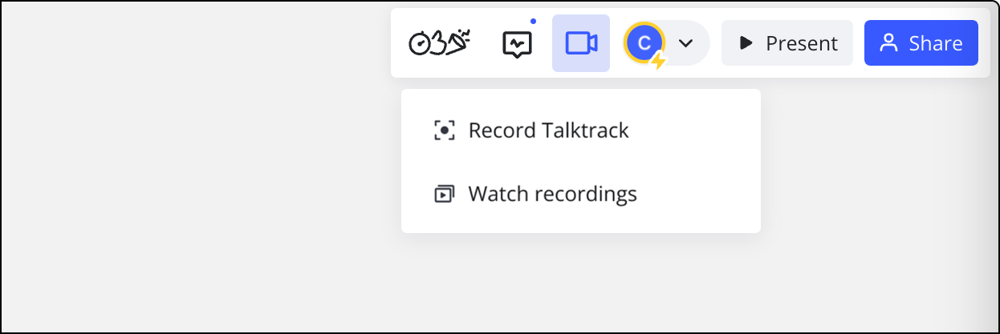
   *L'option d'enregistrement d'un Enregistrement se trouve dans la barre d'outils de collaboration*
2. Un panneau latéral avec des options d'enregistrement apparaît.
3. Votre caméra et votre micro seront activés par défaut. Vous pouvez désactiver la caméra ou le micro ou choisir une autre caméra et un autre micro.
4. Cliquez sur **Démarrer** l’enregistrement.

   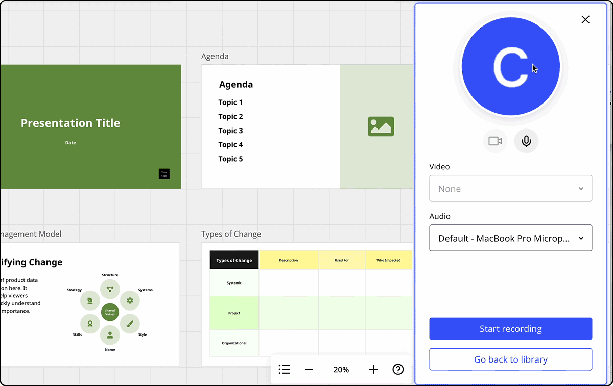
*un Enregistrement dans Miro*
5. Pendant l’enregistrement, vous verrez une barre d’outils dans le coin supérieur droit. Vous pouvez supprimer, redémarrer ou mettre en pause l’Enregistrement, ou cliquer sur **Arrêter** pour terminer l’enregistrement.

   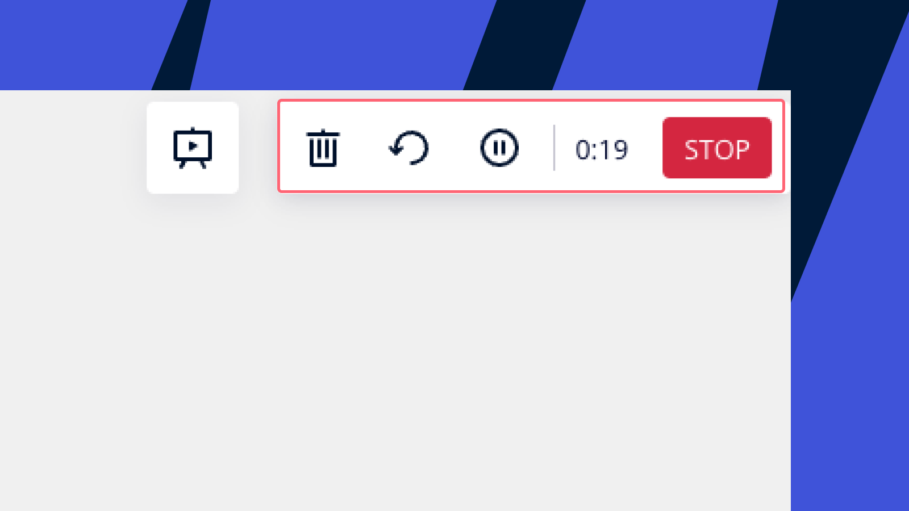
*Barre d’outils de la fonctionnalité Enregistrement*
6. Une fois l’enregistrement terminé, l’Enregistrement apparait dans le panneau de droite et un raccourci est automatiquement ajouté au tableau. Les utilisateurs peuvent cliquer sur le bouton **Lire** d’un raccourci d’enregistrement pour commencer à le regarder immédiatement. Repositionnez les raccourcis de l’Enregistrement en cliquant dessus et en les faisant glisser.

   Vous pouvez également ajouter manuellement un raccourci d’Enregistrement au tableau ultérieurement. Il suffit d’ouvrir le panneau Enregistrement, de cliquer sur le menu à trois points (**...**) situé à côté de l’Enregistrement et de sélectionner **Ajouter au tableau.**

   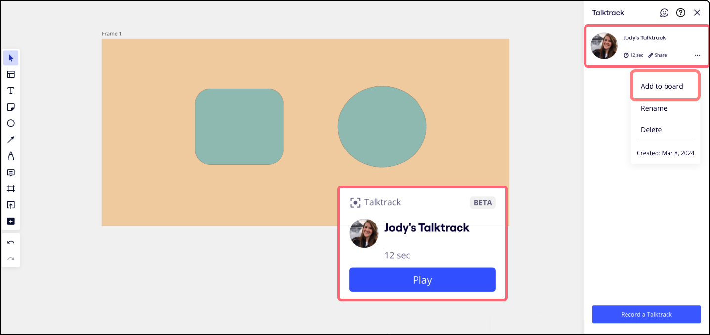
*Enregistrement dans le panneau latéral et son raccourci sur le tableau*
7. Vous pouvez renommer l’Enregistrement en cliquant sur les trois points (...) et en sélectionnant **Renommer.**
8. **Copiez le lien** vers l’enregistrement et envoyez-le à vos collaborateurs. Dès qu’ils suivront le lien, le tableau s’ouvrira et la lecture de l’enregistrement sera lancée automatiquement.
9. Les propriétaires de tableaux peuvent également faire glisser et déposer les enregistrements pour réorganiser l’ordre des enregistrements dans le tableau.

   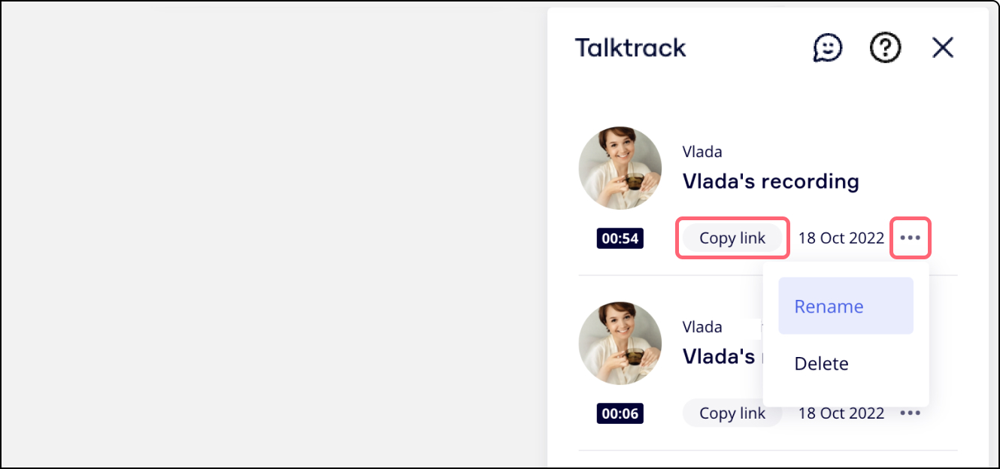
*Options pour copier le lien, renommer et supprimer l’enregistrement*

## Analytique des personnes ayant consulté l’enregistrement

Découvrez qui a regardé votre enregistrement. Cliquez sur le bouton **Regarder les enregistrements** sous l'icône **Vidéo** de la barre d'outils Collaboration, naviguez jusqu'à l'enregistrement et cliquez sur l'icône de l'œil pour voir la liste des lecteurs.

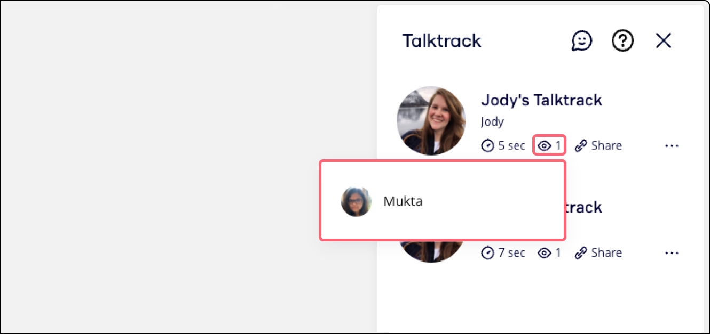
*liste des lecteurs qui ont regardé un Enregistrement*

## Lire l’enregistrement

> **Disponible sur :** navigateur de bureau, application de bureau, application mobile.

Toute personne (y compris les utilisateurs non enregistrés) ayant accès au tableau peut consulter les enregistrements du tableau.

Il existe deux façons de lire un enregistrement :

1. En suivant le lien direct vers un Enregistrement.
2. En cliquant sur l'icône **Vidéo** dans la barre d'outils de collaboration. Cliquez ensuite sur le bouton **Regarder les enregistrements.**  Si de nouveaux enregistrements ont été effectués depuis votre dernière visite du tableau, l’icône sera surmontée d’un point bleu. Tout collaborateur d’un tableau peut copier les liens vers les enregistrements.

:::tip
[Vous pouvez regarder les enregistrements de vos créateurs préférés dans le](../../miroverse/01-what-is-miroverse.md) Miroverse.
:::

### Commandes de lecture

L’expérience de lecture est interactive : lors de la lecture, vous suivez le point de vue de l’enregistreur, mais vous pouvez également effectuer un panoramique sur le tableau et procéder à des modifications.

Pour revenir à la vue de la personne ayant effectué l’enregistrement, cliquez sur **Revenir à [prénom de l’utilisateur]** en bas de l’écran.

Les lecteurs peuvent avancer ou reculer de 10 secondes lorsqu’ils regardent un Enregistrement. Et lorsque plusieurs Enregistrements sont disponibles, vous pouvez simplement cliquer sur **Next dans le menu du lecteur pour regarder l’Enregistrement suivant. Pour regarder l’Enregistrement plus rapidement ou plus lentement, sélectionnez différentes vitesses de lecture dans le mode de lecture de la barre d’outils. Les lecteurs peuvent également activer le sous-titrage codé à partir des paramètres de lecture.**

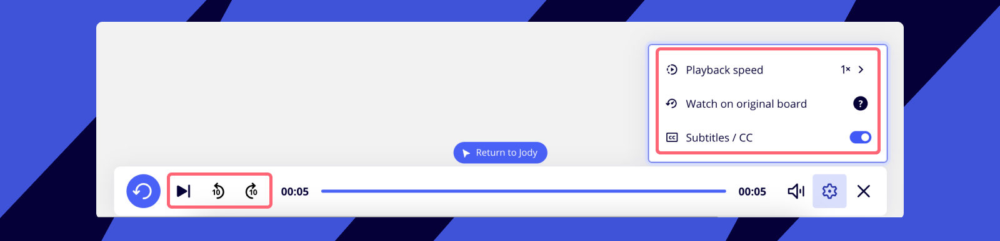

#### Réactions à l’Enregistrement

Les lecteurs peuvent instantanément donner leur avis sur des moments précis d’un Enregistrement en utilisant des émojis. Dans la barre d’outils de lecture, il suffit de cliquer sur un émoji pour réagir directement sur le Planning de l’enregistrement. Les réactions à l’Enregistrement mettent visuellement en évidence les moments importants ou remarquables de l’Enregistrement, pour une expérience de visualisation collaborative.

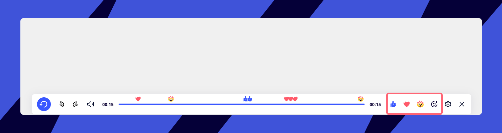

## Lire la version originale d’un enregistrement

:::warning
Tout contenu qui se trouvait sur le tableau au moment de l’enregistrement sera toujours visible par les lecteurs via cette fonctionnalité, même si vous l’avez supprimé entre temps.
:::

Il arrive que le contenu d’un tableau soit déplacé, modifié ou supprimé après la réalisation d’un enregistrement.

Pour consulter un enregistrement avec le contenu original du tableau :

1. Commencez la lecture d’un enregistrement
2. **Dans le panneau de commandes de lecture, cliquez sur l’icône Paramètres de lecture.**
3. Cliquez sur **Regarder sur le tableau d’origine**.
4. Une fenêtre contextuelle s’affiche avec la version originale de l’enregistrement. Vous pouvez lire l’enregistrement au sein de la fenêtre contextuelle et vous déplacer sur le tableau, mais vous ne pouvez pas en modifier le contenu.

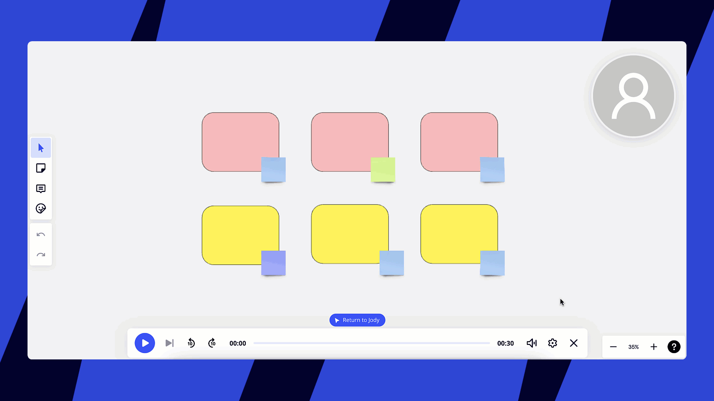
*Lecture de la version d’origine d’un enregistrement*

## Lire un enregistrement pendant une présentation

Vous pouvez lire un enregistrement précédemment effectué enmode de présentation interactif. Même si un présentateur ne peut pas se rendre à la réunion, il peut toujours présenter des idées à l’équipe de façon asynchrone.

1. En mode présentation, rendez-vous dans la barre d’outils du présentateur en bas de votre écran.
2. Cliquez surMinuteur, vote et outils.
3. Sélectionnez **Enregistrement**.
4. Le panneau de la fonctionnalité Enregistrement s’affiche.

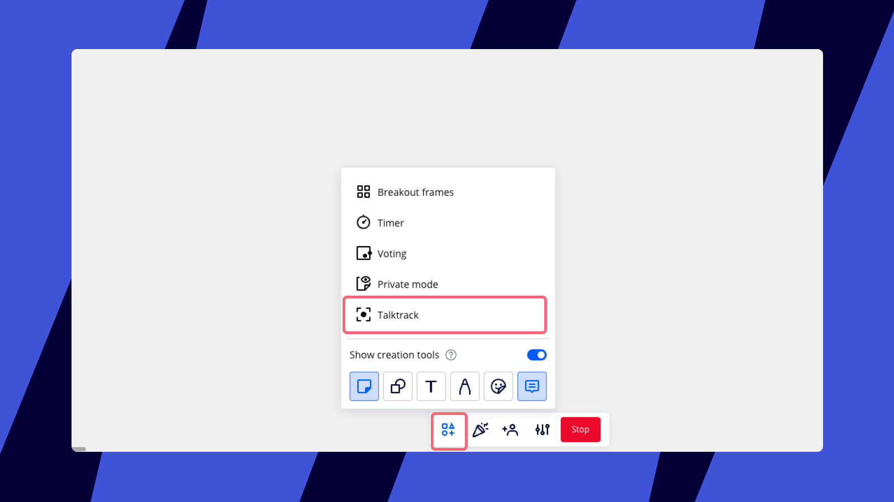
*Lecture d’un enregistrement pendant une présentation*

## Ajouter un Enregistrement dans Coda, Notion et Productboard

Intégrez vos enregistrements directement dans Coda, Notion et Productboard pour améliorer le travail collaboratif et le flux des présentations. Les lecteurs peuvent directement regarder et interagir avec l’Enregistrement sans quitter la plateforme, ce qui simplifie l’expérience de partage et de visionnage.

**Copiez le lien Enregistrement dans Miro :**

1. Ouvrez le tableau où se trouve votre Enregistrement.
2. Cliquez sur le bouton **Enregistrement** sous **Présent** dans la [barre d'outils de collaboration](../../../getting-started/start-here/your-first-board/05-toolbars.md).
3. Le panneau Enregistrement s’ouvre sur le côté droit de votre tableau.
4. Dans le tableau de bord, localisez l’Enregistrement que vous souhaitez partager.
5. Cliquez sur l’option **Partager** à côté de l’Enregistrement.
6. Le lien de l’Enregistrement sera copié dans votre presse-papier.

**Collez le lien sur la plateforme de votre choix :**

1. Ouvrez la page Coda, Notion ou Productboard où vous souhaitez ajouter l’Enregistrement.
2. Trouvez un champ de texte dans lequel vous souhaitez insérer l’Enregistrement.
3. Collez le lien d’Enregistrement copié directement dans le champ de texte.
4. En fonction de la plateforme (Coda, Notion ou Productboard), plusieurs options peuvent apparaitre après avoir collé le lien. Sélectionnez l’option permettant d’**intégrer le** contenu.
5. Une fois intégré, l’Enregistrement apparait en mode lecture, ce qui permet aux lecteurs de le lire directement à partir du tableau Miro intégré à la page.

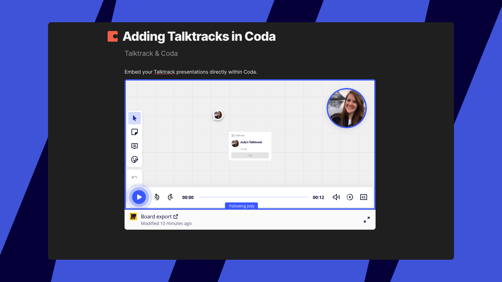
*Enregistrement intégré dans Coda*

## Foire aux questions

**Les enregistrements ont-ils une date d’expiration ?**

Non, les enregistrements sont disponibles indéfiniment, sauf s’ils sont supprimés. Seuls les propriétaires du tableau ou la personne qui a effectué l’enregistrement peuvent les supprimer.

**Un tableau peut-il contenir les enregistrements de plusieurs utilisateurs ?**

Oui, plusieurs éditeurs de tableau peuvent ajouter des enregistrements à un tableau Miro.

**Qui peut créer et/ou consulter un enregistrement ?**

Les éditeurs et les commentateurs d’un tableau peuvent créer un enregistrement et supprimer/renommer leurs propres enregistrements. Les propriétaires et les copropriétaires du tableau peuvent non seulement créer un enregistrement, mais ils peuvent également supprimer/renommer ceux créés par toute personne sur le tableau. Toute personne (y compris les utilisateurs non enregistrés) ayant accès au tableau peut consulter les enregistrements du tableau.

**La fonctionnalité Enregistrements est-elle compatible avec le mode présentation ?**

Oui. Une fois l’enregistrement démarré, un bouton de mode présentation apparaitra en haut pour que vous puissiez vous enregistrer pendant que vous présentez vos diapositives. En savoir plus sur le [mode de présentation interactive](../09-interactive-presentation-mode.md).

**La fonctionnalité Enregistrement est-elle disponible sur les appareils mobiles ?**

Les appareils mobiles ne sont actuellement pas pris en charge, mais nous pourrions donner la priorité à la mise en œuvre de la fonctionnalité Enregistrement sur ces plateformes si suffisamment d’utilisateurs manifestent leur intérêt.

**L’ensemble de mon écran est-il enregistré ?**

Seule la vue du tableau de Miro (le canevas) est enregistrée, sans les panneaux latéraux ni les outils. La fonctionnalité Enregistrement ne capture que la vidéo et les mouvements sur le canevas Miro de la personne qui enregistre. Elle ne capture pas les interactions de cette personne avec le tableau (par exemple, l’ouverture d’un document ou l’ajout d’un pense-bête).
