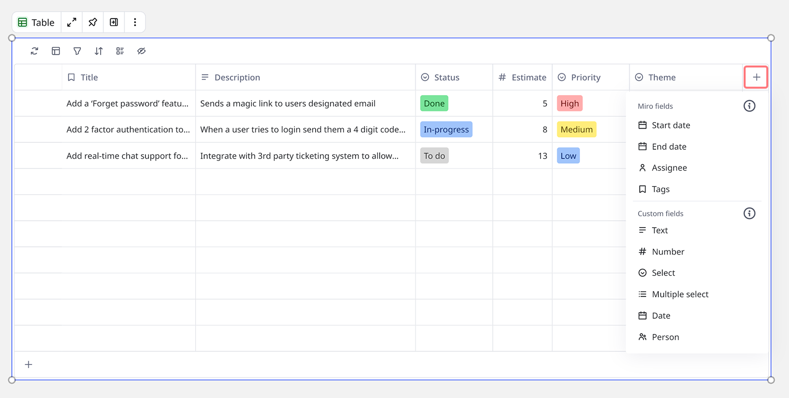
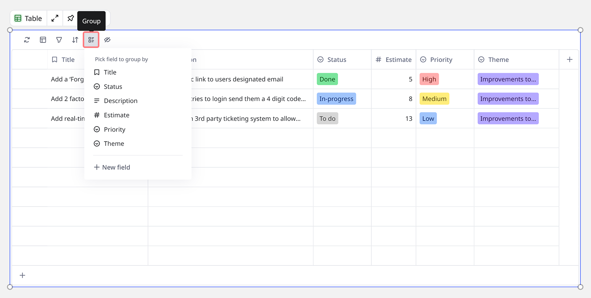

Les tables sont un outil interactif qui vous permet de structurer votre contenu sur Miro, en transformant les idées en plans réalisables.

> ***Disponible sur :** Tous les appareils*
> ***Disponible pour :** Tous les forfaits Miro*
> ***Qui peut le faire :** Propriétaires de tableaux et éditeurs*

## Fonctionnalités clés

Les tables comprennent les éléments clés suivants :

- **Créer des champs personnalisés**
  Organisez et structurez vos informations à l'aide de champs personnalisés.
- **Créer des entrées à partir des cartes Miro**
  Faites glisser et déposez les cartes Miro dans le widget Tables pour créer de nouvelles entrées.
- **Créer des entrées à partir de pense-bêtes**
  Voir Ajouter une carte Miro ou un pense-bête à une table.
- **Créer des entrées synchronisées à partir des cartes Jira**
  Voir Ajouter une carte Jira à une table.
- **Capacités avancées de filtrage et de tri**
  Filtrez et triez les tables pour organiser et prioriser les entrées.
- **Groupes des entrées**
  Organisez les entrées d’une table par champ afin de regrouper les informations de manière logique.
- **Créer des tables synchronisées sur plusieurs tableaux**
  Copier et coller une table pour créer une vue synchronisée des mêmes entrées
- **Vue Planning**
  Passez à une vue Planning pour voir vos données dans une nouvelle disposition.
- **Calculs de colonne**
  Calculez des agrégats comme la somme, la moyenne, et plus encore pour des champs numériques afin d’analyser vos données en un coup d’œil.
- **Formatage visuel des nombres**
  Formatez les chiffres en barres de progression avec affichage en pourcentage ou en devise, et utilisez des règles de formatage conditionnel pour mettre en évidence les valeurs répondant à des critères spécifiques. Voir [Nombres visuels dans les tables](04-visual-numbers-in-tables.md).
- **Dépendances**
  Cartographiez et visualisez les dépendances entre les entrées à l’aide des champs « bloqué par » et « bloqueur » parmi les projets.
- **Actions de groupe**
  Effectuez des actions comme modifier, déplacer, dupliquer et supprimer sur plusieurs entrées à la fois, ou faites glisser plusieurs entrées vers le canevas sous forme de cartes.

## Ajouter une table à votre tableau

:::warning
Les éditeurs invités n'ont pas la possibilité d'ajouter ou de modifier des tables.
:::

1. Ouvrez un tableau Miro.
2. Cliquez sur l'icône **Outils, médias et intégrations** (**+**) dans la barre d’outils de création.
   Le panneau Outils, médias et intégrations s’ouvre.
3. Recherchez et sélectionnez **Table**.
   Votre curseur apparait maintenant sous la forme de l’icône Table.
4. Cliquez n’importe où sur le tableau Miro pour placer votre widget Table.

## Convertir un fichier Excel en table

1. Ouvrez un tableau Miro.
2. Cliquez sur l’icône **Outils, médias et intégrations** (**+**) dans la barre d’outils de création.
   Le panneau Outils, médias et intégrations s’ouvre.
3. Recherchez et sélectionnez **Charger**.
   Le panneau Charger s’ouvre.
4. Sélectionnez **Mon appareil**.
5. Accédez au fichier Excel (.xlsx) que vous souhaitez charger et sélectionnez-le.
6. Une fenêtre modale s’ouvrira avec les options suivantes :
   1. Convertir en table.
   2. Convertir en grille.
   3. Ajouter en tant que fichier.
7. Sélectionnez **Convertir en table** et choisissez si vous souhaitez **Utiliser la première ligne comme en-têtes**.
8. Cliquez sur **Sélectionner**.
9. Une table sera créée sur le tableau avec les données du fichier Excel.

:::warning
Lors du chargement d’un fichier Excel, il y a une limite de 500 lignes et 30 colonnes.
:::

## Copier et coller des tables

Vous avez essentiellement deux options pour copier et coller des tables, soit au sein d'un tableau, soit entre tableaux. La première option consiste à créer une table synchronisée qui affichera les mises à jour dans chaque emplacement. La deuxième option consiste à créer une table non synchronisée, qui fonctionne comme un modèle.

1. Sélectionnez la table que vous souhaitez copier.
2. Cliquez sur le menu contextuel () et sélectionnez Copier. Vous pouvez également utiliser le raccourci clavier Ctrl + C (sous Windows) ou Commande + C (sous Mac).
3. Naviguez jusqu’à l’endroit du tableau où vous souhaitez coller votre table.
4. Cliquez avec le bouton droit de la souris et sélectionnez Coller. Vous pouvez également utiliser le raccourci clavier Ctrl + V (sous Windows) ou Commande + V (sous Mac).
   Une fenêtre contextuelle s'ouvre.
5. Choisissez si vous souhaitez créer une table synchronisée ou une nouvelle table dans la fenêtre contextuelle.

## Gestion des autorisations pour les tables

Si vous créez une ou plusieurs vues synchronisées d’une table dans les tableaux Miro, vous devrez gérer les autorisations pour vous assurer que lorsque vous ajoutez une vue synchronisée d’une table à un nouveau tableau, vous pouvez voir et gérer les personnes qui ont le droit de consulter et de modifier cette table. Les autorisations relatives aux vues synchronisées des tables sont gérées par le tableau d’origine, c’est-à-dire le tableau sur lequel la table d’origine a été créée.

Lorsque vous collez une table sur un nouveau tableau en tant que vue synchronisée, une fenêtre contextuelle s’affiche si tous les utilisateurs du tableau n’ont pas les droits de consultation ou de modification pour la table. Si vous souhaitez voir ou modifier les autorisations pour cette table, vous serez redirigé vers le tableau d’origine qui contient la table pour y apporter des modifications.

Si l'utilisateur d'un tableau n’a pas accès au tableau d’origine où la table source a été créée, la table apparaîtra dans un état de non-accès pour lui. Si l’utilisateur a uniquement le droit de consulter le tableau d’origine, il pourra voir la table sur le nouveau tableau, mais il ne pourra modifier aucune entrée ni changer de vue en appliquant des filtres, des tris, des groupes, etc.

## Interagir avec les tables

Le widget Table vous permet de créer le contenu que vous souhaitez et de le structurer et de l’organiser de la manière la plus efficace possible pour votre cas d’utilisation.

Lors de la création d'une nouvelle table sur votre tableau Miro, un ensemble de champs par défaut sont fournis, qui correspondent aux champs existants dans les cartes Miro. Vous pouvez supprimer, modifier ou masquer ces champs ou en créer de nouveaux.

### Créer un champ

Procédez comme suit pour créer un nouveau champ :

1. Cliquez sur l’icône + en haut de la colonne de droite de la table.
   Un menu s’ouvre.
   
   *Ajout d’un nouveau champ à une table*
2. Cliquez sur le type de champ que vous souhaitez créer dans le menu. Il existe des options pour les champs Miro et les types de champs personnalisés.
   Une boîte de dialogue d’options s’ouvre.
3. Saisissez les informations relatives au champ (nom du champ et, dans le cas du champ Sélectionner, les options de la liste déroulante) dans la boîte de dialogue et cliquez sur Enregistrer.

:::note
Le type de champ Lien est uniquement disponible pour les forfaits Business et Enterprise.
:::

### Modifier un nom de champ ou des options

1. Survolez le nom du champ.
   Une icône représentant trois points (...) apparaît.
2. Cliquez sur l’icône **trois points** (**...**).
   Un menu s’ouvre.
3. Cliquez sur **Modifier le champ**.
   Une boîte de dialogue s’ouvre avec des options d’édition.
4. Modifiez le nom du champ et/ou les options et cliquez sur **Enregistrer**.

### Supprimer un champ

1. Survolez le nom du champ.
   Une icône représentant trois points (...) apparaît.
2. Cliquez sur l’icône **trois points** (**...**).
   Un menu s’ouvre.
3. Cliquez sur Supprimer.

:::warning
Un champ supprimé ne peut pas être annulé. Il sera immédiatement supprimé de la table actuelle et de toutes les versions synchronisées.
:::

### Masquer ou afficher un champ

Procédez comme suit pour masquer ou démasquer un champ unique :

1. Survolez le nom du champ.
   Une icône représentant trois points (...) apparaîtra.
2. Cliquez sur l’**icône des trois points** (**...**).
   Un menu s’ouvrira.
3. Cliquez sur **Masquer le champ**.
   Le champ sera masqué.
4. Pour démasquer le champ, répétez les mêmes étapes ci-dessus mais cliquez sur **Afficher le champ**.

Vous pouvez également masquer ou afficher plusieurs champs à la fois.

Procédez comme suit pour masquer ou démasquer plusieurs champs :

1. Cliquez sur l’icône **Masquer** en haut de la table.
   Une liste des champs de la table s’affiche.
2. Sélectionnez dans la liste les champs que vous souhaitez masquer ou réafficher.

### Modifier une entrée

1. Double-cliquez sur l’entrée que vous souhaitez modifier.
   L’entrée devient modifiable.
2. Modifiez l’entrée et appuyez sur Entrée.

Pour appliquer un formatage ou ajouter un lien à du texte au sein d’une entrée :

1. Double-cliquez sur l’entrée que vous souhaitez modifier.
   L’entrée devient modifiable.
2. Sélectionnez le texte que vous souhaitez mettre en forme.
   Un menu contextuel s’affiche.
3. Appliquez le formatage ou ajoutez un lien au texte depuis le menu contextuel ou en utilisant les [raccourcis clavier](../working-on-the-board/06-shortcuts-and-hotkeys.md).
4. Appuyez sur Entrée pour enregistrer l’entrée.

Le formatage de texte peut également être appliqué dans le volet latéral lors de la modification d’une entrée.

### Modification en masse de plusieurs entrées

1. Survolez la ligne pour faire apparaître la case à cocher sur la gauche.
2. Sélectionnez les entrées à modifier en utilisant les cases à cocher sur chaque ligne concernée.
   Une barre d’outils apparaîtra avec des options pour la modification.
3. Modifiez, déplacez ou dupliquez ces entrées simultanément dans la barre d’outils.

### Supprimer une entrée

1. Survolez l’entrée que vous souhaitez supprimer.
2. Cliquez sur l’icône à six points pour ouvrir le menu.
3. Sélectionnez **Supprimer**.

### Supprimer plusieurs entrées

1. Survolez la ligne pour faire apparaître la case à cocher sur la gauche.
2. Sélectionnez les entrées à modifier en utilisant les cases à cocher sur chaque ligne concernée.
   Une barre d’outils apparaîtra avec des options pour la modification.
3. Cliquez sur l’icône **Supprimer** dans la barre d’outils pour supprimer toutes les entrées sélectionnées.

### Ajouter des commentaires aux tables

Facilitez la collaboration en ajoutant des commentaires directement sur les parties d’une table que vous souhaitez discuter.

1. Survolez la ligne à laquelle vous souhaitez ajouter un commentaire.
   Une icône Ajouter un commentaire apparaitra à droite de la première cellule.
2. Cliquez sur l’icône **Ajouter un commentaire**.
   Un panneau latéral s’ouvrira à gauche.
3. Dans le panneau, ajoutez votre commentaire et appuyez sur Entrée.

Une fois que de nouveaux commentaires ont été ajoutés, un compteur de commentaires apparaitra à côté de l’icône Ajouter un commentaire pour chaque ligne. Cliquez sur l’icône pour ouvrir le panneau de commentaires.

Depuis le panneau de commentaires, vous pouvez :

- Répondre aux commentaires.
- Ajouter des réactions aux commentaires.
- Résoudre un fil de commentaires.
- Copier un lien vers le commentaire.
- Suivre le fil de commentaires pour recevoir des notifications.
- Supprimer le fil de commentaires.
- Modifier un commentaire que vous avez inséré.

### Ajouter une carte Miro ou un pense-bête à une table

Vous pouvez créer des entrées dans une table à l’aide de cartes Miro ou de pense-bêtes.

1. Sélectionnez la carte ou le pense-bête que vous souhaitez copier dans la table.
2. Faites glisser et déposez la carte ou le pense-bête sur la table.
   Une ligne bleue apparaît à l’emplacement de la nouvelle entrée.
3. Une nouvelle entrée est créée, le contenu de la carte étant affecté aux champs appropriés.
   Dans le cas d’un pense-bête, le contenu s’affichera dans le premier champ.

### Ajouter une carte Jira à une table

Vous pouvez faire glisser et déposer des cartes Jira dans une table pour créer des entrées synchronisées avec Jira. Cela signifie que vous pouvez combiner le travail de Miro et de Jira dans une vue Planning ou Table pour gérer et suivre le travail de l’équipe en un seul endroit.

1. Trouvez la carte Jira pertinente sur le canevas.
2. Faites glisser la carte sur la table.
3. Déposez la carte sur la ligne cible dans la table.

Toutes les modifications effectuées dans Miro seront répercutées dans Jira et vice versa. Les champs suivants dans la table seront synchronisés avec Jira :

- Titre
- Description
- Estimation
- Date de début
- Date de fin
- Responsable (bêta)
- État (bêta)

Tous les autres champs de la table ne sont stockés que dans Miro et ne sont pas synchronisés avec Jira.

**Plus d'informations :** Voir [FAQ sur les cartes Jira](../../integrations-apps/atlassian/17-jira-cards-faq.md).

### Travailler avec plusieurs cartes Jira

Lors de la modification en masse des enregistrements synchronisés avec Jira, seules les actions et les champs pris en charge par l’intégration Jira sont disponibles. Les actions non prises en charge seront masquées ou désactivées dans le menu des actions groupées.

### Filtrer une table

Vous pouvez filtrer le contenu d’une table par un ou plusieurs champs afin de restreindre la vue ou les entrées avec lesquelles vous souhaitez travailler.

1. Cliquez sur l’**icône Filtre** en haut de la table.
   Une boîte de dialogue s’ouvre.
2. Sélectionnez si vous souhaitez **Ajouter un filtre** ou **Ajouter un groupe de filtres**.
   Une boîte de dialogue s’ouvre.
3. Spécifiez les paramètres du filtre : le champ sur lequel filtrer, la logique du filtre et le contenu spécifique pour le filtre.
   La table est filtrée en temps réel.
4. Cliquez n’importe où en dehors de la boîte de dialogue du filtre pour la fermer.

### Trier une table

1. Survolez le nom du champ.
   Une icône représentant trois points (...) apparaîtra.
2. Cliquez sur l’**icône des trois points** (**...**).
   Un menu s’ouvre.
3. Cliquez sur **Trier par ordre croissant** ou **Trier par ordre décroissant**.

Pour supprimer le tri d’une table :

1. Cliquez sur l’**icône de tri** en haut de la table.
   Une boîte de dialogue s’ouvre.
2. Cliquez sur **Supprimer le tri**.

### Rechercher dans une table

1. Cliquez sur l'icône **Rechercher** dans la barre d’outils en haut de la table.
2. Tapez votre requête de recherche.
3. Les résultats pertinents apparaîtront au fur et à mesure que vous tapez.
4. Vous pouvez naviguer parmi les résultats à l’aide des icônes fléchées dans la barre de recherche ou en faisant défiler la table.
5. Cliquez sur l'icône **Effacer** (**X**) pour revenir à la table complète.

### Regrouper les entrées par champ

1. Cliquez sur l’icône de **groupe** en haut de la table.
   Un menu s’ouvre.
   
   *Regrouper les entrées dans une table*
2. Sélectionnez le champ sur lequel vous souhaitez regrouper les entrées.
   Les entrées de la table seront regroupées en fonction du champ choisi.

:::note
Lorsque vous faites glisser une entrée dans un groupe existant, la valeur du champ concerné sera mise à jour pour correspondre à ce groupe.
:::

Pour supprimer le regroupement d’une table, procédez comme suit :

1. Cliquez sur l'icône de **groupe** en haut de la table.
   Un menu s’ouvre.
2. Cliquez sur **Effacer le regroupement**.

### Cartes synchronisées

Vous pouvez faire glisser et déposer des entrées de la table sur votre canevas pour créer une carte synchronisée.

1. Survolez l’entrée à partir de laquelle vous souhaitez créer une carte synchronisée.
   Des icônes apparaissent sur le côté gauche de l’entrée.
2. Cliquez sur l’icône des points et maintenez-la enfoncée, puis faites-la glisser sur le canevas.
   Une carte est créée avec les informations de cette entrée.
3. La carte sera mise à jour chaque fois que l’entrée de la table sera mise à jour, et vice versa.

Vous pouvez savoir si une carte est synchronisée avec une table grâce à l’icône de base de données qui apparait en bas à droite de la carte.

Si vous supprimez une entrée, la carte synchronisée correspondante restera sur le tableau mais apparaîtra désormais vierge.

Si vous supprimez une carte synchronisée sur le canevas, l’entrée restera dans la table.

Si vous faites glisser une carte synchronisée existante dans la table d’où elle provient, elle ne fonctionnera pas, car elle est traitée comme une entrée unique dans cette table. Cependant, vous pouvez faire glisser une carte synchronisée existante dans une nouvelle table et elle apparaîtra dans la table comme une nouvelle entrée non synchronisée.

### Visualiser une table sous forme de planning

Procédez comme suit pour passer à la vue Planning :

1. Cliquez sur l'icône **Table** en haut de la table.
   Une boîte de dialogue s'ouvre.
2. Sélectionnez **Vue Planning** (ou revenez à la **Vue Table**).

Lorsque vous passez à une vue Planning, la date de début et la date de fin par défaut, lorsqu'elles sont renseignées, sont utilisées pour représenter les entrées de votre table sous forme de barres correspondantes dans votre planning. Les champs Titre et Assigné sont utilisés pour afficher le nom de l'entrée et la personne assignée sur la barre.

**Plus d'informations :** [Planning](15-timeline.md)

## Calculs des colonnes

> **Quels forfaits :** Business, Enterprise

Les calculs de colonne vous permettent d’effectuer des fonctions d’agrégation sur les champs numériques de votre table, vous aidant ainsi à analyser et à résumer vos données. Vous pouvez calculer la somme, la moyenne, le nombre, la valeur minimale, la valeur maximale et la médiane pour toute colonne numérique.

1. Ouvrez le menu des options de champ en cliquant sur l’en-tête de colonne contenant des données.
2. Sélectionnez **Afficher le calcul de la colonne** dans le menu.
3. Choisissez le type de calcul que vous souhaitez appliquer :
   1. Somme : Additionne toutes les valeurs de la colonne
   2. Moyenne : Calcule la moyenne de toutes les valeurs
   3. Nombre : Compte le nombre d’entrées
   4. Min. : Affiche la plus petite valeur
   5. Max. : Affiche la plus grande valeur
   6. Médiane : Affiche la valeur médiane
4. Le résultat du calcul apparaîtra dans une ligne de bas de page en bas de la table.

Pour supprimer un calcul de colonne :

1. Cliquez sur l’option **Calculer** dans la ligne de pied de page.
2. Sélectionnez **Aucun**.
3. Répétez jusqu’à ce que le dernier calcul soit défini sur Aucun.

:::note
Vous pouvez appliquer un calcul par colonne. Lorsque vous filtrez ou groupez votre table, les calculs se mettent à jour automatiquement pour refléter uniquement les enregistrements visibles. Dans les vues groupées, les calculs apparaissent pour chaque groupe ainsi qu’un total général.
:::

Les calculs de colonne fonctionnent harmonieusement avec le formatage visuel des nombres. Lorsque vous appliquez un formatage visuel à une colonne calculée, le résultat s’affiche sous forme de barre de progression selon vos règles de formatage. Voir [Nombres visuels dans les tables](04-visual-numbers-in-tables.md).

## Formules multi-colonnes

> **Quels forfaits :** Business, Enterprise

En plus des calculs par colonne, vous pouvez créer des champs pour des formules sur plusieurs colonnes. Les champs de formule calculent à travers plusieurs colonnes de la même ligne.

Pour créer un champ de formule :

1. Cliquez sur l'icône **+** pour ajouter un nouveau champ.
2. Sélectionnez le type **Formule**.
3. Utilisez le créateur de formules visuel pour sélectionner des champs, des constantes et des opérateurs (+, -, ×, ÷, (,)).
4. Votre formule est automatiquement calculée pour chaque ligne.

:::note
Les champs de formule prennent actuellement en charge les champs numériques et les constantes.
:::

## Relations (Dépendances)

> **Quels forfaits :** Business, Enterprise

Ce type de champ de relation vous permet de cartographier les dépendances entre les entrées dans votre table à l’aide des champs "bloqué par" et "bloque". Cela vous aide à suivre les relations de projet et à comprendre comment les éléments de travail dépendent les uns des autres.

### Créer des champs de dépendance

1. Cliquez sur l’icône **+** pour ajouter un nouveau champ.
2. Choisissez entre :
   1. **Bloqué par** - Pour indiquer quelles entrées doivent être terminées avant celui-ci.
   2. **Bloquant** - Pour indiquer quelles entrées attendent celui-ci.
3. Nommer votre champ et cliquez sur Créer.

### Ajouter des dépendances entre les entrées

Une fois les champs de dépendance créés, vous pouvez lier des entrées en suivant ces étapes :

1. Cliquez sur une cellule dans la colonne **Bloqué par** ou **Bloquant**.
2. Sélectionnez l’entrée (ou les entrées) que vous souhaitez lier dans le menu déroulant.
3. Cliquez à l’extérieur de la cellule pour enregistrer.

:::note
Les entrées peuvent avoir plusieurs relations de blocage et de bloqué par. Les dépendances se synchronisent entre toutes les tables synchronisées, garantissant la cohérence à travers vos vues et tableaux Miro.
:::

:::warning
**Limites actuelles (bêta) :**

- Les dépendances ne sont pas encore prises en charge pour les entrées synchronisées avec Jira ou d’autres intégrations tierces
- Les indicateurs visuels pour les dépendances ne sont pas encore affichés sur les cartes synchronisées
- Les ajustements automatiques de date basés sur les dépendances ne sont pas encore disponibles
:::

## Relations (Imbrication) (bêta)

> **Quels forfaits :** Business, Enterprise

Le type de champ relation d’imbrication vous permet de créer une hiérarchie entre les entrées de votre table en utilisant **Parent** et **Enfant** champs.

### Créer des champs hiérarchiques

1. Cliquez sur l’icône **+** pour ajouter un nouveau champ.
2. Choisissez entre :
   1. **Parent** : Utilisez ce champ pour lier une entrée à un élément de niveau supérieur (p. ex. une fonctionnalité liée à un epic).
   2. **Enfant** : Utilisez ce champ pour lier une entrée à des éléments de niveau inférieur (p. ex. une initiative avec des sous-tâches).
3. Nommez votre champ et cliquez sur **Créer**.

### Lier les entrées parent et enfant

1. Cliquez sur une cellule dans la colonne **Parent** ou **Enfant**.
2. Sélectionnez l’entrée (ou les entrées) que vous souhaitez lier dans le menu déroulant.
3. Cliquez à l’extérieur de la cellule pour enregistrer.

### Visualisez votre hiérarchie

1. Cliquez sur l’icône **Paramètres d’affichage** dans l’en-tête des tables.
2. Activez **Imbrication**.

Utilisez le **chevron** à côté des entrées Parent pour afficher ou masquer les entrées Enfant.

:::note
*Imbrication et hiérarchie sont masquées par défaut. Vous devrez les activer dans ces paramètres.*
:::

### Autres moyens de créer une hiérarchie

1. Cliquez sur **Ajouter une sous-entrée** via le **menu à 6 points** à gauche de chaque ligne.
2. L’imbrication s’activera par défaut.

   > ✏️ Les champs Parent et Enfant seront créés, mais masqués. Pour les afficher, allez dans le menu Masquer les champs de l’en-tête de la table.

   > ✏️ Pour désactiver l’imbrication, rendez-vous dans Paramètres d’affichage dans l’en-tête de la table.
3. Vous pouvez gérer les hiérarchies via les champs Parent et Enfant.
4. Lorsque l’imbrication est activée, vous pouvez également glisser-déposer pour créer des hiérarchies.

:::warning
*Si vous supprimez une entrée parente, toutes les entrées enfants de cette entrée seront également supprimées. Utilisez la fonction Annuler pour revenir en arrière si nécessaire.*
:::

Si les champs Parent et Enfant ne sont pas masqués, ils seront visibles dans le panneau latéral. Vous pouvez passer à la vue Planning et voir votre portefeuille se développer au fil du temps.

:::warning
***Limites actuelles (bêta) :***

- *Limite maximale de quatre niveaux pour la hiérarchie.*
- *L’imbrication n’est pas encore prise en charge pour les entrées synchronisées avec Jira ou d’autres intégrations tierces.*
- *Les indicateurs visuels pour l’imbrication ne sont pas encore affichés sur les cartes synchronisées.*
:::

## Mode immersif

Vous pouvez modifier et consulter votre table en mode immersif (plein écran). Cliquez simplement sur l’**icône de la flèche diagonale** en haut du widget. Les paramètres tels que le Filtre, le Tri, le Groupe et Masquer les champs sont situés en haut à droite.

Pour revenir au canevas, cliquez sur **Aller au canevas** en haut.

## Limites du widget de données structurées

Chaque tableau Miro a une limite maximale de 250 widgets de données structurées, ce qui inclut le total combiné de tables, Plannings et cartes synchronisées. Chaque table est limitée à 1 000 lignes et 50 colonnes. Si la limite de lignes est atteinte, vous verrez un message empêchant l’ajout de lignes supplémentaires.

Pour des performances optimales, nous recommandons de garder les tables en deçà de 200 lignes lorsqu’elles contiennent de nombreuses colonnes, car des opérations comme le groupement, le tri et le filtrage peuvent ralentir au-delà de ce point. Ces limites aident à garantir des performances optimales et la fiabilité de vos tableaux Miro.

### Que se passe-t-il lorsque vous atteignez la limite de widgets de données?

Lorsqu’un tableau atteint ou dépasse la limite de 250 widgets de données structurées, vous pouvez rencontrer :

- Un message d’erreur lors de la tentative d’ajout de nouveaux widgets de données structurées.
- Un chargement incohérent des widgets de données existants.
- D’éventuels problèmes lors de la sauvegarde des modifications.
- Des ralentissements de performance.

### Conseils pour gérer les limites de widgets de données

Si vous vous rapprochez ou avez dépassé la limite de widgets de données structurées, essayez de :

**Distribuer les widgets sur plusieurs tableaux :**

- Grouper le contenu lié sur des tableaux séparés.
- Utiliser des noms de tableau pertinents pour une navigation facile.
- Créer un tableau « maître » avec des liens vers tous les tableaux associés.

**Consolider des données similaires :**

- Fusionner des tables avec des structures similaires.
- Utilisez les filtres au lieu de créer des tables distinctes pour différentes vues.
