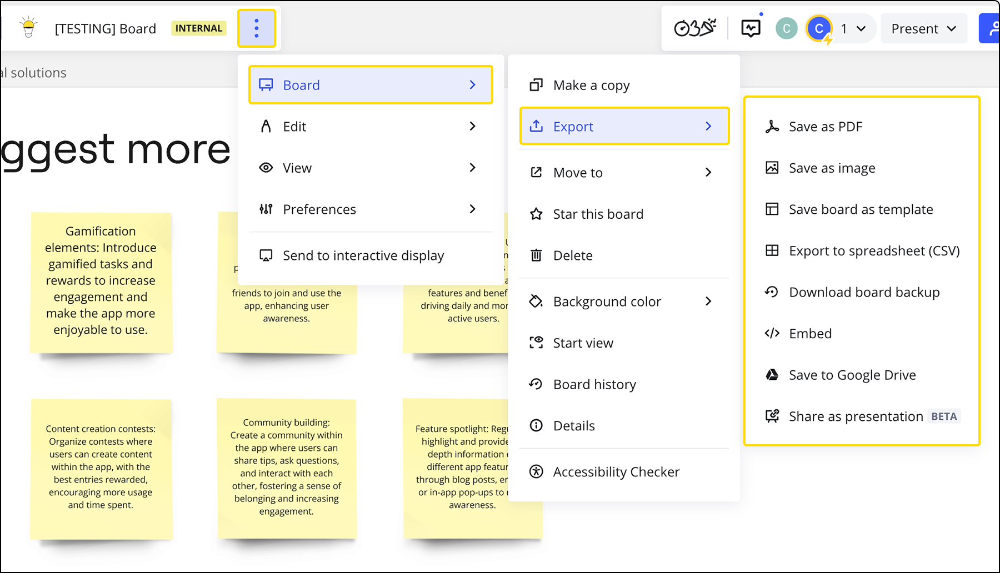

Pour imprimer votre tableau Miro :

1. Accédez aux options d’exportation en cliquant sur l’icône **trois points** (**...**) dans la barre d'outils en haut à gauche > **Tableau** > **Exporter**.
2. Exporter le tableau en tant qu'image ou en PDF.
3. Ouvrez et imprimez le fichier exporté.

> **⚠️** L'exportation de PDF en haute résolution nécessite un abonnement payant. Les utilisateurs ayant un forfait Free ne peuvent exporter que des documents PDF filigranés basse résolution. Pour en savoir plus sur les options d’exportation de tableaux, consultez [cette page](03-how-to-export-your-board.md).

*Options d'exportation du tableau*

Si vous choisissez d’enregistrer le tableau au format PDF, chaque [cadre](../../essential-tools/07-frames.md) du tableau sera créé comme une page séparée du document PDF. Si vous souhaitez qu'un graphique, un diagramme ou une image entière soit imprimé sur une seule page, vous pouvez utiliser un cadre de taille A4 ou lettre, car il correspond automatiquement au format standard du papier.

Pour une expérience optimale, créez des cadres et travaillez sur le tableau avec un niveau de zoom de 100 %.

Si le texte ou les objets du document imprimé sont trop petits, vous pouvez sélectionner les objets et augmenter leur taille sur le tableau, puis réexporter et imprimer.

Si vous rencontrez des problèmes lors de l'exportation de votre tableau, consultez notre [guide de dépannage](../../tools/troubleshooting/03-board-export-issues.md).
