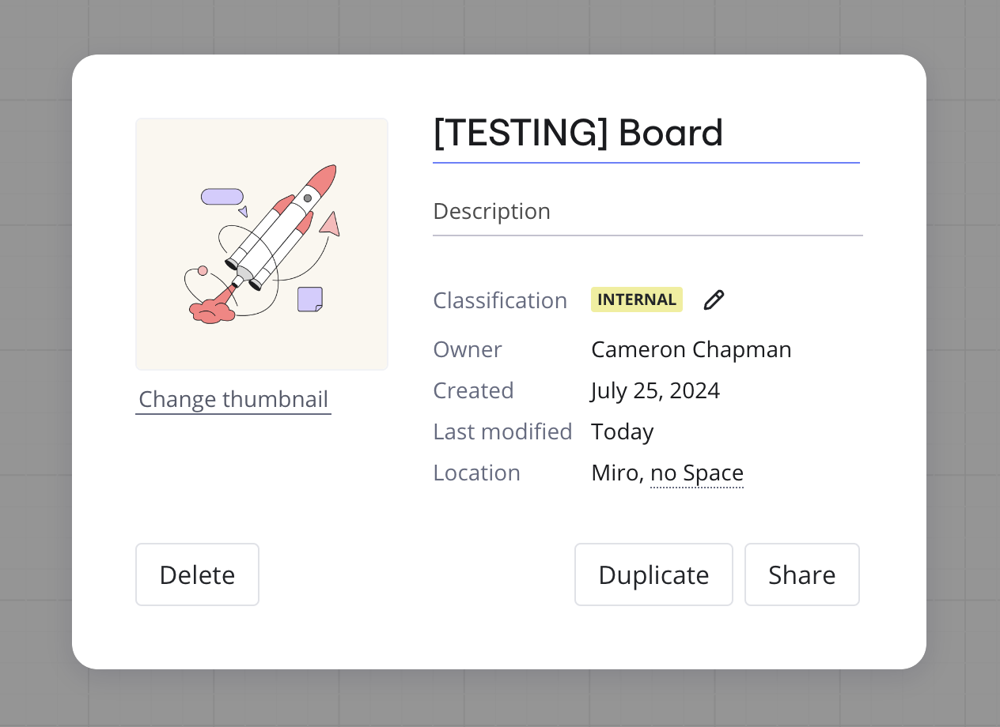

La mise à jour des informations relatives à vos tableaux permet de les organiser et de les retrouver facilement. Les informations relatives au tableau comprennent le nom de votre tableau, sa description, sa classification, son propriétaire, ses dates de création et de modification, son emplacement et les options permettant de modifier la vignette.

## Renommer votre tableau

La procédure suivante explique une méthode pour renommer votre tableau.

**Procédure**

Suivez les tableaux ci-dessous pour renommer votre tableau :

1. Cliquez sur le **titre du tableau** dans la barre d'outils en haut à gauche.
   Le titre du tableau devient modifiable.
2. Saisissez le nouveau nom du tableau.
3. Appuyez sur la touche **Entrée** ou cliquez ailleurs sur le tableau.

   Vous avez enregistré avec succès votre nouveau titre de tableau.

## Modifier la vignette de votre tableau

La procédure suivante explique comment modifier la vignette de votre tableau à partir du tableau.

**Procédure**

Procédez comme suit pour modifier la vignette du tableau :

1. Cliquez sur la **vignette du tableau** dans la barre d'outils en haut à gauche, à côté du **titre du tableau**.
   La boîte de dialogue **Sélectionner une vignette** s'ouvre.
2. Cliquez sur une nouvelle vignette, chargez-en une depuis votre appareil ou sélectionnez une zone du tableau à utiliser comme vignette.

   Vous avez réussi à mettre à jour la vignette et la boîte de dialogue se ferme.

## Afficher la carte d’information du tableau

Si vous disposez de droits d'accès, vous pouvez ouvrir la carte d'information du tableau pour voir le propriétaire du tableau, la date de création, les dernières modifications et l'espace dans lequel le tableau est enregistré. Vous pouvez également supprimer et dupliquer le tableau.

*La carte d'information du tableau*

La procédure suivante explique comment visualiser la carte d'information du tableau.

**Procédure**

Suivez les tableaux ci-dessous pour afficher la carte d'information du tableau :

1. Cliquez sur l'icône du **menu principal** () dans la barre d'outils en haut à gauche.
   Le menu principal s'ouvre.
2. Cliquez sur l'élément de menu **Tableau**.
   Le sous-menu Tableau s'ouvre.
3. Cliquez sur **Détails**.

   Vous avez ouvert avec succès la carte d'information du tableau.

Recommandations :

Afin de trouver et d’identifier facilement vos tableaux, nous vous recommandons de :

- Créer un titre unique
- Définir une image de couverture
- Ajouter une description
- Ajoutez le tableau à un [espace.](../spaces/01-spaces.md)

## Modifier la carte d’information du tableau

**Procédure**

Suivez les tableaux ci-dessous pour éditer la carte d'information du tableau :

1. Cliquez sur l'icône du **menu principal** () dans la barre d'outils en haut à gauche.
   Un menu s'ouvre.
2. Cliquez sur le bouton de menu **Tableau**.
   Le sous-menu Tableau s'ouvre.
3. Cliquez sur le bouton **Détails**.
   La carte d’information du tableau s’ouvre.
4. Ajoutez le titre et la description.
5. Ajoutez le tableau à un espace en cliquant sur **Pas d'espace**.
6. Sélectionnez une zone d’aperçu du tableau. [La sélection de la zone d’aperçu](../troubleshooting-technical-questions/technical-guidelines/02-supported-browsers-browser-restrictions.md) n’est pas prise en charge sur Safari.

   Vous avez édité avec succès la carte d'information du tableau.

## Ajouter une image de couverture à la carte d’informations du tableau

Il existe plusieurs méthodes pour ajouter une image à la carte d’informations de votre tableau : sélectionner une icône que Miro vous propose, charger votre propre image ou sélectionner une zone du tableau.

**Procédure**

Suivez les tableaux ci-dessous pour ajouter une image de couverture à la carte d'information du tableau :

1. Pour définir une vignette de tableau personnalisée, ouvrez la carte d'information du tableau et cliquez sur **Modifier la vignette**.
   La boîte de dialogue **Sélectionner une vignette** s'ouvre.
2. Trois options s’offrent à vous :
   1. Choisissez parmi les icônes proposées par Miro.
   2. Chargez votre propre image en cliquant sur **Upload**. Vous pouvez utiliser des fichiers jpg, jpeg, bmp, png ou gif d’une taille maximale de 30 Mo (la taille de la couverture sur le tableau de bord est de 420×420 et 72 dpi, la taille de l’aperçu dans la carte du tableau est de 210×210 et 72 dpi).
   3. **Si vous souhaitez choisir une zone de votre tableau pour la vignette, cliquez sur-Select board area (Sélectionner une zone du tableau), puis cliquez et faites glisser sur la zone du tableau que vous souhaitez utiliser.**

      Vous avez édité avec succès la carte d'information du tableau.
