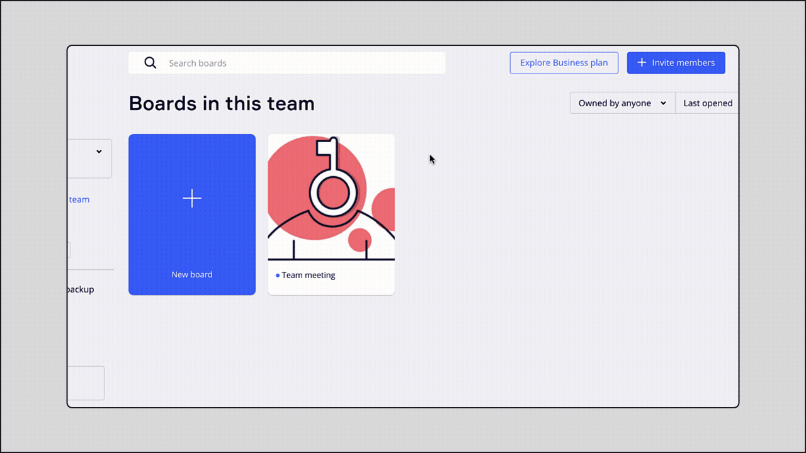
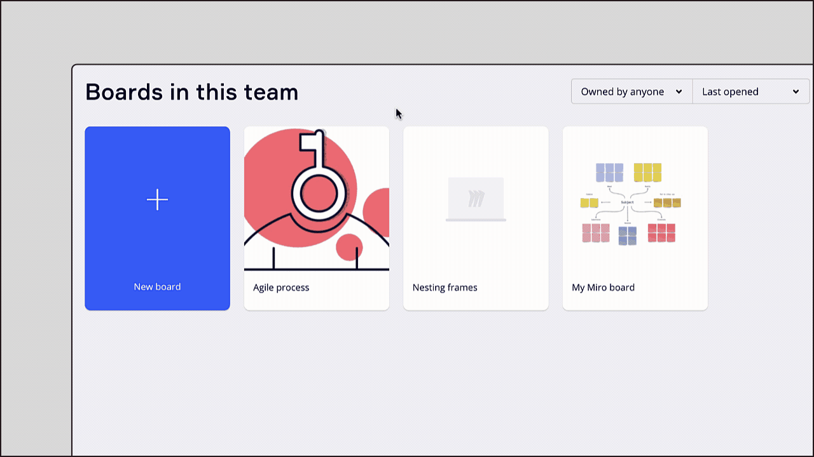
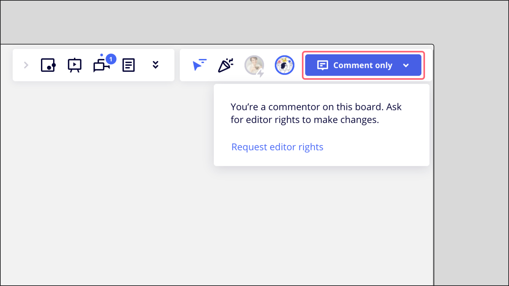
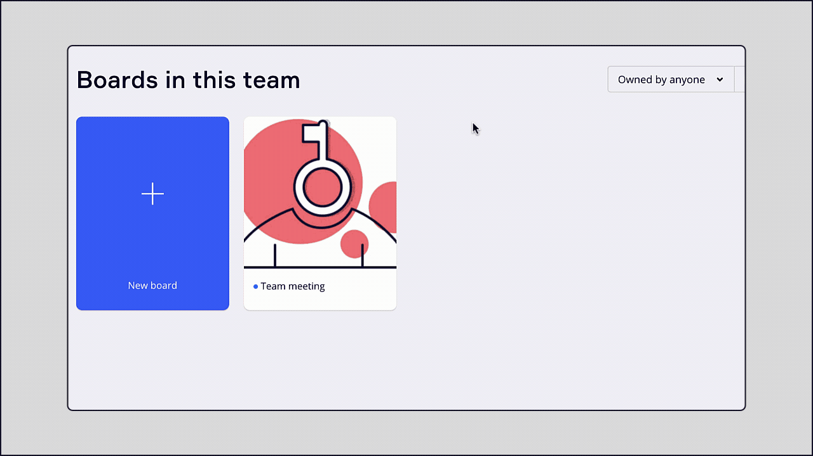
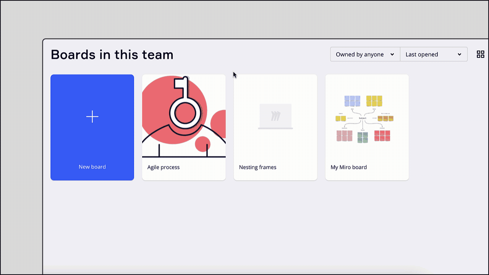
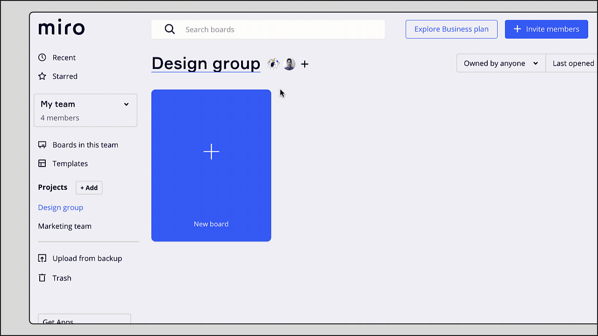
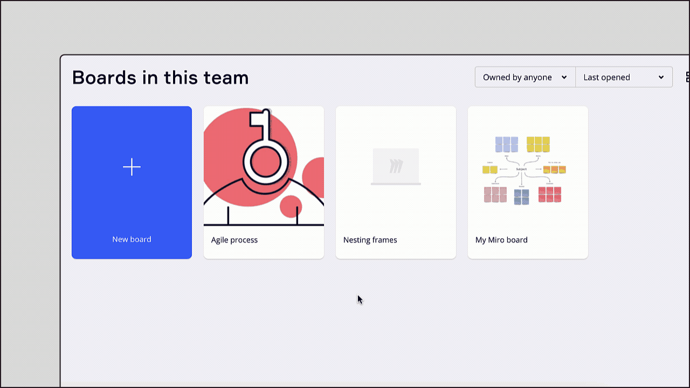

Les utilisateurs peuvent accéder aux tableaux Miro à trois niveaux différents : consultation, commentaire et édition. En savoir plus sur les niveaux d’accès et sur la façon de les gérer pour les utilisateurs.

### Configurer les droits d’accès

Vous pouvez [partager un tableau Miro](03-sharing-boards-and-inviting-collaborators.md) :

- avec des utilisateurs spécifiques par e-mail ;
- avec des membres de l'espace
- avec toute l’équipe ou toute l’entreprise ;
- publiquement avec toute personne ayant le lien du tableau.

Chaque fois que vous partagez un tableau, vous pouvez spécifier les droits d’accès pour vos invités en choisissant **Peut modifier**, **Peut commenter** ou **Peut consulter**.

1. Survolez votre tableau avec la souris sur votre tableau de bord.
2. Cliquez sur les trois points dans le coin supérieur droit.
3. Cliquez sur **Partager**.
4. Entrez l’adresse e-mail de l’utilisateur que vous souhaitez inviter ou choisissez une autre option dans la fenêtre Partager (par exemple, Toute personne dans l’équipe, Toute personne ayant le lien, etc.).
5. Le niveau d’accès par défaut est **Can edit**. Cliquez sur **Can edit** pour changer le niveau d’accès en **Can commentateur** ou **Can view.**

*
Partage d’un tableau par e-mail avec accès aux commentaires (Can)*

*Permettre à n’importe quel membre de l’équipe Miro de modifier le tableau*

### Droits d’accès au tableau

Les propriétaires, les copropriétaires, les éditeurs, les commentateurs et les lecteurs disposent de droits d’accès différents au tableau.

Propriétaire du tableau Copropriétaire du tableau Modifier Commenter Consulter

Chaque tableau a son propriétaire. Il ne peut y avoir **qu’un seul** propriétaire de tableau par tableau. Le propriétaire du tableau peut :

- [déplacer le tableau entre les équipes](../managing-boards/04-how-to-move-a-board.md)
- télécharger les [sauvegardes du tableau](../import-and-export/export/05-how-to-save-board-backup.md) (pour les forfaits payants) ;
- [ajouter des copropriétaires](06-co-owners-of-boards-and-spaces.md) (forfait Business et Enterprise) ;
- [définir un mot de passe pour le tableau](13-password-protection-for-public-boards.md) (pour les forfaits payants) ;
- [masquer les cadres](../essential-tools/07-frames.md), [utiliser des verrouillages protégés](../working-on-the-board/21-work-smarter-not-harder.md) (pour les forfaits payants) ;
- [configurer les paramètres de contenu du tableau](14-how-to-allow-or-restrict-copying-and-exporting-boards-and-content.md) (pour les forfaits payants) ;
- configurer [les paramètres des outils de collaboration](../facilitation-tools/06-collaboration-tools.md) ;
- définir [qui peut partager le tableau](02-who-can-share-a-miro-board.md) ;
- [transférer la propriété du tableau à un autre collaborateur ;](../managing-boards/05-how-to-transfer-board-ownership.md)
- [supprimer le tableau.](../managing-boards/07-how-to-delete-a-board.md)

> **Pertinent pour**: les forfaits Business et Enterprise

Avec les forfaits Business et Enterprise, les utilisateurs peuvent également ajouter des copropriétaires de tableau. Les copropriétaires du tableau peuvent :

- gérer [les paramètres de contenu du tableau](14-how-to-allow-or-restrict-copying-and-exporting-boards-and-content.md) et [les paramètres des outils de collaboration ;](../facilitation-tools/06-collaboration-tools.md)
- [masquer](../facilitation-tools/06-collaboration-tools.md) [et afficher les cadres,](../essential-tools/07-frames.md) [ajouter un verrouillage protégé ;](../working-on-the-board/17-locking-content-on-the-board.md)
- [ajouter un mot de passe au tableau ;](13-password-protection-for-public-boards.md)
- [télécharger une sauvegarde du tableau ;](../import-and-export/export/05-how-to-save-board-backup.md)
- ajouter d’autres copropriétaires ;
- modifier l’image de couverture du tableau et le renommer ;
- [partager le tableau ;](03-sharing-boards-and-inviting-collaborators.md)
- configurer [les autorisations avancées de partage du tableau.](02-who-can-share-a-miro-board.md)

En savoir plus sur [les copropriétaires d’un tableau](06-co-owners-of-boards-and-spaces.md).

Les éditeurs peuvent modifier le contenu du tableau et supprimer ou charger de nouveaux fichiers. Ils peuvent utiliser divers outils et paramètres du tableau selon qu’ils soient visiteurs, invités ou membres.

En savoir plus sur la [différence entre les visiteurs, les invités et les membres](04-sharing-with-users-outside-your-team.md).

Les éditeurs peuvent copier le contenu du tableau si cela est autorisé dans les [tableaux](14-how-to-allow-or-restrict-copying-and-exporting-boards-and-content.md).

**Partage avec droits de modification**

Lorsqu’un éditeur est invité à un tableau en tant que membre de l’équipe (il dispose d’une licence payante), il peut accéder aux paramètres de partage et les modifier.

Les propriétaires et [copropriétaires](06-co-owners-of-boards-and-spaces.md) de tableaux dans les forfaits payants peuvent [restreindre cette option pour les éditeurs de tableaux](02-who-can-share-a-miro-board.md).

Les commentateurs peuvent voir le tableau et y laisser des [commentaires](../facilitation-tools/asynchronous-tools/01-comments.md). Les utilisateurs enregistrés de Miro qui sont invités à participer à un tableau en tant que commentateurs peuvent se joindre à des sessions de [vote](../facilitation-tools/19-voting.md) et voir le [minuteur](../facilitation-tools/16-timer.md) en cours. Les commentateurs peuvent copier le contenu du tableau si cela est autorisé dans les [paramètres de tableau](14-how-to-allow-or-restrict-copying-and-exporting-boards-and-content.md).

Les commentateurs ne peuvent pas modifier le tableau et le partager.

*Point de vue du commentateur sur le tableau*

Les lecteurs ne peuvent pas modifier le tableau. Ils peuvent uniquement voir son contenu. Leur boîte à outils affiche uniquement les options de zoom et de carte, et la barre d’outils n’est pas disponible. Les lecteurs enregistrés peuvent rejoindre les sessions de [vote](../facilitation-tools/19-voting.md) et voir le [minuteur](../facilitation-tools/16-timer.md) en cours. Les lecteurs enregistrés peuvent aussi copier le contenu du tableau si cela est permis dans les [paramètres de contenu du tableau](14-how-to-allow-or-restrict-copying-and-exporting-boards-and-content.md). Si le tableau comporte des [cadres](../essential-tools/07-frames.md), les lecteurs peuvent passer de l’un à l’autre dans l’aperçu du tableau, situé dans le coin inférieur gauche du tableau.

*Mode de visualisation du tableau par le lecteur*

### Comment demander l’accès à un tableau

Si vous suivez le lien d’un tableau et que vous voyez ce message, cela signifie que le tableau n’est pas encore partagé avec vous.

*Demande d’accès au tableau*

Pour consulter, commenter ou modifier un tableau, cliquez sur **Demande d’accès**. Cela enverra un e-mail au propriétaire du tableau. Ils pourront vous donner accès et définir vos droits d’accès.

Si vous n’avez que des droits de visualisation ou de commentaire, vous pouvez demander un accès d’éditeur en cliquant sur le bouton **Commentaire uniquement** dans le coin supérieur droit et en sélectionnant **Demander des droits d’éditeur**. Veuillez noter que cette fonctionnalité n’est pas prise en charge sur le [forfait Education](../../plans-billing/miro-special-pricing/03-education-plan.md).

:::tip
Si vous ne pouvez pas accéder à un tableau alors que l’accès vous a été accordé ou que vous avez créé le tableau, consultez ce guide : [Je ne peux pas accéder à un tableau Miro ni le modifier](../tools/troubleshooting/08-i-can't-access-or-edit-a-miro-board.md).
:::

*Demande de droits d’éditeur*

### Modifier les droits d’accès

Modifier l'accès d'un utilisateur individuel Modifier l'accès d'une équipe ou d'une entrepriseModifier l'accès aux espaces Modifier l'accès public

1. Cliquez sur le bouton **Partager** dans le coin supérieur droit du tableau.
2. Ouvrir **Paramètres de partage.** La liste des personnes ayant accès au tableau s’affiche par e-mail.
3. Définissez les droits d’accès pour un utilisateur en cliquant sur la liste déroulante.
4. Vous pouvez également supprimer des collaborateurs en cliquant sur **Supprimer**.  Le propriétaire du tableau aura également la possibilité de donner à un autre utilisateur la propriété du tableau.
5. Confirmez la modification en cliquant sur **Terminé**.
   > ⚠️ L'utilisateur peut **conserver son niveau d'accès précédent** si le tableau est partagé avec l'ensemble de l'équipe, un espace, l'entreprise ou publiquement. Découvrez [qui a accès à votre tableau.](05-who-has-access-to-my-board.md)

   
   *Modification des droits d’accès d’un éditeur au **commentaire Can***

1. Cliquez sur le bouton **Partager**.
2. Si vous n’êtes **pas** le propriétaire du tableau et que vous avez accès au tableau via l’accès de l’équipe/de l’entreprise, veillez à [inviter votre propre e-mail](03-sharing-boards-and-inviting-collaborators.md) au tableau avant de passer à l’étape suivante. Sinon, vous **perdrez l’** accès au tableau dès que vous supprimerez l’accès à l’équipe/à la société.
3. Trouvez **Toute personne dans l’équipe [nom de l’équipe]** ou **Toute personne de [nom de l’entreprise] ayant le lien** dans la fenêtre **Partager**.
4. Choisissez un type d’accès différent dans le menu déroulant ou supprimez l’accès en sélectionnant **Aucun accès**.
   > ⚠️ Les utilisateurs peuvent **conserver leur niveau d'accès précédent** si le tableau est partagé par e-mail, avec un espace ou publiquement. Découvrez [qui a accès à votre tableau.](05-who-has-access-to-my-board.md)

   
   *Supprimer l’accès de l’équipe à un tableau*

Vous pouvez soit supprimer un tableau d'un espace, soit modifier le niveau d'accès des membres de l'espace.

Retirer un tableau d'un espace :

1. Cliquez sur le  bouton**Partager** .
2. Si vous **n'** êtes **pas** le propriétaire du tableau et que vous avez accès au tableau via l'accès Spaces, assurez-vous d' [inviter votre propre e-mail](03-sharing-boards-and-inviting-collaborators.md) au tableau avant l'étape suivante. Sinon, vous **perdrez l'** accès au tableau dès que vous supprimerez l'accès à l'espace.
3. Cliquez sur le nom de l'espace en bas de la fenêtre de partage.
4. Sélectionnez **Aucun**.

:::warning
Il est possible que les utilisateurs **conservent leur niveau d’accès précédent** si le tableau est partagé avec toute l’équipe, par e-mail, avec l’entreprise ou publiquement. Découvrez [qui a accès à votre tableau.](05-who-has-access-to-my-board.md)
:::

Pour modifier le niveau d'accès des membres de l'espace.

1. Trouvez l'espace nécessaire sur votre tableau de bord.
2. Cliquez sur le nom de l'espace pour ouvrir ses paramètres.
3. Modifier l’accès des utilisateurs individuels.
   
   *Modifier le niveau d'accès d'un membre de Spaces*

1. Cliquez sur le bouton **Partager**.
2. Trouvez **Toute personne ayant le lien**.
3. Choisissez un type d’accès différent dans le menu déroulant ou supprimez l’accès en sélectionnant **Aucun accès**.
   > ⚠️ Les utilisateurs peuvent **conserver leur niveau d'accès précédent** si le tableau est partagé avec l'ensemble de l'équipe, un espace, l'entreprise ou par e-mail. Découvrez [qui a accès à votre tableau.](05-who-has-access-to-my-board.md)

   
   *Suppression de l’accès du public à un tableau*

### Transfert de la propriété d’un tableau à un autre collaborateur du tableau

Lisez l’article [Transférer la propriété d’un tableau](../managing-boards/05-how-to-transfer-board-ownership.md) pour apprendre comment réaffecter un tableau à un autre utilisateur ou obtenir la propriété des tableaux appartenant à un utilisateur qui a quitté l’entreprise.

### Foire aux questions

J’ai supprimé un utilisateur de mon tableau mais cet utilisateur est toujours présent sur le tableau. Comment bloquer l’accès de l’utilisateur ?

L'utilisateur qui n'est pas invité directement peut toujours accéder à votre tableau s'il est partagé par d ['autres moyens](01-board-access-rights.md) ([équipe/espace/entreprise/accès](03-sharing-boards-and-inviting-collaborators.md#partage-de-tableaux-via-un-lien-public)[public](03-sharing-boards-and-inviting-collaborators.md) ). Veuillez vérifier les paramètres de partage du tableau et supprimer l’accès.

Comment vérifier qui est le propriétaire du tableau ?

Le nom du propriétaire du tableau est visible sur la [carte d’information du tableau](../../getting-started/start-here/your-first-board/01-create-a-miro-board.md). Notez que votre niveau d’accès peut ne pas être suffisant pour voir ces informations. Toutefois, si vous avez reçu une invitation au tableau, vous pouvez également voir le nom de l’invitant dans l’e-mail de notification.

J’ai créé un tableau mais je ne peux plus y accéder. Comment rétablir l’accès ?

Il peut y avoir plusieurs raisons à cela. Renseignez-vous sur les causes potentielles : [Je ne peux pas accéder à un tableau Miro ni le modifier.](../tools/troubleshooting/08-i-can't-access-or-edit-a-miro-board.md).

Comment transférer mon tableau hors d’une équipe ?

Vous pouvez [déplacer votre tableau vers une autre équipe](../managing-boards/04-how-to-move-a-board.md) si vous êtes membre de plusieurs équipes. Si vous ne l’êtes pas, vous pouvez [créer votre propre équipe](../../plans-billing/manage-your-subscription-and-plan/03-upgrade-your-plan.md).

Puis-je transférer mon tableau à un utilisateur qui n’est pas membre de mon équipe ?

Non, vous ne pouvez attribuer la propriété du tableau qu’aux membres de votre équipe. En guise de solution de rechange, l’utilisateur peut [créer une copie de votre tableau](../managing-boards/03-how-to-duplicate-a-board.md) dans sa propre équipe (veuillez vous assurer que cela est autorisé dans les [paramètres de contenu du tableau](14-how-to-allow-or-restrict-copying-and-exporting-boards-and-content.md)). La personne doit être un utilisateur enregistré de Miro et un membre d’une autre équipe.
