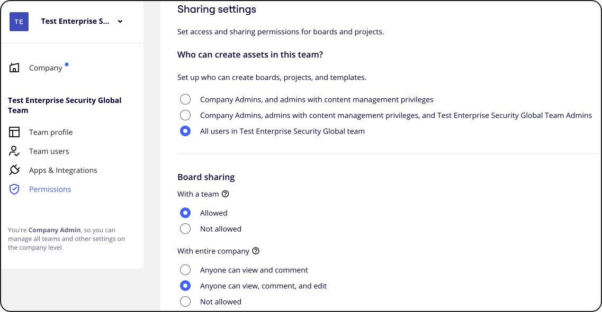
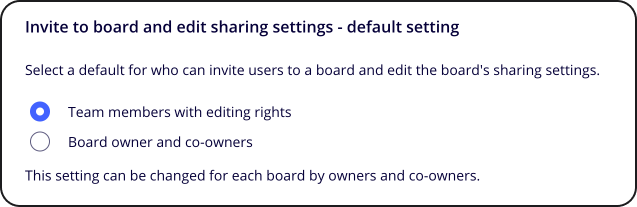

Vous cherchez un moyen plus rapide de partager tous les tableaux ou espaces d'équipe nouvellement créés avec un public spécifique ? Les admins peuvent personnaliser les paramètres de partage par défaut des tableaux et des Espaces que vous et votre équipe créez, et les partager dès le départ avec un niveau particulier de droits d'accès.

> **Disponible pour : les forfaits Starter, Business, Enterprise et Education
> **Installation par :** [Admins d’équipe](../../getting-started/start-here/05-roles-in-miro.md), [admins d’entreprise](../../getting-started/start-here/05-roles-in-miro.md)**

### Comment configurer les paramètres de partage par défaut

En tant qu’admin, n’hésitez pas à ajuster le statut des nouveaux tableaux en fonction de votre workflow en allant dans la section **Paramètres de l’équipe** > **Autorisations** > Paramètres de partage.

Notez que les paramètres de partage des tableaux et espaces individuels peuvent être modifiés par leurs propriétaires, copropriétaires et éditeurs. Les utilisateurs peuvent partager des tableaux avec les membres de l’équipe et les personnes ne faisant pas partie de l’équipe. Pour en savoir plus sur les options de partage, consultez cet article : [Partager des tableaux et inviter des collaborateurs](03-sharing-boards-and-inviting-collaborators.md).

*Paramètres de partage*

### Paramètres de partage de tableau

Tous les tableaux nouvellement *créés* sur les forfaits payants et Education sont définis par défaut comme étant privés et ne sont visibles que par leurs propriétaires. Dans le menu déroulant, choisissez le statut de tous les nouveaux tableaux créés dans votre équipe :

- Privé
- Accessible à tous les membres de l’équipe avec [des droits de consultation, de commentaire ou de modification](01-board-access-rights.md)
- Accessible à tous les membres du [forfait Enterprise](../../plans-billing/miro-plans/04-enterprise-plan.md), indépendamment de leurs équipes, avec des droits de commentaire ou de consultation

> [⚠️ Tous les tableaux d’un *forfait Free* sont partagés avec l’équipe par défaut et ne peuvent pas être privés.](../../plans-billing/miro-plans/09-free-plan.md)

:::warning
Les tableaux partagés de l’entreprise (sur les forfaits Enterprise) n’apparaissent pas sur le tableau de bord des utilisateurs, à moins que ces derniers fassent partie de l’équipe dans laquelle se trouve chaque tableau. Parallèlement, tous les membres de votre forfait Enterprise peuvent ouvrir ces tableaux via un lien, ou les trouver et les ouvrir à partir des résultats de recherche.
:::

> [✏️ Les admins d’équipe des forfaits Starter, Business, Enterprise et Education peuvent configurer les paramètres de contenu par défaut des tableaux.](14-how-to-allow-or-restrict-copying-and-exporting-boards-and-content.md)

### Inviter au tableau et modifier les paramètres de partage

Paramètre par défaut permettant d’inviter des utilisateurs à un tableau et de modifier les paramètres de partage du tableau. Les propriétaires et copropriétaires du tableau peuvent modifier ce paramètre.

:::note
Ce paramètre ne s’applique qu’aux tableaux nouvellement créés. Ce paramètre ne modifie pas les paramètres d’invitation au tableau et de partage pour les tableaux existants.
:::

Cliquez pour sélectionner les utilisateurs appropriés qui peuvent inviter des utilisateurs à un tableau et modifier les paramètres de partage du tableau par défaut.

*Inviter au tableau et modifier les paramètres de partage*

### Paramètres de partage des espaces et des sections

Choisissez parmi l’une des deux options suivantes :

- vous pouvez soit garder les nouveaux espaces d'équipe *privés* et non accessibles à d'autres personnes que leur propriétaire, soit
- les rendre *visibles* pour tous les membres de votre équipe afin que le propriétaire de l'espace n'ait pas besoin d'ajouter manuellement des utilisateurs de l'équipe

Après avoir défini les paramètres de partage généraux pour tous les tableaux ou espaces nouvellement créés, vous pourrez toujours [personnaliser les paramètres de partage](03-sharing-boards-and-inviting-collaborators.md) dans les menus de tableaux et d'espaces particuliers.

Les administrateurs de contenu ont des privilèges de gestion du contenu. Pour les espaces et les sections, l'administrateur de contenu peut modifier les métadonnées, déplacer et supprimer des tableaux à l'intérieur d'un espace ou d'une section, et déplacer des tableaux vers un autre espace ou une autre section. Les mêmes privilèges s'appliquent aux tableaux, espaces et sections privés.

**En savoir plus :** Voir [Rôles dans Miro](../../getting-started/start-here/05-roles-in-miro.md).

:::note
Notez que l'espace [l'accès à l'espace](../spaces/01-spaces.md) l'accès à l'espace et l'accès aux tableaux se complètent et fonctionnent en même temps : par exemple, si un tableau n'est pas partagé avec l'ensemble de l'équipe, l'accès à l'espace et l'accès aux tableaux ne sont pas identiques. [partagé avec l'ensemble de l'équipe](03-sharing-boards-and-inviting-collaborators.md) mais appartient à un espace de vue de l'équipe, tous les membres de l'équipe pourront accéder au tableau.
:::
