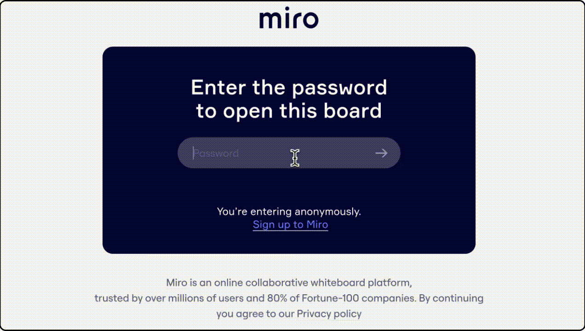
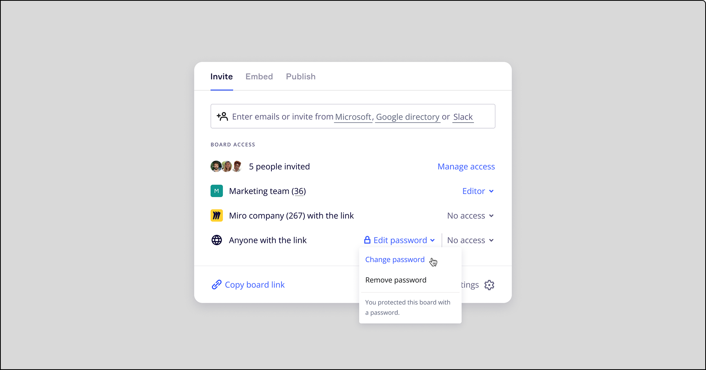
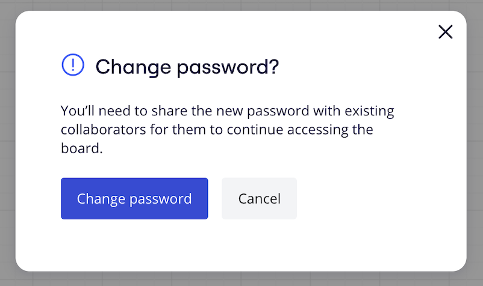
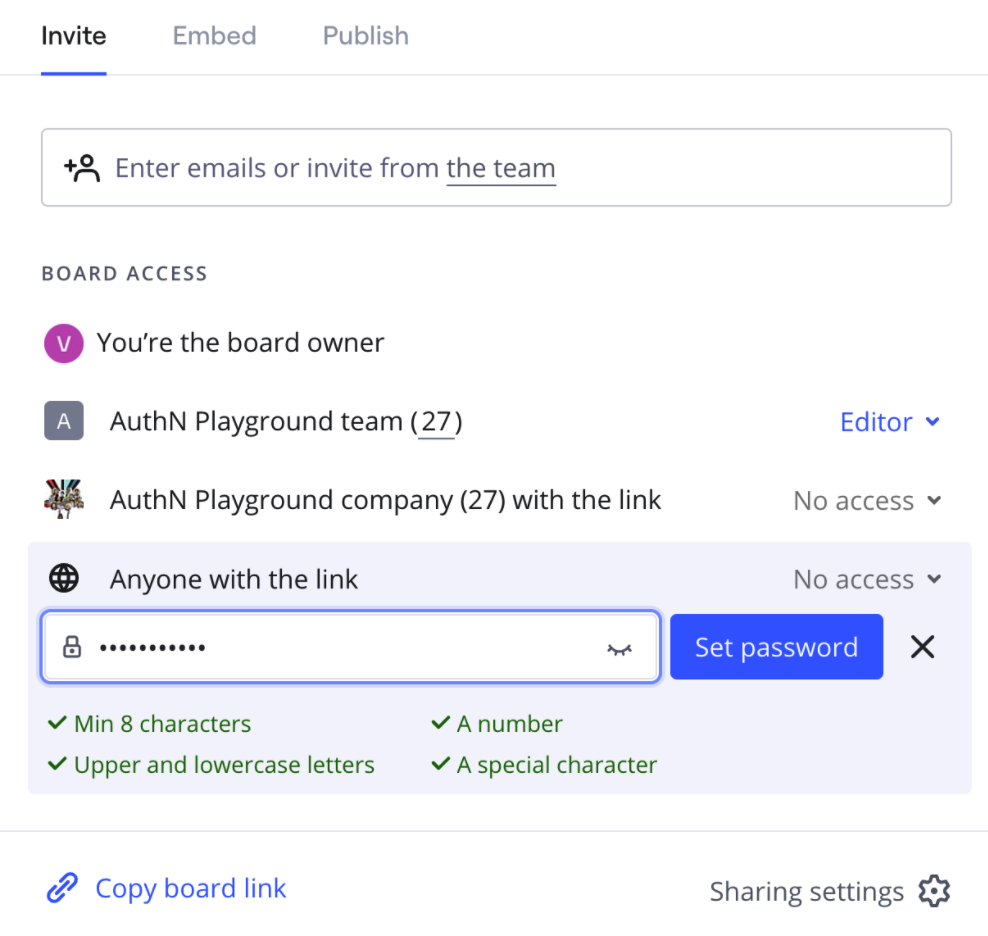

Apprenez-en plus sur notre fonctionnalité de protection par mot de passe pour les forfaits payants et découvrez comment paramétrer un mot de passe pour vos tableaux publics.

> **Qui peut le faire : les** propriétaires et [copropriétaires du tableau](06-co-owners-of-boards-and-spaces.md), ainsi que les admins d’entreprise sur les tableaux Enterprise avec des permissions d’[admin de contenu.](../../enterprise-administration/managing-enterprise-teams-and-content/12-content-admin-permissions.md)
> **Pertinent pour :** les forfaits Starter, Business, Enterprise et Education
> **Disponible sur : [navigateur,](../../getting-started/apps-for-devices/05-desktop-app.md)** application de bureau[,](../../getting-started/apps-for-devices/11-tablet-app.md) application pour tablette

## Mots de passe pour tableaux publics

En invitant des visiteurs sur le tableau à l’aide d’un lien public, vous permettez une collaboration instantanée, ponctuelle ou à court terme avec des utilisateurs en dehors de votre équipe ou de votre entreprise : même les utilisateurs qui ne sont pas inscrits sur Miro peuvent accéder aux tableaux publics.

Lorsque vous partagez des tableaux Miro publics, vous pouvez ajouter une sécurité supplémentaire en définissant un mot de passe.

### Protection par mot de passe basée sur votre forfait

La protection par mot de passe et le niveau d’autorisations dépendent de votre type de forfait.

|  |  |  |  |
| --- | --- | --- | --- |
|  | **Free** | **Starter, Business** | **Enterprise** |
| **Activer, modifier ou supprimer des mots de passe** | ✘ | ✔  Propriétaires et copropriétaires de tableau | ✔  Propriétaires, copropriétaires, admin de l’entreprise* |
| **Activer les mots de passe obligatoires** | ✘ | ✘ | ✔  [Paramétrer un mot de passe obligatoire](../../enterprise-administration/canvas-25-admin-features/data-security/07-sharing-policy-on-enterprise-plan.md) |
| **Exiger des mots de passe complexes** | ✘ | ✘ | ✔  [Exiger un mot de passe complexe](../../enterprise-administration/canvas-25-admin-features/data-security/07-sharing-policy-on-enterprise-plan.md) |

*[Les droits de l’admin de contenu](../../enterprise-administration/managing-enterprise-teams-and-content/12-content-admin-permissions.md) doivent être activés.

> [✏️ En savoir plus sur notre politique de partage pour le forfait Enterprise.](../../enterprise-administration/canvas-25-admin-features/data-security/07-sharing-policy-on-enterprise-plan.md)

## Comment ajouter une protection par mot de passe à un tableau

1. Lorsque vous activez l’accès pour **Anyone avec un lien**, cliquez sur le  bouton **Définir le mot de passe**.

2. Saisissez un mot de passe alphanumérique fort d’au moins 8 caractères, puis cliquez sur **Set.**

3. Le mot de passe sera copié dans votre presse-papiers.

*
Définition d’un mot de passe sur un tableau partagé par lien*

> [✏️  Les admins des forfaits Enterprise peuvent configurer des mots de passe obligatoires sur tous les tableaux dans le cadre de l’abonnement.](../../enterprise-administration/canvas-25-admin-features/data-security/07-sharing-policy-on-enterprise-plan.md)

## Comment fonctionne la protection par mot de passe pour les utilisateurs

Après avoir reçu et ouvert le lien du tableau, les visiteurs sont invités à entrer le mot de passe.

Une fois le mot de passe saisi, ils auront un accès complet à votre tableau. Ils n’auront qu’à réintroduire le mot de passe toutes les 72 heures.

Si les utilisateurs doivent se connecter plus fréquemment, il est possible que l’admin de l’entreprise Miro ait activé le [délai d’inactivité de la session](../tools/troubleshooting/19-why-does-miro-keep-logging-me-out.md) pour une sécurité renforcée.

Veuillez noter que si un tableau est protégé par un mot de passe, il n’apparaîtra que dans les listes "étoilé" et "récent" tant qu’il sera visible par l’utilisateur.

Une fois que la session de l’utilisateur a expiré, les tableaux deviennent indisponibles pour lui et sont supprimés des listes de favoris et des listes récentes. Si l’utilisateur ouvre le tableau via un lien direct et entre à nouveau le mot de passe du tableau, le tableau sera à nouveau affiché dans les listes pertinentes.

## Modifier le mot de passe d’un tableau public

Le changement du mot de passe révoquera immédiatement l’accès au tableau pour tous les visiteurs, même s’ils sont actuellement sur le tableau.

:::note
Les utilisateurs qui peuvent partager un lien vers un tableau protégé par un mot de passe ne peuvent pas modifier le mot de passe, sauf s’ils sont propriétaires ou copropriétaires du tableau.
:::

**Pour modifier le mot de passe d’un tableau public :**

1. Cliquez sur Modifier le mot de passe/span> **dans les paramètres de partage, puis cliquez sur Modifier le mot de passe.
3-1.png
*Modification du mot de passe d’un tableau dans les paramètres de partage*
2. Une fenêtre de confirmation s’affiche et vous informe que vous devrez communiquer le nouveau mot de passe aux collaborateurs existants pour qu’ils puissent continuer à accéder au tableau. Cliquez sur Modifier le mot de passe.**

*Fenêtre de confirmation du changement de mot de passe*
3. Saisissez un mot de passe alphanumérique fort d’au moins 8 caractères.
Votre admin peut avoir défini des exigences spécifiques en matière de mot de passe pour votre compte. Lorsque vous créez votre mot de passe, les critères requis sont clairement affichés pour vous guider.
*Les exigences en matière de mot de passe sont affichées au fur et à mesure que vous saisissez votre mot de passe.*

4. Cliquez sur **Définir le mot de passe**.

:::note
La modification du mot de passe entraîne la suppression immédiate de l’accès de tous les visiteurs du tableau, même s’ils sont actuellement membres du conseil d’administration.
:::

## Désactiver un lien public

Vous pouvez [cesser de partager un tableau public](03-sharing-boards-and-inviting-collaborators.md) à tout moment, mais cela ne réinitialise pas automatiquement le mot de passe de votre tableau. Pour permettre aux visiteurs d’accéder au tableau avec le même mot de passe, vous devez à nouveau partager le tableau par un lien.

Pour en savoir plus sur la modification du mot de passe, voir Modifier le mot de passe d’un tableau public.

## J’ai oublié le mot de passe de mon tableau

Si vous oubliez le mot de passe, vous pouvez facilement modifier le mot de passe de votre tableau dans les paramètres de partage.

:::note
La mise en place d’une protection par mot de passe des tableaux pour les mobiles est dans notre backlog.
:::
