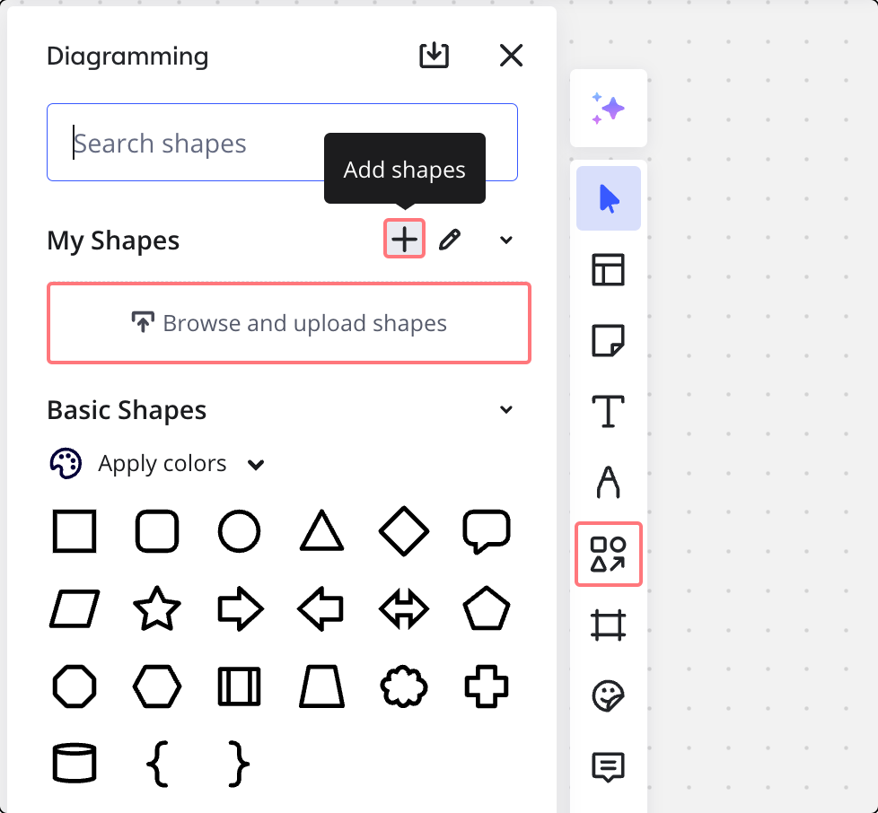
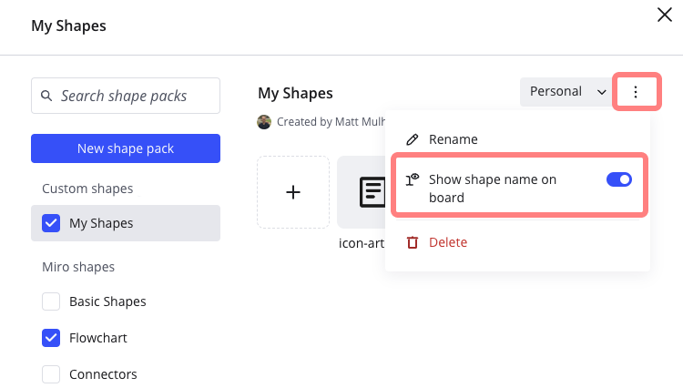
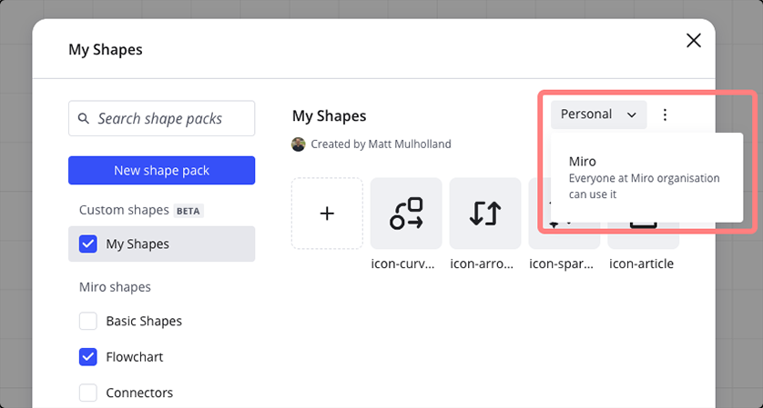
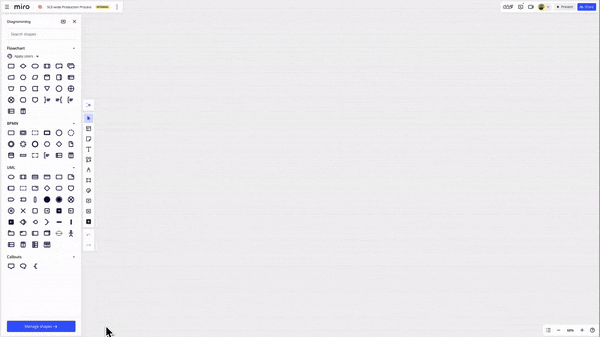

Les packs de formes personnalisées vous permettent d'adapter les diagrammes aux besoins spécifiques d'un secteur ou d'un projet, améliorant ainsi la clarté et la pertinence.

> **Disponible pour :** Plans pour les entreprises, l'éducation et les entreprises
>
> **Disponible sur :** Écrans de bureau et écrans interactifs

### Accéder à des formes personnalisées et les charger

Accédez au menu des formes personnalisées en cliquant sur l'outil **Formes et lignes** dans la barre d'outils de création et en sélectionnant **More shapes.** À partir de là, chargez des formes personnalisées directement à partir du tableau de bord en cliquant sur **Parcourir et charger des formes.** Vous pouvez également ajouter des formes en survolant le titre **Mes formes** et en cliquant sur l'icône **Ajouter des formes**.

Chaque pack de formes peut contenir jusqu’à 100 formes de 50 Ko maximum par fichier au format SVG.

*Comment ajouter des formes personnalisées*

### Modifier un pack de formes personnalisé

Tout d'abord, cliquez sur **Plus de formes** et sélectionnez **Gérer les formes.**À partir d'ici, vous pouvez :

- Renommez votre pack de formes personnalisé.
- Réorganisez la liste des formes personnalisées.
- Toggle **Afficher le nom de la forme sur le tableau**.
- Renommer les formes personnalisées.
- Supprimez les formes personnalisées.

Cliquez sur les trois points (**...**) pour renommer le pack de formes et activer ou désactiver l’option **Afficher le nom de la forme sur le tableau**. Les nouvelles formes ajoutées au tableau affichent désormais leur nom. En outre, lorsque cette option est activée, vous pouvez modifier les noms des formes personnalisées en double-cliquant sur le texte dans le menu **Gérer les formes.**

*Vous pouvez modifier le nom d’un pack de forme et choisir d’afficher ou non le nom*

Réorganisez les formes en cliquant et en faisant glisser les formes.

Pour supprimer une forme personnalisée de votre pack de formes, sélectionnez-la et cliquez sur **Supprimer** en bas du panneau **Gérer les formes**. Maintenez la touche Majuscule enfoncée pour sélectionner plusieurs formes et les supprimer toutes en même temps.

### Partager un pack de formes personnalisé

Les packs de formes personnalisés peuvent être partagés avec tous les utilisateurs de votre organisation. Utilisez le menu déroulant du panneau **Mes formes** pour partager le pack de formes personnalisées.

### Utilisation de formes provenant d’un pack de formes personnalisé

Tant que le pack de formes est sélectionné dans le menu "Plus de formes", les icônes qu’il contient apparaissent dans le panneau de diagramme.

*Accès aux formes personnalisées via le panneau **Plus de formes***

## Foire aux questions

**Comment puis-je accéder aux formes personnalisées que d'autres utilisateurs ont partagées avec mon organisation ?**

Vous devez activer les différents packs de formes personnalisées pour pouvoir les utiliser. Vous trouverez la liste des formes personnalisées disponibles dans le panneau latéral des formes de diagramme. Cliquez sur la case à cocher à côté de chaque pack pour activer/désactiver les formes personnalisées.

**Les admins peuvent-ils restreindre les packs de formes personnalisés qui sont partagés au sein d'une organisation ?**

Les utilisateurs ayant le rôle d'administrateur de contenu peuvent gérer tous les packs de formes personnalisés partagés, y compris les modifier, les supprimer ou les annuler. Cette opération s'effectue dans la boîte de dialogue **Gérer les formes**, à laquelle on accède par le panneau des formes de diagramme.
