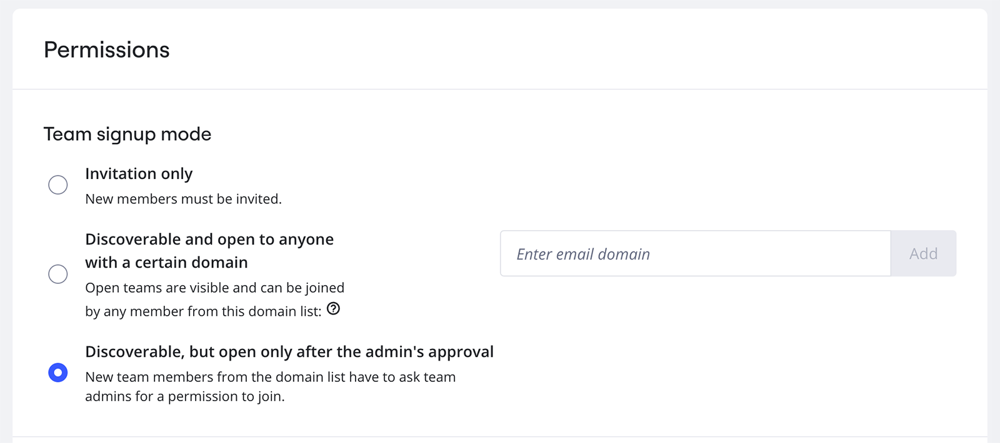

組織内でユーザーがチームに参加する方法を指定します。たとえば、チームメンバーシップを招待制に設定したり、ドメイン内のすべてのユーザーがすべてのチームに参加できるようにしたり、ユーザーが参加をリクエストするように設定したりできます。

:::note
Free、Starter、Educationプランでは、チームの管理者がチーム登録モードを指定します。Enterpriseでは、会社の管理者がチームの登録モードを指定します。
:::

*管理者コンソールでのチームのサインアップモード*

1. ダッシュボードから、右上の自分のアバターを選択し、**管理者コンソールを**選択します。
2. **セキュリティー > パーミッションに**進みます。
3. **チームサインアップモードで**、以下のオプションのいずれかを選択します：
   - **招待のみ**
     新メンバーは、組織内のチームに招待される必要があります。
   - 特定のドメインを持つユーザー全員に公開され検索可能
     新メンバーは、認証されたドメイン内のどのチームにも参加できます。確認するには、メールドメインを入力し、[**追加]**をクリックします。モーダルが開きます。ドメインEメールアドレスを入力し、［**Send verification**］をクリックします。Eメールを確認し、確認Eメールに記載されている「**ドメインの確認**」をクリックしてください。
     > ✏️ 追加したドメインがMiroアカウントのEメールと同じ場合、ドメインは自動的に認証され、確認メールは送信されません。

- **発見可能、ただし管理者の承認が必要**
  新メンバーはチームを見つけることができ、参加を申請する必要があります。チームの管理者または会社の管理者は、チームメンバー申請を承認することができます。新メンバーがチームへの参加を申請すると、管理者に通知メールが届きます。メールに記載されているプロンプトに従って、リクエストを承認してください。
  *チームの管理者がチーム加入申請を承認するためのメール通知*

**詳細：**

- [ユーザーの招待](../user-management/01-invite-users.md)
- [ボードのアクセス権](../../using-miro/sharing-boards/01-board-access-rights.md)
- Enterprise プランのチームのプライバシーと公開の管理
