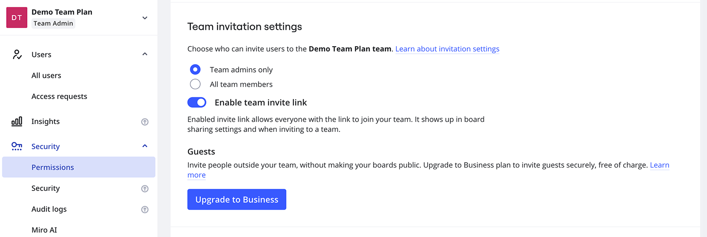
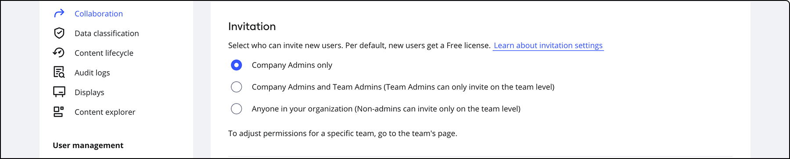

管理者はチームの招待権限を設定し、管理者以外のユーザーが[新しいメンバーを招待](01-invite-users.md)したり、サブスクリプションサイズを変更したりする能力を制限することができます。

右上隅のプロフィールアバターをクリックし、**Admin console** をクリックして管理コンソールにアクセスします。

**セキュリティ** > **管理者権限** タブの**招待の設定**までスクロールダウンします。設定は、Miro のプランによって異なります。

Free、Starter、Education プランでは、チームの招待リンクを有効または無効にすることができ、ユーザーはボードの共有と招待モーダルでコピーできる専用のリンクを使用してチームに参加することができます。[詳細はこちら](../../using-miro/sharing-boards/03-sharing-boards-and-inviting-collaborators.md)。

*Starter プランの招待設定*

Starter と Education プランでは、メンバーのみがボードを編集できます。そのため、メンバーを招待することが許可されていないユーザーが、チームメンバーではない編集者とボードを共有しようとすると、ポップアップが表示されます。

## Business & Enterprise の招待設定

Business プランと Enterprise プランでは、会社の管理者が、[ゲスト](../../using-miro/sharing-boards/07-collaboration-with-guests.md)をさらに許可または禁止することができます。

*Enterprise プランの招待設定*

Business プランおよび Enterprise プランの[会社管理者](../get-started-as-a-miro-admin/01-i-am-a-new-miro-admin.-where-to-start.md)は、サブスクリプション内の各チームの招待設定を構成できます。

以下の手順に従ってください。

1. **管理者コンソール**に移動します。
   Miro のダッシュボードから右上のアバターをクリックして、**管理コンソール**を選択します。
2. **Teams** をクリックします。
3. **チーム名**の下で、チームを選択します。
   チーム設定パネルが開きます。
4. **設定**をクリックします。
5. **招待**の下、このチームにユーザーを招待できるユーザーを選択します。
   > ⚠️ (Business) 新しいユーザーが追加されると、ライセンスは自動的に増加します。新しいユーザーを招待することを誰にでも許可すると、誰でもサブスクリプションに新しいライセンスを追加することができます。
6. **[許可する]** または **[許可しない]** をゲストのために選択してください。
7. 右上で**X**をクリックしてチーム設定パネルを閉じてください。
   設定が保存されました。

新しいメンバーの招待を許可されていないユーザーのダッシュボードには、ユーザーを招待するオプションが表示されません。ゲストが許可されていない場合、Business プランのユーザーにポップアップが表示されます。

Enterprise プランの招待設定の詳細については、[こちらの記事](../../enterprise-administration/user-management/03-invitation-settings-on-enterprise-plan.md)をご覧ください。
