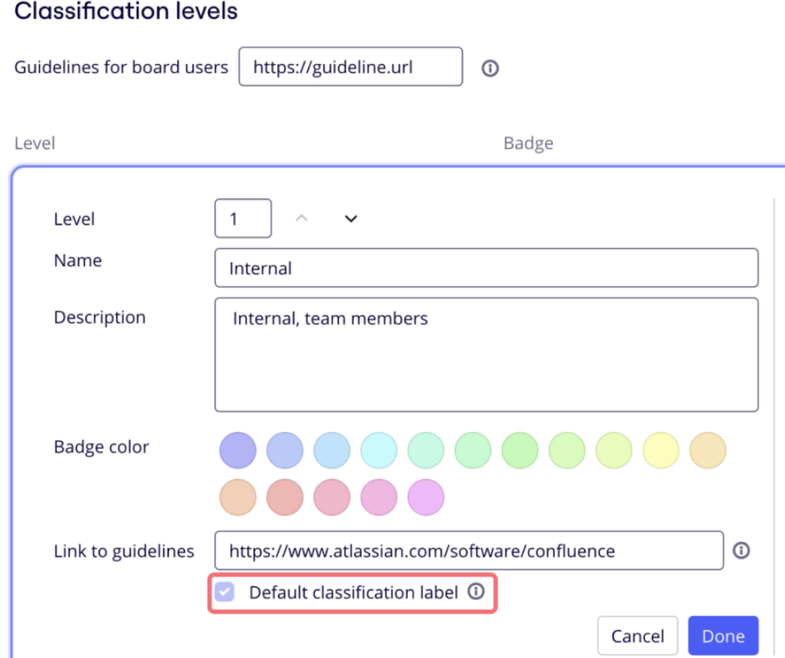
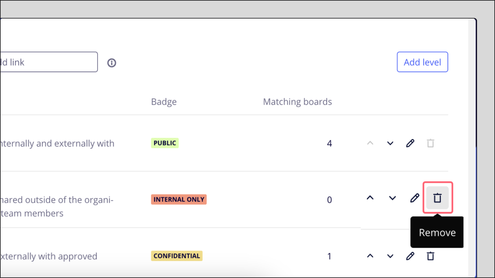
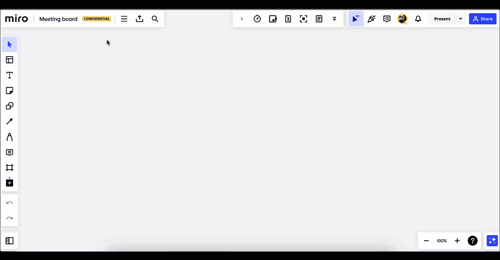
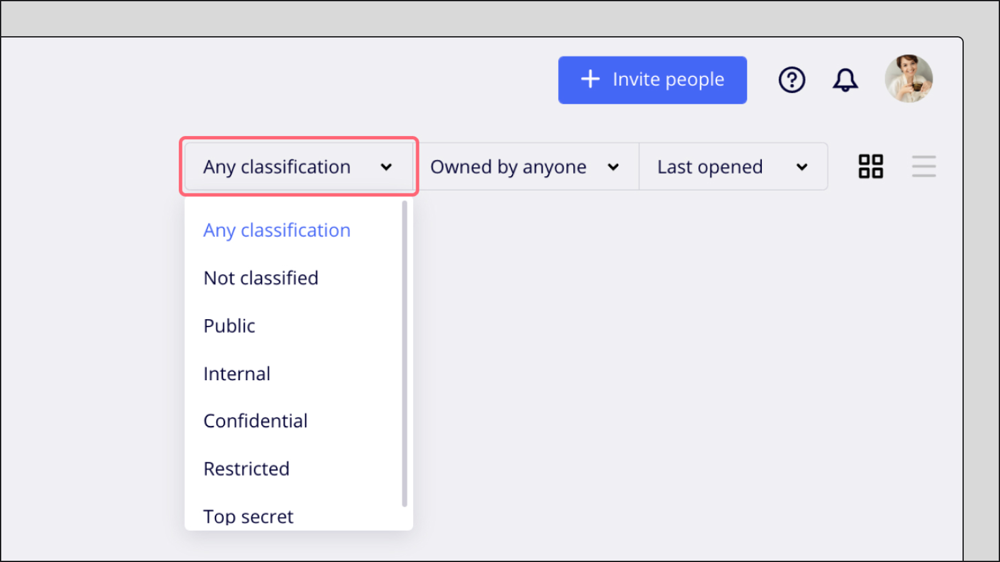

ボードの機密分類では、Enterprise プランユーザーがボードにラベルを割り当てて、ボードのコンテンツの機密レベルを指定することができます。

> **利用可能なプラン：**Enterprise
> **利用可能デバイス**：デスクトップ、タブレット
> **実行可能なユーザー：**会社の管理者

Enterprise管理者コンソールでデータ機密分類の設定を確認できます。**設定]**から[**機密分類]**を選択します。

:::note
Enterprise Guard をご利用のお客様は、管理コンソールの**Enterprise Guard** で**機密分類を**確認できます。**設定**］>［**Enterprise Guard**］>［機密分類］に進みます。
:::

データ機密分類に関する以下のポイントを理解してください：

- データ機密分類は、内部ラベルであり、ボード共有設定には影響しません。つまり、ボードは分類を超えて共有することができます。
- この機能が有効化される前に作成されたボードは、機密分類無しとされます。
- [ボードを複製する](../../../using-miro/managing-boards/03-how-to-duplicate-a-board.md)と、新しく複製されたボードにも現在の機密分類ラベルがコピーされます。
- 現在、[プレゼンテーション モード](https://help.miro.com/hc/articles/360017731073)、[スマート会議モード](https://help.miro.com/hc/articles/4408834812690)や、モバイル上ではラベルは表示されません。

## 機密分類ラベルの設定方法

**設定]**で[**機密分類]**を選択します。Enterprise組織の機密分類ラベルを有効にするには、［**分類の設定**］を選択します。

## 機密分類ラベルの追加方法

会社の管理者は、30個までの機密分類ラベルを作成、カスタマイズすることができ、組織内のすべての新しいボードのデフォルトラベルを設定することができます。

**機密分類の**設定では、すでに4つのラベルが作成されており、カスタマイズすることができます。また、整理のニーズに合わせて新しいラベルを作成することもできます。

新しい機密分類を作成します：

1. **機密分類レベルの編集**］を選択します。
2. **レベルの追加**] をクリックします。
3. **機密分類**レベル**を設定し、**[名前]**、**[概要]** を追加して、バッジの色を変更します**
4. **ボードユーザーのリファレンスを追加するには、ガイドラインへのリンクを追加します**
5. (オプション）**プレビューを** 選択して、ラベルが本番でどのように表示されるかを確認します。
6. **完了を**選択します**。**
7. (オプション）機密分類ラベルを並べ替えるには、上**（Ʌ）**または下**（V**）矢印をクリックします。
8. **[公開] をクリックして、変更を確定します**

:::note
分類ラベルを作成または編集すると、変更は下書きとして保存され、[**公開]**ボタンをクリックするまで公開されません。つまり、機密分類の設定を終了して、いつでもその設定に戻ることができます。
:::

また、自社の機密分類ガイドラインへのリンクを追加することで、共同作業者が既存のデータ機密分類ポリシーについての詳細を知ることができます。

*機密分類ガイドラインリンク*

## 機密分類ドラフトのカスタマイズ方法

下書きが保存されて**いない状態で**機密分類を編集するには：

1. **機密分類レベルの編集** ］ボタンをクリックします。
2. 鉛筆の**編集**アイコンをクリックします。
3. 変更を加え、「**完了**」をクリックします。
4. **[公開] をクリックして、変更を確定します**

下書きが保存**されている**機密分類を編集するには：

1. データ分類パネルで、**設定の再開を**クリックします。
2. 鉛筆の**編集**アイコンをクリックします。
3. 変更を加え、「**完了**」をクリックします。
4. **[公開] をクリックして、変更を確定します**

## 機密分類ラベルの削除方法

ラベルを削除するには、ゴミ箱アイコンをクリックします。なお、デフォルトのラベルを削除することはできません。

*ラベルの*

### 会社レベルにデフォルトのラベルを追加する

新しく作成されたボードのデフォルトの機密分類ラベルを選択します。Enterprise組織で作成される各新規ボードには、デフォルトのラベルが割り当てられます。

組織のデフォルトラベルを設定するには、分類ラベルを追加または編集するときに、［**デフォルト分類ラベル** ］にチェックを付けます。

デフォルトの機密分類ラベルの設定

### チームレベルでのデフォルトラベルの追加

> 設定者：**会社の管理者、チームの管理者**

会社とチームの管理者は、**[デフォルトのラベルを上書きする]** を有効化することができ、チームレベルでのデフォルトラベルを設定することができます。そのチームで作成された新しいボードには、会社レベルで設定されたデフォルトラベルを上書きするこの新たなデフォルトラベルが適用されます。

この設定を有効化するには、[チームの設定] > **[アクセス権限]** に移動して、下にスクロールしてください。

なお、チームの上書きラベルは、会社レベルでデータ機密分類設定が有効になっている場合にのみ設定できます。

[新しく作成されたチームの場合](../../managing-enterprise-teams-and-content/09-create-a-new-team-on-enterprise-plan.md)、チーム作成時にデフォルトの設定を選択すると、この設定は無効になります。

### 機密分類ラベルをボードに追加する

> **設定者：**[ボードの所有者](../../../using-miro/sharing-boards/01-board-access-rights.md)、[ボードの共同所有者](../../../using-miro/sharing-boards/06-co-owners-of-boards-and-spaces.md)、チームメンバーの編集者、[コンテンツ管理者権限](../../managing-enterprise-teams-and-content/12-content-admin-permissions.md)を持つ会社の管理者

会社の設定でボードの機密分類が有効になっている場合、ユーザーはボードのラベルの確認や変更をすることができます。データの機密分類ラベルは、ボード名の横にバッジとして表示されます。バッジにカーソルを合わせると、共同作業者にラベル名と概要のツールチップが表示されます。

[ボードの所有者、](../../../using-miro/sharing-boards/06-co-owners-of-boards-and-spaces.md)[ボードの共同所有者](../../managing-enterprise-teams-and-content/12-content-admin-permissions.md)、チームメンバーの編集者、コンテンツ管理者権限を持つ会社の管理者は、機密分類バッジをクリックするか、ボード詳細から機密分類ラベルを更新することができます。ラベルを選択して [更新] をクリックします。会社の管理者が設定でガイドラインへのリンクを追加していた場合、ユーザーはポップアップ上のリンクから詳細を確認することができます。

*ボードのデータ分類ラベルを。*

### ダッシュボード上でのボード機密分類の絞り込み

データ機密分類を有効にしている Enterprise プランのユーザーは、ダッシュボード上でラベルによるボードの絞り込みをすることができます。**[Any classification（すべての機密分類）]** がデフォルトで選択されています。

*機密分類フィルター*
