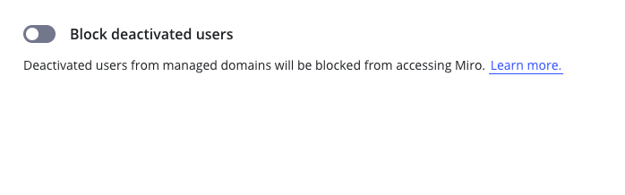

会社の管理者が[ユーザーを非アクティブ化する](01-deactivated-users.md)と、ユーザーは Enterprise サブスクリプションにアクセスできなくなり、SSO でログインできなくなります。非アクティブ化したユーザーは、他の Miro サブスクリプションには引き続き同じメールアドレスでアクセスできます。

さらに、非アクティブ化した[マネージドユーザー](06-managed-users-on-enterprise-plan.md)をブロックして、他の Miro サブスクリプションにもアクセスできないようにすることも可能です。

> **利用可能なプラン：**Enterprise プラン
> **実行可能なユーザー：**会社の管理者

## 非アクティブ化したユーザーのブロック

**設定を有効にした場合：**非アクティブ化したマネージドユーザーは、すべての Miro サブスクリプションへのアクセスがブロックされます。この設定は、サブスクリプション内で現在非アクティブ化されているすべてのユーザーと、将来非アクティブ化されるすべてのユーザーに適用されます。

**設定を無効にした場合：**非アクティブ化したマネージドユーザーは、引き続き会社のメールアドレスとパスワードを使い、他の Miro サブスクリプションにアクセスすることができます。

> **非アクティブ化したユーザーをブロックする**設定を有効にすると、サブスクリプション内でこれまでに非アクティブ化したすべてのユーザーに影響します。設定を有効にする前に、あるいは設定を有効にした状態で新しいドメインを検証する前に、まず非アクティブ化したユーザーのリストを確認し、誰がブロックされるかを把握することをお勧めします。

### 非アクティブ化したユーザーをブロックする方法

1. **設定」** >「**セキュリティー**」>「 **マネージド・ドメイン**」の順に進みます。
2. **[非アクティブ化したユーザーをブロックする]** のトグルをオンにします
   **
   *Enterprise管理コンソールで無効化されたユーザーをブロックします。*

## ブロックされたユーザーにはどのように表示されますか？

ブロックされた非アクティブ化したマネージドユーザーは、すぐにログアウトされます。次回ログインしようとすると、以下のメッセージが表示されます。

*電子メールとパスワードでログインしようとしました。*

*ユーザーがSSOでログインしようとしました*

## 非アクティブ化したユーザーのブロック解除

会社の管理者は、以下の 3 つの方法でユーザーのブロックを解除できます。

**ユーザーを再アクティブ化または再招待する**

ユーザーを再アクティブ化するか、Enterprise サブスクリプションに再招待してドメインを認証します。このユーザーは、ユーザーが所属するすべてのサブスクリプションへのアクセス権を取得します。Enterprise サブスクリプションをあまり使用しない場合は、[制限付き無料](../enterprise-subscription-management/enterprise-licensing/04-free-restricted-license.md)ライセンスを割り当てることもできます。メンバーを招待する方法について詳しくは、Enterprise プランで招待を管理するをご覧ください。

**[非アクティブ化したユーザーをブロックする] 設定のトグルをオフにする**

これにより、非アクティブ化したマネージドユーザー全員のブロックが解除され、会社のメールアドレスで Miro にログインできるようになります。これによって Enterprise サブスクリプションへのアクセス権が付与されることはありません。このオプションは、ユーザーがサブスクリプションから削除されていない場合にのみ機能します。**[Managed domains（マネージドドメイン）]** の設定に移動し、**[非アクティブ化したユーザーをブロックする]** のトグルをオフにします。

**ドメインを削除する**

検証済みドメインのリストから該当するドメインを削除できます。これにより、そのドメインのマネージドユーザーは全員、サブスクリプションから削除されていない限りブロックが解除されます。ドメインを削除するには、会社の設定で、**[セキュリティーとコンプライアンス]** > **[コラボレーション]** に移動し、ドメイン名の横にある **[削除]** をクリックします。

> **✏️** ユーザーの Miro へのアクセスをブロックすると、会社のメールアドレスとパスワード、または SSO で、他の Miro サブスクリプションにログインできなくなります。ブロックを解除しても、明示的にアクセスを許可しない限り、ユーザーに Enterprise サブスクリプションへのアクセス権は付与されません。

## ブロックされたユーザーのシナリオ

この表で、ブロックされたユーザーのさまざまなシナリオで何が起こるかを詳細に理解できます。

|  |  |
| --- | --- |
| アクション | 実行結果 |
| **ユーザーはブロックされる** | |
| 会社の管理者がマネージドユーザーを非アクティブ化する | ユーザーはブロックされる |
| **Enterprise サブスクリプションのメンバーが、**非アクティブ化したマネージドユーザーをチームに招待しようとする | ユーザーはブロックされたままになります。招待者には、ユーザーが非アクティブ化されていて、招待できない、管理者がユーザーを再度アクティブ化できる、というメッセージが表示されます。 |
| 会社の管理者がマネージドユーザーを非アクティブ化し、削除する | ユーザーはブロックされる |
| マネージドユーザーが IdP で非アクティブ化されている | ユーザーはブロックされる |
| マネージドユーザーが IdP の Miro アプリ / グループから削除されている | ユーザーはブロックされる |
| 設定が有効なときに、会社の管理者がドメインを追加して認証する | 非アクティブ化されたリストに入った、新しく認証されたドメインのユーザーは、全員ブロックされます。 |
| 別のサブスクリプション（ドメインが認証されているサブスクリプションとは別のサブスクリプション）の誰かが、非アクティブ化したマネージドユーザーをサブスクリプションに招待しようとする。  マネージドユーザーがサブスクリプションから削除されている場合も同様。 | ユーザーはブロックされたままになります。他のサブスクリプションからの招待は可能で、招待通知が送信されますが、Miro にはログインできません。 |
| **ユーザーのブロックが解除される** | |
| 会社の管理者が非アクティブ化したマネージドユーザーを再度アクティブ化する | ユーザーのブロックが解除される |
| 会社の管理者が、非アクティブ化または削除されたマネージドユーザーをサブスクリプションに招待する。 | ユーザーが招待され、ブロックが解除されます |
| マネージドユーザーが SCIM で再アクティブ化される | ユーザーのブロックが解除される |
| マネージドユーザーが IdP 内の Miro のアプリ / グループに再度追加され、SCIM で同期される | ユーザーのブロックが解除される |
| **Enterprise サブスクリプションのメンバーが、**削除されたマネージドユーザーをチームに招待する | [招待の設定](03-invitation-settings-on-enterprise-plan.md)で、メンバーが新規ユーザーをチームに招待できる場合、そのユーザーは招待され、ブロックが解除されます。 |
| **混合シナリオ** | |
| 検証済みドメインがドメイン管理から削除される | 削除されたドメインの非アクティブ化されたユーザーは、ブロックが解除されます。削除されたユーザーはブロックされたままとなり、ブロックを解除するには、サブスクリプションに再招待される必要があります。 |
| 設定が有効から無効になる。 | 非アクティブ化したマネージドユーザー全員のブロックが解除されます。削除されたユーザーはブロックされたままとなり、ブロックを解除するには、サブスクリプションに再招待される必要があります。 |

## よくある質問

**ブロックされた非アクティブ化ユーザーについて、他のサブスクリプションからは何が分かりますか？**

サブスクリプションでユーザーを非アクティブ化した場合、お使いの Enterprise サブスクリプションでのみ非アクティブ化されます。ブロックが影響するのは、会社のメールアドレスで Miro にログインする機能のみです。ユーザーは、他のサブスクリプションではアクティブに見えますが、会社のメールアドレスでログインすることはできません。

**ユーザーが非アクティブ化され削除された場合、設定が有効になると、Miro へのアクセスはブロックされますか？**

[サブスクリプションから削除しても](01-deactivated-users.md)、ユーザーはブロックされたままになります。ユーザーを削除すると、何らかの影響が及ぶ可能性があります。詳細は、ブロックされたユーザーと非アクティブ化されたユーザーのシナリオをご確認ください。削除されたユーザーのブロックを解除する唯一の方法は、検証済みドメインでサブスクリプションに再招待することです。設定を有効にする前にユーザーがサブスクリプションから削除された場合は、そのユーザーには適用されません。

**この設定は、マネージドユーザー以外のユーザーに影響しますか？**

いいえ。この設定の影響を受けるのは、マネージドユーザーのみです。
