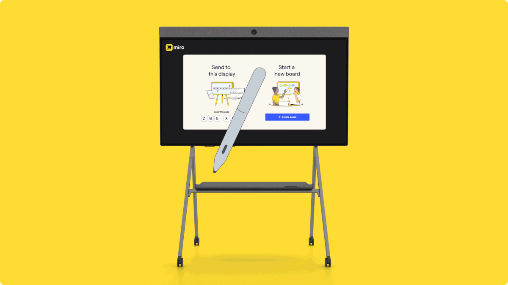
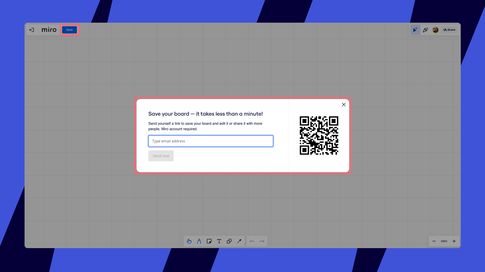
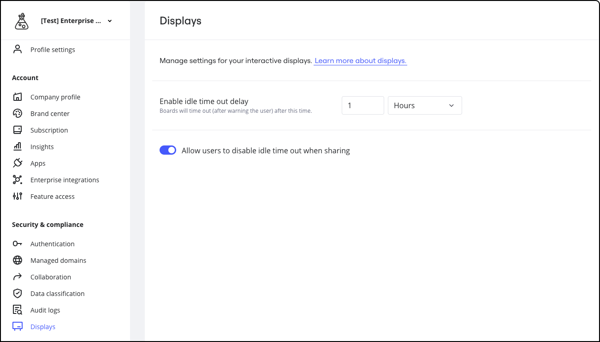

インタラクティブ ディスプレイで Miro を使用することで、ハイブリッド ワークショップやブレインストーミングのセッションを次のレベルに引き上げましょう。

*インタラクティブ・ディスプレイ上の*

## インタラクティブ ディスプレイでの Miro の使用について

Miro は、インタラクティブ ディスプレイで 2 つの方法で使用できます。

- 内蔵 PC がある場合、インタラクティブ ディスプレイ自体を使用する方法
- インタラクティブ ディスプレイに PC を接続する方法

### Miro の推奨ディスプレイ

Miroが互換性と最適なパフォーマンスを保証するためにテストした以下のインタラクティブ・ディスプレイを検討することをお勧めします。

御社のニーズや好みはそれぞれです。そのため、購入前にデバイスをテストし、完璧にマッチすることを確認することが重要です。 [コ](09-selecting-the-right-interactive-display-for-hybrid-collaboration.md)ラボレーションに適したディスプレイの選択の詳細については、こちらをご覧ください。

**PC内蔵ディスプレイ：**

- Neat Board
- DTEN ONboard
- Vibe Board
- [グーグル ミート シリーズワン ボード](12-using-miro-with-google-meet-series-one-boards-beta.md)

**外部PCに接続して表示します：**

- デル インタラクティブ4Kディスプレイ（55～86インチ）
- シャープ（PN-L652B、PN-L752B、PN-L862B）
- NEC製ディスプレイ（WD551、M551/ M651 /M751/ M861 IGB）

**推奨外付けPCセットアップ**

- Dell OptiPlex Micro PC（Intel Core i7 & 16GB RAM搭載）（Windows
- インテルOPS/SDM、Core i7および16GB RAM搭載

## インタラクティブ・ディスプレイでのMiroの設定：アプリとブラウザのオプション

インタラクティブ・ディスプレイでは、Miroアプリを使用するか、ブラウザでMiroを開くことができます。

### Miro アプリ：

- [Windows ベースのディスプレイ用 Miro アプリをダウンロードする](https://desktop.miro.com/platforms/win32/Miro.exe)
- [Vibe Board ディスプレイ用 Miro アプリをダウンロードする](https://vibe.how/en/articles/6880969-how-to-download-and-install-your-favorite-apps-in-vibe-app-store)
- Neat BoardとDTEN ONboard: ディスプレイプロバイダーのカスタマーサクセスマネージャーに連絡して、Miroアプリへのアクセスをアシストしてもらいましょう。

### ブラウザー

- Microsoft Edge ブラウザー（バージョン 85 以上）
- Google Chrome ブラウザー（バージョン 85 以上）

> **[✏️](../../using-miro/essential-tools/10-pen.md) Miro で作業中にアクティブスタイラスを使用している場合、自動的にペンツールに切り替わります。**これは、パームリジェクションを有効にし、指での操作を可能にするモードです。このモードを無効化する（指で描き始める）には、ボードを再読み込みするか、10 分間デジタルペン使用しないようにしてください。

> **✏️ Miro は、ディスプレイごとに 1 つのタッチポイントしかサポートしていません。**

## インタラクティブ・ディスプレイでMiroを起動します。

インタラクティブディスプレイにMiroボードを起動するには、ディスプレイのMiroアプリを使用するか、ディスプレイブラウザを使用するかの2つのオプションがあります。

Miroアプリの使い方 ディスプレイブラウザの使用 Windowsディスプレイ

1. ディスプレイ上でMiroの使用を開始するには、Miroアプリを開きます。ログインは不要です。
2. 選択肢は2つあります：**このディスプレイに送信**すると、携帯電話、タブレット、ラップトップからMiroボードが起動します。**新しいボードを作成する**こともできます。
3. ディスプレイにMiroボードが表示されたら、セッションを開始する準備が整いました。
4. セッションを終了するには、インタラクティブディスプレイの**終了**アイコンをタップしてログアウトするか、Miroウェブまたはモバイルアプリで**共有の停止を**クリックします。

1. ディスプレイでMiroの使用を開始するには、ディスプレイブラウザを開き、[miro.com/displaysに](https://miro.com/displays/)アクセスしてください。
2. 選択肢は2つあります：**このディスプレイに送信**すると、携帯電話、タブレット、ラップトップからMiroボードが起動します。**新しいボードを作成する**こともできます。(Miroボードを直接送って展示したい場合は、[miro.com/send-to-displayを](https://miro.com/send-to-display/)ご覧ください)。
3. ディスプレイにMiroボードが表示されたら、セッションを開始する準備が整いました。
4. セッションを終了するには、インタラクティブディスプレイの**終了**アイコンをタップしてログアウトするか、Miroウェブまたはモバイルアプリで**共有の停止を**クリックします。

1. WindowsディスプレイでMiroの使用を開始するには、Miroアプリを開きます。
2. 物理キーボードまたは仮想キーボードで、*alt*キーを押します。コンテキストメニューが開きます。
3. **Help** >**Public device（** **ヘルプ** >**パブリックデバイス**）を選択します。アプリはインタラクティブなディスプレイ体験に変わります。

:::tip
**自分のプロフィールデータを保護し、次のユーザーがログインできるようにするため、ディスプレイからログアウトすることを**常に忘れないようにしてください。
:::

### ボードの保存

新しいボードを作成すると、保存した後でアクセスすることができます。これを行うには、Miro のアカウントが必要です。

1. ボードの左上で、**[保存]** をクリックします
2. メールアドレスを入力し、**[今すぐ送信]** をクリックするか、QR コードをスキャンします
3. メールアドレスからボードを開きます。QR コードをスキャンすると、ボードはお使いのデバイスで自動的に開きます
4. **新しいボード名を入力**するよう求められます。ドロップダウンから**チームを選択**します
5. **[保存]** をクリックします

*新しいボードを*

## インタラクティブ ディスプレイ上の Miro のツールバー

インタラクティブ ディスプレイ上で Miro を使って作業する場合、作成ツールバーは画面の下部に表示されます。デフォルトでは、[付箋](../../using-miro/essential-tools/14-sticky-notes.md)、[図形](../../using-miro/essential-tools/11-shapes.md)、[テキスト](../../using-miro/essential-tools/16-text.md)、[線](../../using-miro/essential-tools/05-connection-lines.md)、[ペン](../../using-miro/essential-tools/10-pen.md)、蛍光ペン、消しゴムといった、よく使うツールしかありません。その他のツールは「**ツール、メディア、インテグレーション****（＋**）」メニューにあります。

> **[✏️](10-send-to-display.md)** 4K+ のタッチデバイスでブラウザーを使って作業し、Miro へのログインにクイックサインイン機能を使用しない場合は、画面の左側にツールバーが表示されます。

*インタラクティブ・ディスプレイでのMiroの使用*

## インタラクティブ・ディスプレイのタイムアウト設定

管理者は、組織内のインタラクティブ・ディスプレイにカスタムのタイムアウト設定を適用することができます。定義できる設定は2つあります：

1. アイドルタイムアウト期間。
2. 個々のユーザーがアイドルタイムアウトを上書きできるかどうか。

これらの設定は、「**セキュリティーとコンプライアンス**」>「**ディスプレイ**」でアクセスできます。

*インタラクティブ・ディスプレイのタイムアウト設定*

## 組織内の複数デバイスに Miro を導入する方法

Miro の提供する各種インストーラーにより、IT 管理者は数千のマシン上のユーザーに Miro を展開することができます。

その方法については、[デスクトップアプリの](05-desktop-app.md)記事の「*Miroを複数のデバイスにデプロイする*」のセクションを参照してください。

> インタラクティブ ディスプレイを使用して Miro でハイブリッド会議を開催するヒントをご覧ください。
