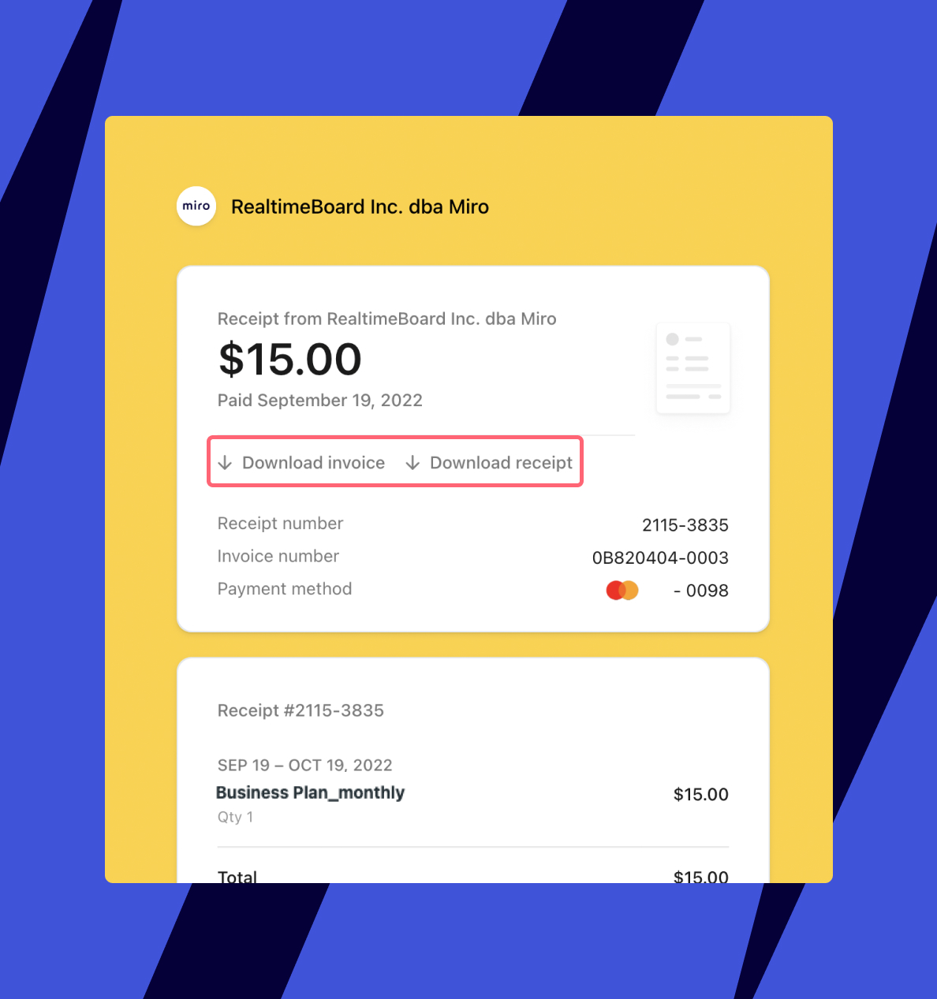

税務上または会計上必要となるため、会社情報を使用して請求書をダウンロードしてください。請求書は、お支払い関連メールから直接ダウンロードするか、プラン設定からダウンロードすることができます。

> **該当プラン**: Starter、Business プラン
> **実施者:** チームの管理者、会社の管理者、支払い管理者

:::note
請求設定にアクセスできない場合は、Miro の管理者に連絡してサポートを依頼してください。
:::

## 請求書を検索する方法

すべての請求書は、当社の支払いプロバイダーである Stripe によって生成されます。すべての請求書と領収書は、プラン設定で確認できます。また、すべての請求書と領収書は Miro のお支払い関連のメールで受信できます。

1. プロフィールのアバターをクリックし、**Admin console**をクリックします。
2. 左のサイドバーで**お支払い**をクリックします。
   お支払いの概要ページが表示されます。
3. 上部の**請求書**タブをクリックします。

:::warning
Free プランにダウングレードした場合、請求設定にアクセスできなくなります。過去の請求書を閲覧するには、[Stripe の請求メール](07-understanding-your-invoice.md)をメールボックスで検索してください。
:::

## 請求書をダウンロードする方法

請求書をダウンロードする方法は、2 つあります。

請求設定 請求メール

1. 上記の手順に従って請求書を見つけます。
2. 請求書の横にある**[ダウンロード]**をクリックします。
3. 請求書は、ブラウザのダウンロード用デフォルトフォルダーに保存されます。ブラウザの設定によっては、ダウンロードする前に保存場所を指定するように求められることがあります。

**クレジットカード**

クレジットカードでお支払いの場合、請求書のメールを受け取ります。そのメールには**請求書をダウンロード**と**領収書をダウンロード**のオプションがあります。

*請求書のメールから請求書をダウンロードする*

**請求書発行**

請求書払いの場合、**請求書をダウンロード**するオプションが含まれた請求メールが届きます。請求書を支払うと、支払い領収書が記載された 2 通目のメールが届きます。

:::warning
請求書を支払うために会社情報を変更する必要がある場合は、 [Miro サポート](../../using-miro/tools/troubleshooting/06-contacting-miro-support.md)に連絡してください。
:::

*請求メールから請求書をダウンロード*
