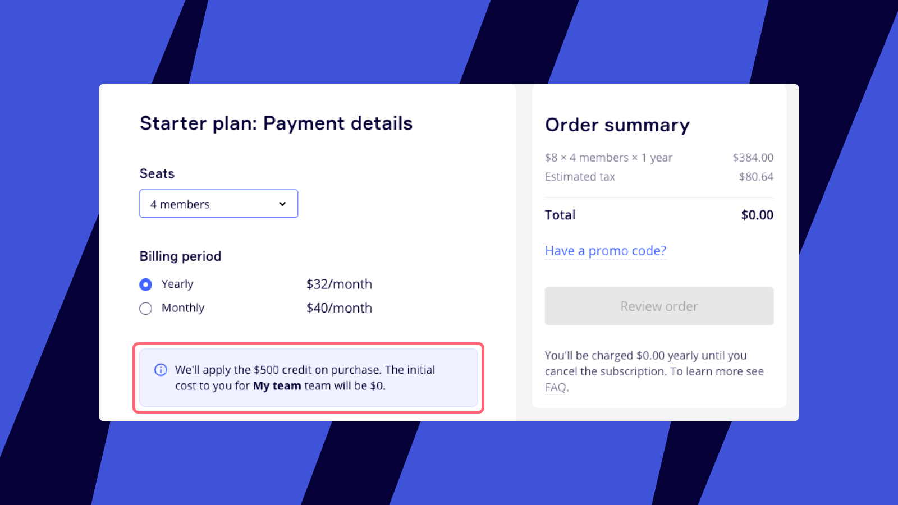

Miro は、デジタル付箋を使ったブレインストーミングから、ビジネスを実現するためのアイデアの企画や視覚化まで、スタートアップが効率よく共同作業できるようにすることを目指しています。Miro スタートアッププログラム、応募資格、応募方法についてご覧ください。

<iframe allow="encrypted-media" allowfullscreen="" frameborder="0" src="//www.youtube-nocookie.com/embed/qNJcNHJpkhI?si=pCHC2AqfWeKbR1vw" style="width: 100%; aspect-ratio: 16 / 9;"></iframe>

## スタートアップ企業の資格

### グローバルなスタートアップ企業のパートナーとの連携

グローバル[Miro スタートアップ プログラムのパートナー](https://docs.google.com/spreadsheets/d/17YVHVfvejQ5gOYUbCUKQ309YoEsUaYn_iX1FgyDO8FQ/edit#gid=0)と連携しているスタートアップは、1,000 ドルのクレジットを受け取る資格があります。

申請が受理されるためには、スタートアップが以下の条件を満たさなければなりません:

- Miro の有料サブスクリプションの管理者またはメンバーではないこと
- Miro スタートアップ プログラムのパートナーと連携していること
- 独立所有、運営であること（親会社が所有していない）
- 従業員 30 人未満であること
- *サービスプロバイダー（コンサルティングなど）ではないこと*

### 単体のスタートアップ企業

単体のスタートアップ企業は 500 ドルのクレジットを取得できます。個々のスタートアップ企業をケースバイケースで受け入れます。すべての応募した独立型スタートアップ企業にアクセス権を付与することは保証できません。

スタートアップ企業と見なされるには、以下の申請条件が必要です。

- Miro の有料サブスクリプションの管理者またはメンバーではないこと
- 資金調達を受けていること、Crunchbase 経由で確認済みであること
- 独自ドメインを所有していること（例：*gmail.com、yahoo.com、hotmail.com ではない*）
- *サービスプロバイダー（コンサルティングなど）ではないこと*

## スタートアップ プログラムのポリシー

Miro のスタートアップ企業向けプログラムのパートナーに連携していない場合でも、個々のスタートアップ企業として申請して 500 ドルのクレジットを取得できます。
:::note
スタートアッププログラムの申請が処理される間、Freeプランのままでお待ちください。この間にトライアルサブスクリプションに申し込むと、申請の資格に影響がある可能性がありますので、ご注意ください。
:::

あなたが[Miro Startup Programパートナー](https://docs.google.com/spreadsheets/d/17YVHVfvejQ5gOYUbCUKQ309YoEsUaYn_iX1FgyDO8FQ/edit#gid=0)と連携している場合は、アクセラレーター、インキュベーター、またはベンチャーキャピタリストから直接申請フォームを入手できます。

申請が審査される間も、[Miroに登録](../../getting-started/start-here/02-how-to-register-with-miro.md)して、[Freeプラン](../miro-plans/09-free-plan.md)にアクセスすることができます。

申請が承認されると、支払いページへのリンクが記載された通知メールが届きます。リンクに従ってチームをアップグレードするか、[ダッシュボード](../manage-your-subscription-and-plan/03-upgrade-your-plan.md)からもアップグレードできます。どのプランでも選択できますが、[Starter プラン](../miro-plans/08-starter-plan.md)をお勧めします。Starter プランは小規模なチーム向けに設計されており、すべての基本的な有料[機能](../miro-plans/02-plans-and-features-available.md)を含んでいます。支払いページでは、1,000 ドル / 500 ドルのクレジットが購入時に適用される旨のメモが表示されます。

:::warning
クレジットは、申請フォームで指定されたメールアドレスと紐づけられます。他のユーザーがアップグレードを行った場合、不要なクレジットカードの請求が発生する可能性があります。
:::

*Miro のスタートアップ プログラム参加者の支払いページ*

## すでに支払いをしている場合はどうなりますか？

われわれは、ベンチャーキャピタル支援を受けているスタートアップには、Enterprise プランで25%の割引を提供しています。Enterprise プランは高度なセキュリティー、コンプライアンス、管理コントロールを提供し、大規模な組織向けにカスタマイズされた専用の顧客サポートとカスタマイズオプションも備えています。それに対して、Starter プランは小規模なチーム向けに設計されており、Miroを始めるための基本的な機能を提供しますが、Enterprise プランのような広範な管理機能やセキュリティー機能はありません。こちらからお申し込みください：`https://miro.com/startups/scale-offer-vc/`

## よくある質問

**購入金額が 1,000 ドル / 500 ドル以上になった場合はどうなりますか？**

クーポンコードは、1,000 ドルのみ有効です。それ以上は、自己負担となります。例えば、20 人のチームの場合、Starter プランの年間支払いは 1,920 ドルです。したがって、差額分 920 ドルの支払いが必要になります。

**購入額が 1,000 ドル / 500 ドル未満になった場合はどうなりますか？**

クーポンは、1,000 ドルに達するまで使用できます。

**後でプランを変更した場合はどうなりますか？**

プランを変更（ダウングレードまたはアップグレード）すると、プロモーションが失効します。

**何人のチームメンバーを招待できますか？**

必要に応じて何人でもユーザーを招待できます。例えば、Miro の Starter プランの料金は、メンバー 1 人当たり月額 10 ドルです。つまり、20 人のチームの場合、1,000 ドルのクレジットは、月次サブスクリプションで 5 か月間、Miro を無料で使えることになります。

**特定数のメンバーでアップグレードした後、同じクレジットを使用してさらに数人追加することはできますか？**

はい、複数のライセンスを購入し、クレジットを使用してさらにライセンスを追加することができます。クレジットの限度額（1,000 ドルまたは 500 ドル）に達すると、クレジットカードに支払額が請求されることになります。

**スタートアップ企業向けプログラムに参加した場合のみ、Starter プランにアップグレードできますか？**

申請が承認された旨のメールに記載されたリンクをたどると、Starter プランの購入ページにリダイレクトされます。ただし、他のプランを選択することも可能で、その場合はダッシュボードからチームをアップグレードするだけです。

## 利用規約

**対象となる資格**

対象となる参加者は、以下の資格要件を満たす必要があります。1. リクエストにより Miro に資格証明を提出すること。2. 現在、アクティブなサブスクリプション、期限切れのサブスクリプション、またはトライアルの有料サブスクリプションの管理者やメンバーでないこと。3. 差別禁止ポリシー。年齢、民族、性別、国籍、障害、人種、体格、宗教、性的指向、または社会経済的背景に基づく差別を擁護、支持、実践することは禁じられます。対象となる参加者は、このプログラムに参加するため、これらのいかなる理由においても差別しないことに同意し、またそれを証明できることが必要です。

**プログラム利用規約**

対象となる参加者は、Miro 標準のサービス利用規約に同意しなければなりません。本オファーは、対象者のみが直接購入して使用することができます。譲渡または再販は固く禁止されています。過去の購入には適用されず、大口購入割引または他の製品やオーダーレベルのプロモーション、割引、オファーと併用することはできません。現金と交換することもできません。Miro には、このプログラムとサービス利用規約をいつでもキャンセル、変更、一時停止、終了する権利があります。また、Miro は、単独の裁量により、いかなる対象となる参加者への販売を拒否する権利を留保します。

**プロモーション権とケーススタディーへの参加**

対象となる参加者は Miro が参加者名またはロゴを使用して、参加者をユーザーとして識別することを許可し、Miro から要求された場合、ケーススタディーまたはお客様の声に参加することに同意する必要があります。
