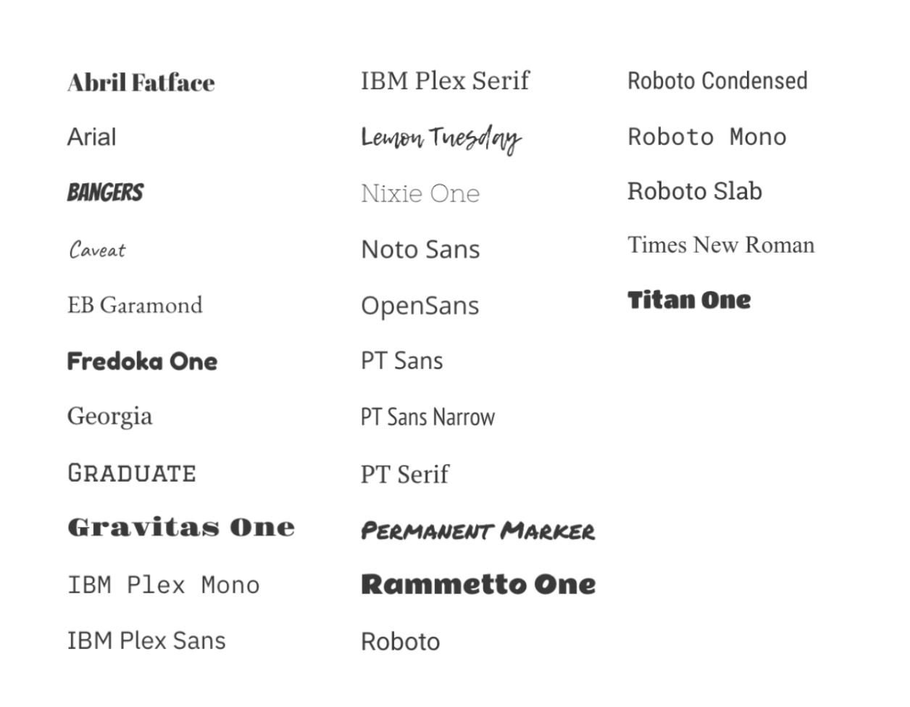

20 種類以上のベストセラーフォントを備えた Miro のフォントコレクションを活用して、コンテンツを魅力的で分かりやすく仕上げましょう。重要なポイントを強調し、テキストに関心を集めましょう。

## フォントを変更

:::tip
フォントをアップロードしてチームコンテンツの作成を簡素化しましょう あなたの[ブランド センター](../../administration/get-started-as-a-miro-admin/04-brand-center.md)へ。
:::

Miro でテキストのフォントを変更するには、テキストや図形をハイライトし、ドロップダウンメニューからフォントを選択します。

*テキストのフォントを変更*

一つのテキストボックス内の特定の単語やフレーズに対してフォントを選択することはできません。それはオブジェクトのテキスト全体に適用されます。文書、スライド、[図形](11-shapes.md)および[テキストボックス](16-text.md)のフォントを変更できます。[付箋](14-sticky-notes.md)は2種類のフォントスタイルに対応しています。[カード](02-cards.md)、[接続線](05-connection-lines.md)、および[マインドマップノード](../advanced-tools/03-mind-map.md)は、複数フォントをサポートしていません。

## 利用可能なフォントと機能

*Miro フォントギャラリー*

|  |  |  |  |
| --- | --- | --- | --- |
| **名前** | **ラテン** | **キリル** | **太字 / 斜体** |
| Abril Fatface | ✔ | ✘ | ✘ |
| Bangers | ✔ | ✘ | ✘ |
| EB Garamond | ✔ | ✔ | **ボールド** / - |
| 卒業 | ✔ | ✘ | ✘ |
| Gravitas One | ✔ | ✘ | ✘ |
| Fredoka One | ✔ | ✘ | ✘ |
| Lemon Tuesday | ✔ | ✔ | **太字** / *イタリック* |
| Nixie One | ✔ | ✘ | ✘ |
| OpenSans | ✔ | ✔ | **太字** / *斜体* |
| Permanent Marker | ✔ | ✘ | **ボールド**/ - |
| PT Sans | ✔ | ✔ | **太字** / *斜体* |
| PT Sans Narrow | ✔ | ✔ | **太字**/ - |
| PT Serif | ✔ | ✔ | **太字** / *斜体* |
| Rammetto One | ✔ | ✘ | **太字**/ *斜体* |
| Roboto | ✔ | ✔ | **太字**/*斜体* |
| Roboto Condensed | ✔ | ✔ | **ボールド**/*イタリック* |
| Roboto Slab | ✔ | ✔ | **ボールド**/*イタリック* |
| 但し書き | ✔ | ✘ | **太字**/ - |
| Titan One | ✔ | ✘ | **ボールド**/*イタリック* |
| ジョージア | ✔ | ✔ | **太字**/*斜体* |
| Times New Roman | ✔ | ✔ | **太字**/*斜体* |
| Arial | ✔ | ✔ | **太字**/*斜体* |
| IBM Plex Mono | ✔ | ✔ | **太字**/*斜体* |
| IBM Plex Sans | ✔ | ✔ | **ボールド**/*イタリック* |
| IBM Plex Serif | ✔ | ✔ | **ボールド** /*イタリック* |
| Noto Sans | ✔ | ✔ | **太字**/*斜体* |
| Robot Mono | ✔ | ✔ | **太字**/*斜体* |

## よくある質問

Miro にその他のフォントを追加することはできますか？

はい、[ブランドセンター](../../administration/get-started-as-a-miro-admin/04-brand-center.md)を通じてブランドフォントをアップロードできます。

フォントの色を変更することはできますか？

[テキストボックス](16-text.md)、[図形](11-shapes.md)、[マインドマップノード](../advanced-tools/03-mind-map.md)、[接続線](05-connection-lines.md)のフォントの色を変更できます。テキストの色は[付箋](14-sticky-notes.md)および[カード](02-cards.md)では変更できません。

ボードのデフォルトフォントを設定できますか？

テキストボックスや図形を作成する時に使用するフォントは、現在の作業セッション中にボードで新しいテキストボックスや図形を作成する際に同じになります（ボードを再読み込みするまで）。すべての既存のテキストボックスや図形のフォントを変更したい場合は、ボード上のすべてのオブジェクトを選択してください（**Ctrl + A** *for Windows* または **Cmd + A** *for Mac* を使用できます）、[テキストや図形をフィルター](../working-on-the-board/21-work-smarter-not-harder.md)し、フォーマットを変更します。
