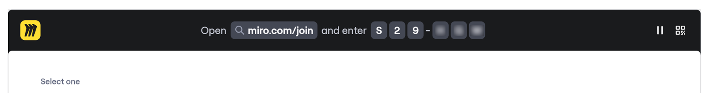

アクティビティーは、Miro Engage の中核機能であり、会議やワークショップの参加者の関心を高め、参加者のインサイトを大規模にキャプチャするためのツールです。アクティビティーは、ファシリテーターが Miro ボード上でインタラクティブな演習（複数選択やオープンエンドの質問など）を実行できるようにします。

ユーザーは、ボード上で直接参加するか、QRコードをスキャンしてコードを入力することでモバイルから参加でき、アカウントやアプリのダウンロードは不要です。

回答はリアルタイムで視覚化されるため、ワークショップやプレゼンテーションがより包括的でダイナミックになります。

アクティビティーはMiro スライドを使用すると最も効果的ですが、ボードの任意の場所に配置できます。また、AI フローやサイドキックと組み合わせて使用することも可能です。

:::note
アクティビティーはベータ期間中無料です。
:::

## キャンバスにアクティビティーを追加する

アクティビティーはキャンバスに直接追加できます。追加するには、以下の手順に従います：

1. **ツール、メディアとインテグレーション** アイコンまたは **フレーム** アイコンを作成ツールバーでクリックします。
2. **Activities** を検索して選択するか、フレームメニューからアクセスする場合は **Activities** を選択します。
3. スライドがキャンバスに追加されます。参加手順のスライドと、追加したいアクティビティを選択できる2番目のスライドです。
4. 2番目のスライドで追加したいアクティビティを選択します。
5. フレーム内で他のアクティビティスライドを追加するには、既存のスライドの横にある **テンプレートを追加** アイコンをクリックし、**Activities** タブを選択します。
6. 「**アクティビティー**」タブで、追加したいアクティビティーを選択します。

## アクティビティーをスライドに追加する

1. ボード上で新しい Miro スライドデッキを作成するか、スライドが含まれている既存のボードを開きます。**詳細情報：**[Miro スライド](../formats/13-miro-slides.md)。
2. 既存のスライドの隣にある**テンプレートを追加**アイコンをクリックし、新しいスライドを追加するためのモーダルを開きます。
3. モーダルで**アクティビティー**タブに切り替えます。
4. 以下のオプションから選択します:
   1. **参加インストラクションスライド:**参加者が参加するための QRとセッションコードを表示します。
   2. **多肢選択式投票:**複数の回答選択肢を持つ投票質問を作成します。
   3. **自由形式の質問:**聞き手から書かれた回答を集めます。
   4. **ワードクラウド:**集めた最も頻繁な回答を視覚化します。
5. 新しいアクティビティースライドに該当するコンテンツを追加します。

## 個別のアクティビティーをキャンバスに追加する

アクティビティーはキャンバスでも機能します。追加するには、以下の手順に従ってください:

1. 「**ツール、メディア、インテグレーション**」のアイコンをクリックします。
2. 「**選択肢が複数ある選択**」、「**自由回答**」、「**ワードクラウド**」のいずれかを検索して選択します。利用可能なオプションを確認するために、アクティビティーを検索することもできます。
3. アクティビティーを配置したいボードをクリックします。
4. 新しいアクティビティーに適用可能なコンテンツを追加します。

## 使用可能なアクティビティー

### **参加手順**

「参加案内」アクティビティーは、新しいスライドを追加するときに利用可能です。これにはQRコードとコード付きリンクが含まれており、モバイルデバイスのユーザーがアクティビティーに参加できるようになります。

### **選択式**

選択式アクティビティーは、アンケートを実施して意見を集め、テーマについての合意を得ることができます。

「選択式」アクティビティーを追加した後:

1. 適切なフィールドにアンケートの質問またはテーマを入力します。
2. **オプション**欄に選択肢を入力します。リストの下部にある**オプションを追加**ボタンで、さらに選択肢を追加できます。
3. **編集完了**をクリックして、スライドを完成させます。

**設定**

- 結果を % で表示: 投票数の代わりに投票の割合を表示します。
- 匿名投票: 投票された際の名前とアバターを非表示にし、匿名で入力できます。
- 複数投票を許可: 最大20票まで、1人のユーザーが複数のオプションを選択できるように設定します。

ユーザーがモバイルデバイスから投票する際は、**送信**を押す前にチェックボックスのチェックと解除ができます。キャンバス上では、アクティビティが停止されるまで参加者は投票を行ったり変更したりすることができます。

### **自由記述**

自由記述アクティビティでは、トピックについての考えを自由にテキストで収集することができます。

自由記述アクティビティを追加後:

1. **アンケートの質問を入力** フィールドにテキストを入力します。
2. **編集を完了** をクリックして、オープンエンデッドのスライドをキャンバスに追加します。

**設定**

- 匿名回答: 提出された回答の名前とアバターを非表示にして匿名入力にします。
- 1 人あたりの回答数を制限: 1 人あたりの回答数を設定できます。初期設定では制限はありません。

アクティビティが開始されると、ユーザーはデバイスまたはキャンバスから回答を追加できます。提出した回答は変更できません。

### **ワードクラウド**

ワードクラウドアクティビティーは、トピックに関する最も人気のある考えを視覚化することができます。より頻繁に使用される単語は、ワードクラウド内で大きく表示されます。

ワードクラウドアクティビティーを追加した後：

1. **質問を入力**フィールドにテキストを入力します。
2. **編集の完了**をクリックして、ワードクラウドスライドをキャンバスに追加します。

**設定**

- 匿名回答: 提出された回答の名前とアバターを非表示にして匿名入力にします。
- 1 人あたりの回答数を制限: 1 人あたりの回答数を設定できます。デフォルトでは、制限はありません。

## アクティビティーを使ったプレゼンテーション

Miro スライドデッキのコンテキストメニューで**プレゼンテーションを開始**をクリックします。

**参加方法のスライド**に到達すると、参加者は次の方法でどのデバイス（スマートフォン、ラップトップ、タブレット）からでも参加できます。

1. スマートフォンのカメラでQRコードをスキャンする。
2. miro.com/joinを訪れてセッションコードを入力する。セキュリティーのため、6桁の参加コードは10分ごとに変更されます。

通常のプレゼンテーションのようにスライドを操作します。進行に連れて参加者はアクティビティーを見て操作することができます。

:::note
アクティビティーがないスライドが表示された場合、参加者は**アクティビティーを待機中**画面を見ることになります。
:::

##

## アクティビティーに参加する

### モバイルデバイスから

ファシリテーターによって共有された**QRコード**をスキャンするか、または[miro.com/join](http://miro.com/join)で6桁のコードを入力することでアクティビティーに参加できます。参加するのにMiroアカウントは必要ありません。

参加する際に、名前の入力を求められます。

ファシリテーターがアクティビティーを表示していない場合、**次回のアクティビティーを待機中**のページが表示されます。

ファシリテーターがアクティビティーを開始すると、ページが更新され、参加できるようになります。

[miro.com/join](http://miro.com/join)経由で接続されたデバイス上で名前や地域を変更するには、右上のアバターをクリックしてプロファイル設定を調整します。

### ボード上で

コラボレーターは、ボード上で直接アクティビティーに参加できます。プレゼンターは、アクティビティーを開始する前に参加者がボードに招待されていることを確認してください。

## アクティビティーの使用方法

プレゼン中、参加者はアクティビティー用のスライドのトップバーに表示される参加リンクとコードを使用してアクティビティーに参加できます。また、QRコードを表示することで、モバイルユーザーがQRコードのアイコンをクリックして簡単に参加できるようにすることもできます。

*スライドの上のツールバーからアクティビティーに参加*

アクティビティーは、コンテキストメニューの**アクティビティーを停止**アイコンをクリックすることで終了できます。また、**アクティビティーを開始**アイコンをクリックすることで再開できます。

アクティビティーは、回答がある場合に、コンテキストツールバーからアクティビティーを停止してから**リセット**アイコンをクリックすることでリセットできます。これによりすべての回答が削除されますが、アクティビティーの設定（タイトルやオプションなど）は保持されます。

アクティビティーが停止された後は、コンテキストツールバーの**編集**アイコンをクリックすることで編集できます。アクティビティーに回答が含まれている場合、変更を行うにはアクティビティーをリセットする必要があります。

### **アクティビティーの回答をエクスポート**

参加者の入力を収集したいスライドを選択し、コンテキストメニューから**エクスポート**アイコンをクリックします。回答は付箋またはテーブルにエクスポートすることができます。
