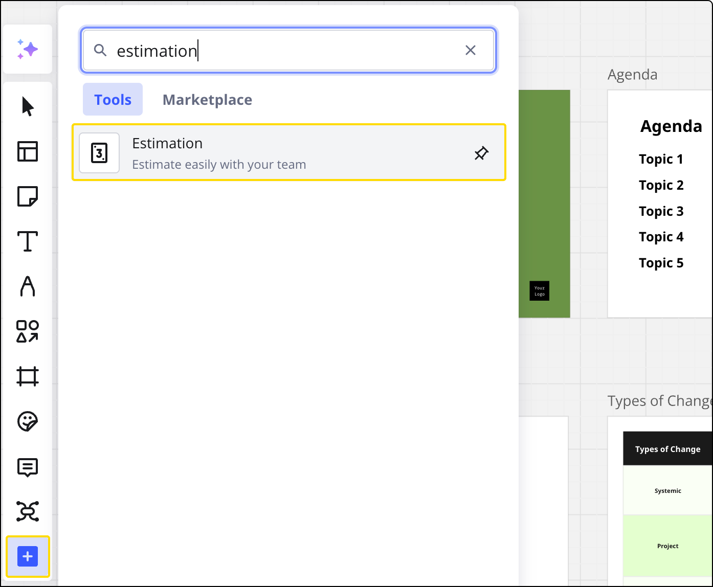
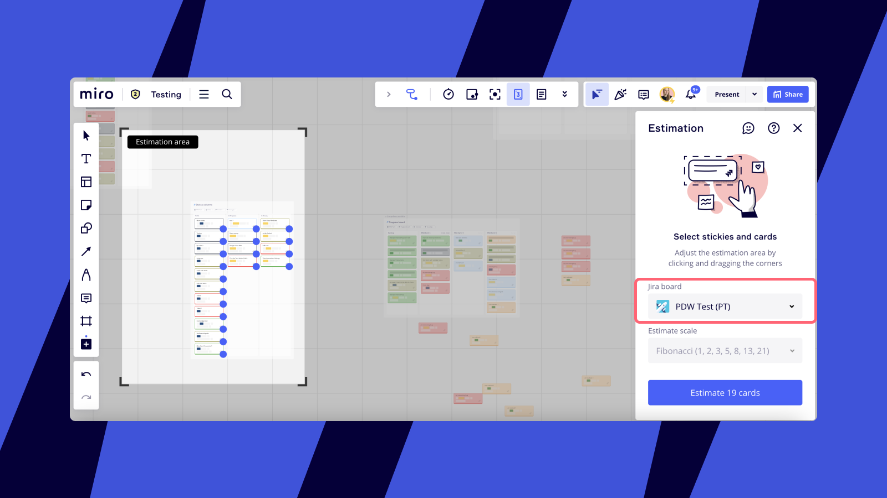

工数見積はアジャイル開発とそのプランニングにおいて重要なプロセスです。工数見積は、チームメンバーの作業範囲の認識合わせ、分析や理解のギャップの特定、納品イメージの明確化に役立ちます。

チームメンバーが工数を見積もる際は、タスクの完成までに必要な作業量を数字（工数）にしてタスクに割り当てます。Miro の工数見積アプリでは、見積をより現実的なものにするため、以前の数字を集計する方法を採用しています。工数の集計が終わったら、チームで話し合い、数字について合意することができます。

Miro の工数見積アプリなら、Miro ボードで[カード](../essential-tools/02-cards.md)、[付箋](../essential-tools/14-sticky-notes.md)、[Jira カード](../../integrations-apps/atlassian/03-jira-cards.md)などのツールを利用して、マルチプレイヤーによる工数見積セッションを行うことができます。

> **利用可能なプラン**：Starter、Business、Enterprise
> **設定者**：ボードの編集権を持つチームメンバー

工数見積を開始するには

1. 作成ツールバーから工数見積アプリにアクセスし、**新規セッションの開始を**選択します。**ツール、メディア、インテグレーション** （+）アイコンから工数見積アプリを追加する必要があるかもしれません：
   *ツールバーの工数見積アプリ*
2. 工数見積の種類を選択：ドロップダウン メニューから、**T シャツ**（Miro の[カード](../essential-tools/02-cards.md)でのみ利用可能）または **フィボナッチ**見積もりを選択します。
3. 「工数見積エリア」の範囲を調整して、複数のオブジェクトをまとめて選択することができます。工数見積には、カード、付箋、[Jira カード](../../integrations-apps/atlassian/03-jira-cards.md)が選択できます。青い点をクリックすると、特定のオブジェクトを見積もりから除外できます。
4. Jira カードを選択している場合は、カードが属する Jira ボードを選択するように求められます。これにより、見積もりが正確かつ確実に Jira に保存されます。この手順を行わないと、見積もりの Jira への保存は保証されません。
5. 見積もりを開始する準備ができたら、[**カード/付箋を見積**] をクリックしてください。*工数見積もりセッションを開始**Jira カードで工数見積アプリを使用*

ボード上の全員（見積セッション中にボードに参加したユーザー含む）が、工数見積セッションに参加できます。参加する全員に、ボードの編集権限と Jira のアクセス権限が必要です。工数見積は、同時にも非同期でも実施できます。工数見積の入力はすべて匿名です。

*工数見積セッション参加のポップアップ*

[**見積に参加**] をクリックすると、最初の項目にリダイレクトされ、工数見積を追加できます。ユーザーは、すべての項目に投票することも、一部の項目をスキップして特定の項目のみに投票することもできます。見積を編集するには、ペンのアイコンをクリックします。

*進行中の工数見積*

セッションの実施中、ファシリテーターは、各項目に追加された見積もりと、見積もりを追加したユーザーのアバターを確認できます。必要な参加者全員からすべての項目の見積もりが追加されると、ファシリテーターは、各項目の「最終的な見積もりを選択」することができます。ファシリテーターは、合意した見積もりを編集することもできます。

*工数見積もりの終了*

すべての項目の見積もりに同意すると、ファシリテーターには、セッションを終了して結果を共有するオプション画面が表示されます。またファシリテーターは、**全員の見積を終了**をクリックして、いつでもセッションを終了することもできます。これにより、合計ポイントの数が表示されます。ポップアップで、[**終了して結果を共有**] をクリックすると、セッションの結果が保存されます。

*工数見積の合意*

Miro のカードや付箋で実施した工数見積は、カードや付箋上にタグとして表示されます。

*カードの工数見積をタグで表示*

**フィボナッチ**を使用して Jira カードを見積もりした場合、見積もりは Jira に保存されます（現時点では、同期されるのはフィボナッチ見積りのみです）。進行役が Jira カードの工数見積を確定するには、認証情報を使って Jira にログインしておく必要があります。見積もり結果は、対応する Jira 課題と自動的に同期されます。
 を選択します

**Jira カードとタスクにフィボナッチ工数見積が表示されるようにするには：**

1. Jira でストーリーポイントのフィールドが設定されていること
2. Jira でストーリーポイントのフィールドの値を更新するために必要な権限を有していること
