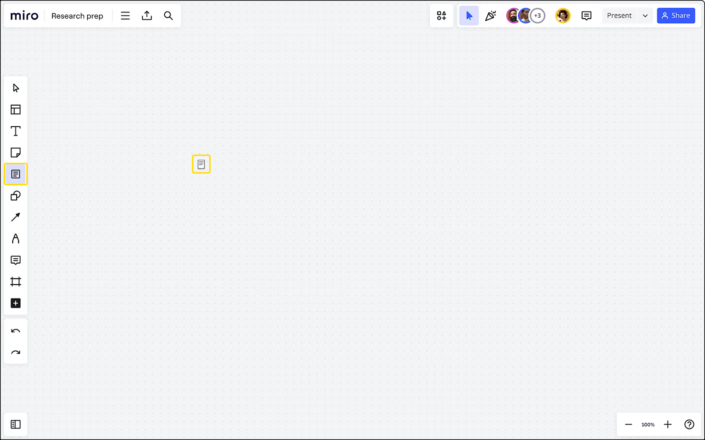
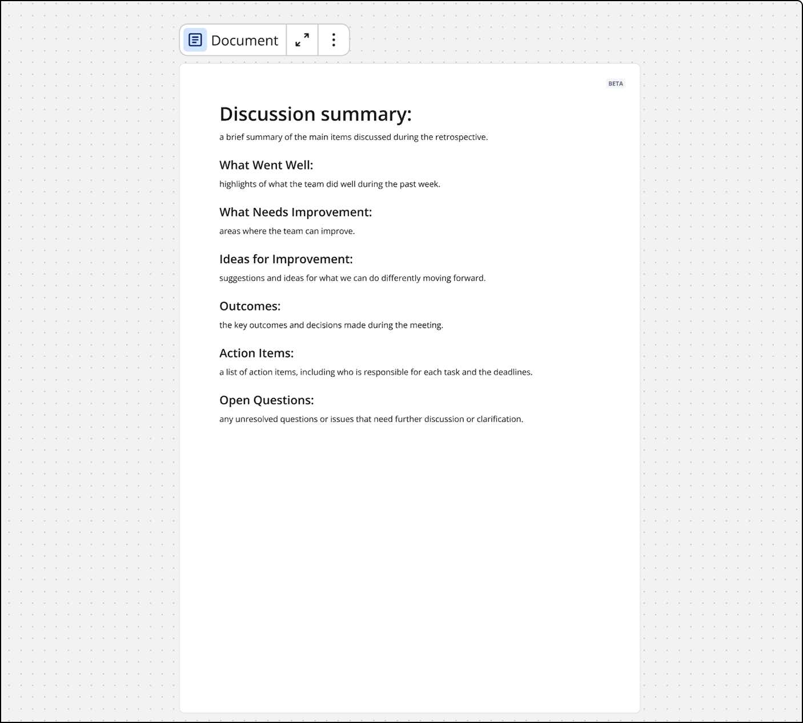
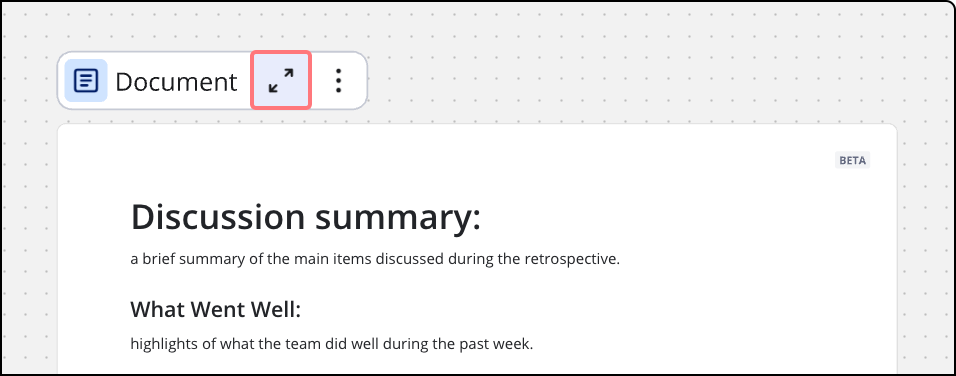
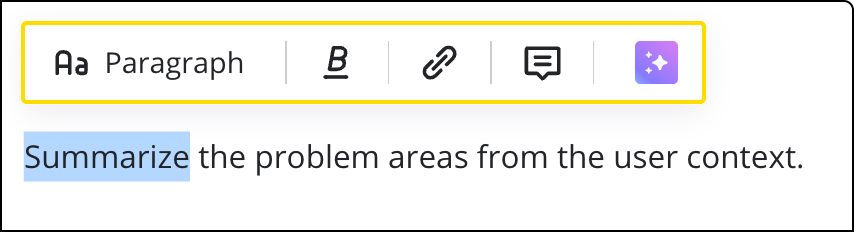
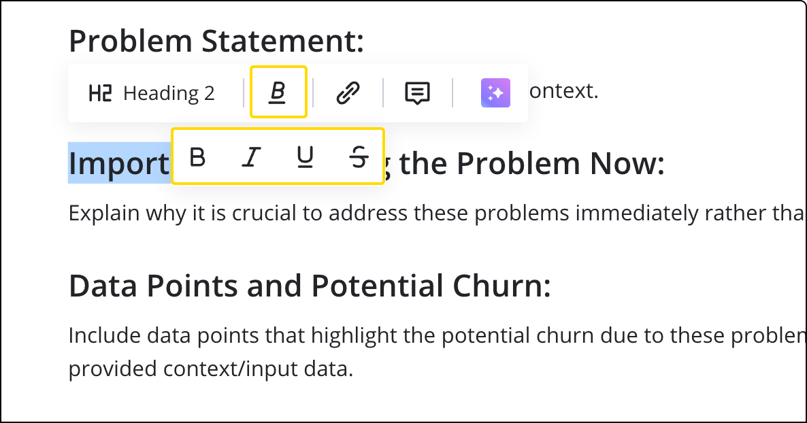
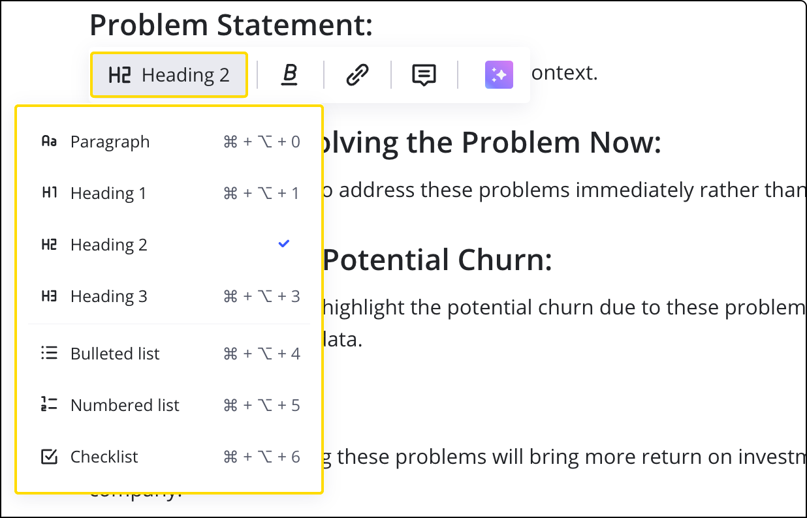

ボード上のコンテンツを、より構造化された文書の形式に変換します。キャンバス上のオブジェクトを入力情報として使用し、要約や調査レポート、製品概要を作成して、インサイトのまとめや分析ができます。

## 文書にアクセス

新しい文書を追加するには：

1. **ツール、メディア、インテグレーション** () アイコンをクリックします。
2. **文書**を検索して選択します。
3. キャンバス上の任意の場所をクリックして追加します。

ドキュメントがすでに追加されたテンプレートもあります。

*文書アイコンから新規ドキュメントを追加*

Miro AIで文書を追加することもできます。

1. 作成ツールバーの**Miro AI** () アイコンをクリックします。
2. **フォーマット**タブを選択します。
3. **文書**を選択します。
4. プロンプトを入力するか、既存のオプションから選択し、ニーズに合わせてカスタマイズします。
5. **Enter**キーを押して、Miro AI で文書を作成します。

*Miro AI による文書の追加*

コンテキストメニューから文書を追加する方法：

1. ボード上にある複数のオブジェクト（付箋など）を選択して文書を作成します。
2. コンテキストメニューで**Miro AI** () アイコンをクリックします。
3. サブメニューから**ドキュメント**を選択します。
4. テンプレートを選択するか、**カスタムプロンプト**を使用します。
5. 文書が作成され、ボードに配置されます。

*コンテキストメニューによる文書の追加*

Miro AI で文書を追加する方法：

1. **AIで作成**パネルを開きます。
2. **ドキュメント**のコンテンツ種別を選択します。
3. あらかじめ用意されたプロンプトを使用するか、自分でプロンプトを書いてください。
4. 必要に応じて、ボード上のオブジェクト（付箋など）を選択し、背景情報を追加します。
5. **ドキュメントを作成**をクリックします。
6. 生成されたドキュメントはキャンバス上の空白エリアに追加されます。

Microsoft Word (.docx) ファイルからドキュメントを追加するには:

1. **ツール、メディア、インテグレーション**（**+**）アイコンをクリックします。
2. **アップロード**を検索して選択します。
3. アップロード パネルで**マイ デバイス**を選択します。
4. アップロードしたいファイルを見つけて選択します。
5. または、ファイルをドラッグ&ドロップして Miro ボードにアップロードします。
6. ダイアログで**Doc に変換**を選択します。
7. **選択**をクリックします。
8. ファイルが Miro Doc に変換され、編集が可能になります。

## Miro 文書のテンプレート

現在、新しい文書を開始する際に次の 4 つのテンプレートが利用できます：製品概要、ふりかえりの要約、会議メモ、リサーチシンセシス。

新しい文書を作成してテンプレートを選択すると、文書にテンプレートが追加されます。

*ふりかえりの要約テンプレートの例*

## 文書のコンテキストメニュー

文書を作業しているとき、追加の機能はコンテキストメニューで見つけることができ、**三点リーダー** (**...**) アイコンをクリックしてアクセスします。コンテキストメニューでは、コピー、同期、レイヤーの移動と優先順位の設定、エクスポートと共有、コメント、テンプレートとして保存などの機能にアクセスできます。

## フォーカスモードでの文書作業

文書をフルスクリーンのフォーカスモードで開くと、ボード上の他のコンテンツではなく、作業中の文書に集中できます。このモードにアクセスするには、作業中の文書の上にある**フォーカスモード アイコン**をクリックします。

*文書フォーカスモードのアイコン*

フォーカスモードには、テキストをフォーマットするためのコンテキストメニューも含まれています。これにより、ボードの背景が削除されて、気を散らすものを排除できます。

フォーカスモードはMiroモバイルアプリでも利用可能です。モバイルではボード上の文書を閲覧できますが、文書の編集はフォーカスモードでのみ可能です。

フォーカスモードを終了するには、画面上部の**キャンバスで発想**ボタンをクリックします。

### 文字数制限

Miro 文書には最大で 80,000 文字まで含めることができます。より多くのスペースが必要な場合、同じボード上で追加の文書を作成し、コンテンツを分割することで対応できます。これにより、制限内で情報を一箇所に整理することができます。

## 文書へのコンテンツのコピー

次のコンテンツをボードから文書へドラッグアンドドロップできます：

- 付箋
- テキストボックス
- 画像
- iFrame
- プレビュー
- テーブル
- タイムライン
- ダイアグラム

:::note
文書は付箋とテキストボックスを箇条書きリストに変換します。
:::

*データウィジェットを文書にドラッグアンドドロップ*

### 文書内のダイアグラム

ダイアグラムを文書にドラッグ＆ドロップすると、Miro は[連動コピー](../working-on-the-board/11-synced-copies.md)を作成します。これにより、ボード上の元のダイアグラムに加えた変更が文書内のコピーにも反映されますが、その逆はありません。コピーの内容を変更するには、元のダイアグラムの内容を変更してください。

これは、最新のビジュアル情報で文書を常に最新の状態に保つことを可能にします。

### 文書内の他のコンテンツの動作

例えばテーブルのようなフォーカスモードを持つウィジェットは、文書内でも没入モードにアクセスできます。寸法はフィットするようにスケールし、文書内でスクロールします。

また、コンテンツを文書の外にドラッグしてボード上に戻すこともできます。

## 文書の書式設定

文書では、テキストを読みやすくしてスキャンしやすくするための基本的なテキスト書式設定オプションが提供されています。

文書内で書式設定したいテキストを選択すると、書式設定ツールバーが開きます：

*文書の書式設定ツールバー*

**テキストスタイル**アイコンをクリックすることで、テキストに太字、下線、斜体、取り消し線のスタイルを適用できます：

*文書のテキストスタイルアイコンメニュー*

文書に構造を追加するために、さまざまな見出しやリストタイプを選択できます：

*文書での見出しとリストのサブメニュー*

文書内の段落や他のブロックをコールアウトとしてフォーマットできます。コールアウトにしたいブロックを選択し、テキストフォーマットメニューから**コールアウト**を選択します。これにより、そのブロックにアイコンと色付きの背景が適用されます。ブロックの右上にあるセレクターを使って背景色を変更できます。

スラッシュメニュー（**/**を入力するか、**+**アイコンをクリックして**コールアウト**を選択）からもコールアウトを追加できます。

### 絵文字の使用

「**:**」（コロン）を入力し、その後に目的の絵文字名の少なくとも2文字を続けて入力することで、文書を絵文字で魅力的にします。例えば「**:sm**」。すると、Miroが関連する絵文字の候補をポップアップ表示し、適切な絵文字を素早く選択して挿入できます。

:::note
絵文字はUnicodeテキストとして挿入されるため、異なるオペレーティングシステム間でわずかな視覚的な違いが生じることがあります。
:::

コロンを通常通りに使用する場合は、コロン「**:**」を入力し、そのまま続けて入力して絵文字を選ばないでください。

## 文書内でのキーボードショートカットの使用

キーボードショートカットを使用して、見出しやリスト形式をテキストに適用できます（これらのショートカットは段落タイプサブメニューで確認できます）：

変換: **cmd + opt + \{number\}** を使用

- 0 -> 段落
- 1 -> 見出し 1
- 2 -> 見出し 2
- 3 -> 見出し 3
- 4 -> 箇条書きリスト
- 5 -> 番号付きリスト
- 6 -> チェックリスト

ブロック選択にはキーボードショートカットも使用できます：Escape キーを一度押してブロック選択モードに入り、その後：

- **shift + 上/下** -> 選択範囲を拡大
- **cmd + opt + 上/下** -> 選択範囲を上下に移動

以下の機能もホットキーでアクセス可能です：

|  |  |
| --- | --- |
| **⌘** + **enter** | テキストの選択メニューにフォーカス |
| **⌘** + **shift** + **X** | 取り消し線を切り替える |
| **⌘** + **shift** + **U** | リンクを追加 |
| **⌘** + **E** | インラインコードを切り替え |
| **⌘** + **,** | チェックリストのアイテムにチェックを入れる / 外す |
| **⌘** + **/** | ブロックのコンテキストメニューを開く |
| **⌘** + **D** | 選択したブロックを複製 |
| **⌘** + **I** | ブロックへのリンクをコピー |

Miroアプリ内から画面の右下にある**ヘルプとリソース**アイコンをクリックして、キーボードショートカットの全リストにアクセスできます。

*ヘルプとリソースアイコンを通じたキーボードショートカット*

## 文書でのMiro AIの活用

Miro AIを使って文書を編集すると、編集プロセスがスピードアップし、より簡潔で読みやすい文書が作成できます。

Miro AIを使って、文書内のハイライトされたテキストを編集できます。

*Miro Doc内のハイライトテキストをMiro AIに編集させるプロンプト*

Miro AI を使用するには、Miro 文書でテキストをハイライトしてください。コンテキストメニューの一番右にある**Miro AI で改善**を選択します。ドロップダウンメニューから**カスタムプロンプト**または利用可能なプロンプトを選びます。

Miro AI を使用してMiro 文書全体を変更することもできます。これを行うには、文書の上にある**その他メニュー**をクリックし、**AI アシスタント**を選択します。ドロップダウンメニューから利用可能なプロンプトを選びます。AI によって生成されたテキストが新しい Miro 文書となり、元の文書の隣に作成されます。

## Miro 文書でのコラボレーション

Miro 文書では、他のユーザーとリアルタイムでコラボレーションできます。キャンバス上の他のコンテンツと同様に、カーソル表示が有効になっており、他のユーザーが文書のどこで作業しているかを確認することができます。

インラインでのコメントも可能で、他のユーザーを @メンションすることもできます（アプリ内とメールの両方で通知されます）。コメントのスレッドとリアクションも両方有効です。

### Miro 文書のユーザーチップ

ユーザーチップは、文書内でユーザーに関する詳細情報を提供できます。たとえば、重要なチームメンバーや関係者に @ユーザーチップを追加します。

Miro 文書で '@' を入力してユーザーチップを追加します。結果を絞り込むためにユーザー名を続けて入力するか、開いたドロップダウンメニューからユーザーを選択します。

*Miro 文書のどこにでもユーザーチップを追加できます*

@ユーザーチップにカーソルを合わせると、そのユーザーについての情報を確認できます。

*ユーザー チップにはユーザーに関する情報が含まれています*

ユーザー チップはコメント内のメンションとは別に動作し、例えばユーザー チップは指定されたユーザーに通知を送信しません。

### Miro 文書内の日付チップ

日付チップはMiro 文書に**@**記号を入力することで追加できます。メニューが表示され、ユーザーオプションの下に日付オプションが利用可能です。

*Miro 文書に日付チップを追加*

**@** 記号を入力して、日付（「来週」や「来月」などの参照を含む）を入力することでも、日付チップを追加できます。入力するに従って、メニューが表示され、日付を選択できます。

*Miro Docsで日付チップを追加する別の方法*

チップの日付を変更したい場合は、チップをクリックしてください。カレンダーが表示されます。

*Miro Docsでのチップの日付を変更する*

## 文書のコピー、共有、エクスポート

文書はボード間でコピーできますが、その後の変更については同期されません。つまり、あるボード上の文書で行われた編集は、コピー先やコピー元のボードには反映されません。

リンクで他のユーザーと文書を共有することができます。

文書はコンテキストメニューの**その他のアイコン** () からPDFまたはMarkdownフォーマットにエクスポートできます。

文書をMarkdownにエクスポートすると、すべてのテキストフォーマットが変換されます。文書に埋め込まれたボードオブジェクトは、元の文書内のウィジェットへのリンクに置き換えられます。
