Miro構築のDraw.ioアプリを使用すると、さまざまな種類のダイアグラムを作成し、コラボレーションすることができ、部門横断のチーム、プロジェクト、技術文書を1つのワークスペースに統合することができます。UML や ERD などのテクニカルダイアグラムの作成、サーバーラックの設計、ネットワークやクラウドアーキテクチャーの視覚化に最適なツールです。

## Draw.io ダイアグラムの主な機能

Draw.io Diagrams アプリの高度な機能を利用して、ダイアグラム作成プロセスを合理化できます。これらの機能により、既存のワークフローとのカスタマイズ、効率性、インテグレーションが向上します。

- ArchiMate のエンタープライズアーキテクチャ、電気回路、平面図など 50 以上の図形パックを活用し、オープンソースのアイコンライブラリから図形を検索できます。
- [draw.io](../../../getting-started/migrating-content-to-miro/02-import-draw.io-diagrams-to-miro.md)、[Visio](../../../getting-started/migrating-content-to-miro/09-import-visio-diagrams-to-miro.md)、および[Lucidchart](../../../getting-started/migrating-content-to-miro/04-import-lucidchart-diagrams-to-miro.md)から図をインポートします。
- レイヤー、タグ、スマートコンテナ、自動レイアウト、図形メタデータなどの高度な機能を活用できます。
- HTML でテキストを書式設定し、ラベルに数学的書式を使用できます。
- PlantUML、Mermaid コード、CSV スプレッドシートデータとフォーマット情報、または SQL コードを使用してダイアグラムのテキストを生成できます。
- draw.io のスマートテンプレートを使って、テキスト記述からダイアグラムを生成できます。

:::note
Enterprise 管理者は、[アプリ設定](../../../enterprise-administration/managing-apps-on-enterprise-plan/02-app-management.md)から Draw.io Diagrams アプリを承認済みアプリリストに追加できます。
:::

## Draw.io ダイアグラムを始めよう

このセクションでは、MiroボードでDraw.io Diagramsアプリにアクセスし、初期設定を行う方法をガイドし、ダイアグラム作成作業に即座に利用できるようにします。

### Draw.io Diagrams アプリを起動します。

Draw.io Diagrams を使用するには、まず Miro ボードのツールバーから起動する必要があります。以下の手順を実施してください。

1. ボードの左側にある[作成ツールバー](../../../getting-started/start-here/your-first-board/05-toolbars.md)に移動します。
2. **ツール、メディア、インテグレーション**（**+**）アイコンをクリックし、「**Draw.io Diagrams**」を検索します。
3. **Draw.io Diagrams** アプリを起動します。

*作成ツールバーから Draw.io Diagrams アプリを起動*

### Draw.io ダイアグラムをツールバーに固定

将来のアクセスを容易にするために、Draw.io Diagrams アプリを作成ツールバーに直接ピン留めすることができます。その方法をご紹介します。

1. ツールバーでアプリを検索した後、検索結果の**Draw.io Diagrams**アプリにカーソルを合わせます。
2. **「ツールバーにピン留めする」**アイコンをクリックします。

*Draw.io Diagrams アプリをツールバーにピン留め*

## Draw.io でダイアグラムを作成する

Draw.io Diagrams アプリは、ダイアグラム作成の作業を始める際に柔軟性を提供し、白紙のキャンバスから始めるか、あらかじめデザインされたテンプレートを利用することができます。さまざまなソースから既存のダイアグラムを取り込むこともできます。

:::tip
既存の draw.io ダイアグラムを Miro ボードに追加できます。[Draw.io の図をインポートする方法](../../../getting-started/migrating-content-to-miro/02-import-draw.io-diagrams-to-miro.md)を学ぶ。
:::

### 新しいダイアグラムを作成

図を最初から作成するには、以下の手順に従ってください。このメソッドは、カスタムデザイン用の白紙のキャンバスを提供します。

:::note
Draw.io のルーラー、カスタマイズ可能なグリッド、位置決めガイドラインを使用して、より素早く図を描くことができます。
:::

1. **Draw.io Diagrams** アプリを起動します。
2. 白紙のキャンバスが表示され、ダイアグラムを開始できます。また、draw.io ファイルを draw.io キャンバスにドラッグ＆ドロップすることもできます。
3. 左サイドバーには、様々な図形種別があります。
4. サイドバーから図形（長方形や楕円形など）をクリックしてキャンバス上にドラッグします。
5. 必要に応じて図形とコネクターをさらに追加し、図を完成させます。また、左サイドバーからテキストボックスや画像などの他の要素を追加することもできます。
6. 完了したら、Draw.io Diagrams アプリの右上にある**保存して閉じる**をクリックします。

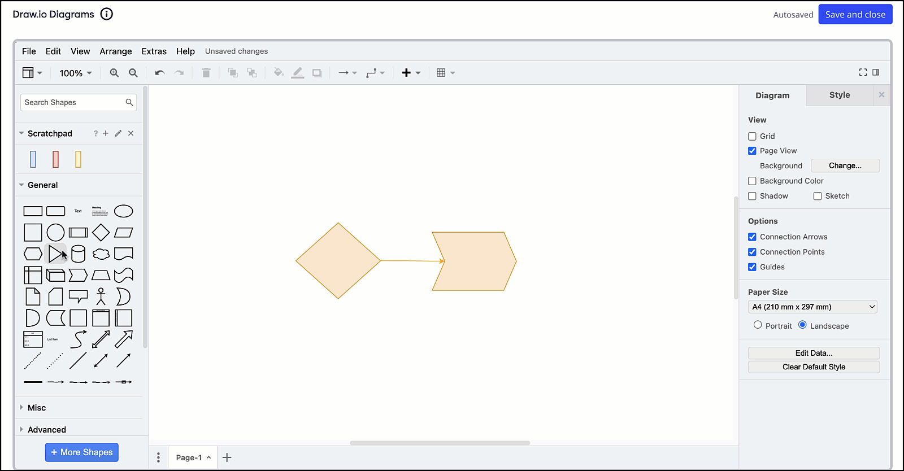
*Draw.io Diagrams アプリを使って新しいダイアグラムを作成*

### テンプレートを選択する

あらかじめデザインされた構造から始めたい場合は、利用可能なテンプレートから選択できます。その方法をご紹介いたします。

1. **Draw.io Diagrams** アプリを起動します。
2. 上部のツールバーで、**挿入** アイコン (**+**) をクリックします。
3. **テンプレート**をクリックします。
4. テンプレートを選択します。
5. 必要に応じてテンプレートを編集してください。
6. 完了したら、右上にある**保存して閉じる** をクリックします。

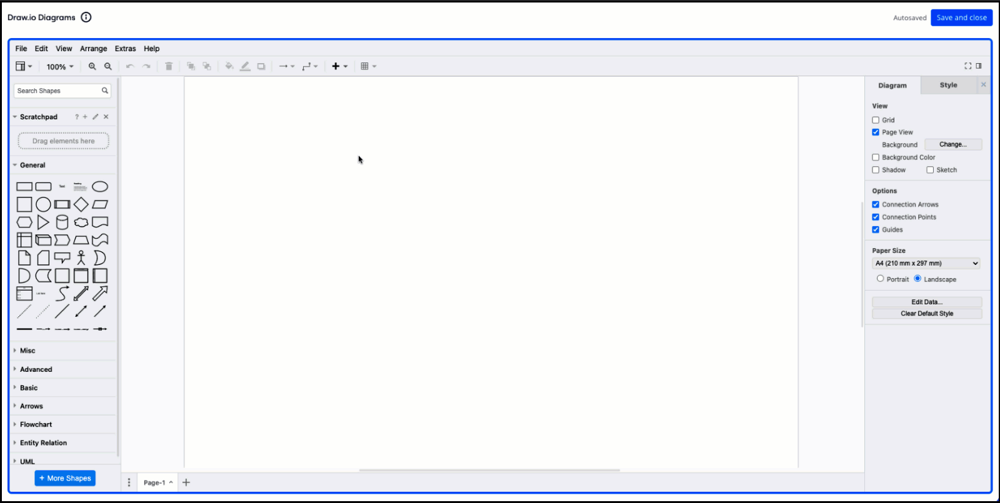
*Draw.io Diagrams アプリからテンプレートを選択*

## ダイアグラムの変更

ダイアグラムが Draw.io Diagrams アプリのキャンバスにある場合、その構造や外観を調整するためにコンポーネントをいくつかの方法で変更できます。

### 図形同士をつなぐ

図形をつなぐことは、ダイアグラムを作成する際の基本的な部分です。コネクターを作成してカスタマイズするには、以下の手順に従ってください。

1. 図形にカーソルを合わせます。小さな接続ポイントが表示されます。
2. これらの接続点の 1 つから別の図形までクリックしてドラッグすると、コネクター線が作成されます。
3. コネクター線をクリックしてカスタマイズできます。右側のパネルで、コネクターのスタイル（直線、曲線など）を変更し、矢印やその他の終点を追加して、線の色や太さを調整できます。

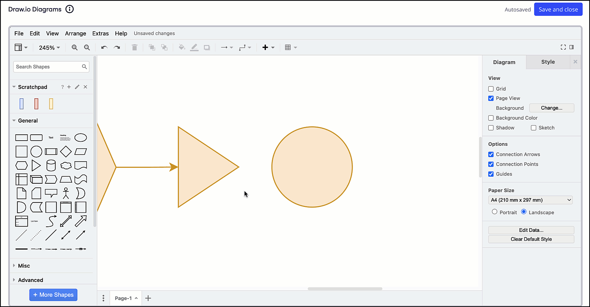
*Draw.io Diagrams アプリで図形を接続*

### 図形とコネクターにラベルを追加

図形要素にテキスト情報を追加するには、図形やコネクターにラベルを付けることができます。その方法をご紹介します。

1. 図形またはコネクターをダブルクリックし、入力を開始します。
2. キャンバスの右側にあるテキストメニューから、ラベルの書式設定をします。フォントのスタイル、色、方向、高さを変更できます。

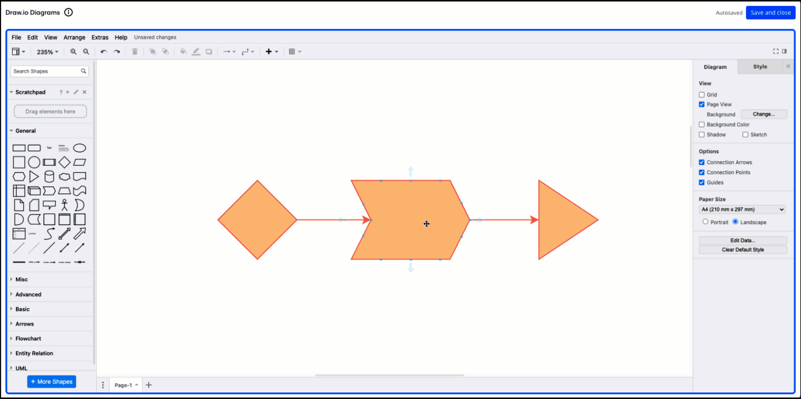
*Draw.io Diagrams アプリで図形にラベルを追加*

### オブジェクトの移動、サイズ変更、削除

キャンバス上のオブジェクトを簡単に操作できます。これらの手順は、移動、サイズ変更、または削除する方法を説明します。

1. 図形やコネクターを移動するには、クリックして目的の位置までドラッグします。
2. 図形のサイズを変更するには、図形をクリックし、小さな青い円のいずれかをドラッグします。
3. オブジェクトを削除するには、オブジェクトを選択してキーボードの**Delete**キーを押すか、上部ツールバーの**Delete**アイコンをクリックします。

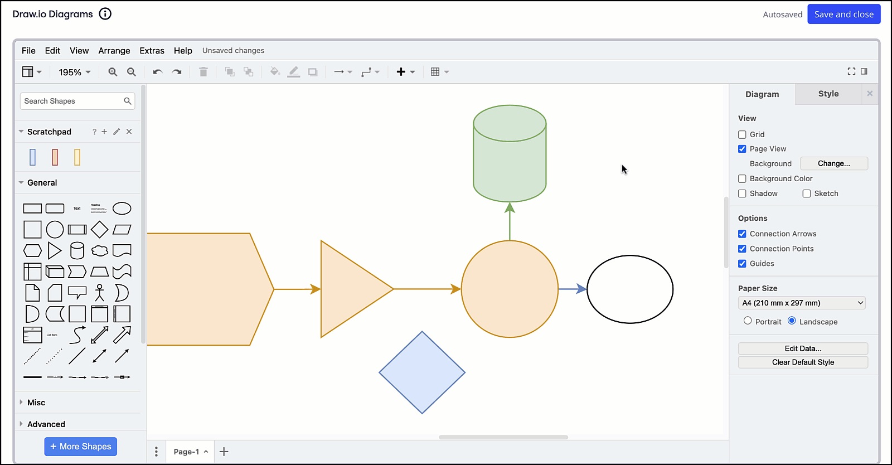
*Draw.io Diagrams アプリでのオブジェクトの移動、サイズ変更、削除*

### 図形のメタデータを編集

図形に重要な詳細情報をメタデータとして追加して、より分かりやすくできます。以下の手順を実施してください。

1. **Draw.io Diagrams** アプリを起動します。
2. ダイアグラム内の図形を選択します。
3. 図形を右クリックし、**データを編集**を選択します。
4. ダイアログが開き、図形のメタデータが表示されます。プロパティ名は左に、その値は右にあります。
5. 図形に関連付けたい情報のキーと値のペアを追加します。
6. **適用**をクリックしてメタデータを図形に保存します。
7. 図形にカーソルを合わせるとメタデータが表示されます。

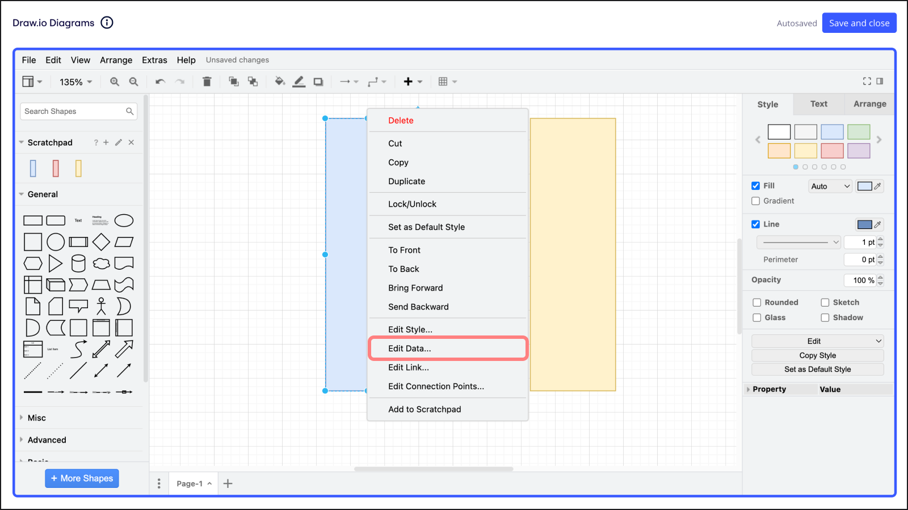
*図形のメタデータの編集*

### ダイアグラムにレイヤーを追加

レイヤーはダイアグラムの構成と明確さを向上させ、異なる部分を分割して集中的に編集または表示できるようにします。これは複雑なプロジェクトに特に役立ちます。

1. **Draw.io Diagrams** アプリでダイアグラムを開きます。
2. **[表示]** をクリックし、**[レイヤー]** を選択してレイヤーのダイアログを表示します。
3. 新しいレイヤーを追加するには、レイヤーのダイアログの下部にある**＋**アイコンをクリックします。
4. レイヤー名を編集するには、レイヤーをダブルクリックしてテキストを編集し、**名前を変更**をクリックします。
5. レイヤーを選択すると、要素の追加や編集が可能になります。
6. レイヤーを非表示または表示するには、レイヤー名の横にある**目**のアイコンをクリックします。
7. ダイアグラムの編集が終了したら、**保存して閉じる**をクリックします。

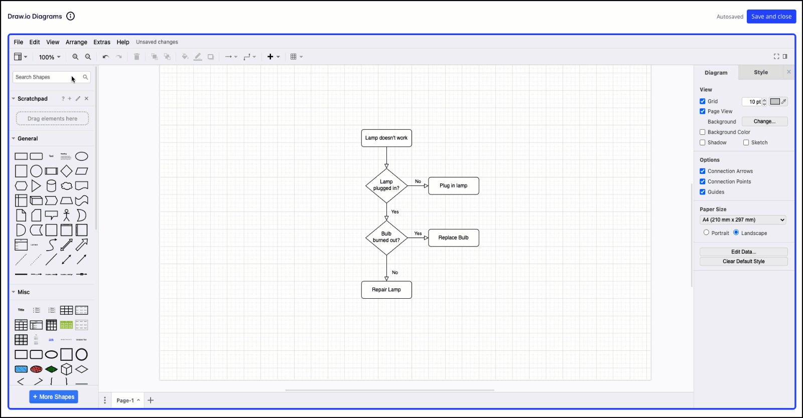
*Draw.io Diagrams アプリでレイヤーを追加する*

## 図形と図形ライブラリーを管理

Draw.io Diagrams は、さまざまな図形ライブラリを使用したり、特定のダイアグラムニーズに合わせてカスタム図形を管理したりするための豊富なオプションを提供します。

### 幅広い draw.io 図形パックを利用する

draw.io の豊富な図形パックにアクセスすることで、ダイアグラム作成の可能性を広げることができます。追加方法は次のとおりです:

1. **Draw.io Diagrams** アプリを起動します。
2. 左側の**図形**パネルの下部にある**他の図形**をクリックします。
3. 各種カテゴリーを探し、追加したい図形パックの横にあるボックスにチェックを入れてください。
4. **適用**をクリックして、選択した図形パックを**図形**パネルに追加します。

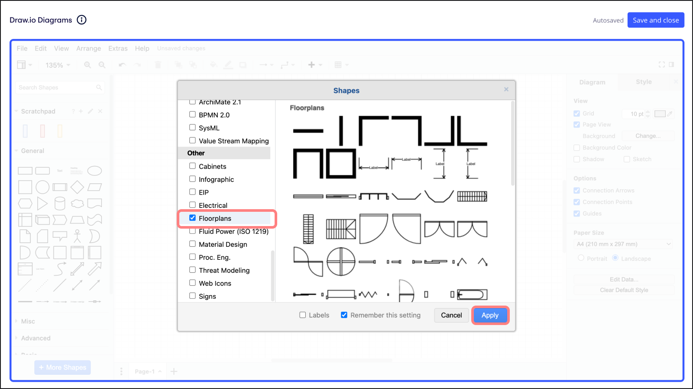
*draw.io 図形パックの選択*

### スクラッチパッドでカスタム図形を追加

さらにダイアグラムのエクスペリエンスをカスタマイズするために、スクラッチパッドを使用して個別の図形ライブラリーを作成し、統合できます。以下の手順に従ってください。

1. **Draw.io Diagrams** アプリを起動します。
2. **表示**に移動します。
3. **Scratchpad** を選択します。
4. 左側のパネルにスクラッチパッドが開きます。
5. スクラッチパッドにファイルをドラッグ & ドロップして、カスタム図形を追加します。

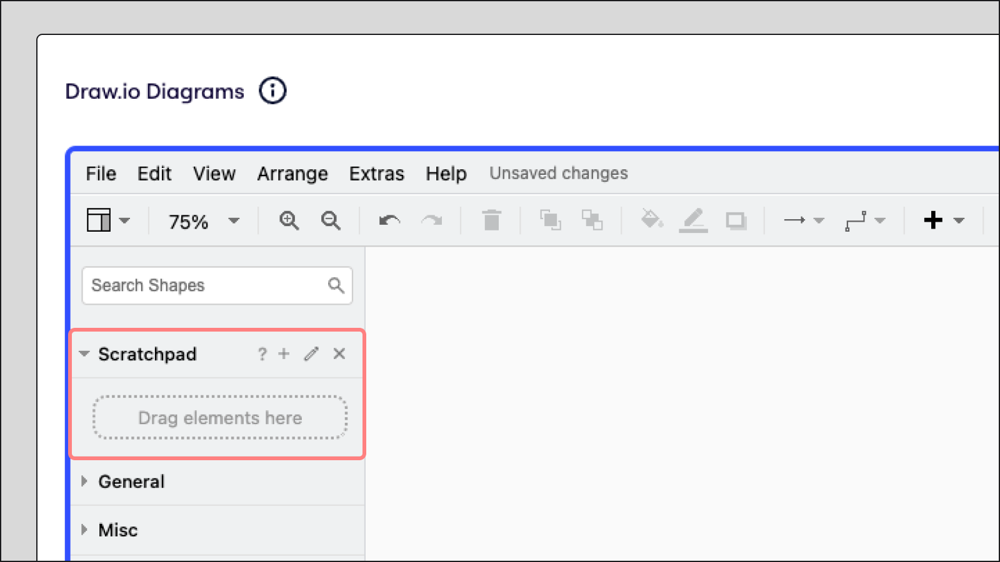
*スクラッチパッドを使ったカスタム図形の追加*

### スクラッチパッドでカスタム図形を編集

カスタム図形がスクラッチパッドにあれば、それらを変更できます。その方法は次のとおりです：

1. キャンバス上で図形をクリックします。
2. 青い点をクリックしてドラッグすると、図形のサイズを変更できます。
3. 右側のパネルを使用して、図形の色、テキスト、サイズなど、図形をさらにカスタマイズします。
4. 完成したら、図形をクリックし、スクラッチパッドのプラスアイコンをクリックします。
5. 図形はカスタム図形に追加されます。

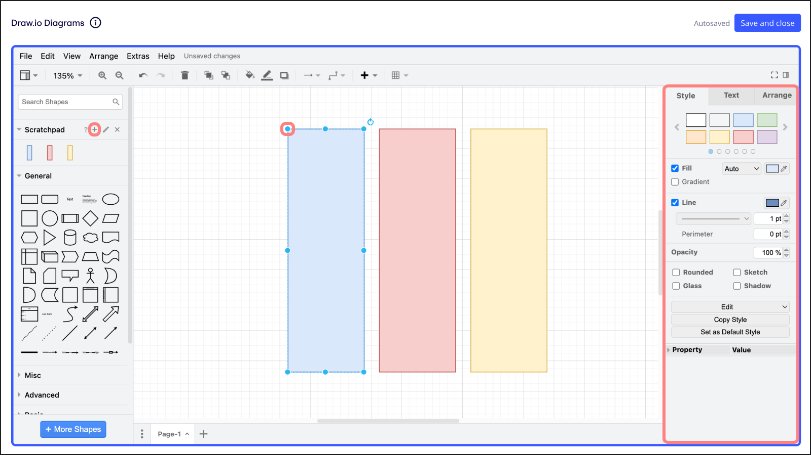
*スクラッチパッドによるカスタム図形の変更*

### スクラッチパッドでカスタム図形の削除と名前の変更

カスタム図形は、スクラッチパッド内で削除や名前の変更を行って管理できます。こちらの指示に従ってください。

1. スクラッチパッドで鉛筆のアイコンをクリックします。
2. スクラッチパッドから図形を削除するには、図形の右上にある**x**をクリックします。
3. 図形の下にあるテキストフィールドをクリックして名前を入力します。デフォルトでは、スクラッチパッドに追加された図形は無題です。
4. 編集が終わったら、**保存**をクリックします。

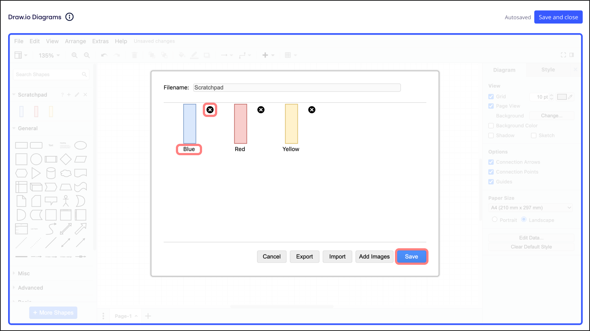
*スクラッチパッドでカスタム図形の削除と名前の変更*

### カスタム図形を図形ライブラリーとしてエクスポート

カスタム図形を他の場所で使用したり共有したりするには、ライブラリーとしてエクスポートできます。こちらがプロセスです：

1. スクラッチパッドで鉛筆のアイコンをクリックします。
2. **エクスポート** をクリックして、カスタム図形をライブラリーとして保存します。
3. カスタム図形ライブラリーのファイル名を入力し、保存場所を選択します。
4. **保存** をクリックします。

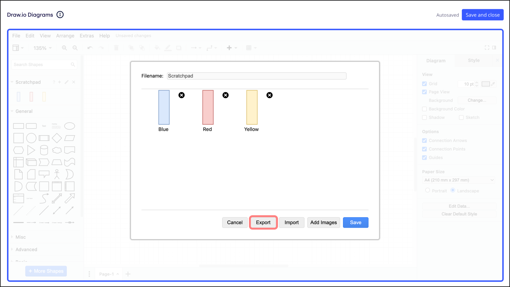
*カスタム図形をライブラリーとしてエクスポート*

## Visio ダイアグラムで作業する

Draw.io ダイアグラムによって、ダイアグラム作成ツール間をシームレスに移行でき、Visio ダイアグラムを異なるプラットフォーム間で詳細を失わずに作業することができます。インポートおよびエクスポート方法:

1. **Draw.io Diagrams** アプリを起動します。
2. インポートするには、左上の**File**をクリックして**Import From**にカーソルを合わせ、**Device**を選択します。メニューにあるクラウドサービスを使用して、Visio（VSDX）ファイルをアップロードすることもできます。
3. デバイスから Visio（VSDX）ファイルを選択し、**開く**をクリックしてインポートします。
4. エクスポートするには、ダイアグラムを完成させた後、**File** をクリックし、**Export as** にカーソルを合わせて、**Visio (VSDX)** を選択します。
5. プロンプトに従ってエクスポートプロセスを完了します。

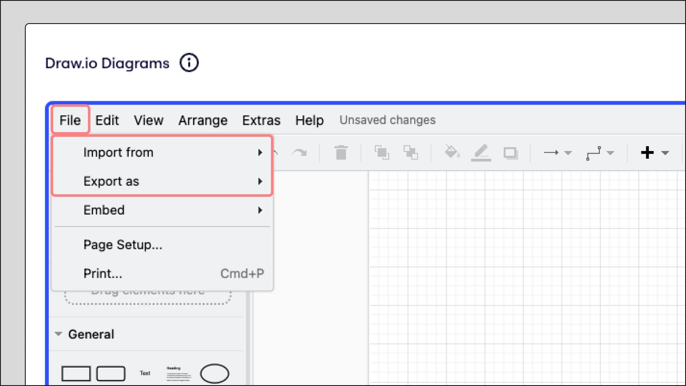
*Draw.io Diagrams アプリでのダイアグラムのインポートとエクスポート*

## Draw.io ダイアグラムの保存、編集、エクスポート

このセクションでは、ダイアグラム作成ワークフローの重要な最終ステップをカバーしています。Miro ボードに作業を保存し、その後の編集を行い、ダイアグラムをさまざまな形式でエクスポートします。

### draw.io ダイアグラムの保存

Draw.io Diagrams アプリ内で変更を行った後、Miro ボードに作業を保存する必要があります。以下の手順を実施してください。

1. ダイアグラムの変更が完了したら、必ず**保存して閉じる**をクリックしてください。これは**Draw.io Diagrams**アプリの右上にあります。
2. **Draw.io Diagrams** アプリが終了し、ダイアグラムが自動的に Miro ボードに表示されます。

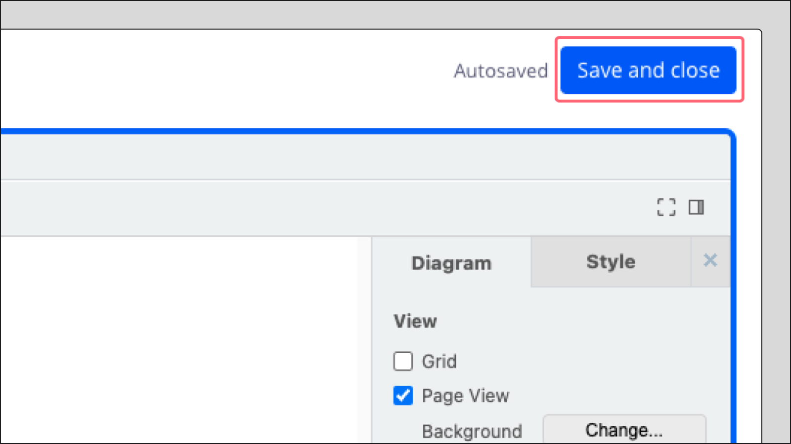
*Draw.io Diagrams アプリから図を保存*

### draw.io ダイアグラムの編集

Miro ボード上ですでにあるダイアグラムにさらに変更を加える必要がある場合は、以下の手順で編集できます。

1. Miro ボードで、編集したいダイアグラムを選択します。
2. ツールバーが表示されます。
3. ツールバーで、**編集** の鉛筆アイコンをクリックします。
4. **Draw.io ダイアグラム** アプリが開き、ダイアグラムに変更を加えることができます。

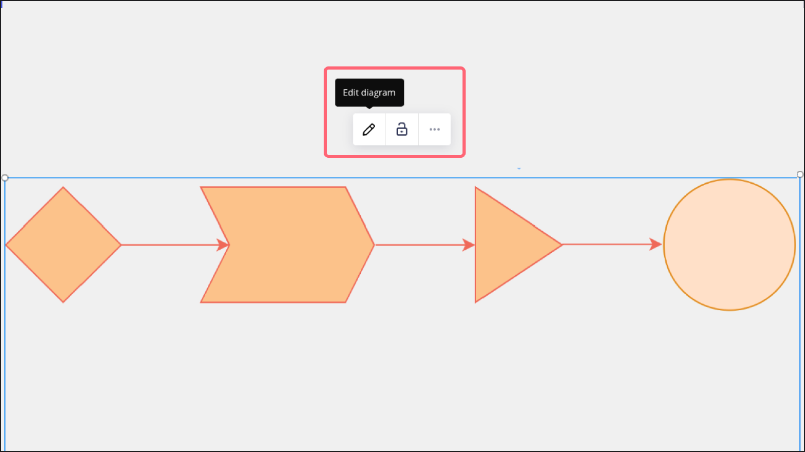
*Draw.io Diagrams アプリでダイアグラムを編集*

### draw.io ダイアグラムをエクスポート

図を、アプリから直接 PNG、JPEG、PDF などの複数の形式でエクスポートできます。以下の指示に従ってください。

1. **Draw.io Diagrams** アプリの左上にある**ファイル**をクリックします。
2. **Export as**にカーソルを合わせます。
3. ご希望のフォーマットを選択し、プロンプトに従ってください。
4. **エクスポート** をクリックします。

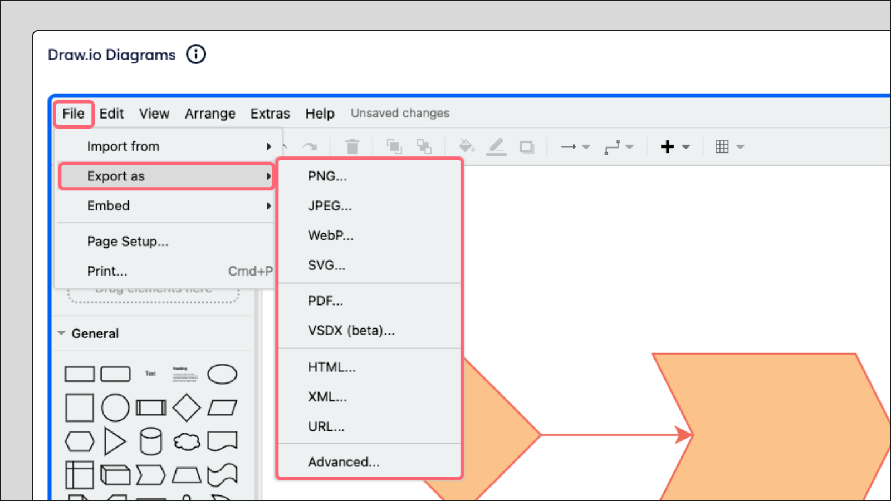
*Draw.io Diagrams アプリからダイアグラムをエクスポート*

## 情報を参照

このセクションでは、Draw.io Diagrams の特定の使用例やよくある質問などの詳細情報を提供しています。このツールを最大限に活用するためにお役立てください。

### Draw.io ダイアグラムを使用する場面

Draw.io ダイアグラムは、プロジェクトにより専門的なダイアグラムの要件がある場合に特に役立ちます。以下のシナリオでの使用を検討してください:

- **ニッチな図形ライブラリー：**複雑な電気回路図や間取り図のレイアウトなど、ニッチな図形を利用できます。
- **カスタマイズ：**Visio（VSSX ファイル）または draw.io 内で直接、独自の図形パックを作成し、ニーズに合わせたダイアグラムを作成できます。
- **シームレスなインテグレーション:**draw.io は、Visio、Lucidchart などの主要な作図ツールとのスムーズな互換性を確保します。Visio（VSDX）を汎用フォーマットとして使用することで、簡単に共有し、共同作業を行うことができます。
- **重要な詳細を保存：**レイヤーと図形の重要なメタデータ（ダイアグラム内のテキスト）を保持して、Visio、draw.io、Lucidchart から移行する際にも、豊富な情報がそのまま維持されます。

:::note
このサードパーティープラットフォーム アプリは、GitHub リポジトリのオープンソース Draw.io コードを利用し、Miro によって安全にホストされています。データは第三者と共有されません。Draw.io への貢献は終了しました。したがって、このサードパーティー プラットフォームアプリは、すべてのバグやエラーを含めて「現状のまま」で提供されており、Miro または Draw.io からのいかなる保証、補償、セキュリティの約束、またはサポートもありません。
:::

### よくある質問

Miro で Draw.io Diagrams アプリを使用する際のよくある質問への回答です。

私のデータ、図、その他のコンテンツは draw.io やその他の第三者と共有されますか？

いいえ、draw.io アプリ内のお客様のダイアグラムとデータは、Miro の信頼できるクラウド インフラストラクチャーに安全に保存されます。第三者とデータを共有することはありません。

複数の人が同時にダイアグラムを編集できますか？

一度に図を編集できるのは一人だけです。しかし、一旦ボード上に図が表示されれば、全員がそれを閲覧し、交代で編集し、共同作業することができます。
