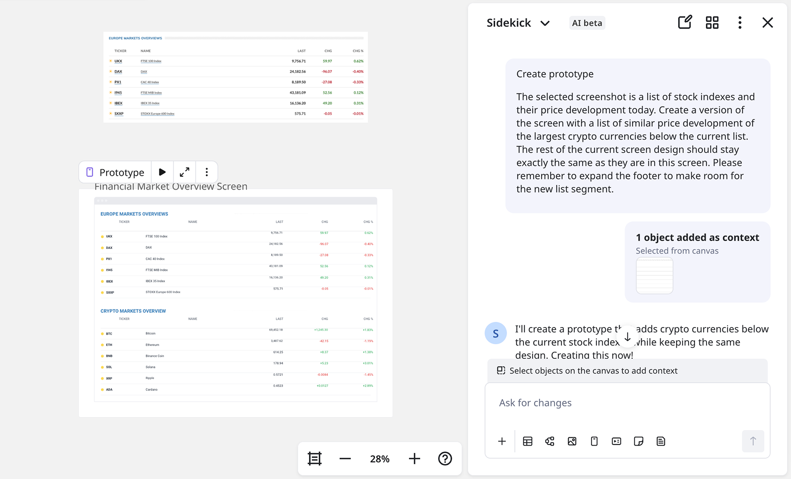

Miro Prototypes は、プロダクトチームが初期のアイデアをインタラクティブなプロトタイプに素早く変換し、デザインやコーディングに進む前に明確な方向性を持つのに役立ちます。

> **ヒント:** プロトタイプをサイドキックと共に作成することで、AIチャット履歴を有効にし、以前に検討したオプションを確認し、どのボードでも再開することが可能です。詳細については、[サイドキックがMiroでのAI創造を進化させる](https://help.miro.com/hc/articles/33881743175954)と[Miro Prototypes の概要](../../miroverse/prototyping/01-miro-prototypes-overview.md)をご覧ください。

このガイドでは、AIを活用したプロトタイピングで成功するチームの思考と作業方法を紹介します。文脈を考慮して計画し、意図的に生成し、チームとして反復し、重要な点をテストします。Miro Prototypesの基本的な使い方を学んだら、プロのように活用する方法がこちらです。

## ステップ 1：文脈を考慮する

最良のAIプロンプトは実際の作業から始まります。付箋、製品要件文書、ユーザーフロー、スクリーンショット、またはチームの考えを記録したアーティファクトを選び、キャンバスを基盤として使用しましょう。

### **チームが終了した地点から始める**

[キャンバスのコンテンツを選択し](../../miroverse/prototyping/03-miro-prototypes.md)、アイデアを定義します。AIはこのコンテキストを使用して構造や論理を形成します。このプロンプトを使って開始できますが、選択内容に合わせて内容を調整してください。。

プロンプトの例:

> 「選択されたPRDとオポチュニティーマップに基づいて5画面のモバイルプロトタイプを作成してください。」

### **既存製品を改良する**

製品のスクリーンショットを投入してください。Miro AIがそれを編集可能なモックアップに変換するため、最初からやり直す必要はありません。

:::tip
スクリーンショットを選択し、[**コンテキストメニューから****画像をプロトタイプに変換**](../../miroverse/prototyping/03-miro-prototypes.md)を使用します。プロンプトは必要ありません。
:::

また、スクリーンショットや選択したプロトタイプをAIチャットで次のイテレーションのコンテキストとして使用することもできます。

プロンプトの例:

> 選択されたスクリーンショットは、株価指数とその今日の価格変動を示すリストです。現在のリストの下に、大規模な暗号通貨の類似した価格変動のリストを表示するバージョンを作成してください。現在の画面デザインのその他の部分は、この画面上のものとまったく同じである必要があります。フッターを拡大して、新しいリストセグメントの余地を作ることを忘れないでください。画面全体のテキスト出力を英語に変更してください。

*スクリーンショットから作成・変更されたプロトタイプ*

### **さらに進む**

- **プロセスをマッピングする**: 付箋や図を使っておおまかなフローを描き、必要な画面数を定義します（例：*サインアップ→ダッシュボード→チェックアウト*）。
- **雰囲気やテーマを設定する:** 参考となるスクリーンショットやスタイルガイドを追加し、AIが望む見た目やトーンに合わせます。
- **詳細なプロンプトでより良い結果を得る:** プロンプトが詳細であればあるほど、生成されるプロトタイプが希望に近いものになります。異なる要素の色に特定の16進コードを提供することも可能です。

プロンプト例:

> "選択されたPRDと機会のマッピング演習に基づいて、5画面のモバイルプロトタイプを作成します。デザインのスタイルとテーマは、選択されたスクリーンショットのスタイルと正確に一致する必要があります。"

## ステップ 2：設置する前に一時停止

最初のプロンプトで完璧なビジュアルを作るのは難しいため、何度か編集して繰り返す準備をしましょう。大きなプロンプトを必要としなくても、Miro AIはプロンプトにできるだけ近い画面を生成します。構造、色、ビジュアル階層などが重要であればそれを具体的にすることが役立ちます。

### **ステップごとに繰り返し**

ステージングエリアはあなたのサンドボックスです。クリックしたものは保持し、そうでないものは再生成してください。任意のフレームを選択し、[Miro AI を使って設置前に変更を加え](../../miroverse/prototyping/03-miro-prototypes.md)ましょう。

プロンプト例:

> 「このレイアウトを簡単にして、主要なアクションを強調表示してください。」

### **方向性を****比較する**

- **バージョンを切り替える:** アクセスしているバージョンをクリックして最適な方向を選びます。
- **並べて比較する**: あるバージョンをコピーして、もう一つの隣に貼り付けて視覚的に比較できます。

### **さらに進む**

- **ループ作業をする**: 生成 → 改善 → 共有。最初から完璧を期待しないでください。
- **コンテキストのためのメモを追加する**: 配置する前に、何をテストしたり検討していたのかを記録するための付箋を作成します。

:::note
アイデアをチームに持ち込む前に、AIを使って自由に反復を行います。みんなが見て編集できるようになったら、**キャンバスに適用**をクリックします。
:::

## ステップ 3：チームで反復作業を行う

プロトタイプがボードに載ったら、AIまたは手作業でコンセプトをレビューし、洗練し、進化させ、何が機能しているか、なぜそうなのかをチームで合意します。

### **一緒に検討する**

- **画面を接続**して、ロジックのギャップと次のステップを明らかにします。
- [**プロトタイプ** **フォーマット**と**フォーカスモード**](../02-formats-&-focus-modes.md)を使用して、ボード全体の煩わしさを排除してプロトタイプのみを共有します。フォーマットをピン留めして、他の人がボードを開いたときに自動的に開くようにします。
- [**プレビューモード**](../../miroverse/prototyping/03-miro-prototypes.md)に切り替えて発表時にすべての人が同じフローを辿り、フルコンテキストにクリックひとつでアクセスできるようにします。

画面に直接コメントを入れたり、スタンプで反応したりして、うまくいっていること（うまくいっていないこと）を捉えることができます。注釈を利用することで、チーム全体が一致した方向に進むことが可能です。

### **重要な場合は手作業で編集**

すべての変更に新しいプロンプトが必要なわけではありません。自分で微調整したほうが早くてわかりやすいこともあります。**プロトタイピングライブラリー**を使って、コンポーネントを入れ替えたり、スペースを調整したり、テキストを書き換えたりしてください。

チームの誰もが操作を担当し、編集を加え、アイデアを前進させることができます。

### **さらに進化させる**

- **目的を持ったスタイル化** — プロンプトにブランドカラーを含めましょう。あるいは、製品のスクリーンショットをアップロードして、AIが自動的にスタイルを適用するようにすることもできます。これによってプロトタイプがより本物らしくなります。

プロンプト例:

> 「ブランドのガイドラインを使用: プライマリーアクションには #0052CC を使用」

:::tip
画面を選択し、[**画像からスタイルを一括インポート**](../../miroverse/prototyping/03-miro-prototypes.md)します。イメージテーマを適用してください。
:::

- **非同期フィードバック用に**[**Talktrack**](../../facilitation-tools/asynchronous-tools/02-talktrack-board-recordings.md)**を追加**: クイックウォークスルーを録画して、会議なしで思考を説明しフィードバックを得る（または会議の事前作業として）。
- **コメントで決定を記録**: 重要なフィードバックや次のステップをボード上で要約し、Slackやメールのスレッドで情報が失われないようにします。

## ステップ 4：テストして改善する

チェックを実行し、インサイトを集め、学んだことを適用します。

### サイドキックに聞く

設計や開発に移る前に、AIサイドキックとクイックチームレビューでコンセプトを検証します。[UXリサーチャー](https://miro.com/templates/sidekicks/ux-research/)や[コンテンツデザイナー](https://miro.com/templates/sidekicks/content-design-review/)のサイドキックを呼んで、別の視点からの迅速なレビューを得ましょう。これを軽量なユーザーテストとして扱います。

[UXリサーチャーサイドキック](https://miro.com/templates/sidekicks/ux-research/)のプロンプト例:

> 「選択されたプロトタイプを分析し、最も重要な5つのユーザビリティ問題とその解決策に関する具体的な推奨事項を含むレポートを作成してください。」
>
> 「推奨事項を5つにまとめ、各推奨事項を箇条書きにしたエグゼクティブサマリーを上部に記載してください」

### 学んだことを活かす

レイアウトを洗練し、コピーを練り直し、摩擦ポイントを修正してストーリーをよりスムーズにします。[デザインプロトタイプサイドキック](https://miro.com/templates/sidekicks/design-prototypes/)を試して反復を行ってください。

プロンプト例:

> 「選択したレポートで推奨された重要な改善を反映した新しいバージョンのプロトタイプを作成してください。」

### ワークをつなげるためにフローを活用

AI フローを使用して、反復的な作業を自動化し、プロセスを効率化し、Miro キャンバス上で生産性を向上させましょう。チームのアイデアを対話型のビジュアルに変換し、翻訳バリアントのように実験、共有、比較が可能です。

こちらで試してみるには [ローカライズプロトタイプ テンプレート](https://miro.com/templates/localise-prototypes/) を使用してください。

## ステップ 5：そして、繰り返す

### 論理が確立したら引き継ぐ

Miro Prototypes を使用して、デザイナーがデザインツールに移行したり、開発者が構築（または軽いコーディング）を開始したりする前に、進む方向性を一致させましょう。これにより、高額な手戻りを防ぎ、ハイフィデリティの実行に何時間も投資する前に、全員が解決策に同意していることを確認できます。

:::tip
[**プロトタイプ** **フォーマット** および **フォーカスモード**](../02-formats-&-focus-modes.md) を使用して、完全なボードの干渉を避け、プロトタイプのみを共有しましょう。
:::

## まとめ

プロトタイピングはピクセルパーフェクトな最終デザインを作成することではなく、使いやすい製品に向けて前進することです。Miro Prototypes はチームがアイデアを早く視覚化し、迅速に一致させ、一緒に適切なものを構築することを支援します。

チームがアイデアを早く確認できるほど、迅速に認識を合わせて適切なソリューションを構築できます。
