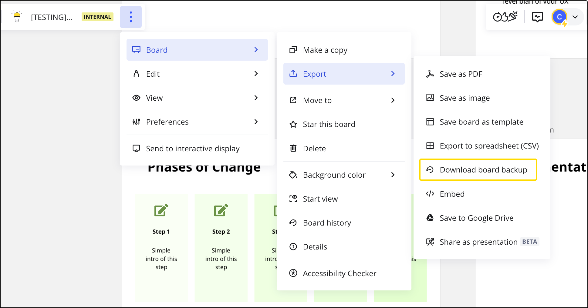
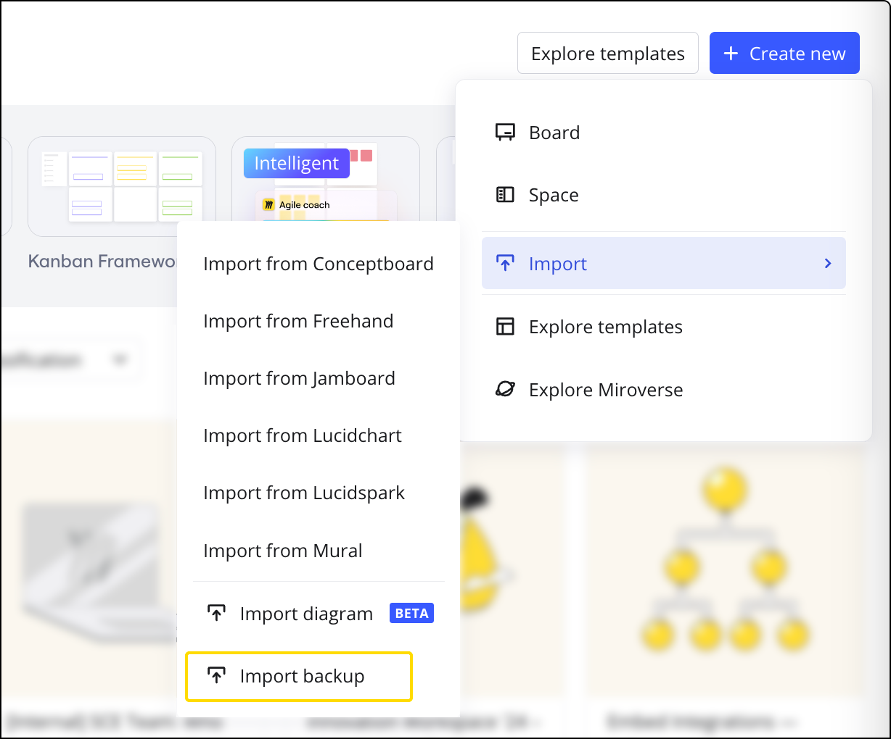

ボードのバックアップを保存することで、ボードのアーカイブコピーを作成しましょう。バックアップにより、コンテンツの安全性を確保し、他の Miro のユーザーともボードのコピーを共有できるようになります。

## ボードのバックアップを保存

バックアップを作成するには:

1. ボードを開き、**三点リーダー**（）アイコンをクリックします。
2. **ボード**サブメニューを選択します。
3. **エクスポート**サブメニューを選択します。
4. **バックアップをダウンロード**オプションを選択し、画面の指示に従ってください。

*ボードバックアップをダウンロード中*

ダッシュボードからバックアップを保存することもできます。**三点リーダー** (**...**) アイコンをクリックしてボードのメニューを開き、オプションから**ボードのバックアップをダウンロード**を選択します。

**.rtb* ファイルがデバイスに保存されます。

:::warning
**ボードの所有者** と共同所有者のみが **有料**チームにあるボードのバックアップをダウンロードできます。このオプションがエクスポートメニューでグレーアウトされている場合は、この機能が[お使いのプランで利用可能](../../../plans-billing/miro-plans/02-plans-and-features-available.md)かどうか、およびあなたが[ボードの所有者](../../sharing-boards/01-board-access-rights.md)または[共同所有者](../../sharing-boards/06-co-owners-of-boards-and-spaces.md)であることを確認してください。
:::

## バックアップからボードを復元

有料チームのユーザーは全員、ボードのバックアップをアップロードするオプションを利用できます。ボードのアーカイブコピーを別の Miro ユーザーに送信して、そのユーザーが有料チームでボードのコピーを再作成させることができます。

バックアップからボードを復元するには:

1. ダッシュボードから、[**新規作成**](https://miro.com/app/dashboard/)をクリックします。
2. **インポート**を選択します。
3. **バックアップをインポート**を選択します。
   ダイアログボックスが表示されます。
4. **.rtb* ボードバックアップファイルを選択します。
5. 選択を確定すると、チームに同じコンテンツの新しいボードが作成されます。ボードのタイトルには**「Restored」**が加えられます。

ボードを復元した後、ボードをチーム内の別のスペースに移動することも可能です。

*バックアップからボードを復元する*

## トラブルシューティング

ボードバックアップのダウンロードとアップロードには制限がありますのでご注意ください。ダウンロードの場合、**1GB**の制限があります。ボードがそれより大きい場合は、ボードを小さなボードに分割するか、ボードのダウンロードバックアップの代わりに[ボードのバージョン](../../managing-boards/12-board-history-versions.md)を利用してください。

アップロードに関しては、Miro のインターフェイスは最大 **1GB** のボードバックアップのみアップロードが可能です。それより大きなバックアップファイルをアップロードするには、Miro サポートチームまでご連絡ください。

1. Miroにログインし、[サポートフォーム](../../tools/troubleshooting/06-contacting-miro-support.md)を使用してリクエストを送信してください。
2. バックアップファイルをリクエストに添付するか、クラウドストレージにアップロードし、リンクを送信してください（リンクを知る全員にファイルのダウンロードの許可を必ず与えておいてください）。
3. バックアップファイルが1GB未満であるにもかかわらず、アップロードに問題がある場合は、[こちらのページ](../../tools/troubleshooting/07-how-to-troubleshoot-and-report-a-bug.md)のトラブルシューティングの手順を確認してください。

バックアップをアップロードする際に、「**最適化されたリソース 0 に対して既存リソースの複製が見つかりません**」というエラーが表示された場合、ボードのバックアップに削除すべきリソースがあることを意味します。バックアップのアップロードが正常に行われるよう、[Miro のサポートに .*rtb* ファイルを送信](../../tools/troubleshooting/06-contacting-miro-support.md)してください。リソースデータを削除いたします。

:::note
バックアップの保存に問題がある場合は、[この記事](../../tools/troubleshooting/07-how-to-troubleshoot-and-report-a-bug.md)のトラブルシューティング手順を試してください。
:::

## よくある質問

**ボードのバックアップをダウンロードするオプションがありません。なぜですか？**

有料チームのボード所有者/共同所有者、または[コンテンツ管理者の権限](../../../enterprise-administration/managing-enterprise-teams-and-content/12-content-admin-permissions.md)を持つ[Enterpriseプラン](../../../plans-billing/miro-plans/04-enterprise-plan.md)の会社の管理者のみがボードのバックアップを保存できます。

**ボードが削除された場合どうすればいいですか？**

[削除されたボードを復元する方法](../../managing-boards/08-how-to-restore-a-deleted-board.md)をご覧ください。

**複数のボードのバックアップを一括して作成することはできますか？**

現時点ではできません。各ボードを個別にバックアップする必要があります。
